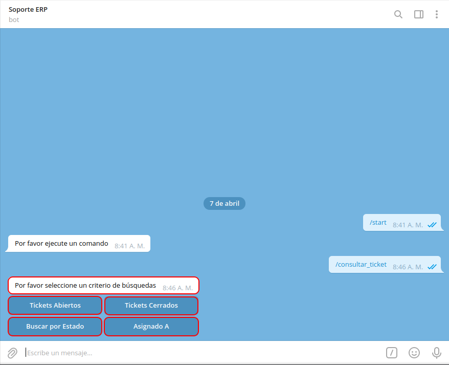

.. |mensaje principal por favor indique un comando para consultar| image:: resources/main-message-please-indicate-a-command-to-consult.png

.. |selección de criterio tickets abiertos| image:: resources/criteria-selection-open-tickets.png
.. |icono reenviar del criterio tickets abiertos| image:: resources/icon-resend-open-tickets-criteria.png
.. |opciones de acceso a las tareas del mensaje del criterio tickets abiertos| image:: resources/access-options-to-the-message-tasks-of-the-open-tickets-criteria.png
.. |opciones anterior y siguiente de las tareas del mensaje del criterio tickets abiertos| image:: resources/previous-and-next-options-of-the-open-tickets-criteria-message-tasks.png
.. |selección de opción de acceso a tarea| image:: resources/selection-of-task-access-option.png
.. |mensaje recibido con consulta de tarea del consultar tareas| image:: resources/message-received-with-task-query-from-query-tasks.png
.. |opciones de la consulta de la tarea específica del consultar tareas| image:: resources/query-specific-task-options-from-query-tasks.png
.. |opción agregar comentario de la tarea específica del consultar tareas| image:: resources/option-add-comment-of-the-specific-task-of-the-query-tasks.png
.. |comentario de la tarea en el bot del consultar tareas| image:: resources/task-comment-in-task-query-bot.png
.. |comentario de la tarea en el openproject del consultar tareas| image:: resources/comment-of-the-task-in-the-openproject-of-the-query-tasks.png
.. |opción asignar a de la tarea específica del consultar tareas| image:: resources/option-assign-to-of-the-specific-task-of-the-query-tasks.png
.. |asignado a de la tarea en el bot del consultar tareas| image:: resources/assigned-to-the-task-in-the-task-query-bot.png
.. |asignado a de la tarea en el openproject del consultar tareas| image:: resources/assigned-to-the-task-in-the-openproject-of-the-query-tasks.png
.. |opción cambiar estado de la tarea específica del consultar tareas| image:: resources/option-change-specific-task-status-of-query-tasks.png
.. |estado de la tarea en el bot del consultar tareas| image:: resources/task-status-in-the-task-query-bot.png
.. |estado de la tarea en el openproject del consultar tareas| image:: resources/task-status-in-openproject-from-query-tasks.png

.. _documento/consultar-tareas:

**Consultar Tareas**
====================

Al abrir la conversación de **Soporte ERP**, seleccione la opción "**INICIAR**", ubicada en la parte inferior de la conversación. Posteriormente podrá visualizar un mensaje donde el bot indica que **Por favor ejecute un comando**.

    |mensaje principal por favor indique un comando para consultar|

    Imagen 1. Mensaje Principal "Por favor indique un comando"

Si desconoce el número de tarea que requiere consultar o simplemente requiere consultar todas las tareas que contiene el proyecto cuyos ticket se encuentran abiertos o cerrados. Puede realizar el siguiente procedimiento.

Se debe seleccionar el icono "**/**", ubicado del lado derecho del campo "**Mensaje**".

    |icono barra para indicar comando a ejecutar|

    Imagen 2. Icono Barra "/"

Luego de seleccionar el icono "**/**", podrá visualizar tres (3) opciones que representan diferentes comandos dentro de la conversación de **Soporte ERP**. Debe seleccionar la opción "**/consultar_ticket**", para consultar los diferentes ticket del proyecto según lo requerido por el usuario.

    |opción consultar ticket|

    Imagen 4. Opciones de Comandos a Ejecutar

Posteriormente, recibirá el mensaje "**Por favor seleccione un criterio de búsqueda**", con la finalidad de filtrar la información por "**Tickets Abiertos**", "**Tickets Cerrados**" y "**Mis Tickets**". 

    |criterios de búsqueda de la opción consultar ticket|

    Imagen 5. Criterios de Búsqueda

.. note::

    Para el presente ejemplo, fue seleccionado el criterio de búsqueda "**Tickets Abiertos**".

Al seleccionar el criterio de búsqueda "**Tickets Abiertos**", el bot ejecuta dicha acción, filtrando las tareas por fecha de actualización y mostrando cuatro (4) tareas por mensaje. 

    |selección de criterio tickets abiertos|

    Imagen 6. Selección de Criterio Tickets Abiertos

También se puede reenviar el mensaje recibido, seleccionando el icono "**Reenviar**", ubicado del lado inferior derecho del mensaje.

    |icono reenviar del criterio tickets abiertos|

    Imagen 7. Icono Reenviar del Criterio Tickets Abiertos

Adicional a ello, se tienen las opciones de acceso a las diferentes tareas que se reflejan en el mensaje anterior, para consultar unicamente la tarea requerida.

    |opciones de acceso a las tareas del mensaje del criterio tickets abiertos|

    Imagen 8. Opciones de Acceso a las Tareas del Mensaje

Finalmente, para navegar entre las diferentes tareas del proyecto, se tienen las opciones "**Anterior**" y "**Siguiente**", que permiten avanzar a la siguiente página o retroceder a la anterior.

    |opciones anterior y siguiente de las tareas del mensaje del criterio tickets abiertos|

    Imagen 9. Opciones Anterior y Siguiente de las Tareas del Mensaje

Seleccione la opción de acceso a la tarea que requiere consultar. Para ejemplificar el caso, se selecciona la opción **#5316**, correspondiente a la tarea "**#5316**" del "**OpenProject**".

    |selección de opción de acceso a tarea|

    Imagen 10. Selección de Opción de Acceso a Tarea

Finalmente, se recibe un mensaje con la información detallada de la tarea, en el cual se indica lo siguiente:

    - Número de la tarea
    - Nombre de la tarea
    - Proyecto al que pertenece la tarea
    - Nombre y apellido del autor de la tarea 
    - Fecha y hora en la que fue creada la tarea
    - Nombre y apellido del encargado de la tarea
    - Fecha y hora de la última actualización de la tarea
    - Estado en el que se encuentra la tarea
    - Descripción que contiene la tarea

    |mensaje recibido con consulta de tarea del consultar tareas|

    Imagen 3. Mensaje con Consulta de Tarea

Adicional a ello, se muestra en la parte inferior del mensaje con la consulta, tres opciones que le permiten al usuario agregar un comentario a la tarea, cambiar el estado o la persona asignada de la misma.

    |opciones de la consulta de la tarea específica del consultar tareas|

    Imagen 4. Opciones de la Tarea Específica

    Seleccione la opción "**Agregar Comentario**", para agregar un comentario a la tarea consultada. 

        .. note::

            Esta opción también permite agregar una imagen.

        |opción agregar comentario de la tarea específica del consultar tareas|

        Imagen 5. Opción Agregar Comentario

        Al agregar un comentario desde el bot, se agrega el mismo de manera automática en dicha tarea en el OpenProject.

            |comentario de la tarea en el bot del consultar tareas|

            Imagen 6. Comentario de la Tarea en el Bot

            |comentario de la tarea en el openproject del consultar tareas|

            Imagen 7. Comentario de la Tarea en el OpenProject

    Seleccione la opción "**Asignar A**", para agregar o cambiar el responsable de la tarea.

        |opción asignar a de la tarea específica del consultar tareas|

        Imagen 7. Opción Asignar A

        Al cambiar la persona responsable de la tarea desde el bot, se cambia de manera automática en dicha tarea en el OpenProject.

            |asignado a de la tarea en el bot del consultar tareas|

            Imagen 8. Asignado A de la Tarea en el Bot

            |asignado a de la tarea en el openproject del consultar tareas|

            Imagen 9. Asignado A de la Tarea en el OpenProject

    Seleccione la opción "**Cambiar Estado**", para cambiar el estado en el que se encuentra la tarea.

        |opción cambiar estado de la tarea específica del consultar tareas|

        Imagen 9. Opción Cambiar Estado

        Al cambiar el estado de la tarea desde el bot, se cambia de manera automática en dicha tarea en el OpenProject.

            |estado de la tarea en el bot del consultar tareas|

            Imagen 10. Estado de la Tarea en el Bot

            |estado de la tarea en el openproject del consultar tareas|

            Imagen 11. Estado de la Tarea en el OpenProject