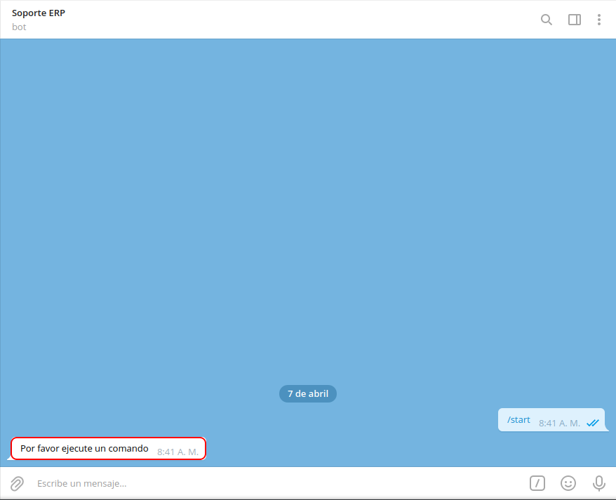
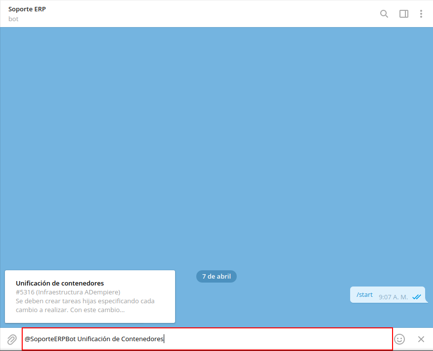
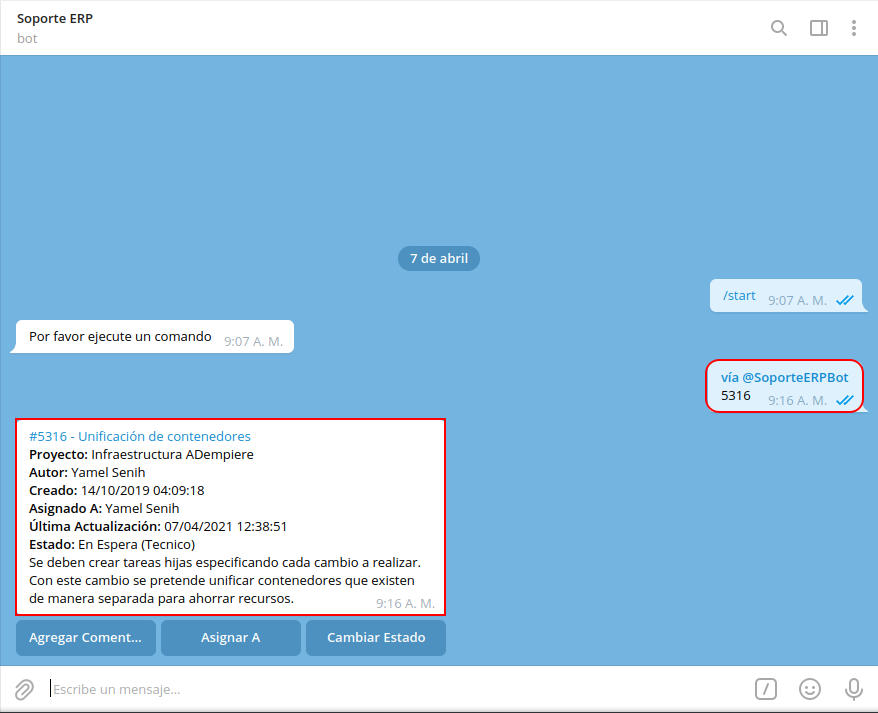
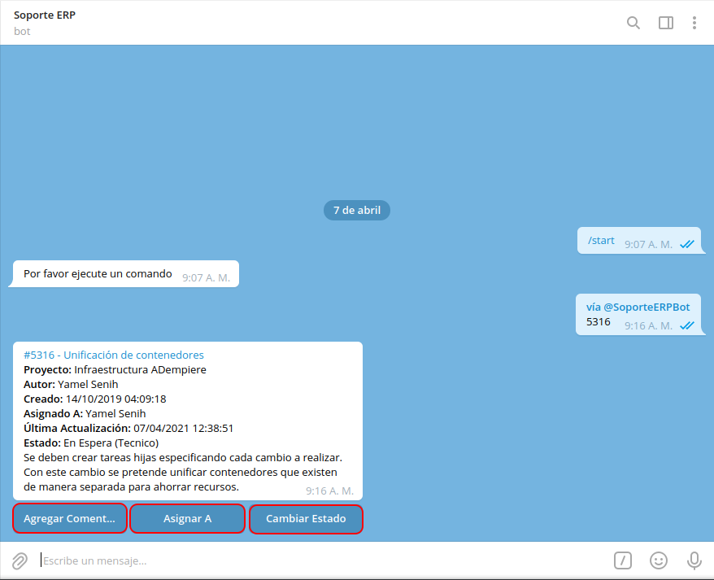
.. |opción agregar comentario de la tarea específica| image:: resources/option-add-comment-of-specific-task.png
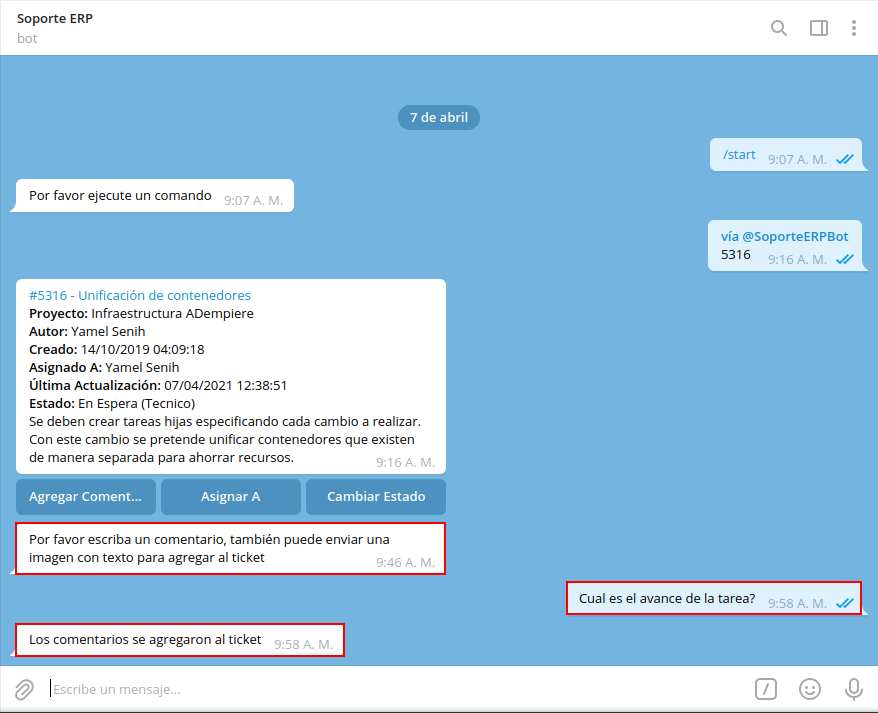
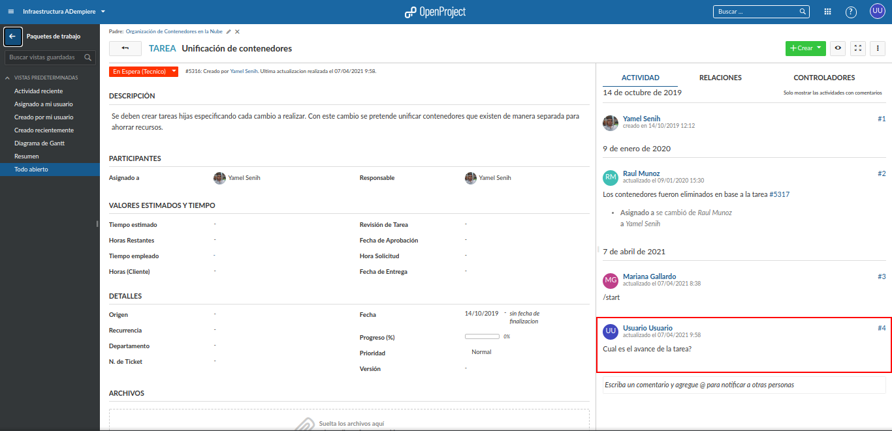
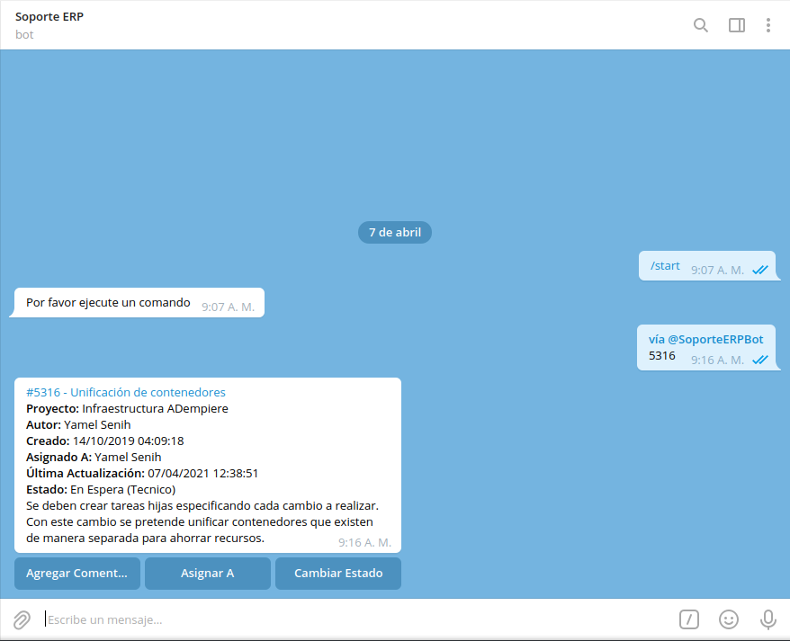
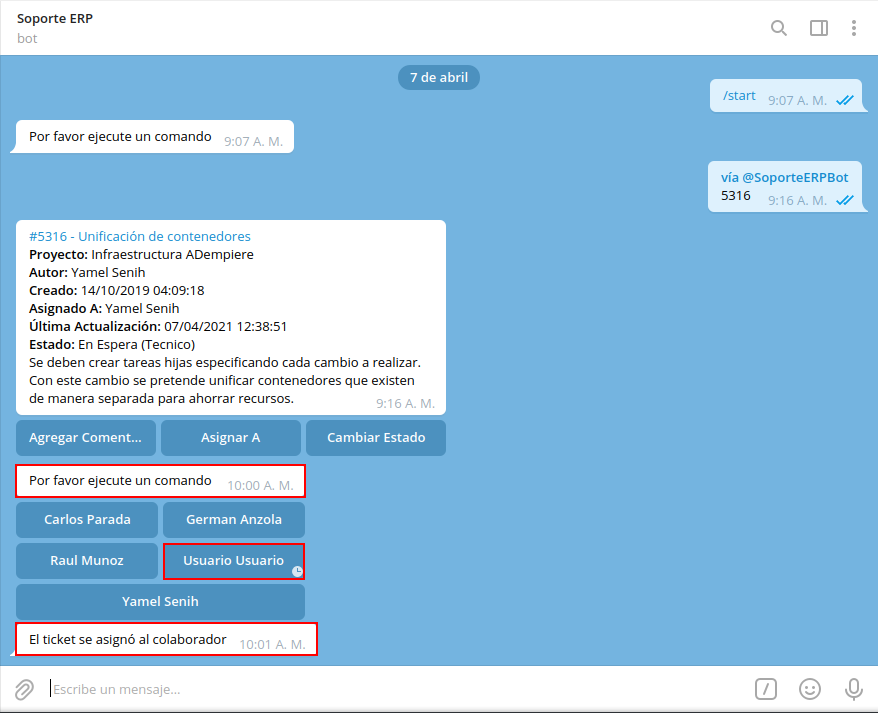
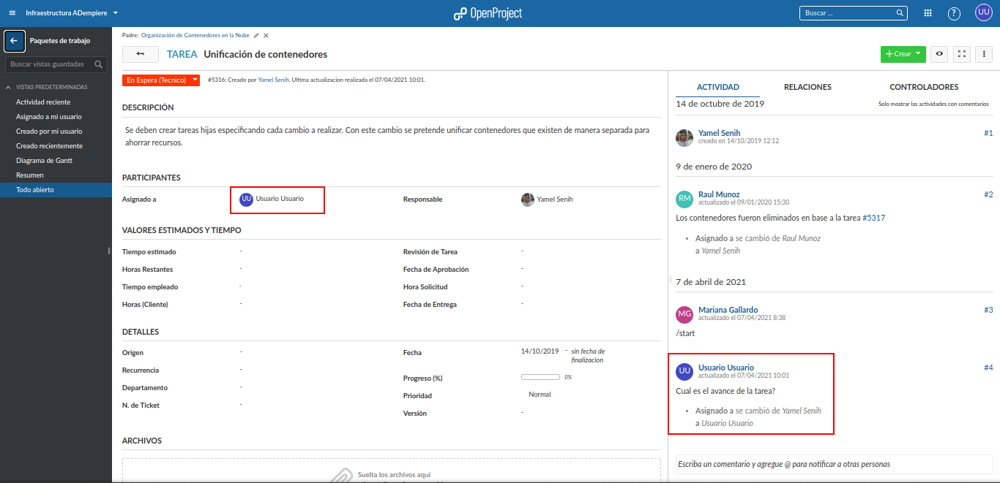
.. |opción cambiar estado de la tarea específica| image:: resources/option-change-specific-task-status.png
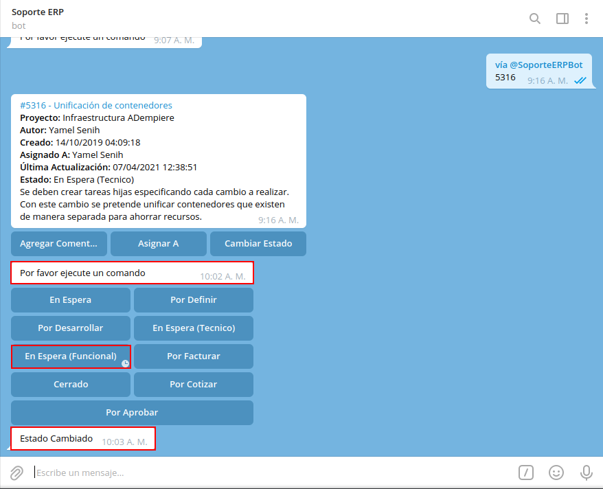
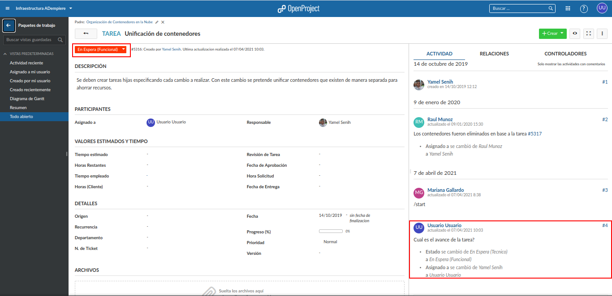

.. _documento/consultar-tarea-específica:

**Consultar Tareas Específicas**
================================

Al abrir la conversación de **Soporte ERP**, seleccione la opción "**INICIAR**", ubicada en la parte inferior de la conversación. Posteriormentre podrá visualizar un mensaje donde el bot indica que **Por favor ejecute un comando**.

    |mensaje principal por favor indique un comando|

    Imagen 1. Mensaje Principal "Por favor indique un comando"

Para consultar la información de una tarea en específico, de la cual conoce el número de identificación o nombre de la misma, debe ingresar en el campo "**Mensaje**", la palabra "**@SoporteERPBot**", seguido de un espacio en blanco y el número o nombre de la tarea.

    La búsqueda se realiza de manera automática al ingresar algún valor después del espacio en blanco que le sigue a la palabra "**@SoporteERPBot**", los resultados de la búsqueda se visualizan en la parte superior del campo "**Mensaje**".

    |variable soporte para consultar tarea|

    Imagen 2. Variable ADempiere

Finalmente, al seleccionar alguna de las coincidencias que se reflejan en la parte superior del campo "**Mensaje**", se envia un mensaje con el comando "**vía @SoporteERPBot**" y el número de tarea correspondiente a lo seleccionado en la búsqueda. Adicional a ello, se recibe un mensaje con la información detallada de la tarea, en el cual se indica lo siguiente:

    - Número de la tarea
    - Nombre de la tarea
    - Proyecto al que pertenece la tarea
    - Nombre y apellido del autor de la tarea 
    - Fecha y hora en la que fue creada la tarea
    - Nombre y apellido del encargado de la tarea
    - Fecha y hora de la última actualización de la tarea
    - Estado en el que se encuentra la tarea
    - Descripción que contiene la tarea

    |mensaje recibido con consulta de tarea|

    Imagen 3. Mensaje con Consulta de Tarea

Adicional a ello, se muestra en la parte inferior del mensaje con la consulta, tres opciones que le permiten al usuario agregar un comentario a la tarea, cambiar el estado o la persona asignada de la misma.

    |opciones de la consulta de la tarea específica|

    Imagen 4. Opciones de la Tarea Específica

    Seleccione la opción "**Agregar Comentario**", para agregar un comentario a la tarea consultada. 

        .. note::

            Esta opción también permite agregar una imagen.

        |opción agregar comentario de la tarea específica|

        Imagen 5. Opción Agregar Comentario

        Al agregar un comentario desde el bot, se agrega el mismo de manera automática en dicha tarea en el OpenProject.

            |comentario de la tarea en el bot|

            Imagen 6. Comentario de la Tarea en el Bot

            |comentario de la tarea en el openproject|

            Imagen 7. Comentario de la Tarea en el OpenProject

    Seleccione la opción "**Asignar A**", para agregar o cambiar el responsable de la tarea.

        |opción asignar a de la tarea específica|

        Imagen 7. Opción Asignar A

        Al cambiar la persona responsable de la tarea desde el bot, se cambia de manera automática en dicha tarea en el OpenProject.

            |asignado a de la tarea en el bot|

            Imagen 8. Asignado A de la Tarea en el Bot

            |asignado a de la tarea en el openproject|

            Imagen 9. Asignado A de la Tarea en el OpenProject

    Seleccione la opción "**Cambiar Estado**", para cambiar el estado en el que se encuentra la tarea.

        |opción cambiar estado de la tarea específica|

        Imagen 9. Opción Cambiar Estado

        Al cambiar el estado de la tarea desde el bot, se cambia de manera automática en dicha tarea en el OpenProject.

            |estado de la tarea en el bot|

            Imagen 10. Estado de la Tarea en el Bot

            |estado de la tarea en el openproject|

            Imagen 11. Estado de la Tarea en el OpenProject