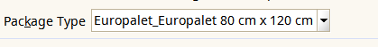
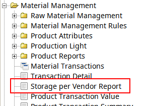
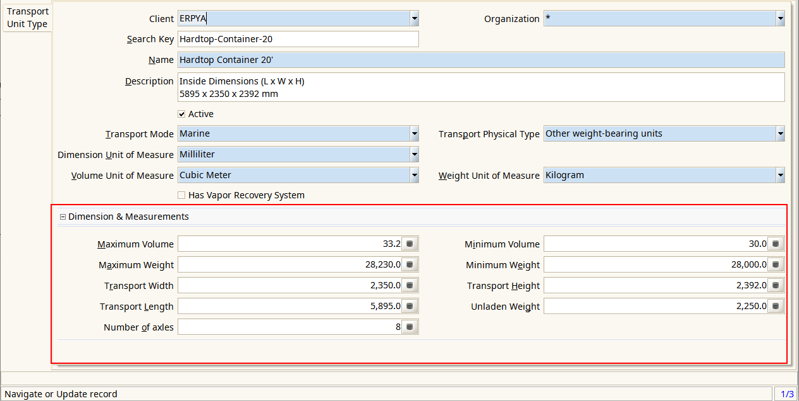

.. |generar factura automaticamente| image:: resources/rs-28-2-generate-invoice-shipment-automatically.png
.. |agregar asignacion de paquetes a orden de compras| image:: rs-28-2-purchase-order-add-package-allocation.png

.. _documento/versión-28-2:

**rs-28.2**
===========

**Fecha de Liberación:** 2021-09-22
-----------------------------------

.. data:: Soporte a Versiones:

- ADempiereBase: Versión de Liberación: 3.9.3-rs-4.3
- CST-STD: Versión de Liberación: rs-25.5
- Consigned-Material: 1.2.8
- Exchange-Operation-System: 1.1.7
- Cash-Management: 1.0.4
- Currency-Convert-Documents: 1.0.5
- Farmer-Assistance-Program: 1.1.6
- RethinkDB-Replicator-Client: 1.1.2
- Third-Party-Access: 1.0.2
- FiscalPrinter: 1.3.2
- Sales-Force-Management: 1.0.2
- Delivery-Management-Service: 1.0.6
- Travel-Agency-Management: 1.0.8
- Withholding: 1.0.9
- Additional-Reports: 1.0.3
- Migration-Tools: 1.0.3
- LVE: 1.3.9
- Performance-Analysis: 1.0.2
- Queue-Manager: 1.0.4
- Notification-Queue: 1.0.4
- Point-Of-Sales-Improvements: 1.1.5
- Kafka-Replicator-Client: 1.0.6
- Core-Tools: 1.1.1
- Get-Weight:1.0.9
- Record-Weight: 1.0.3
- Raw-Material-Receipt: 1.0.9
- Additional-Reports: 1.0.7
- adempiere-gRPC-Server: rt-23.5
- Material-Management-Improvements: 1.0.1
- Warehouse-Management-System-Improvements: 1.0.8
- Import-Export-Management: 1.0.0

.. data:: Detalle Técnico:
  
- Consigned-Material: Add Storage per Vendor Report
- Delivery-Management-Service: 

  - Add Barcode Box Report
  - Add flag for Allocate packages from Purchase Orders
  - Add Package Type reference to Order
  - Generate packages automatically from Purchase Order

- Import-Export-Management: Initial Commit
- Warehouse-Management-System-Improvements: Add Flag for generate invoice / shipment from Outbound Order

.. data:: Requerimientos:

- Aplicar binario de la aplicación
- Aplicar los XML's:

  - Consigned-Material: 07830_Add_Storage_per_Vendor.xml
  - Delivery-Management-Service: 
  
    - 06490_Add_Barcode_Box_Report.xml
    - 06500_Add_IsAllocatePackages_flag_for_Orders.xml
    - 06510_Add_PackageType_to_Order.xml

  - Import-Export-Management:

    - 09380_Add_Entity_Type_for_Fleet_Management_Improvements.xml
    - 09390_Add_transport_Unit_Type_Values.xml
    - 09400_Add_Package_Reference.xml
    - 09410_Add_Functionality_Setup_for_Import_Export_Management.xml

  - Warehouse-Management-System-Improvements: 09380_Add_Flag_for_Invoice_Shipment_Outbound_Automatically.xml

.. data:: Mejoras

|confirmar paquete|

- Se agrega nuevo reporte de Almacenamiento de Productos por Proveedor: muy util para ver los productos en consignación

|reporte de almacenamiento por proveedor|

- Se agrega formato de impresión de paquetes en formato 80 mm
- Se agrega referencia a tipo de paquete en Orden de Compras

|agregar tipo de paquete a orden de compra|

- Se agrega bandera para permitir asignar paquetes a orden de compras

|agregar asignacion de paquetes a orden de compras|

- Se agrega proceso que permite crear de manera automática los paquetes según peso y volumen al completar una orden de compras
- Se agregan dimensiones permitidas en el tipo de unidad de transporte
- Se predeterminan los valores máximos y mínimos de las unidades de transporte según su tipo

|agregar medidas a tipo de unidad de transporte|

- Se agrega bandera en tipo de documento de orden de salida para generar de manera automática las entregas al completar el documento
- Se agrega bandera en tipo de documento de orden de salida para generar de manera automática las facturas al completar el documento

|generar factura automaticamente|
