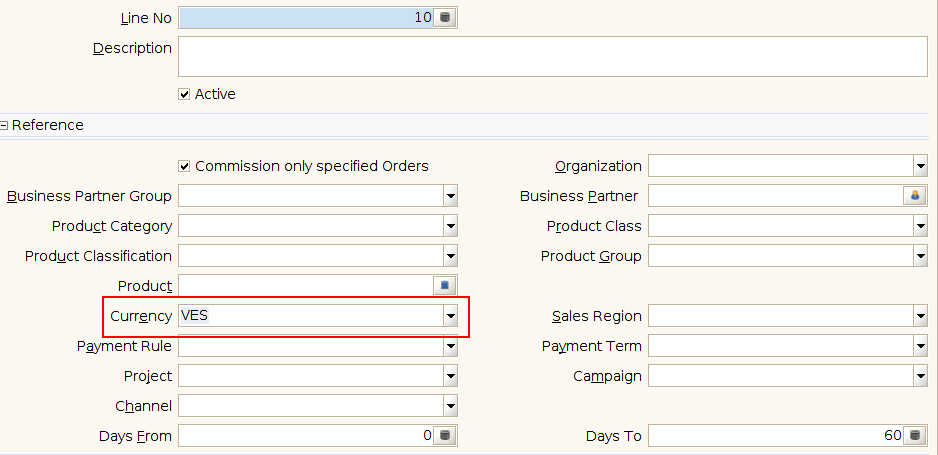

.. _documento/versión-47-1:
.. _Error al activar Validador de Modelo: https://github.com/erpcya/Control-PROSEIN/issues/237
.. |Configuración de Tienda| image:: resources/rs-47-1-store-setup.png
.. |Configuración de Comisión| image:: resources/rs-47-1-commission-setup.png

**rs-47-1**
===========

**Fecha de Liberación:** 2022-07-19
-----------------------------------

.. data:: Soporte a Versiones

- ADempiereBase: Versión de Liberación: 3.9.3-rs-4.3
- CST-STD: Versión de Liberación: rs-34.9
- Consigned-Material: 1.3.0
- Exchange-Operation-System: 1.2.1
- Cloud-Service-Management: 1.2.4
- Cash-Management: 1.1.4
- Currency-Convert-Documents: 1.0.9
- Farmer-Assistance-Program: 1.4.5
- RethinkDB-Replicator-Client: 1.1.5
- Third-Party-Access: 1.0.6
- Fiscal-Printer: 1.5.3
- Sales-Force-Management: 1.0.6
- Delivery-Management-Service: 1.1.9
- Travel-Agency-Management: 1.1.9
- Withholding: 1.2.2
- Migration-Tools: 1.0.4
- LVE: 1.8.4
- Performance-Analysis: 1.1.3
- Queue-Manager: 1.0.6
- Notification-Queue: 1.1.6
- Point-Of-Sales-Improvements: 1.4.4
- Kafka-Replicator-Client: 1.0.9
- Kafka-Util: 1.0.2
- Core-Tools: 1.4.1
- Get-Weight:1.2.4
- Record-Weight: 1.0.7
- Raw-Material-Receipt: 1.1.6
- Additional-Reports: 1.2.4
- adempiere-customer-backend: 1.2.1
- Material-Management-Improvements: 1.1.6
- Warehouse-Management-System-Improvements: 1.1.6
- Import-Export-Management: 1.0.3
- Update-Management: 1.1.9
- Mini-Retail: 1.1.7
- Print-Queue: 1.1.4
- ERP-Payroll-Definition: 1.0.6
- Internal-Store: 1.0.4
- Telegram-Notifier: 1.0.5
- Costing-Engine-Improvements: 1.1.1
- Default-Attribute: 1.0.1
- Financial-Report: 1.0.1
- Json-Replicator-Client: 1.0.2
- Kubernetes-Cluster: 1.0.7
- ADempiere-Exporter: 1.0.5
- ADempiere-TelegramBot
- e-Commerce-Queue: 1.1.5
- Vue-StoreFront-API: 1.0.9
- Mercado-Libre-Venezuela-API: 1.0.8
- Common-Functionalities: 1.0.0
- FAP-Venezuela-Location: 1.0.4
- LVE-AdditionalTax: 1.0.7

.. data:: Detalle Técnico

- e-Commerce-Queue:
  
  - Add support to selected export entities based on e-Commerce setup

- CST-STD:

  - Add patch for new e-Commerce functionalidy based on selected tables to export
  - Add support to currency filter to commission and commission line definition

.. data:: Requerimientos

- Aplicar binario de la aplicación

- Aplicar XML's:

  - e-Commerce-Queue:

    - 10020_Add_Export_flags_definition.xml
  
  - CST-STD:

    - 10270_Add_Currency_as_filter_to_Commission_Definition.xml

	
.. data:: Novedades

- Se corrige llamado recursivo de método para exportación de datos del e-Commerce
- Se agrega bandera en tienda web para determinar cuales entidades se exportarán a la tienda web
- Se agrega filtro por moneda en la definición y línea de comisiones. Esto permite que se pueda tener una comisión en una moneda y otra en una moneda distinta, tambien se puede tener una sola definición de comisiones con dos lineas aplicando filtro de distintas monedas

Banderas que se agregaron a la tienda web se pueden ver a continuación
|Configuración de Tienda|

Con este release ahora se puede marcar una bandera en la comisión para que sólo busque los documentos que tienen la misma moneda de la definición de comisión. A continuación se puede ver dónde se configura dentro de la ventana de Definición de Comisiones
|Configuración de Comisión|

Si se desea tener una sola definición de comisiones pero con reglas distintas dependiendo de la moneda entonces se puede seleccionar la moneda en la línea de la definición de comisiones y actuará como filtro, esto sólo es aplicable si la bandera que se encuentra en la definición de comisiones para hacer filtro por la misma moneda se encuentra deshabilitada.
|Configuración de Línea de Comisión|

.. data:: Reportes Relacionados

  - `Error al activar Validador de Modelo`_