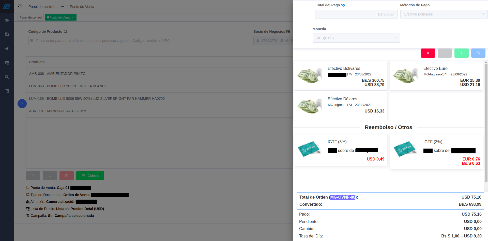

.. _documento/versión-47-9:

**rs-47-9**
===========

**Fecha de Liberación:** 2022-08-23
-----------------------------------

.. data:: Soporte a Versiones

- ADempiereBase: Versión de Liberación: 3.9.3-rs-4.3
- CST-STD: Versión de Liberación: rs-35.1
- Consigned-Material: 1.3.0
- Exchange-Operation-System: 1.2.1
- Cloud-Service-Management: 1.2.4
- Cash-Management: 1.1.4
- Currency-Convert-Documents: 1.1.2
- Farmer-Assistance-Program: 1.4.6
- RethinkDB-Replicator-Client: 1.1.5
- Third-Party-Access: 1.0.6
- Fiscal-Printer: 1.5.3
- Sales-Force-Management: 1.0.9
- Delivery-Management-Service: 1.2.0
- Travel-Agency-Management: 1.1.9
- Withholding: 1.2.6
- Migration-Tools: 1.0.4
- LVE: 1.9.0
- Performance-Analysis: 1.1.3
- Queue-Manager: 1.0.7
- Notification-Queue: 1.1.6
- Point-Of-Sales-Improvements: 1.4.7
- Kafka-Replicator-Client: 1.0.9
- Kafka-Util: 1.0.2
- Core-Tools: 1.4.4
- Get-Weight:1.2.4
- Record-Weight: 1.0.7
- Raw-Material-Receipt: 1.1.6
- Additional-Reports: 1.2.6
- adempiere-customer-backend: 1.2.1
- Material-Management-Improvements: 1.1.6
- Warehouse-Management-System-Improvements: 1.1.6
- Import-Export-Management: 1.0.3
- Update-Management: 1.1.9
- Mini-Retail: 1.1.7
- Print-Queue: 1.1.4
- ERP-Payroll-Definition: 1.0.6
- Internal-Store: 1.0.4
- Telegram-Notifier: 1.0.5
- Costing-Engine-Improvements: 1.1.1
- Default-Attribute: 1.0.1
- Financial-Report: 1.0.1
- Json-Replicator-Client: 1.0.2
- Kubernetes-Cluster: 1.0.7
- ADempiere-Exporter: 1.0.5
- ADempiere-TelegramBot
- e-Commerce-Queue: 1.1.5
- Vue-StoreFront-API: 1.0.9
- Mercado-Libre-Venezuela-API: 1.0.8
- Common-Functionalities: 1.0.0
- FAP-Venezuela-Location: 1.0.5
- LVE-AdditionalTax: 1.0.9

.. data:: Detalle Técnico

- Point-Of-Sales-Improvements:

  - Add Rate and Base amount for order reference payment
  - Add flag to allows create complete shipment instead line by line
  - Add attribute displayed from collection for POS payment type allocation

- LVE-AdditionalTax:

  - Add FBTT support calculation from POS

.. data:: Requerimientos

- Aplicar binario de la aplicación
- Aplicar los XML's:

  - Point-Of-Sales-Improvements:

    - 09800_ECA14_Add_Reference_Payment_fields.xml
    - 09810_ECA14_Add_flag_for_complete_shipment.xml
    - 09820_ECA14_Add_flag_for_IsDisplayedFromCollection.xml

  - LVE-AdditionalTax:

    - 0010_ECA40_Add_Setup_for_POS.xml
	
.. data:: Novedades

- Se agrega monto base y porcentaje de referencua en la referencia de pagos del Punto de Ventas
- Se agrega bandera para permitir hacer entregas completas y no línea a línea en el Punto de Ventas
- Se agrega atributo que permite visualizar métodos de pago en el POS
- Se agrega funcionalidad para cálculo de IGTF de manera automática en el Punto de Ventas
|IGTF en POS|

.. only:: html

    .. figure:: resources/rs-47-9-fbtt-collect.mp4
      

.. only:: html

    .. figure:: resources/rs-47-9-fbtt-generated.mp4

.. data:: Reportes Relacionados