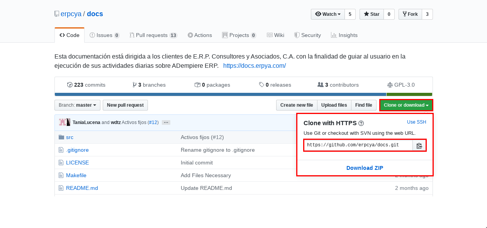

.. _ERPyA: http://erpya.com

.. _documento/contribuir-documento:

=================================
**Contribuir a la Documentación**
=================================

La documentación es una forma de describir un proceso simple o complejo para un usuario final, dado que en el día a día existen muchas actividades y muy poco tiempo siempre es bueno contar con una guía para realizar los procesos que a veces se olvidan.

Este material elaborado por `E.R.P. Consultores y Asociados, C.A. <http://erpya.com/>`__ está dirigido a las personas que se encargan de documentar cualquier proceso, paso a paso, guía de usuario o simplemente una publicación bajo el uso de la herramienta "**reStructuredText**". Tome en cuenta todas las consideraciones expresadas en esta guía para evitar problemas de escalabilidad a futuro y mantenimiento.

A diferencia de "**Markdown**", la documentación en "**rST**" no es realizada de forma local, por lo tanto el equipo de trabajo necesita conexión a internet para visualizar los cambios realizados en la documentación.

Las colaboraciones a dicha documentación son realizadas por medio de "**GitHub**". El repositorio del usuario debe ser actualizado para extraer del repositorio "**erpcya/docs**" los cambios. Para contribuir a la documentación de `ERPyA`_, el usuario debe cumplir con tres (3) requerimientos necesarios indicados a continuación y acceder a https://github.com/erpcya/docs/issues para contribuir:

- Tener el repositorio de `ERPyA`_ clonado en su versión actualizada.

- Tener usuario en Read the Docs

- Tener creado un proyecto con la url del repositorio de `ERPyA`_

En el caso de que el usuario no cumpla con los requerimientos establecidos y desconozca la manera de obtenerlos, puede ingresar al documento :ref:`documento/nuevo-proyecto`, y seguir el procedimiento indicado para cumplir con los requerimientos necesarios.

Cuando el usuario cumpla con los requerimientos indicados anteriormente y desee realizar contribuciones a las documentaciones, el mismo debe iniciar sesión en "**Read the Docs**", abrir el editor de texto instalado previamente (Puede ser utilizado Visual Studio Code) y realizar lo siguiente:

Seleccione en la barra de herramientas de "**Visual Studio Code**", la opción "**Terminal**", luego seleccione la opción "**Nueva Terminal**". Ejecute el siguiente comando en la terminal: git remote add upstream https://github.com/erpcya/docs.git

Luego de haber configurado "**Visual Studio Code**", puede proceder a realizar o actualizar la documentación.

**Apuntes para la Documentación**
=================================

El lenguaje "**reStructuredText**" o "**rST**" es muy parecido al lenguaje "**Markdown**", al momento de documentar en "**rST**" se deben tener en cuenta algunos detalles diferentes de "**Markdown**":

**Identificación del Documento**
********************************

Al principio del documento es recomendable identificarlo con una etiqueta, la misma se compone de dos puntos continuos "**..**", seguido de un espacio en blanco y por último el símbolo "**_**", pegado de la palabra "**documento**", con el símbolo "**/**" y el nombre del documento, finalizando con el símbolo "**:**"

**Ejemplo**:

::

    .. _documento/contribuir:

La etiqueta al principio del documento es una forma de clasificación ordenada que sirve de utilidad al usuario para llamarlo cuando sea necesario en cualquier otro documento. El llamado de un documento se puede realizar por medio de la siguiente etiqueta:

::

    :ref:`documento/contribuir`

**Ejemplo**:

::

    Si desea contribuir a esta documentación, puede tomar como guia el documento realizado por E.R.P. Consultores y Asociados con la finalidad de que los usuario puedan :ref:`documento/contribuir`.

**Titulos**
***********

Los titulos en "**rST**" son identificados por caracteres especiales

::

    # Con revestimiento, para piezas

    * Con overline, para capítulos

    =, Para secciones

    -, Para subsecciones

    ^, Para las subsecciones

    ", Para párrafos

Los mismos, pueden ser utilizados de la siguiente manera en un documento

::

    =============================
    Contribuir a la Documentación
    =============================

    Apuntes para la Documentación
    =============================

    
    Identificación del Documento
    ****************************

    
    Tabla Compleja
    --------------

**Formato para Listas Numericas**
*********************************

La numeración en la documentación se realiza agregando:

::

    * Punto uno

    - Punto dos

    + Punto tres 

    #. Punto cuatro 

    1. Punto cinco

La misma es visualizada de la siguiente manera:

* Punto uno

- Punto dos 

+ Punto tres

#. Punto cuatro

1. Punto cinco

**Formato de Párrafos**
***********************

Los párrafos son simplemente fragmentos de texto separados por una o más líneas en blanco. En "**reStructuredText**" se puede dar formato a los párrafos de la siguiente manera:

::

    - Un asterisco: *text* para énfasis (cursiva),

    - Dos asteriscos: **text** para un fuerte énfasis (negrita) y

    - Comillas inversas: ``text`` para muestras de código.

**Ejemplo**:

    - Un asterisco: *text* para énfasis (cursiva),

    - Dos asteriscos: **text** para un fuerte énfasis (negrita) y

    - Comillas inversas: ``text`` para muestras de código.

Tenga en cuenta algunas restricciones de este marcado:

- No puede estar anidado

- El contenido puede no comenzar o terminar con espacios en blanco entre los asteriscos: * text*

**Formato para Tablas**
***********************

En rST se pueden realizar dos tipos de tablas:

**Tabla Compleja**
------------------

Permite adaptar las celdas al requerimiento que tenga el usuario para plasmar la información.

::

    +------------------------+--------------------------+------------------------------+-----------------+
    |     Requerimientos     |         Usuario          |         Contraseña           |  Documentación  |
    |      del Usuario       |                          |         del Usuario          |     Publica     |
    +========================+==========================+==============================+=================+
    |        GitHub          |      UsuarioEstandar     |         Clave Secreta        |Perfil en GitHub |
    +------------------------+--------------------------+------------------------------+-----------------+
    |     Read the Docs      |         uEstandar        |            uEstandar         |Proyectos Creados|
    +------------------------+--------------------------+------------------------------+-----------------+

**Ejemplo de Tabla Compleja**:

    +------------------------+--------------------------+------------------------------+-----------------+
    |     Requerimientos     |         Usuario          |         Contraseña           |  Documentación  |
    |      del Usuario       |                          |         del Usuario          |     Publica     |
    +========================+==========================+==============================+=================+
    |        GitHub          |      UsuarioEstandar     |         Clave Secreta        |Perfil en GitHub |
    +------------------------+--------------------------+------------------------------+-----------------+
    |     Read the Docs      |         uEstandar        |            uEstandar         |Proyectos Creados|
    +------------------------+--------------------------+------------------------------+-----------------+

**Tabla Sencilla**
------------------

Permite al usuario plasmar la información en una tabla sencilla.

::

    ==============  ===============  =============
    Requerimientos      Usuario       Contraseña
    ==============  ===============  =============
    Read the Docs   uEstandar        uEstandar
    GitHub          UsuarioEstandar  Clave Secreta
    ==============  ===============  =============

**Ejemplo de Tabla Sencilla**:

    ==============  ===============  =============
    Requerimientos      Usuario       Contraseña
    ==============  ===============  =============
    Read the Docs   uEstandar        uEstandar
    GitHub          UsuarioEstandar  Clave Secreta
    ==============  ===============  =============

**Formato para Imágenes**
*************************

Las imágenes pueden ser llamadas en la documentación de dos (2) formas:

**Llamado de Imagen**
---------------------

::

    "Ejemplo de una imagen":

    .. documento/contribuir-01

    .. figure:: resources/img1.png
       :alt: Inicio de Sesión en GitHub

    Imagen 1. Inicio de Sesión en GitHub

    "Ejemplo de otra imagen":

    .. documento/contribuir-02

    .. figure:: resources/img2.png
       :alt: Perfil de ERPyA en GitHub

    Imagen 2. Perfil de ERPyA en GitHub

.. note::

    - ``.. documento/contribuir-01``: Etiqueta de referencia para ordenar las imágenes en el código por si ocurre un error con las mismas.
    
    - ``.. figure:: img/img1.png``: Etique para llamar las imágenes.
    
    - ``:alt:``: Etiqueta para el nombre de la imagen por si falla la visualización de la misma. Esta debe colocarse dejando tres (3) espacios en blanco despues de donde comienza la identación de la etiqueta ``.. figure:: img/img1.png``.
    
    - ``Imagen 1. Inicio de Sesión en GitHub``: Referencia para mostrar por orden las imágenes en el documento y agregar su título o descripción.

**Llamado de Imagen por Etiqueta**
----------------------------------

"**Ejemplo de ruta de la imagen**":

    ``.. |Inicio de Sesión en GitHub| image:: img/img1.png``

    ``.. |Perfil de ERPyA en GitHub| image:: img/img2.png``

.. note::

    - ``.. |Inicio de Sesión en GitHub| image:: img/img1.png``: Etiqueta de ruta de la imagen. Esta etiqueta debe agregarse al principio del documento y antes de la etiqueta de identificación del documento.
 

:: 

    "Ejemplo de llamado de una imagen en el documento":

    Ingrese a su usuario de "GitHub" en https://github.com/. 

    |Inicio de Sesión en GitHub|

    Imagen 1. Inicio de Sesión en GitHub

    "Ejemplo de llamado de otra imagen en el documento":

    Luego ubique el perfil de `ERPyA`_ ubicado en https://github.com/erpcya, para buscar el repositorio de la documentación "docs". La búsqueda del repositorio puede ser realizada de forma manual o buscando la palabra "docs" en la barra de búsqueda inteligente.

    |Perfil de ERPyA|

    Imagen 2. Perfil de ERPyA

.. note:: 

    - ``|Perfil de ERPyA|``: Llamado de la imagen en el documento. Esta puede ser llamada cuando se necesite a lo largo del documento.
    - ``Imagen 2. Perfil de ERPyA``: Referencia para mostrar por orden las imágenes en el documento y agregar su título o descripción.

**Formato para Menú**
*********************

El menú en la documentación es conformado en el "**index.rst**" principal de la carpeta "**src**". El documento se encuentra conformado por lo siguiente:

- ``Título``: Título Principal de la Documentación.
- ``.. toctree::``: Etiqueta para mostrar en el menú los nombres de los documentos con enlace a los mismos por medio de un click.
- ``:caption: E.R.P. Consultores y Asociados, C.A.``: Etiqueta para clasificar el menú por modulos, seguido del nombre correspondiente.
- ``:maxdepth: 2``: Etiqueta utilizada para indicar que cantidad o profundidad de niveles de documentos que se van a mostrar. 
- ``:numbered:``: Etiqueta utilizada para enumerar cada documento del menú declarado con su respectiva ruta.
- ``general/procedures/index``: Declaración de la ruta del documento.

**Formato para Notas y Alertas**
********************************

Para agregar correctamente una nota o alerta, es necesario tomar en cuenta lo siguiente:

    - No dejar espacios en blanco al comenzar la línea donde sera definida la etiqueta de la nota o alerta.

    - Definir la etiqueta de la nota ``.. note::``, o alerta ``.. warning::``

    - Dejar una línea libre entre la etiqueta de la nota ``.. note::``, o alerta ``.. warning::`` y el contenido de la misma.

    - Dejar una sangría de cuatro (4) espacios en blanco, en la línea del contenido.

**Reglas para Crear una Documentación**
=======================================

E.R.P. Consultores y Asociados, C.A. tiene establecido como estándar de nombre de archivos, directorio e imágenes de la documentación en "**reStructuredText**" lo siguiente.

**Nombre del Archivo de la Documentación**
******************************************

El nombre del archivo debe respetar lo siguiente:

- Debe ser un nombre que describa la funcionalidad.

- El nombre debe ser en inglés.

- Los espacios en blanco se deben sustituir por guiones (-).

- No debe poseer caracteres especiales: !@#$%*()_=+/?<>~

- La extensión del archivo debe ser rst

- El nombre debe ser todo en minúscula.

**Ejemplo de un nombre de archivo**: setup-vmax-220.rst

**Directorio de la Documentación**
**********************************

Dependiendo de lo complejo de la documentación se define la estructura de directorios, sea lo mas específico posible y preguntese primero lo siguiente:

- ¿La documentación tiene muchas secciones?

- ¿Las funcionalidades son completamente separadas?

- ¿Tiene relación un documento con otro?

Con base en las preguntas deberá determinar si debe agregar un directorio nuevo al directorio principal o simplemente usar uno que ya exista.

Un ejemplo es la localización realizada por E.R.P. Consultores y Asociados, C.A. para Venezuela, a continuación se presenta:

- ¿La documentación tiene muchas secciones? Si puede tener varias secciones como:

    - Impresión fiscal

    - Retenciones

    - Tesorería

    - Reportes fiscales

- ¿Las funcionalidades son completamente separadas? Pertenecen a un sub-grupo llamado localización Venezuela que practicamente no forma parte del core de ADempiere

- ¿Tiene relación un documento con otro? Si, entre cada una de las funcionalidades de la localización se tiene mucha relación.

Todo esto indica que se debe crear un directorio dentro del directorio principal y dentro de ese directorio deberá existir un 
directorio por funcionalidad, 

**Ejemplo de Directorio Principal**: docs 

    Árbol de directorios:

        - docs/
            
            - lve/
        
                - fiscal-printer/
                
                    - setup-vmax-220.rst
                
                - withholding/
                
                - finance/
                
                - fiscal-reports/

.. note::

    Para el nombre de los directorios se debe respetar la misma definición utilizada para los nombres de los archivos.

**Directorio de las Imágenes de la Documentación**
**************************************************

El directorio de las imágenes se debe crear dentro del directorio de la funcionalidad, un ejemplo de ello puede ser el siguiente: 

Siguiendo con el ejemplo anterior, si se desea agregar alguna imagen al documento "**setup-vmax-220.rst**" se debe crear un directorio 
llamado "**resources**" dentro del directorio "**fiscal-printer**", el resultado quedaría como el siguiente:

**Ejemplo de Directorio de las Imágenes**: 

    Árbol de directorios:

        - docs/
            
            - lve/
        
                - fiscal-printer/

                    - resources/
                
                    - setup-vmax-220.rst
                
                - withholding/
                
                - finance/
                
                - fiscal-reports/

.. note:: 

    Para el nombre de las imágenes se debe respetar la misma definición utilizada para los nombres de los archivos.

**Comandos para Documentación**
===============================

**Descargar Repositorio**
*************************

Para descargar el repositorio en la carpeta local y poder contribuir a la documentación, es necesario ejecutar los siguientes comandos en la terminal de "**Visual Studio Code**".

#. Comando para ubicarse en la carpeta donde se va a almacenar el repositorio ``cd /opt/Development/Workspace/``

#. Copie la url del repositorio de `ERPyA`_ con la opción "**Clone or download**"

    |Clonar o Descargar|

    Imagen 1. Opción Clonar o Descargar Repositorio 

#. Comando para descargar el repositorio clonado en la carpeta local seleccionada ``git clone https://github.com/erpcya/docs.git``

.. note:: 

    La url introducida en el comando es la copiada desde la opción "**Clone or download**" del repositorio de `ERPyA`_.

**Actualizar Repositorio**
**************************

Para contribuir a la documentación es necesario tener el repositorio actualizado, para ello se debe ejecutar los siguientes comandos:

#. Comando para ubicarse en la carpeta donde se encuentra el repositorio ``cd /opt/Development/Workspace/docs``

#. Comando para traer los cambios del repositorio de `ERPyA`_ ``git fetch upstream``

#. Comando para reemplazar el repositorio en mi cuenta por el repositorio de `ERPyA`_ ``git rebase -f upstream/master``

    #. Si da conflicto o se necesitan los cambios de una rama en especifico, se debe ajecutar el siguiente comando ``git merge master``

    #. Hacer commit para corregir el conflicto.

.. note::

    No se debe trabajar en la rama master.

**Actualizar el Servicio de Prueba**
************************************

#. Hacer commit en la rama creada para el documento.

#. Ubicarse en 159.65.189.53:8000/projects/documentacion-uestandar/builds/ o en su defecto http://docs.erpya.com/projects/documentacion-uestandar/builds/

    #. Seleccione la rama (versión) a actualizar.

    #. Seleccione la opción "**Versión de Compilación**".

    .. note:: 

        La palabra "**documentacion-uestandar**" corresponde al proyecto creado en la documentación :ref:`documento/nuevo-proyecto`:

#. Espere el resultado

    #. **Compilando**: Se esta compilando el servicio y construyendo los cambios.

    #. **Fallido**: Ocurrio un error y no se compilo el servicio de prueba. En este caso debe realizar lo siguiente:

        #. Seleccione la palabra "**Fallido**" para ver el error.

        #. Solucione el error y genere otro commit con los cambios para solucionarlo.

        #. Realice el proceso para "**Actualizar el Servicio de Prueba**".
    
    #. **Con Éxito**: Se compilo exitosamente el servicio de prueba.

#. Ubique el servicio de prueba 159.65.189.53:8000/docs/documentacion-uestandar/en/versióncompilada o en su defecto puede seleccionar la opción "**Ver Documentación**" y cambie en la url http://docs.erpya.com/docs/documentacion-uestandar/en/latest/ la palabra "**latest**" por el nombre de la versión compilada.

    #. Refresque o Actualice la página para ver los cambios.