.. _ERPyA: http://erpya.com
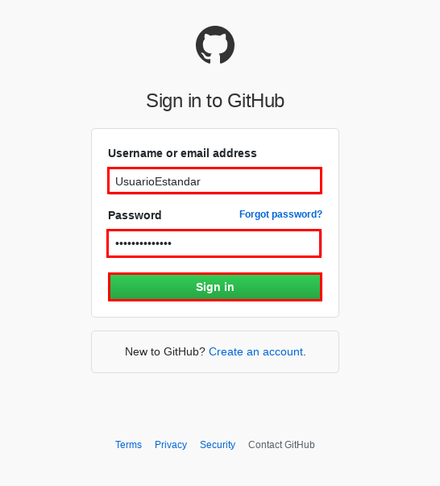
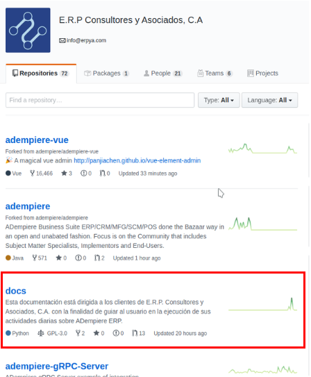
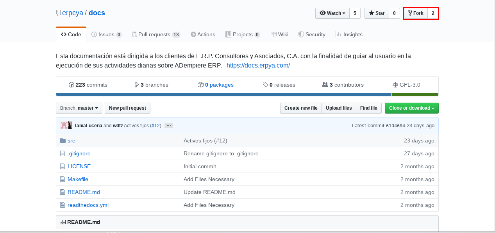
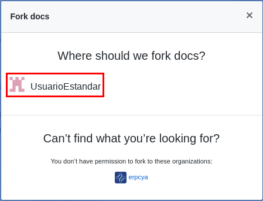
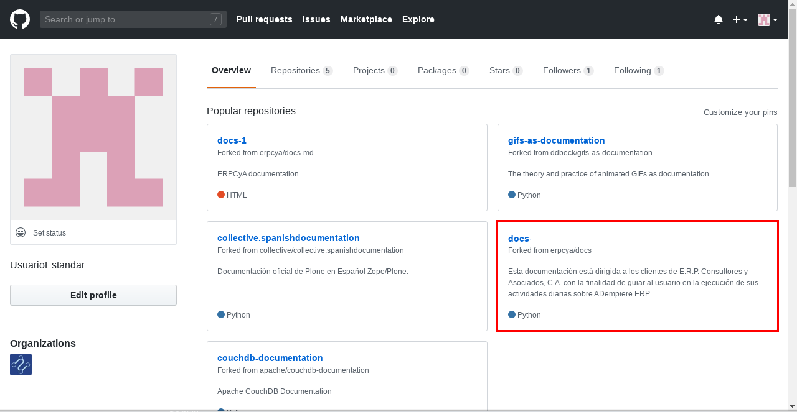
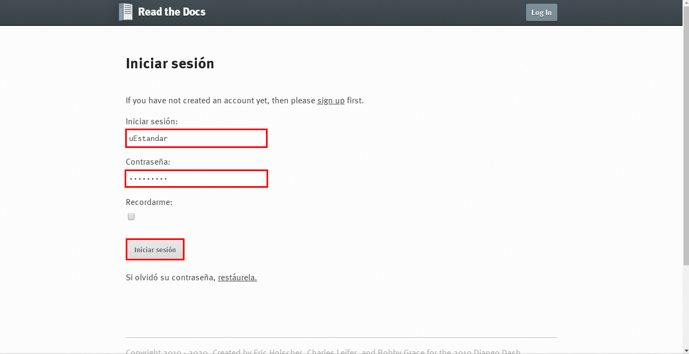
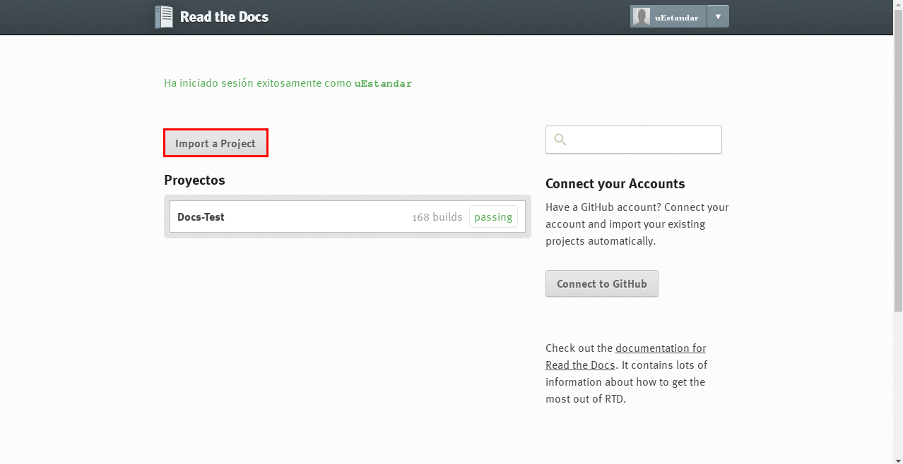
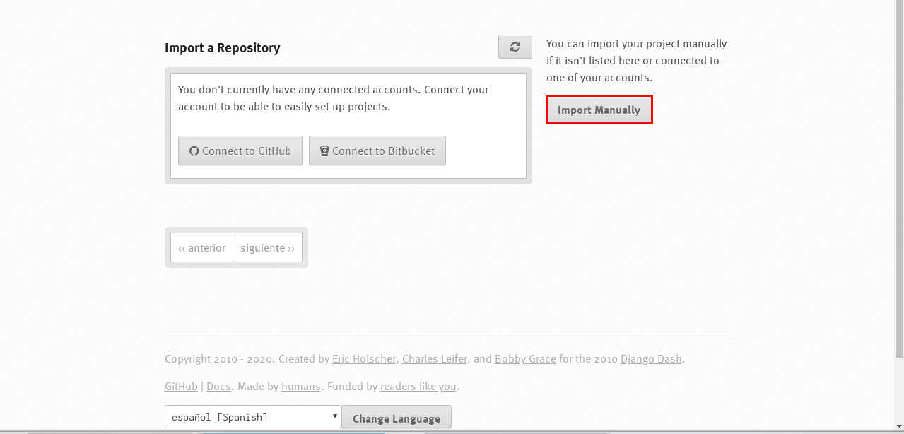
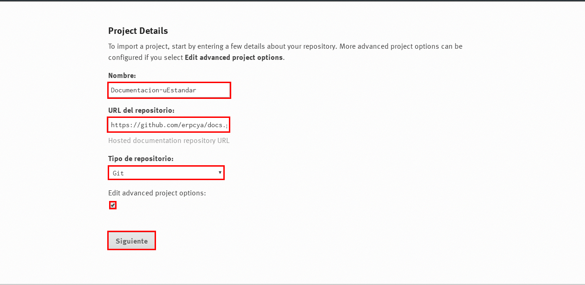
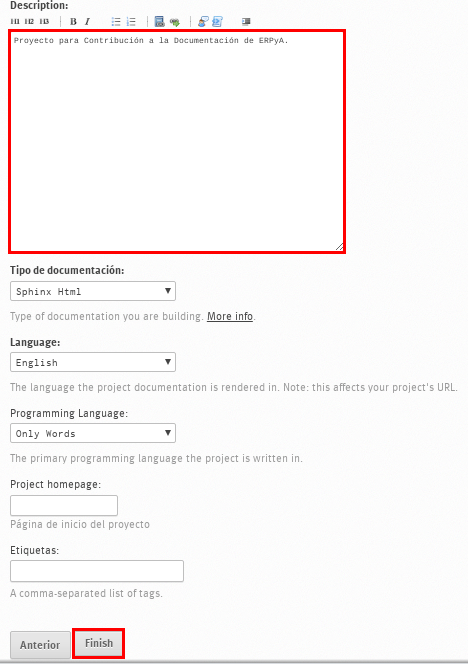
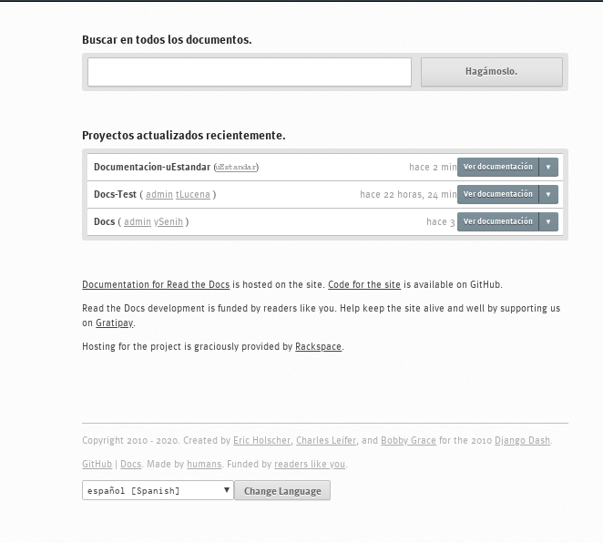

.. _documento/nuevo-proyecto:

======================================
**Crear un Proyecto en Read the Docs**
======================================

Para realizar una contribución a la documentación de `ERPyA`_ realice el procedimiento indicado en el presente documento para cumplir con los requerimientos necesarios.

`ERPyA`_ tiene como estándar de usuario para acceder a "**Read the Docs**", el mismo estándar de usuario en "**ADempiere**".

Las credenciales para que el usuario pueda iniciar sesión en "**Read the Docs**" son:

**Usuario**: Primera letra del primer nombre, seguido del primer apellido con la primera letra en mayúscula. El usuario no debe tener espacios en blanco o caracteres especiales.

    - **Ejemplo**: uEstandar

**Contraseña**: La misma información establecida en el campo usuario, sin espacios en blanco o caracteres especiales.

    - **Ejemplo**: uEstandar

**Clonar Repositorio de ERPyA**
===============================

Ingrese a su usuario de "**GitHub**" en https://github.com/. 

    |Usuario en GitHub|

    Imagen 1. Inicio de Sesión en GitHub

Luego ubique el perfil de `ERPyA`_ ubicado en https://github.com/erpcya, para buscar el repositorio de la documentación "**docs**". La búsqueda del repositorio puede ser realizada de forma manual o buscando la palabra "**docs**" en la barra de búsqueda inteligente.

    |Perfil de ERPyA|

    Imagen 2. Perfil de ERPyA

Ingrese al repositorio "**docs**" y seleccione la opción "**Fork**" ubicada en la superior derecha de la ventana. 

    |Fork|

    Imagen 3. Clonar Repositorio

.. note:: 

    Esta opción permite crear en su repositorio de "**GitHub**", una copia del repositorio en cual se encuentra ubicado el usuario.

Podrá visualizar la ventana "**Fork docs**", donde debe seleccionar el usuario en el cual será guardada la copia realizada y esperar hasta que el proceso culmine.

    |Copiar al Usuario|

    Imagen 4. Seleccionar Usuario para Realizar la Copia

Luego de culminado el proceso "**Fork**", puede acceder al repositorio desde el perfil del usuario.

    |Perfil Usuario|

    Imagen 5. Perfil del Usuario

**Crear un Proyecto en Read the Docs**
======================================

Ingrese a la página http://docs.erpya.com/accounts/login/, para iniciar sesión con su usuario en "**Read the Docs**".

    |Usuario en Read the Docs|

    Imagen 6. Inicio de Sesión en Read the Docs

En "**Read the Docs**", la creación de proyectos es realizada mediante la selección de la opción "**Import a Project**".

    |Crear Proyecto|

    Imagen 7. Opción Crear nuevo Proyecto

El usuario debe realizar la importación manualmente seleccionando la opción "**Import Manually**".

    |Importar Manualmente|

    Imagen 8. Opción Importar Manualmente

`ERPyA`_ recomienda a los usuarios que los proyectos creados con respecto a la documentación sean creados bajo un estándar con respecto a los nombres:

    - **Campo Nombre:** Se refiere al nombre del proyecto en Read the Docs, el mismo puede ser la palabra "**Documentacion**", seguida del símbolo "**-**" y por último el nombre del usuario "**uEstandar**".

    - **Campo URL del repositorio:** Se refiere a la url del repositorio clonado. Para este ejemplo el repositorio clonado es el de `ERPyA`_ y la url es https://github.com/erpcya/docs.git obtenida en el repositorio "**docs**", seleccionando la opción "**Clone or download**".

    - **Checklist Edit advanced project options:** Permite agregar la descripción del proyecto que se esta creando.

Luego de llenar los campos correspondientes, el usuario debe seleccionar la opción "**Siguiente**" para continuar con la creación del proyecto.

    |Datos del Proyecto|

    Imagen 9. Datos del Nuevo Proyecto

Proceda a ingresar una descripción referente al proyecto que esta creando. Luego seleccione la opción "**Finish**", para finalizar la creación del proyecto.

    |Descripción del Proyecto|

    Imagen 10. Descripción del Proyecto

.. note::

    La creación del proyecto puede tardar unos minutos, `ERPyA`_ recomienda al usuario esperar hasta que "**Read the Docs**" culmine el proceso.

El usuario puede visualizar los proyectos creados ingresando en http://docs.erpya.com/

    |Proyectos Creados|

    Imagen 11. Proyectos Creados