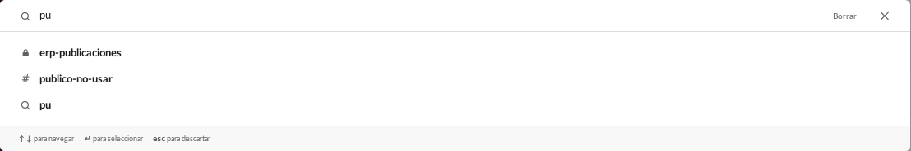
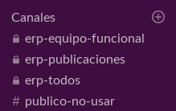
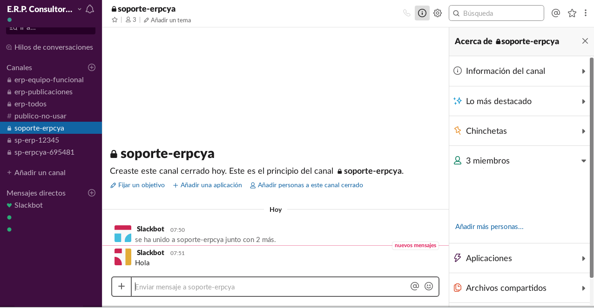
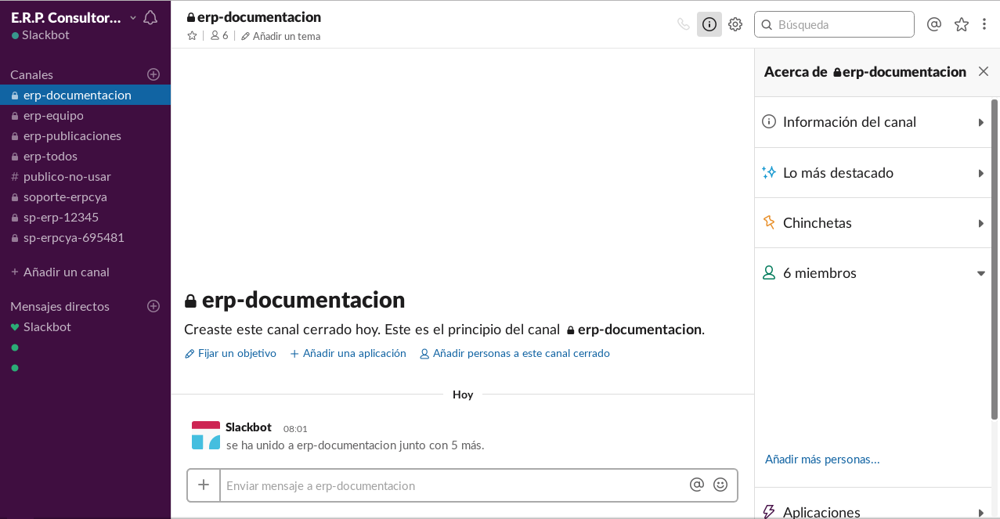
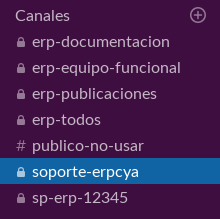
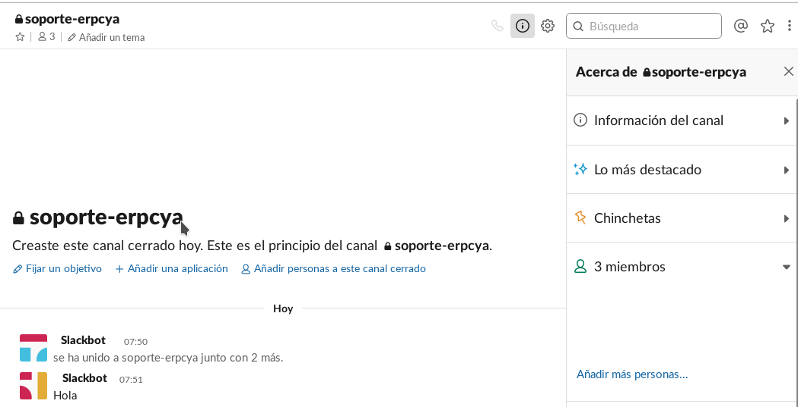
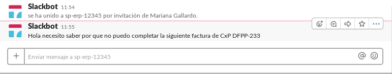
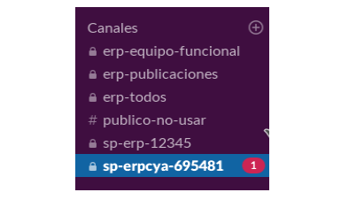

.. _ERPyA: http://erpya.com
.. _Slack: https://erp.slack.com/
.. _Google Play Store: https://play.google.com/store/apps/details?id=com.Slack

.. |Crear Cuenta Usuario| image:: resources/Crear_Cuenta_Usuario.png
.. |Crear Cuenta Contraseña| image:: resources/Crear_Cuenta_Contraseña.png
.. |Crear Cuenta botón| image:: resources/Crear_Cuenta_boton.png
.. |Inicio de Sesión Bienvenida| image:: resources/Inicio_Sesión_bienvenida_Mejorado.png
.. |Menú Slack| image:: resources/Menú_Mejorado.png
.. |Nombre Espacio Trabajo| image:: resources/Slack_Espacio_trabajo.png
.. |Nombre Usuario| image:: resources/Slack_Usuario.png
.. |Estatus| image:: resources/Slack_Usuario.png
.. |Identificación Canales| image:: resources/Slack_Canales.png
.. |Identificación Mensajes| image:: resources/Slack_Mensajes.png
.. |Descripción del Canal| image:: resources/Descripción_Canal_Defenitivo.png
.. |URL Slack| image:: resources/URL_Slack.png
.. |Acceso| image:: resources/Acceso.png

.. _documento/slack:

**Instalación de Slack**
========================

Esta herramienta es posible instalarla en "**Windows**" y "**Linux**", por lo que permite que empresas que trabajen con uno o ambos sistemas operativos puedan utilizarla.

#. **Instalación de Slack en Windows**

    Para los equipos de la empresa que tienen instalado sistema operativo "**Windows**", simplemente debe ingresar al siguiente enlace y seguir las intrucciones que en el se indican.

    .. note:: 
    
        "**Slack para Windows**"
    
        https://get.slack.help/hc/es/articles/209038037-C%C3%B3mo-descargar-Slack-para-Windows

#. **Instalación de Slack en Linux**

    Para los equipos de la empresa que tienen instalado sistema operativo "**Linux**", simplemente debe ingresar al siguiente enlace y seguir las intrucciones que en el se indican.

    .. note::
   
        "**Slack para Linux**"
            
        https://slack.com/intl/es-ve/downloads/linux

**Slack como Herramienta de Trabajo en las Empresas**
=====================================================

La herramienta slack es utilizada en la empresa "**ERP Consultores y Asociados**" como único medio de comunicación obligatorio entre ellos y las empresas, con la finalidad de brindarles consultoría y soporte inmediato con respecto a ADempiere.

.. note::

    Cualquier duda o inquietud sobre la información incluida en este material, contactar a los consultores de **ERP Consultores y Asociados**.

Para poder acceder al espacio de trabajo de `ERPyA`_ se debe tener una cuenta asociada, para ello primeramente debes contar con una invitación el cual llegará a la cuenta de correo electrónico qué le facilites a los consultores de `ERPyA`_, posterior a ello debes ser miembro de un canal privado de la empresa a la qué pertenezca para qué puedas interactuar bajo el espacio de trabajo de `ERPyA`_.

.. note::

    La invitación es realizada por el equipo de trabajo de `ERPyA`_

Para poder cumplir con los aspectos anteriormente mencionados, a continuación se detalla el paso a paso para poder crear una cuenta y acceder al espacio de trabajo del slack de `ERPyA`_

**Crear Cuenta en Slack**
-------------------------

#. En la cuenta del correo electrónico llegará un mensaje con la invitación realizada por `ERPyA`_

#. Al abrir el correo de la invitación aparecerá un mensaje invitandote a unirte al espacio de trabajo, dar click al botón “**Únete ahora**” para poder crear una cuenta.

    |Invitación Slack|

    Imagen 1. Invitación Slack

    .. note::

        Al dar click al botón **“Únete ahora”** te redireccionará a una nueva pestaña en el navegador en el qué te encuentres trabajando.

    #. Se mostrará la siguiente vista, donde se debe colocar en el campo **“Nombre Completo”** el  nombre de usuario de la  cuenta de slack a manejar, para este caso es el nombre y apellido.

        |Crear Cuenta Usuario|

        Imagen 2. Crear Cuenta Usuario

        .. note::

            Se recomienda colocar como nombre y apellido la inicial de ambos en mayúscula y continuar con minúscula, el nombre qué coloques es el nombre a mostrar en los mensajes que envíes en slack.

    #. Colocar la contraseña en el campo **“Contraseña”**  la cual se utilizará para acceder al slack, esta debe contemplar  lo indicado por el slack el cual no puede tener menos de 6 caracteres.

        |Crear Cuenta Contraseña|

        Imagen 3. Crear Cuenta Contraseña

        .. note::

            La contraseña a colocar queda a criterio de la persona qué esté creando la cuenta, se recomienda colocar contraseñas fáciles de recordar, y qué la persona suela  utilizar comúnmente.

    #. Una vez llenado los campos **“Nombre Completo”** y **“Contraseña”** dar click al botón **“Crear Cuenta”**

        |Crear Cuenta botón|

        Imagen 4. Crear Cuenta botón

        .. note::

            Al dar click al botón **“Crear Cuenta”** te redireccionará al espacio de trabajo de `ERPyA`_

#. Se mostrará la siguiente vista, donde te dará la bienvenida al espacio de trabajo de `ERPyA`_ y una serie de opciones para que te pongas en marcha y al día en la cuenta de Slack

    |Inicio de Sesión Bienvenida|

    Imagen 5. Inicio de Sesión Bienvenida

    #. Podran observar qué slack cuenta con un pequeño menú del lado izquierdo, donde pueden apreciar lo siguiente:

        |Menú Slack|

        Imagen 6. Menú Slack

        #. El nombre del espacio de trabajo de slack en el cual se encuentra asociado

            |Nombre Espacio Trabajo|

            Imagen 7. Nombre Espacio Trabajo

        #. El usuario con el que se encuentra trabajando, que es el mismo usuario el cual fue creado

            |Nombre Usuario|

            Imagen 8. Nombre Usuario

        #. El estado de actividad de la cuenta **“Activo”** ó **“Ausente”**

            |Estatus|

            Imagen 9. Estatus

        #. Canales

            |Identificación Canales|

            Imagen 10. Identificación Canales

        #. Mensajes directos

            |Identificación Mensajes|

            Imagen 11. Identificación Mensajes

    #. Dentro de la opción **“Canales”** podrá observar los canales privados el cual va a pertenecer, al posicionarse dentro del canal privado podrá comenzar a interactuar con el equipo de trabajo de `ERPyA`_

        |Descripción del Canal|

        Imagen 12. Descripción del Canal

**Inicio de Sesión**
--------------------

Si deseas conectarte nuavemente al espacio de trabajo de slack de `ERPyA`_, debes realizar los siguientes pasos:

#. Ingresar en el navegador de tu preferencia la URL donde se encuentra alojado el espacio de trabajo de `ERPyA`_

    |URL Slack|

    Imagen 13. URL Slack

    .. note::

        Dar click a esta opción para acceder a la URL de `Slack`_

    #. Al colocar la URL del espacio de trabajo de `ERPyA`_  mostrará la siguiente vista donde se colocara la crenciales de acceso.

        |Acceso|

        Imagen 14. Acceso

**¡Muy Importante!**

#. Como usuario debes colocar el correo al cual te llego la invitación del Slack

#. Como contraseña debes colocar la contraseña que utilzaste al momento de crear la cuenta

.. note::

    Te envitamos a que también descargues la aplicación en tu teléfono móvil o en tu equipo a traves de `Google Play Store`_

**Gestiones Básicas de la Herramienta Slack**
=============================================

En el presente instructivo se pretende explicar la herramienta a fin de que los usuarios puedan entender cada una de sus funciones.

**Perfil de Usuario**
---------------------

Es donde se encuentran los datos del perfil de usuario que inicio sesión en el espacio de trabajo de slack.

#. **Notificaciones**

    Es la configuración de las notificaciones que recibe el usuario ya sea por mensajes de canales o mensajes directos.

**Ir a...**
-----------

Es un buscador inteligente que posee la herramienta slack donde se puede filtrar la búsqueda por mensajes, archivos y canales.

    |Búscador de Slack|

    Imagen 15. Buscador Inteligente de Slack

**Hilos de Conversaciones**
---------------------------

Son las respuestas de los mensajes enviados o recibidos entre los usuarios.

**Canales**
-----------

Son grupos creados por **ERP Consultores y Asociados** para comunicarse entre ellos y los clientes. La información expresada en los canales, sólo pueden ser vistas por los miembros.

Una persona puede ser miembro de un canal sólo si es invitada por otro miembro o si es ella quien crea el canal. En slack se crean los canales a partir de la opción "**Añadir un Canal**". A continuación se define el proceso de creación de los canales.

**Añadir un Canal**
~~~~~~~~~~~~~~~~~~~

Los canales se pueden crear de dos (2) tipos, estos pueden ser públicos o privados. Para crear un canal en slack se debe seleccionar la opción añadir canal, luego indicar el tipo de canal, seguido del nombre y por último se deben seleccionar los miembros que pertenecerán al canal. A continuación se define el comportamiento de los tipos de canales.

#. **Canal Público**

    El canal público es aquel al que tienen acceso todos los miembros del espacio de trabajo, se diferencia del canal privado por tener del lado izquierdo del nombre, el símbolo **#**.

#. **Canal Privado**

    El canal privado es aquel al que tienen acceso algunos de los miembros del espacio de trabajo, se diferencia del canal público por tener del lado izquierdo del nombre un candado.

    |Canales Públicos y Privados de Soporte a Empresa en Slack|

    Imagen 16. Canales Públicos y Privados de Soporte a Empresa en Slack

En **ERP Consultores y Asociados** esta establecido como estándar de creación de canales los siguientes lineamientos:

#. **Canal de Soporte**

    Si el canal a crear es de soporte, la primera palabra será soporte, seguido del nombre de la empresa a la cual se le brindará el soporte.

    |Canal Privado de Soporte a Empresa en Slack|

    Imagen 17. Canal Privado de Soporte a Empresa en Slack

#. **Canal Interno**

    Si el canal a crear es interno de **ERP Consultores y Asociados** las primeras letras serán erp, seguido del tema del canal.

    |Canal Privado Interno en Slack|

    Imagen 18. Canal Privado Interno en Slack

#. **Nombre de los Canales**

    El nombre de los canales no deben llevar mayúsculas, ni espacios en blanco, por lo tanto se deben separar las palabras con el símbolo guión (-).

    .. note::
      
        "Forma Correcta"

        **Nombre del canal de soporte**: soporte-erpcya

        **Nombre del canal interno**: erp-documentacion

    .. warning::
      
        "Forma Incorrecta"

        **Nombre del canal de soporte**: sp-erpya

        **Nombre del canal interno**: erpcya-documentacion-general

Con la integración que realizó **ERP Consultores y Asociados** los ticket creados serán privados al igual que los grupos, es decir que sólo podrán visualizarlos y tendrán acceso a ellos los miembros seleccionados.

#. **Canal de Ticket en Slack**

    Con la nueva actualización, slack permite crear un ticket por medio de un mensaje en un canal de soporte, los miembros de ese canal serán la persona que envia el mensaje y la que crea el ticket desde el mensaje. Por lo tanto, todos los canales de enlace o canales de ticket serán privados.

    El nombre de este tipo de canal es generado automaticamente y esta conformado por las letras sp, el nombre de la empresa de la que se presenta la problemática, seguido de una serie de números aleatorios.

    .. note:: 

        El nombre de los canales de ticket no deben llevar mayúsculas, ni espacios en blanco, por lo tanto se separan las palabras con el símbolo guión (-).

    A continuación se describe el procedimiento de creación de un Ticket en Slack.

    #. Seleccione el canal creado para el soporte de la empresa.

        |Nombre del Canal de Soporte a Empresa ERP en Slack|
        
        Imagen 19. Canal de Soporte a Empresa ERP en Slack

    #. Revise y conteste los mensajes recibidos por los miembros del canal.

        |Canal de Soporte a Empresa ERP en Slack|
        
        Imagen 20. Canal de Soporte a Empresa ERP en Slack

    #. Luego realice la petición de la problemática sobre ADempiere durante la conversación..

        |Mensajes del canal de Soporte a Empresa ERP en Slack|
        
        Imagen 21. Mensajes del canal de Soporte a Empresa ERP en Slack

    #. Si el ticket referente a la misma no ha sido creado, el consultor procede a la creación del ticket correspondiente.

        |Ticket de Soporte a Empresa en Slack|
        
        Imagen 22. Ticket de Soporte a Empresa en Slack

    .. note::

        Todo lo referente a la problemática correspondiente al ticket creado debe ser expresado por el canal del ticket.

**Mensajes Directos**
~~~~~~~~~~~~~~~~~~~~~

Esta opción es utilizada para enviar mensajes entre los miembros del espacio de trabajo.

.. warning::

    "Cómo enviar un mensaje privado?"
      
    Seleccione la opción **Mensajes Directos**" y introduzca el nombre de la persona a la que desea escribir un mensaje privado, así el mensaje sólo podrá ser visto por usted y esa persona que seleccionó. Finalmente seleccione la opción "**Ir**".
