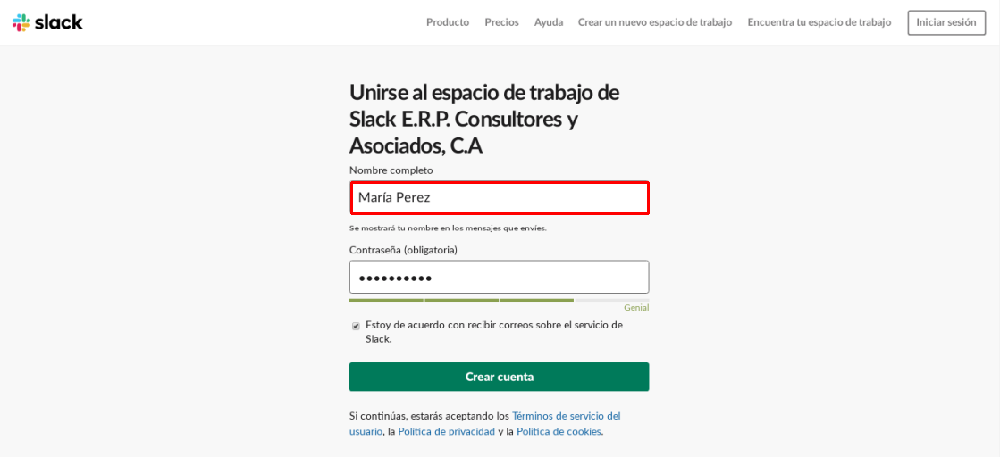
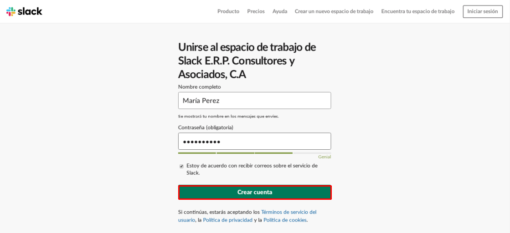
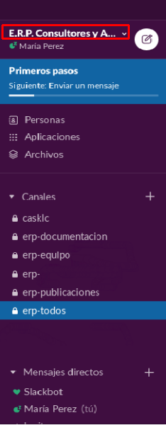
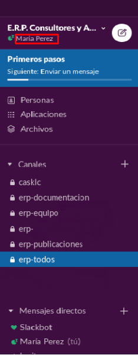
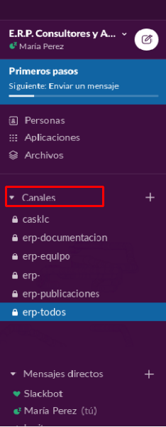
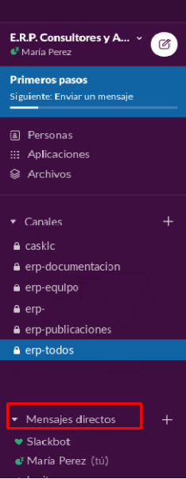
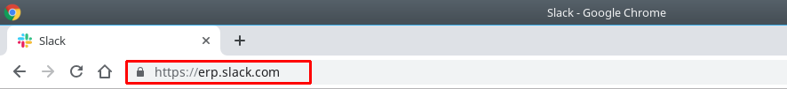
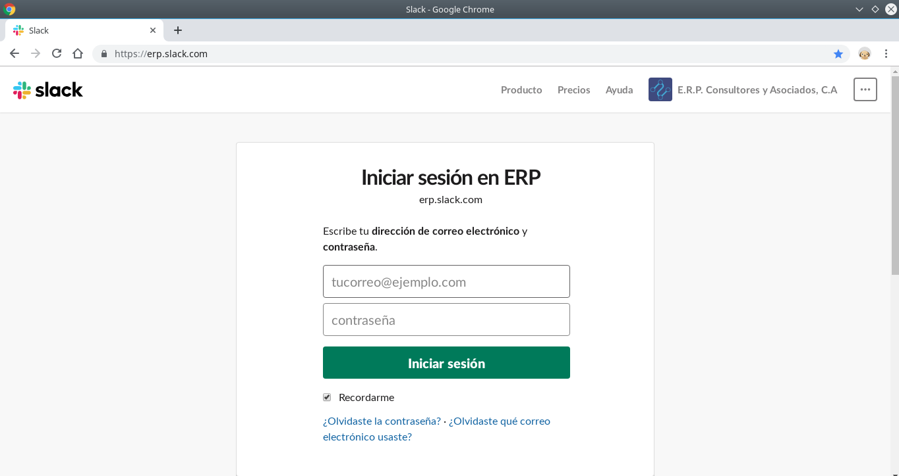

.. _src/general/slack
.. _ERPyA: http://erpya.com
.. _Slack: https://erp.slack.com/
.. _Google Play Store: https://play.google.com/store/apps/details?id=com.Slack

.. |Invitación Slack| image:: resources/Invitación2.png

.. |Crear Cuenta Contraseña| image:: resources/Crear_Cuenta_Contraseña.png

.. |Inicio de Sesión Bienvenida| image:: resources/Inicio_Sesión_bienvenida_Mejorado.png
.. |Menú Slack| image:: resources/Menú_Mejorado.png

.. |Descripción del Canal| image:: resources/Descripción_Canal_Defenitivo.png

Para poder acceder al espacio de trabajo de `ERPyA`_ se debe tener una cuenta asociada, para ello primeramente debes contar con una invitación el cual llegará a la cuenta de correo electrónico qué le facilites a los consultores de `ERPyA`_, posterior a ello debes ser miembro de un canal privado de la empresa a la qué pertenezca para qué puedas interactuar bajo el espacio de trabajo de `ERPyA`_.

.. note::

    La invitación es realizada por el equipo de trabajo de `ERPyA`_

Para poder cumplir con los aspectos anteriormente mencionados, a continuación se detalla el paso a paso para poder crear una cuenta y acceder al espacio de trabajo del slack de `ERPyA`_

**Crear Cuenta en Slack**
-------------------------

#. En la cuenta del correo electrónico llegará un mensaje con la invitación realizada por `ERPyA`_

#. Al abrir el correo de la invitación aparecerá un mensaje invitandote a unirte al espacio de trabajo, dar click al botón “**Únete ahora**” para poder crear una cuenta.

    |Invitación Slack|

    Imagen 1. Invitación Slack

    .. note::

        Al dar click al botón **“Únete ahora”** te redireccionará a una nueva pestaña en el navegador en el qué te encuentres trabajando.

    #. Se mostrará la siguiente vista, donde se debe colocar en el campo **“Nombre Completo”** el  nombre de usuario de la  cuenta de slack a manejar, para este caso es el nombre y apellido.

        |Crear Cuenta Usuario|

        Imagen 2. Crear Cuenta Usuario

        .. note::

            Se recomienda colocar como nombre y apellido la inicial de ambos en mayúscula y continuar con minúscula, el nombre qué coloques es el nombre a mostrar en los mensajes que envíes en slack.

    #. Colocar la contraseña en el campo **“Contraseña”**  la cual se utilizará para acceder al slack, esta debe contemplar  lo indicado por el slack el cual no puede tener menos de 6 caracteres.

        |Crear Cuenta Contraseña|

        Imagen 3. Crear Cuenta Contraseña

        .. note::

            La contraseña a colocar queda a criterio de la persona qué esté creando la cuenta, se recomienda colocar contraseñas fáciles de recordar, y qué la persona suela  utilizar comúnmente.

    #. Una vez llenado los campos **“Nombre Completo”** y **“Contraseña”** dar click al botón **“Crear Cuenta”**

        |Crear Cuenta botón|

        Imagen 4. Crear Cuenta botón

        .. note::

            Al dar click al botón **“Crear Cuenta”** te redireccionará al espacio de trabajo de `ERPyA`_

#. Se mostrará la siguiente vista, donde te dará la bienvenida al espacio de trabajo de `ERPyA`_ y una series de opciónes para que pongas en marcha y al día la cuenta en Slack

    |Inicio de Sesión Bienvenida|

    Imagen 5. Inicio de Sesión Bienvenida

    #. Podran observar qué slack cuenta con un pequeño menú del lado izquierdo, donde pueden apreciar lo siguiente:

        |Menú Slack|

        Imagen 6. Menú Slack

        #. El nombre del espacio de trabajo de slack en el cual se encuentra asociado

            |Nombre Espacio Trabajo|

            Imagen 7. Nombre Espacio Trabajo

        #. El usuario con el que se encuentra trabajando, que es el mismo usuario el cual fue creado

            |Nombre Usuario|

            Imagen 8. Nombre Usuario

        #. El estado de actividad de la cuenta **“Activo”** ó **“Ausente”**

            |Estatus|

            Imagen 9. Estatus

        #. Canales

            |Identificación Canales|

            Imagen 11. Identificación Canales

        #. Mensajes directos

            |Identificación Mensajes|

            Imagen 12. Identificación Mensajes

    #. Dentro de la opción **“Canales”** podrá observar los canales privados el cual va a pertenecer, al posicionarse dentro del canal privado podrá comenzar a interactuar con el equipo de trabajo de `ERPyA`_

        |Descripción del Canal|

        Imagen 13. Descripción del Canal

**Inicio de Sesión**
--------------------

Si deseas conectarte nuavemente al espacio de trabajo de slack de `ERPyA`_, debes realizar los siguientes pasos:

#. Ingresar en el navegador de tu preferencia la URL donde se encuentra alojado el espacio de trabajo de `ERPyA`_

    |URL Slack|

    Imagen 14. URL Slack

    .. note::

        Dar click a esta opción para acceder a la URL de `Slack`_

    #. Al colocar la URL del espacio de trabajo de `ERPyA`_  mostrará la siguiente vista donde se colocara la crenciales de acceso.

        |Acceso|

        Imagen 15. Acceso

**¡Muy Importante!**

#. Como usuario debes colocar el correo al cual te llego la invitación del Slack

#. Como contraseña debes colocar la contraseña que utilzaste al momento de crear la cuenta

.. note::

    Te envitamos a que también descargues la aplicación en tu teléfono móvil o en tu equipo a traves de `Google Play Store`_
