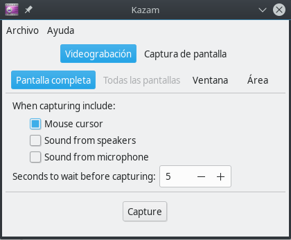
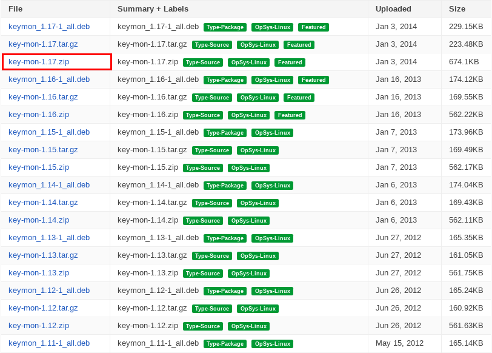

.. _Kazam: https://launchpad.net/kazam 
.. _key-mon: https://code.google.com/archive/p/key-mon/downloads
.. _Peek: https://github.com/phw/peek 

.. _documento/generar-videos-comprimidos-como-gif:

**Generar Videos Comprimidos como GIF**
=======================================

**Instalando Kazam**
--------------------

Para grabar la pantalla de la computadora se puede usar cualquier grabador, en este caso se usa Kazam como ejemplo. Puede consultar los detalles de la aplicación en `Kazam`_.

**Desde el Terminal de Linux**
******************************

Para instalar Kazam simplemente abra el terminal de linux (Como root) y ejecute el siguiente comando:

::
    
    apt-get install kazam

Luego de instalar Kazam puede abrir la aplicación desde el menú y se mostrará algo como la siguiente imagen:

|kazam|

Imagen 1 KAZAM

**Instalación y uso de FFMPEG**
-------------------------------

**Instalando FFMPEG**
*********************

El ffmpeg es una aplicación que puede ser utilizada para comprimir videos o convertirlos a gif, para instalarlo simplemente abra el terminal de linux (Como root) y ejecute el siguiente comando:

::

    apt-get install ffmpeg

**Comprimiendo un Video**
*************************

Para comprimir un video siga los siguientes pasos:

    - Vaya al directorio donde se encuentra el video.
    - Presione la tecla especial F4 (Se abrirá un terminal en la parte inferior).
    - A continuación ejecute el siguiente comando **(Note que la propiedad vid indica el nombre del archivo)**:

::

    vid=Current.mp4
    start_time=00:00:01
    height=ih/2      # input height halved , can replace with pixils .
    width=-2         # keeps aspect ratio . can replace with pixils .
    fps=40           # frames per a second .

    filters="fps=$fps,scale=$width:$height:flags=lanczos"

    ffmpeg -ss $start_time                             \
        -i  "$vid"                                  \
        -vf "$filters,palettegen"                   \
        -y  palette.png                             &&
    ffmpeg -ss $start_time                             \
        -i  "$vid"                                  \
        -i  palette.png                                \
        -lavfi "$filters [x]; [x][1:v] paletteuse"  \
        -y  "$vid".gif                              &&
    rm palette.png

**Convirtiendo desde SH**
*************************

Para evitar abrir la consola simplemente descargue el archivo que se encuentra en :download:`convert.sh <convert.sh>` y coloque el mismo dentro del directorio donde se encuentran los archivos a convertir.

Tome en cuenta que el archivo a convertir debe tener el siguiente nombre: **Current.ogv**

A continuación se encuentra un demo del recorrido:

.. only:: html

    .. figure:: resources/Current.ogv.gif

    Video 1. Convert Video

:download:`Convert Video <Current.ogv.gif>`

**Crear gif utilizando Peek**
-----------------------------

Peek es un grabador de pantalla simple con una interfaz fácil de usar.

.. only:: html

    .. figure:: resources/peek-recording-itself.gif

    Video 2. Peek

:download:`peek <peek-recording-itself.gif>`

**Instalando `Peek`_**
**********************

::

    apt install peek

**Instalando key-mon**
**********************

Key-mon es un plugin que permite dibujar pequeños círculos alrededor de los clics del mouse.

- Dirigirse a la pagina oficial de descargas de este plugin `key-mon`_.
- Elegir de la siguiente lista la version y la extensión del archivo deseado.

    .. note::

        En mi caso particular utilizo la versión 1.17 con la extensión del archivo *.zip*
        
        |options-list|

        Imagen 2. options-list

- Una vez descargado el paquete debemos ejecutar los siguientes comandos para instalarlo

    - Si el formato es *.deb* debemos usar el siguiente comando:
    
        ::
            
            dpkg -i key-mon*.deb
    
    - Si el formato es *.zip* debemos usar los siguientes comandos:

        ::

            unzip key-mon*.zip

        ::

            cd key-mon*
        
        ::

            python setup.py install

- Al finalizar la instalación exitosamente debemos ejecutar el siguiente comando:

    ::

        key-mon --visible_click

Esto permitira que al grabar un gif se pueda vizualizar un pequeño circulo de color rojo cada vez que se clickea, esto permite al usuario o receptor del archivo saber si debe hacer click en una opción o no.
