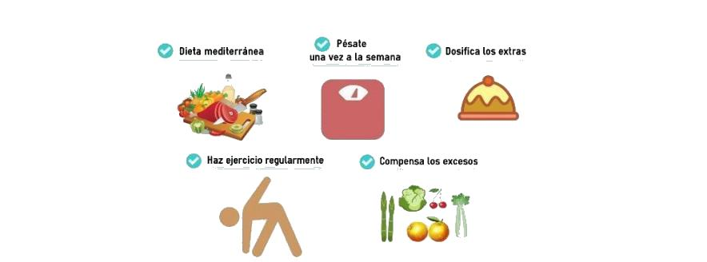
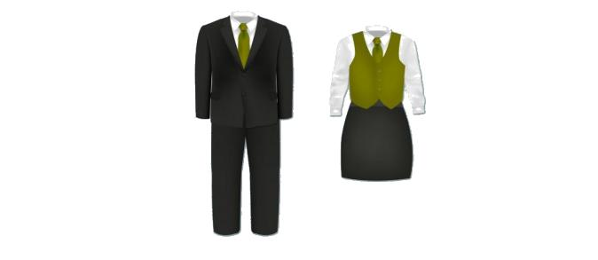
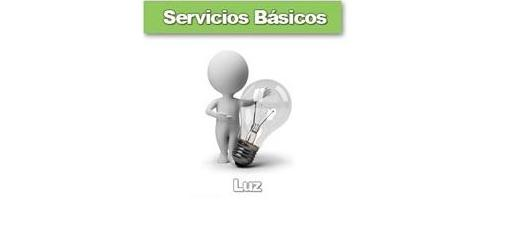
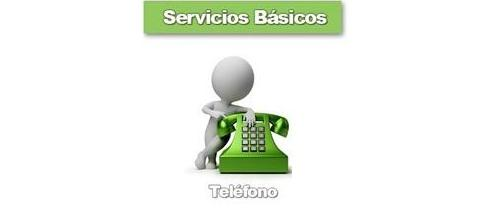

.. |Capacitación de Personal Nuevo Ingreso| image:: resources/new-staff-training.jpg
.. |Guardería Matrícula de Dependiente de Personal| image:: resources/nursery-staff-clerk-enrollment.jpg
.. |HCM de Personal| image:: resources/hcm-staff.png

.. |Pack de Alimentos de Personal| image:: resources/personal-food-pack.jpg
.. |Recreación de Personal| image:: resources/personal-recreation.jpg
.. |Servicio Funerario de Personal| image:: resources/personal-funeral-service.png
.. |Taxi Extra Tiempos de Personal| image:: resources/personal-transportation.jpg
.. |Transporte de Personal| image:: resources/personal-transportation.jpg

.. |Útiles Escolares de Dependientes de Personal| image:: resources/school-supplies-from-staff-dependents.png 

.. |Servicio de Agua| image:: resources/water-service.jpg
.. |Servicio de Agua Potable| image:: resources/drinking-water.png
.. |Servicio de Aseo Urbano| image:: resources/urban-cleaning-service.jpg
.. |Servicio de Internet| image:: resources/internet-service.jpg

.. |Servicio de Vigilancia| image:: resources/surveillance-service.png

.. |Aporte INCES| image:: resources/inces.png
.. |Aporte RPE| image:: resources/SSO.png
.. |Aporte RPVH| image:: resources/banavih.jpg
.. |Aporte SSO| image:: resources/SSO.png
.. |Bono Alimentación| image:: resources/food-voucher.jpg
.. |Retención INCES| image:: resources/inces.png
.. |Retención ISLR| image:: resources/islr.png
.. |Retención RPE| image:: resources/SSO.png
.. |Retención RPVH| image:: resources/banavih.jpg
.. |Retención SSO| image:: resources/SSO.png
.. |Sueldos y Salarios por Pagar| image:: resources/wages-and-salaries-payable.png
.. |Utilidades por Pagar| image:: resources/profits-payable.jpeg

.. |Publicidad Televisión| image:: resources/television-advertising.jpg

.. |Donaciones| image:: resources/donations.png
.. |Encomienda| image:: resources/commission.png

.. |Honorarios Profesionales| image:: resources/professional-fees.png
.. |Impuestos, Tasas y Contribuciones| image:: resources/taxes-fees-and-contributions.png

.. |Mantenimiento de Equipos| image:: resources/equipment-maintenance.jpg
.. |Periódicos, Libros y Revistas| image:: resources/newspapers-books-and-magazines.png

.. |Reembolso de Caja Chica| image:: resources/petty-cash-refund.jpg
.. |Reparación de Edificación e Instalaciones| image:: resources/building-and-facilities-repair.png
.. |Reparación de Vehículos| image:: resources/vehicle-repair.jpeg

.. |Servicios de Informática| image:: resources/computer-services.png

.. |Cheque Devuelto| image:: resources/returned-check.png
.. |Comisión FLAT| image:: resources/flat-commission.jpg
.. |Cuota Mantenimiento Mensual| image:: resources/flat-commission.jpg

.. |Emisión de Estados de Cuentas| image:: resources/issuance-of-account-statements.png
.. |IGTF| image:: resources/flat-commission.jpg

.. |Impuesto Ley del Deporte| image:: resources/sports-law-tax.jpg

.. |Impuesto Municipal| image:: resources/council-tax.jpg
.. |Impuesto Sobre la Renta| image:: resources/islr.png
.. |Intereses| image:: resources/interests.jpeg
.. |Intereses Moratorios| image:: resources/default-interest.jpg

.. |Suspensión de Cheques| image:: resources/returned-check.png

.. _documento/cargos:

**Tipos de Cargos**
===================

En ADempiere los tipos de cargos se encuentran conformados por diferentes cargos y su aplicación en documentos específicos generan ajustes de débito o crédito a los mismos.

Entendiendo como cargo, los diferentes conceptos por medio de los cuales se generan ajustes a un pago o a un cobro, dependiendo el caso que se presente. Significa entonces que los tipos de cargos son la agrupación o clasificación de los cargos, dependiendo de su implicación.

El presente material es elaborado por la empresa ERPyA, el mismo explicará de forma eficiente al usuario la utilidad que representan los tipos de cargos y los diferentes cargos que los conforman, para nuestra localización Venezuela en la versión 3.92 de ADempiere.

**Recursos Humanos**
--------------------

El tipo de cargo "**Recursos Humanos**" se refiere netamente al personal de la empresa, en este se agrupan todos los cargos que pueden o no acreditar a todo el personal de la misma.

**Comportamiento en ADempiere**
~~~~~~~~~~~~~~~~~~~~~~~~~~~~~~~

El tipo de cargo "**Recursos Humanos**" es utilizado en ADempiere para generar un ajuste a la empresa por parte de un socio de negocio, el mismo será visualizado en los tipos de documentos nombrados a continuación:

    -  Pago de Cuentas por Pagar Reembolso
    -  Pago de Cuentas por Pagar Gasto Directo
    -  Pago de Cuentas por Pagar Viáticos
    -  Cobro de Cuentas por Cobrar Reembolso
    -  Cobro de Cuentas por Cobrar Gasto Directo
    -  Cobro de Cuentas por Cobrar Viáticos
    -  Inventario de Uso Interno Obsequio

**Cargos que contempla**
~~~~~~~~~~~~~~~~~~~~~~~~

Actualmente ADempiere utiliza diecisiete (17) diferentes cargos en tipo de cargo "**Recursos Humanos**", que en su aplicación beneficia o no al personal de la empresa. A continuación son definidos los diferentes cargos pertenecientes al tipo de cargo "**Recursos Humanos**".

#. **Adiestramiento de Personal**

    #. **Definición**

        Es enseñar al personal de la empresa cómo elaborar uno o varios procesos determinados, el mismo esta inducido a personal ya existente en la empresa.

        Se realiza un adiestramiento de personal existente en la empresa con la finalidad de refrescar conocimientos o aclarar dudas que estos puedan tener.

        |Adiestramiento de Personal Existente|

        Imagen 1. Adiestramiento Personal Existente

    #. **Implicación en ADempiere**

        - En cuentas por cobrar el cargo "**Adiestramiento de Personal**" es utilizado por un socio de negocio tipo empleado para generar un ajuste de crédito a la empresa con la finalidad de que la misma le reintegre el dinero.

        - En cuentas por cobrar el cargo "**Adiestramiento de Personal**" es utilizado por la empresa para generar un ajuste de débito al socio de negocio tipo cliente con la finalidad de que el mismo le pague el dinero que le debe.

        - En cuentas por pagar el cargo "**Adiestramiento de Personal**" es utilizado por la empresa para generar un ajuste de crédito a un socio de negocio tipo cliente con la finalidad de que el mismo le reintegre el dinero.

        - En cuentas por pagar el cargo "**Adiestramiento de Personal**" es utilizado por el socio de negocio tipo empleado para generar un ajuste de débito a la empresa con la finalidad de que la misma le pague el dinero que le debe.

    .. warning::

        Permite reflejar el gasto referente a adiestramiento de personal, ya sea dentro o fuera de la empresa.

#.  **Alimentación (Extra-Tiempos) de Personal**

    #. **Definición**

        Para obtener un mejor rendimiento de producción por parte del personal de la empresa, los mismos deben tener una buena alimentación de acuerdo a sus actividades dentro de la misma.

        Es aconsejable que los trabajadores de la empresa mantengan una buena nutrición, cada cierto tiempo pueden realizar charlas sobre la misma en la empresa, de esta manera se puede comenzar a crear el habito de la buena alimentación en todos sus trabajadores. Algunos de los tips más recomendables para una buena alimentación son:

        |Dieta Diaria para Trabajadores|

        Imagen 2. Dieta Diaria para Trabajadores

        #. Planifica un menú semanal distribuyendo los alimentos de manera equilibrada y variada a lo largo de la semana.
        #. Realiza cinco comidas al día y establece los horarios de las mismas.
        #. Hidrátate con uno o dos litros de agua al día.
        #. Cocina sano y bajo en sal.

        Los trabajadores de la empresa que cumplen tiempo extra deben continuar con sus horarios de comida normal, de esta manera se evitan las molestias estomacales. Se considera tiempo extra cuando el trabajador labora mas tiempo de lo previsto en el artículo 90 de la constitución de la República Bolivariana de Venezuela.

        Al exceder el límite de horas establecidas en el artículo mencionado anteriormente, otorgará al trabajador el derecho de percibir el beneficio de alimentación, queda de su parte y en acuerdo con el empleador si desea recibir el alimento o que se le sume a las horas extras.

    #.  **Implicación en ADempiere**

        -  En cuentas por cobrar el cargo "**Alimentación (Extra-Tiempos) de Personal**" es utilizado por un socio de negocio tipo empleado para generar un ajuste de crédito a la empresa con la finalidad de que la misma le reintegre el dinero.

        -  En cuentas por cobrar el cargo "**Alimentación (Extra-Tiempos) de Personal**" es utilizado por la empresa para generar un ajuste de débito al socio de negocio tipo cliente con la finalidad de que el mismo le pague el dinero que le debe.

        -  En cuentas por pagar el cargo "**Alimentación (Extra-Tiempos) de Personal**" es utilizado por la empresa para generar un ajuste de crédito a un socio de negocio tipo cliente con la finalidad de que el mismo le reintegre el dinero.

        -  En cuentas por pagar el cargo "**Alimentación (Extra-Tiempos) de Personal**" es utilizado por el socio de negocio tipo empleado para generar un ajuste de débito a la empresa con la finalidad de que la misma le pague el dinero que le debe.

    .. warning:: 

        Permite reflejar el gasto referente a la alimentación del personal que trabaja extra tiempo con previa autorización de los supervisores correspondientes.

#.  **Capacitación de Personal**

    #. **Definición**

        La capacitación de personal es realizado en nuevo ingreso para que el mismo adquiera conocimiento de los procesos que se realizan en la empresa y a su vez pueda desenvolverse cabalmente al momento de desempeñar el puesto en la misma. También es realizado por algúna rotación de puestos en la empresa por motivo de alguna vacante disponible.

        |Capacitación de Personal Nuevo Ingreso|

        Imagen 3. Capacitación de Personal Nuevo Ingreso

    #.  **Implicación en ADempiere**

        -  En cuentas por cobrar el cargo "**Capacitación de Personal**" es utilizado por un socio de negocio tipo empleado para generar un ajuste de crédito a la empresa con la finalidad de que la misma le reintegre el dinero.

        -  En cuentas por cobrar el cargo "**Capacitación de Personal**" es utilizado por la empresa para generar un ajuste de débito al socio de negocio tipo cliente con la finalidad de que el mismo le pague el dinero que le debe.

        -  En cuentas por pagar el cargo "**Capacitación de Personal**" es utilizado por la empresa para generar un ajuste de crédito a un socio de negocio tipo cliente con la finalidad de que el mismo le reintegre el dinero.

        -  En cuentas por pagar el cargo "**Capacitación de Personal**" es utilizado por el socio de negocio tipo empleado para generar un ajuste de débito a la empresa con la finalidad de que la misma le pague el dinero que le debe.

    .. warning:: 

        Permite reflejar el gasto referente a la capacitación de personal, ya sea dentro o fuera de la empresa.

#. **Guardería/Matrícula de Dependiente de Personal**

    #. **Definición**

        Se encuentra establecido en la ley del trabajador que la empresa con veinte (20) o menos trabajadores debe habilitar un centro de atención inicial, donde se incluya la sala de lactancia. Para el cuidado de los hijos de los trabajadores durante su horario de trabajado, el cual será dirigido por profesionales en educación inicial, que cuidaran de los niños con edad comprendida entre tres (3) meses y seis (6) años. Así mismo, la empresa con mas de (20) trabajadores, esta en la obligación de mantener un centro educativo inicial con sala de lactancia.

        |Guardería Matrícula de Dependiente de Personal|

        Imagen 4. Guardería Matrícula de Dependiente de Personal

    #.  **Implicación en ADempiere**

        -  En cuentas por cobrar el cargo "**Guardería/Matrícula de Dependiente de Personal**" es utilizado por un socio de negocio tipo empleado para generar un ajuste de crédito a la empresa con la finalidad de que la misma le reintegre el dinero.

        -  En cuentas por pagar el cargo "**Guardería/Matrícula de Dependiente de Personal**" es utilizado por el socio de negocio tipo proveedor para generar un ajuste de débito a la empresa con la finalidad de que la misma le pague el dinero que le debe.

    .. warning:: 

        Permite reflejar el gasto referente a la guardería o matrícula de los niños dependientes de los trabajadores de la empresa.

#. **HCM de Personal**

    #. **Definición**

        La gestión de capital humano que posee una empresa es la que se encarga de la contratación, productividad, seguridad, despido, entre otras tareas que competen netamente a los empleados de la misma. La finalidad de la existencia de un seguro HCM de personal en una empresa es indemnizar al asegurado por gastos medicos que adquiere como consecuencia de alteraciones de la salud de el mismo o sus familiares dependientes, de acuerdo a las condiciones establecidas en el documento.

        |HCM de Personal|

        Imagen 5. HCM de Personal

    #.  **Implicación en ADempiere**

        -  En cuentas por cobrar el cargo "**HCM de Personal**" es utilizado por un socio de negocio tipo empleado para generar un ajuste de crédito a la empresa con la finalidad de que la misma le reintegre el dinero.

        -  En cuentas por cobrar el cargo "**HCM de Personal**" es utilizado por la empresa para generar un ajuste de débito al socio de negocio tipo proveedor con la finalidad de que el mismo le pague el dinero que le debe.

        -  En cuentas por pagar el cargo "**HCM de Personal**" es utilizado por la empresa para generar un ajuste de crédito a un socio de negocio tipo proveedor con la finalidad de que el mismo le reintegre el dinero.

        -  En cuentas por pagar el cargo "**HCM de Personal**" es utilizado por el socio de negocio tipo empleado para generar un ajuste de débito a la empresa con la finalidad de que la misma le pague el dinero que le debe.

    .. warning:: 

        Permite reflejar el gasto referente a un caso de enfermedad o indemnización por gastos medicos.

#. **Hospedaje de Personal**

    #. **Definición**

        Es utilizado por las empresas que envian a sus empleados de viaje por asuntos de negocios, ya sea para realizar una compra o para realizar una venta, independientemente del motivo del viaje de trabajo que vaya a realizar el empleado, esta opción permite que de refleje el gasto generado a la empresa.

        |Hospedaje de Personal|

        Imagen 6. Hospedaje de Personal

    #.  **Implicación en ADempiere**

        -  En cuentas por cobrar el cargo "**Hospedaje de Personal**" es utilizado por un socio de negocio tipo empleado para generar un ajuste de crédito a la empresa con la finalidad de que la misma le reintegre el dinero.

        -  En cuentas por cobrar el cargo "**Hospedaje de Personal**" es utilizado por la empresa para generar un ajuste de débito al socio de negocio tipo cliente con la finalidad de que el mismo le pague el dinero que le debe.

        -  En cuentas por pagar el cargo "**Hospedaje de Personal**" es utilizado por la empresa para generar un ajuste de crédito a un socio de negocio tipo cliente con la finalidad de que el mismo el reintegre el dinero.

        -  En cuentas por pagar el cargo "**Hospedaje de Personal**" es utilizado por el socio de negocio tipo empleado para generar un ajuste de débito a la empresa con la finalidad de que la misma le pague el dinero que le debe.

    .. warning:: 

        Permite reflejar el gasto referente a hospedaje en viajes por cuestiones de negocios.

#. **Juguetes de Dependiente de Personal**

    #. **Definición**

        Es utilizado por las empresas que le brindan a sus trabajadores el beneficio de juguetes para los niños dependientes de los mismos, para reflejar el gasto monetario por la compra de juguetes.

        |Juguetes de Dependiente de Personal|

        Imagen 7. Juguetes de Dependiente de Personal

    #.  **Implicación en ADempiere**

        -  En cuentas por cobrar el cargo "**Juguetes de Dependiente de Personal**" es utilizado por un socio de negocio tipo empleado para generar un ajuste de crédito a la empresa con la finalidad de que la misma le reintegre el dinero.

        -  En cuentas por pagar el cargo "**Juguetes de Dependiente de Personal**" es utilizado por el socio de negocio tipo empleado para generar un ajuste de débito a la empresa con la finalidad de que la misma le pague el dinero que le debe.

    .. warning:: 

        Permite reflejar el gasto referente a la compra de juguetes para los niños dependientes de los trabajadores de la empresa.

#. **Obsequios de Personal**

    #. **Definición**

        Los obsequios que las empresas le regalan a sus trabajadores son incentivos con la finalidad de que estos se motiven a seguir o como agradecimiento por los años de servicio que tenga el trabajador.

        |Obsequios de Personal|

        Imagen 8. Obsequios de Personal

    #.  **Implicación en ADempiere**

        -  En cuentas por cobrar el cargo "**Obsequios de Personal**" es utilizado por un socio de negocio tipo empleado para generar un ajuste de crédito a la empresa con la finalidad de que la misma le reintegre el dinero.

        -  En cuentas por pagar el cargo "**Obsequios de Personal**" es utilizado por el socio de negocio tipo empleado para generar un ajuste de débito a la empresa con la finalidad de que la misma le pague el dinero que le debe.

    .. warning:: 

        Permite reflejar el gasto referente a la compra de obsequios para los trabajadores de la empresa.

#. **Pack de Alimentos de Personal**

    #. **Definición**

        Se refiere a una cantidad de alimentos que la empresa le gestiona a sus trabajadores cada cierto tiempo, con la finalidad de beneficiar y motivar a cada uno de ellos.

        |Pack de Alimentos de Personal|

        Imagen 9. Pack de Alimentos de Personal

    #.  **Implicación en ADempiere**

        -  En cuentas por cobrar el cargo "**Pack de Alimentos de Personal**" es utilizado por un socio de negocio tipo empleado para generar un ajuste de crédito a la empresa con la finalidad de que la misma le reintegre el dinero.

        -  En cuentas por cobrar el cargo "**Pack de Alimentos de Personal**" es utilizado por la empresa para generar un ajuste de débito al socio de negocio tipo empleado con la finalidad de que el mismo le pague el dinero que le debe.

        -  En cuentas por pagar el cargo "**Pack de Alimentos de Personal**" es utilizado por la empresa para generar un ajuste de crédito a un socio de negocio tipo empleado con la finalidad de que el mismo le reintegre el dinero.

        -  En cuentas por pagar el cargo "**Pack de Alimentos de Personal**" es utilizado por el socio de negocio tipo empleado para generar un ajuste de débito a la empresa con la finalidad de que la misma le pague el dinero que le debe.

    .. warning:: 

        Permite reflejar el gasto referente a la compra de alimentos para los trabajadores de la empresa.

#. **Recreación de Personal**

    #. **Definición**

        Se refiere a las actividades recreativas que la empresa organiza para sus trabajadores con la finalidad de contribuir a que los mismos se ejerciten físicamente e incentivar a un buen desarrollo social y emocional por medio de distracciones que generen alegrías en los trabajadores.

        |Recreación de Personal|

        Imagen 10. Recreación de Personal

    #.  **Implicación en ADempiere**

        -  En cuentas por cobrar el cargo "**Recreación de Personal**" es utilizado por un socio de negocio tipo empleado para generar un ajuste de crédito a la empresa con la finalidad de que la misma le reintegre el dinero.

        -  En cuentas por cobrar el cargo "**Recreación de Personal**" es utilizado por la empresa para generar un ajuste de débito al socio de negocio tipo cliente con la finalidad de que el mismo le pague el dinero que le debe.

        -  En cuentas por pagar el cargo "**Recreación de Personal**" es utilizado por la empresa para generar un ajuste de crédito a un socio de negocio tipo cliente con la finalidad de que el mismo le reintegre el dinero.

        -  En cuentas por pagar el cargo "**Recreación de Personal**" es utilizado por el socio de negocio tipo empleado para generar un ajuste de débito a la empresa con la finalidad de que la misma le pague el dinero que le debe.

    .. warning:: 

        Permite reflejar el gasto referente a la elaboración de las actividades recreativas para los trabajadores de la empresa.

#. **Servicio Funerario de Personal**

    #. **Definición**

        Se refiere al beneficio de servicios funerarios adquirido por los trabajadores de una determinada empresa, el mismo puede ser propio o transferible a un familiar y el pago de este es descontado de la nómina para luego ser entregado por la empresa a la funeraria.

        |Servicio Funerario de Personal|

        Imagen 11. Servicio Funerario de Personal

    #.  **Implicación en ADempiere**

        -  En cuentas por cobrar el cargo "**Servicio Funerario de Personal**" es utilizado por un socio de negocio tipo empleado para generar un ajuste de crédito a la empresa con la finalidad de que la misma le reintegre el dinero.

        -  En cuentas por cobrar el cargo "**Servicio Funerario de Personal**" es utilizado por la empresa para generar un ajuste de débito al socio de negocio tipo empleado con la finalidad de que el mismo le pague el dinero que le debe.

        -  En cuentas por pagar el cargo "**Servicio Funerario de Personal**" es utilizado por la empresa para generar un ajuste de crédito a un socio de negocio tipo empleado con la finalidad de que el mismo le reintegre el dinero.

        -  En cuentas por pagar el cargo "**Servicio Funerario de Personal**" es utilizado por el socio de negocio tipo empleado para generar un ajuste de débito a la empresa con la finalidad de que la misma le pague el dinero que le debe.

    .. warning:: 

        Permite reflejar el gasto referente a los servicios funerarios de los trabajadores de la empresa. Las condiciones de pago del servicio siempre son establecidas por la funeraria en su contrato y cumplidas por la empresa por medio de descuentos realizados en el pago de la nómina del trabajador.

#. **Taxi (Extra-Tiempos) de Personal**

    #. **Definición**

        Se refiere a los gastos por concepto de pago de taxi realizados por los trabajadores de una determinada empresa cuando los mismos continuan trabajando luego de haber terminado su jornada laboral normal, indiferentemente el motivo de este, mientras que el trabajo extra tiempo se encuentre avalado por su supervisor.

        |Taxi Extra Tiempos de Personal|

        Imagen 12. Taxi Extra Tiempos de Personal

    #.  **Implicación en ADempiere**

        -  En cuentas por cobrar el cargo "**Taxi (Extra-Tiempo) de Personal**" es utilizado por un socio de negocio tipo empleado para generar un ajuste de crédito a la empresa con la finalidad de que la misma le reintegre el dinero.

        -  En cuentas por cobrar el cargo "**Taxi (Extra-Tiempo) de Personal**" es utilizado por la empresa para generar un ajuste de débito al socio de negocio tipo cliente con la finalidad de que el mismo le pague el dinero que le debe.

        -  En cuentas por pagar el cargo "**Taxi (Extra-Tiempo) de Personal**" es utilizado por la empresa para generar un ajuste de crédito a un socio de negocio tipo cliente con la finalidad de que el mismo le reintegre el dinero.

        -  En cuentas por pagar el cargo "**Taxi (Extra-Tiempo) de Personal**" es utilizado por el socio de negocio tipo empleado para generar un ajuste de débito a la empresa con la finalidad de que la misma le pague el dinero que le debe.

    .. warning:: 

        Permite reflejar el gasto referente a taxis pagados por los trabajadores cuando cumplen trabajos extra tiempo avalado por su supervisor.

#. **Transporte de Personal**

    #. **Definición**

        Se refiere al traslado de los trabajadores de una determinada empresa, el mismo consta de buscar los trabajadores en un determinado lugar y llevarlos hasta la empresa o viceversa. El proposito de un transporte de personal es garatizar la puntualidad y seguridad de los mismos durante el traslado de un lugar a otro.

        |Transporte de Personal|

        Imagen 13. Transporte de Personal

    #.  **Implicación en ADempiere**

        -  En cuentas por cobrar el cargo "**Transporte de Personal**" es utilizado por un socio de negocio empleado o proveedor para generar un ajuste de crédito a la empresa con la finalidad de que la misma le reintegre el dinero.

        -  En cuentas por cobrar el cargo "**Transporte de Personal**" es utilizado por la empresa para generar un ajuste de débito al socio de negocio tipo cliente con la finalidad de que el mismo le pague el dinero que le debe.

        -  En cuentas por pagar el cargo "**Transporte de Personal**" es utilizado por la empresa para generar un ajuste de crédito a un socio de negocio tipo cliente con la finalidad de que el mismo le reintegre el dinero.

        -  En cuentas por pagar el cargo "**Transporte de Personal**" es utilizado por el socio de negocio tipo empleado o proveedor para generar un ajuste de débito a la empresa con la finalidad de que la misma le pague el dinero que le debe.

    .. warning:: 

        Permite reflejar el gasto referente a transporte asignado o contratado para los trabajadores de la empresa.

#. **Uniforme de Personal**

    #. **Definición**

        Se refiere a la dotación de uniformes que la empresa le suministra a sus trabajadores, la misma es realizada cada cierto tiempo y dependiendo de condiciones como personal nuevo, existencia de uniformes, entre otras que impliquen que se puede realizar.

        |Uniforme de Personal|

        Imagen 14. Uniforme de Personal

    #.  **Implicación en ADempiere**

        -  En cuentas por cobrar el cargo "**Uniforme de Personal**" es utilizado por un socio de negocio tipo proveedor o empleado para generar un ajuste de crédito a la empresa con la finalidad de que la misma le reintegre el dinero.

        -  En cuentas por cobrar el cargo "**Uniforme de Personal**" es utilizado por la empresa para generar un ajuste de débito al socio de negocio tipo proveedor o empleado con la finalidad de que el mismo le pague el dinero que le debe.

        -  En cuentas por pagar el cargo "**Uniforme de Personal**" es utilizado por la empresa para generar un ajuste de crédito a un socio de negocio tipo proveedor o empleado con la finalidad de que el mismo le reintegre el dinero.

        -  En cuentas por pagar el cargo "**Uniforme de Personal**" es utilizado por el socio de negocio tipo proveedor o empleado para generar un ajuste de débito a la empresa con la finalidad de que la misma le pague el dinero que le debe.

    .. warning:: 

        Permite reflejar el gasto referente a los uniformes de los trabajadores de la empresa.,

#. **Útiles Escolares de Dependiente de Personal**

    #. **Definición**

        Es utilizado por las empresas que le brindan a sus trabajadores el beneficio de útiles escolares para los niños dependientes de los mismos, para reflejar el gasto monetario por la compra de útiles escolares.

        |Útiles Escolares de Dependientes de Personal|

        Imagen 15. Útiles Escolares de Dependientes de Personal

    #.  **Implicación en ADempiere**

        -  En cuentas por cobrar el cargo "**Útiles Escolares de Dependiente de Personal**" es utilizado por un socio de negocio tipo empleado para generar un ajuste de crédito a la empresa con la finalidad de que la misma le reintegre el dinero.

        -  En cuentas por cobrar el cargo "**Útiles Escolares de Dependiente de Personal**" es utilizado por la empresa para generar un ajuste de débito al socio de negocio tipo proveedor con la finalidad de que el mismo le pague el dinero que le debe.

        -  En cuentas por pagar el cargo "**Útiles Escolares de Dependiente de Personal**" es utilizado por la empresa para generar un ajuste de crédito a un socio de negocio tipo proveedor con la finalidad de que el mismo le reintegre el dinero.

        -  En cuentas por pagar el cargo "**Útiles Escolares de Dependiente de Personal**" es utilizado por el socio de negocio tipo empleado para generar un ajuste de débito a la empresa con la finalidad de que la misma le pague el dinero que le debe.

    .. warning:: 

        Permite reflejar el gasto referente a los útiles escolares de los niños dependientes de los trabajadores de la empresa.

#. **Viáticos de Personal**

    #. **Definición**

        Se refiere a una cantidad de dinero que la empresa le suministra a los trabajadores que viajan por cuestiones de trabajo, es utilizado por la misma para reflejar el gasto monetario correspondiente a cada trabajador.

        |Viáticos de Personal|

        Imagen 16. Viáticos de Personal

    #.  **Implicación en ADempiere**

        -  En cuentas por cobrar el cargo "**Viáticos de Personal**" es utilizado por un socio de negocio tipo empleado para generar un ajuste de crédito a la empresa con la finalidad de que la misma le reintegre el dinero.

        -  En cuentas por cobrar el cargo "**Viáticos de Personal**" es utilizado por la empresa para generar un ajuste de débito al socio de negocio tipo cliente con la finalidad de que el mismo le pague el dinero que le debe.

        -  En cuentas por pagar el cargo "**Viáticos de Personal**" es utilizado por la empresa para generar un ajuste de crédito a un socio de negocio tipo cliente o empleado con la finalidad de que el mismo le reintegre el dinero.

        -  En cuentas por pagar el cargo "**Viáticos de Personal**" es utilizado por el socio de negocio tipo empleado para generar un ajuste de débito a la empresa con la finalidad de que el mismo le pague el dinero que le debe.

    .. warning:: 

        Permite reflejar el gasto referente a los viáticos de los trabajadores de la empresa.

**Servicios Básicos**
---------------------

El tipo de cargo "**Servicios Básicos**" se refiere a todos aquellos servicios que son pagados por las empresas, en este se agrupan todos los cargos que acreditan a las empresas por posesión de los mismos, sin embargo las desacreditan monetariamente por el pago correspondiente a cada servicio.

**Comportamiento en ADempiere**
~~~~~~~~~~~~~~~~~~~~~~~~~~~~~~~

El tipo de cargo "**Servicios Básicos**" es utilizado en ADempiere para generar un ajuste de débito a la empresa por parte de un socio de negocio tipo proveedor o viceversa, el mismo será visualizado en los tipos de documentos nombrados a continuación:

    -  Factura de Cuentas por Pagar Nacional
    -  Factura de Cuentas por Pagar Importación
    -  Factura de Cuentas por Pagar Intercompañía
    -  Factura de Cuentas por Pagar Empleado
    -  Factura de Cuentas por Pagar Indirecta
    -  Factura de Cuentas por Cobrar Nacional
    -  Factura de Cuentas por Cobrar Exportación
    -  Factura de Cuentas por Cobrar Intercompañía
    -  Factura de Cuentas por Cobrar Empleado
    -  Factura de Cuentas por Cobrar Manual
    -  Factura de Cuentas por Cobrar Pro forma
    -  Factura de Cuentas por Cobrar Indirecta
    -  Nota de Crédito de Cuentas por Cobrar Nacional
    -  Nota de Crédito de Cuentas por Cobrar Exportación
    -  Nota de Crédito de Cuentas por Cobrar Intercompañía
    -  Nota de Crédito de Cuentas por Cobrar Empleado
    -  Nota de Crédito de Cuentas por Cobrar Indirecta
    -  Nota de Crédito de Cuentas por Pagar Nacional
    -  Nota de Crédito de Cuentas por Pagar Importación
    -  Nota de Crédito de Cuentas por Pagar Intercompañía
    -  Nota de Crédito de Cuentas por Pagar Empleado
    -  Nota de Crédito de Cuentas por Pagar Indirecta
    -  Nota de Débito de Cuentas por Pagar Nacional
    -  Nota de Débito de Cuentas por Pagar Importación
    -  Nota de Débito de Cuentas por Pagar Intercompañía
    -  Nota de Débito de Cuentas por Pagar Empleado
    -  Nota de Débito de Cuentas por Pagar Indirecta
    -  Nota de Débito de Cuentas por Cobrar Nacional
    -  Nota de Débito de Cuentas por Cobrar Exportación
    -  Nota de Débito de Cuentas por Cobrar Intercompañía
    -  Nota de Débito de Cuentas por Cobrar Empleado
    -  Nota de Débito de Cuentas por Cobrar Indirecta
    -  Ajuste de Crédito de Cuentas por Pagar
    -  Ajuste de Débito de Cuentas por Pagar
    -  Ajuste de Crédito de Cuentas por Cobrar
    -  Ajuste de Débito de Cuentas por Cobrar

**Cargos que contempla**
~~~~~~~~~~~~~~~~~~~~~~~~

Actualmente ADempiere utiliza nueve (9) diferentes cargos en el tipo de cargo "**Servicios Básicos**", que en su aplicación desacredita a la empresa monetariamente. A continuación son definidos los diferentes cargos pertenecientes al tipo de cargo "**Servicios Básicos**".

#. **Servicio de Agua**

    #. **Definición:**

        Es el suministro de agua en las tuberías de las empresas utilizada para la produccción de sus productos, asi como también para las necesidades de sus trabajadores.

        |Servicio de Agua|

        Imagen 17. Servicio de Agua

    #. **Implicación en ADempiere**

        -  En cuentas por pagar el cargo "**Servicio de Agua**" es   utilizado por la empresa para generar un ajuste de débito al   socio de negocio tipo cliente con la finalidad de pagarle al   mismo el dinero que le debe.

    .. warning:: 

        Permite reflejar el gasto referente al servicio de agua suministrado en una empresa determinada.

#. **Servicio de Agua Potable**

    #. **Definición**

        Es el suministro de agua potable embotellada para el consumo de los trabajadores de una determinada empresa, la misma es surtida semanal, quincenal o mensual de acuerdo a su consumo.

        |Servicio de Agua Potable|

        Imagen 18. Servicio de Agua Potable

    #. **Implicación en ADempiere**

        -  En cuentas por pagar el cargo "**Servicio de Agua Potable**" es   utilizado por la empresa para generar un ajuste de débito al   socio de negocio tipo proveedor con la finalidad de pagarle al   mismo el dinero que le debe.

    .. warning:: 

        Permite reflejar el gasto referente al servicio de agua potable suministrado en una empresa determinda.

#. **Servicio de Aseo Urbano**

    #. **Definición**

        Es el servicio de recolección de basura generada por la empresa en general, la misma es ubicada en un lugar especifico de la empresa para facilitar su canalización a los botaderos o lugares correspondientes.

        |Servicio de Aseo Urbano|

        Imagen 19. Servicio de Aseo Urbano

    #. **Implicación en ADempiere**

        -  En cuentas por pagar el cargo "**Servicio de Aseo Urbano**" es   utilizado por la empresa para generar un ajuste de débito al   socio de negocio tipo proveedor con la finalidad de pagarle al   mismo el dinero que le debe.

    .. warning:: 

        Permite reflejar el gasto referente al servicio de aseo urbano correspondiente a una empresa determinada.

#. **Servicio de Internet**

    #. **Definición**

        Es el suministro de internet en los diferentes departamentos u oficinas de una determinada empresa, el mismo es adquirido mediante un contrato de servicio.

        |Servicio de Internet|

        Imagen 20. Servicio de Internet

    #. **Implicación en ADempiere**

        -  En cuentas por pagar el cargo "**Servicio de Internet**" es   utilizado por la empresa para generar un ajuste de débito al   socio de negocio tipo proveedor con la finalidad de pagarle al   mismo el dinero que le debe.

    .. warning:: 

        Permite reflejar el gasto referente al servicio de internet suministrado en un empresa determinada.

#. **Servicio de Limpieza y Mantenimiento**

    #. **Definición**

        Es el servicio adquirido por una empresa determinada para la limpieza de sus diferentes departamentos u oficinas, así como también para la limpieza y mantenimiento de sus equipos y maquinarias.

        |Servicio de Limpieza y Mantenimiento|

        Imagen 21. Servicio de Limpieza y Mantenimiento

    #. **Implicación en ADempiere**

        -  En cuentas por pagar el cargo "**Servicio de Limpieza y   Mantenimiento**" es utilizado por la empresa para generar un   ajuste de débito al socio de negocio tipo proveedor con la   finalidad de pagarle al mismo el dinero que le debe.

    .. warning:: 

        Permite reflejar el gasto referente al servicio de limpieza y mantenimiento suministrado en una determinada empresa. 

#. **Servicio de Luz**

    #. **Definición**

        Es el suministro de energía eléctrica adquirida en una empresa determinada, la misma es necesaria para cumplir con sus propositos o metas de producción.

        |Servicio de Luz|

        Imagen 22. Servicio de Luz

    #. **Implicación en ADempiere**

        -  En cuentas por pagar el cargo "**Servicio de Luz**" es   utilizado por la empresa para generar un ajuste de débito al   socio de negocio tipo proveedor con la finalidad de pagarle al   mismo el dinero que le debe.

    .. warning:: 

        Permite reflejar el gasto referente al servicio de luz suministrado en una empresa determinada.

#. **Servicio de Telefonía**

    #. **Definición**

        Es el suministro de telefonía en los diferentes departamentos u oficinas de una determinada empresa, el mismo es adquirido mediante un contrato de servicio.

        |Servicio de Telefonía|

        Imagen 23. Servicio de Telefonía

    #. **Implicación en ADempiere**

        -  En cuentas por pagar el cargo "**Servicio de Telefonía**" es   utilizado por la empresa para generar un ajuste de débito al   socio de negocio tipo proveedor con la finalidad de pagarle al   mismo el dinero que le debe.

    .. warning:: 

        Permite reflejar el gasto referente al servicio de telefonía suministrado en una determinada empresa. 

#. **Servicio de Televisora**

    #. **Definición**

        Es el suministro de televisión por cable y satelital en los diferentes departamentos u oficinas de una determinada empresa, el mismo es adquirido mediante un contrato de servicio.

        |Servicio de Televisora|

        Imagen 24. Servicio de Televisora

    #. **Implicación en ADempiere**

        -  En cuentas por pagar el cargo "**Servicio de Televisora**" es   utilizado por la empresa para generar un ajuste de débito al   socio de negocio tipo proveedor con la finalidad de pagarle al   mismo el dinero que le debe.

    .. warning:: 

        Permite reflejar el gasto referente al servicio de televisora suministrado en una determinada empresa.

#. **Servicio de Vigilancia**

    #. **Definición**

        Es el servicio adquirido por una empresa determinada con la finalidad de tener una buena supervisión y seguridad en las diferentes áreas que conforman la misma.

        |Servicio de Vigilancia|

        Imagen 25. Servicio de Vigilancia

    #. **Implicación en ADempiere**

        -  En cuentas por pagar el cargo "**Servicio de Vigilancia**" es   utilizado por la empresa para generar un ajuste de débito al   socio de negocio tipo tipo proveedor con la finalidad de   pagarle al mismo el dinero que le debe.

    .. warning:: 

        Permite reflejar el gasto referente al servicio de vigilancia suministrado en una empresa determinada.

**Nómina**
----------

El tipo de cargo "**Nómina**" se refiere a todos aquellos pagos realizados por las empresas en beneficio de sus empleados, en este se agrupan todos los cargos que acreditan a los trabajadores de las mismas.

**Comportamiento en ADempiere**
~~~~~~~~~~~~~~~~~~~~~~~~~~~~~~~

El tipo de cargo "**Nómina**" es utilizado en ADempiere para generar un ajuste de débito a la empresa por parte de un socio de negocio tipo empleado o viceversa, el ajuste será visualizado en los tipos de documentos nombrados a continuación:

    -  Nómina Mensual
    -  Nómina por Comisiones
    -  Nómina por Pagos Especiales
    -  Nómina Prestaciones Sociales
    -  Nómina Quincenal
    -  Nómina Retroactivo
    -  Nómina Semanal
    -  Nómina Utilidades
    -  Nómina Vacaciones
    -  Ajuste de Crédito de Cuentas por Pagar
    -  Ajuste de Débito de Cuentas por Pagar
    -  Ajuste de Débito de Cuentas por Cobrar
    -  Nómina Bono de Alimentación

**Cargos que contempla**
~~~~~~~~~~~~~~~~~~~~~~~~

Actualmente ADempiere utiliza catorce (14) diferentes cargos en el tipo de cargo "**Nómina**" que en su aplicación beneficia a los trabajadores de la empresa. A continuación son definidos los diferentes cargos pertenecientes al tipo de cargo "**Nómina**".

#. **Antigüedad por Pagar**

    #. **Definición**

        Se refiere al pago que las empresas le realizan a sus trabajadores como beneficio por años de prestación de servicio ininterrumpidos cumplidos en la mismas.

        |Antiguedad por Pagar|

        Imagen 26. Antigüedad por Pagar

    #.  **Implicación en ADempiere**

        -  En cuentas por pagar el cargo "**Antigüedad por Pagar**" es utilizado por la empresa para generar un ajuste de débito con la finalidad de que la misma le pague el dinero que le debe al socio del negocio tipo empleado.

    .. warning:: 

        Permite reflejar los pagos referentes a la antigüedad que tienen los diferentes trabajadores de las empresas.

#. **Aporte INCES**

    #. **Definición**

        Se refiere al pago trimestral que las empresas le realizan al Instituto Nacional de Capacitación y Educación Socialista (INCES) al tener cinco (5) o más trabajadores cumpliendo actividades para las mismas.

        |Aporte INCES|

        Imagen 27. Aporte INCES

    #.  **Implicación en ADempiere**

        -  En cuentas por pagar el cargo "**Aporte INCES**" es utilizado por la empresa para generar un ajuste de débito con la finalidad de que la misma le pague el dinero que le debe al socio del negocio.

    .. warning:: 

        Permite reflejar el pago referente al aporte INCES que la empresa realiza trimestralmente.

#. **Aporte RPE**

    #. **Definición**

        Se refiere al pago que las empresas hacen al Instituto Venezolano de los Seguros Sociales (IVSS) por cada empleado que tienen cumpliendo actividades para las mismas.

        |Aporte RPE|

        Imagen 28. Aporte RPE

    #.  **Implicación en ADempiere**

        -  En cuentas por pagar el cargo "**Aporte RPE**" es utilizado por la empresa para generar un ajuste de débito con la finalidad de que la misma le pague el dinero que le debe al socio del negocio.

    .. warning:: 

        Permite reflejar el pago referente al aporte RPE que la empresa realiza correspondiente a cada trabajador.

#. **Aporte RPVH**

    #. **Definición**

        Se refiere al pago que las empresas hacen al Fondo de Ahorro Obligatorio y Voluntario para la Vivienda (FAOV) por cada empleado que tienen cumpliendo actividades para las mismas.

        |Aporte RPVH|

        Imagen 29. Aporte RPVH

    #.  **Implicación en ADempiere**

        -  En cuentas por pagar el cargo "**Aporte RPVH**" es utilizado por la empresa para generar un ajuste de débito con la finalidad de que la misma le pague el dinero que le debe al socio del negocio.

    .. warning:: 

        Permite reflejar el pago referente al aporte RPVH que la empresa realiza correspondiente a cada trabajador.

#. **Aporte SSO**

    #. **Definición**

        Se refiere al pago que las empresas hacen al Instituto Venezolano de los Seguros Sociales (IVSS) por cada empleado que tienen cumpliendo actividades para las mismas.

        |Aporte SSO|

        Imagen 30. Aporte SSO

    #.  **Implicación en ADempiere**

        -  En cuentas por pagar el cargo "**Aporte SSO**" es utilizado por la empresa para generar un ajuste de débito con la finalidad de que la misma le pague el dinero que le debe al socio del negocio.

    .. warning:: 

        Permite reflejar el pago referente al aporte SSO que la empresa realiza correspondiente a cada trabajador.

#. **Bono Alimentación**

    #. **Definición**

        Se refiere al pago que las empresas le realizan a sus trabajadores como beneficio de una alimentación balanceada para obtener mayor productividad por causa del buen estado nutricional de los mismos.

        |Bono Alimentación|

        Imagen 31. Bono Alimentación

    #.  **Implicación en ADempiere**

        -  En cuentas por pagar el cargo "**Bono de Alimentación**" es utilizado por la empresa para generar un ajuste de débito con la finalidad de que la misma le pague el dinero que le debe al socio del negocio tipo empleado.

    .. warning:: 

        Permite reflejar los pagos referentes al bono de alimentación de los diferentes trabajadores de las empresas.

#. **Retención INCES**

    #. **Definición**

        Se refiere al porcentaje de retención que la empresa le aplica a cada uno de sus trabajadores, destinado al aporte INCES.

        |Retención INCES|

        Imagen 32. Retención INCES

    #.  **Implicación en ADempiere**

        -  En cuentas por cobrar el cargo "**Retención INCES**" es utilizado por la empresa para generar un ajuste de débito al socio de negocio tipo empleado con la finalidad de que el mismo le pague el dinero que le debe.

    .. warning:: 

        Permite reflejar la retención referente a INCES que la empresa aplica a cada trabajador de la misma.

#. **Retención ISLR**

    #. **Definición**

        Se refiere al porcentaje de retención que la empresa le aplica a cada uno de sus socios de negocios tipo proveedores, así como también, el porcentaje de retención que cada uno de los socios de negocios tipo clientes le aplica a la empresa, el monto aplicado en ambas partes es destinado al ente "**SENIAT**".

        |Retención ISLR|

        Imagen 33. Retención ISLR

    #.  **Implicación en ADempiere**

        -  En cuentas por cobrar el cargo "**Retención ISLR**" es utilizado por la empresa para generar un ajuste de débito al socio de negocio tipo proveedor con la finalidad de retener un porcentaje de dinero.

        -  En cuentas por pagar el cargo "**Retención ISLR**" es utilizado por el socio de negocio tipo cliente para generar un ajuste de débito a la empresa con la finalidad de retener un porcentaje de dinero.

    .. warning:: 

        Permite reflejar la retención referente al ISLR aplicada como cliente o por el cliente.

#. **Retención RPE**

    #. **Definición**

        Se refiere al porcentaje de retención que la empresa le aplica a cada uno de sus trabajadores, destinado al aporte RPE.

        |Retención RPE|

        Imagen 34. Retención RPE

    #.  **Implicación en ADempiere**

        -  En cuentas por cobrar el cargo "**Retención RPE**" es utilizado por la empresa para generar un ajuste de débito al socio de negocio tipo empleado con la finalidad de retener un porcentaje de dinero.

    .. warning:: 

        Permite reflejar la retención referente a RPE que la empresa aplica a cada trabajador de la misma.

#. **Retención RPVH**

    #. **Definición**

        Se refiere al porcentaje de retención que la empresa le aplica a cada uno de sus trabajadores, destinado al aporte RPVH.

        |Retención RPVH|

        Imagen 35. Retención RPVH

    #.  **Implicación en ADempiere**

        -  En cuentas por cobrar el cargo "**Retención RPVH**" es utilizado por la empresa para generar un ajuste de débito al socio de negocio tipo empleado con la finalidad de retener un porcentaje de dinero.

    .. warning:: 

        Permite reflejar la retención referente a RPVH que la empresa aplica a cada trabajador de la misma.

#. **Retención SSO**

    #. **Definición**

        Se refiere al porcentaje de retención que la empresa le aplica a cada uno de sus trabajadores, destinado al aporte SSO.

        |Retención SSO|

        Imagen 36. Retención SSO

    #.  **Implicación en ADempiere**

        -  En cuentas por cobrar el cargo "**Retención SSO**" es utilizado por la empresa para generar un ajuste de débito al socio de negocio tipo empleado con la finalidad de retener un porcentaje de dinero.

    .. warning:: 

        Permite reflejar la retención referente a SSO que la empresa aplica a cada trabajador de la misma.

#. **Sueldos y Salarios por Pagar**

    #. **Definición**

        Se refiere al pago que la empresa realiza a cada uno de los trabajadores por las actividades que cumplen para la misma durante su jornada laboral.

        |Sueldos y Salarios por Pagar|

        Imagen 37. Sueldos y Salarios por Pagar

    #.  **Implicación en ADempiere**

        -  En cuentas por pagar el cargo "**Sueldos y Salarios por Pagar**" es utilizado por la empresa para generar un ajuste de débito con la finalidad de que la misma le pague el dinero que le debe al socio del negocio tipo empleado.

    .. warning:: 

        Permite reflejar los pagos referentes a los sueldos y salarios de los diferentes trabajadores de las empresas.

#. **Utilidades por Pagar**

    #. **Definición**

        Es utilizado en una empresa determinada para reflejar el pago realizado a cada uno de sus trabajadores por las vacaciones que le corresponden según lo establecido en el artículo 131 de la LOTTT.

        |Utilidades por Pagar|

        Imagen 38. Utilidades por Pagar

    #.  **Implicación en ADempiere**

        -  En cuentas por pagar el cargo "**Utilidades por Pagar**" es utilizado por la empresa para generar un ajuste de débito con la finalidad de que la misma le pague el dinero que le debe al socio del negocio tipo empleado.

    .. warning:: 

        Permite reflejar los pagos referentes a las utilidades de los diferentes trabajadores de las empresas.

#. **Vacaciones por Pagar**

    #. **Definición**

        Es utilizado en una empresa determinada para reflejar el pago realizado a cada uno de sus trabajadores por las vacaciones que le corresponden según lo establecido en el artículo 190 de la LOTTT.

        |Vacaciones por Pagar|

        Imagen 39. Vacaciones por Pagar

    #.  **Implicación en ADempiere**

        -  En cuentas por pagar el cargo "**Vacaciones por Pagar**" es utilizado por la empresa para generar un ajuste de débito con la finalidad de que la misma le pague el dinero que le debe al socio del negocio tipo empleado.

    .. warning:: 

        Permite reflejar los pagos referentes a las vacaciones de los diferentes trabajadores de las empresas.

**Publicidad**
--------------

El tipo de cargo "**Publicidad**" se refiere a toda aquella publicidad que es pagada por las empresas, en este tipo de cargo se agrupan todos los cargos que acreditan a las empresas por publicidad y propaganda, sin embargo las desacreditan monetariamente por el pago correspondiente a cada publicidad.

**Comportamiento en ADempiere**
~~~~~~~~~~~~~~~~~~~~~~~~~~~~~~~

El tipo de cargo "**Publicidad**" es utilizado en ADempiere para generar un ajuste de débito a la empresa por parte de un socio de negocio tipo proveedor o viceversa, el ajuste será visualizado en los tipos de documentos nombrados a continuación:

    -  Factura de Cuentas por Pagar Nacional
    -  Factura de Cuentas por Pagar Importación
    -  Factura de Cuentas por Pagar Intercompañía
    -  Factura de Cuentas por Pagar Empleado
    -  Factura de Cuentas por Pagar Indirecta
    -  Factura de Cuentas por Cobrar Nacional
    -  Factura de Cuentas por Cobrar Exportación
    -  Factura de Cuentas por Cobrar Intercompañía
    -  Factura de Cuentas por Cobrar Empleado
    -  Factura de Cuentas por Cobrar Indirecta
    -  Factura de Cuentas por Cobrar Pro forma
    -  Factura de Cuentas por Cobrar Manual
    -  Nota de Crédito de Cuentas por Cobrar Nacional
    -  Nota de Crédito de Cuentas por Cobrar Exportación
    -  Nota de Crédito de Cuentas por Cobrar Intercompañía
    -  Nota de Crédito de Cuentas por Cobrar Empleado
    -  Nota de Crédito de Cuentas por Cobrar Indirecta
    -  Nota de Crédito de Cuentas por Pagar Nacional
    -  Nota de Crédito de Cuentas por Pagar Importación
    -  Nota de Crédito de Cuentas por Pagar Intercompañía
    -  Nota de Crédito de Cuentas por Pagar Empleado
    -  Nota de Crédito de Cuentas por Pagar Indirecta
    -  Nota de Débito de Cuentas por Cobrar Nacional
    -  Nota de Débito de Cuentas por Cobrar Exportación
    -  Nota de Débito de Cuentas por Cobrar Intercompañía
    -  Nota de Débito de Cuentas por Cobrar Empleado
    -  Nota de Débito de Cuentas por Cobrar Indirecta
    -  Nota de Débito de Cuentas por Pagar Nacional
    -  Nota de Débito de Cuentas por Pagar Importación
    -  Nota de Débito de Cuentas por Pagar Intercompañía
    -  Nota de Débito de Cuentas por Pagar Empleado
    -  Nota de Débito de Cuentas por Pagar Indirecta
    -  Ajuste de Crédito de Cuentas por Pagar
    -  Ajuste de Débito de Cuentas por Pagar
    -  Ajuste de Crédito de Cuentas por Cobrar
    -  Ajuste de Débito de Cuentas por Cobrar

**Cargos que contempla**
~~~~~~~~~~~~~~~~~~~~~~~~

Actualmente ADempiere utiliza cinco (5) diferentes cargos en el tipo de cargo "**Publicidad**" que en su aplicación desacredita a la empresa monetariamente. A continuación son definidos los diferentes cargos pertenecientes al tipo de cargo "**Publicidad**".

#. **Marketing Redes Sociales**

    #. **Definición**

        Se refiere a la propaganda o publicidad que reciben las empresas por medio de las diferentes redes sociales, con la finalidad de llegar a los clientes o futuros clientes de las mismas.

        |Marketin Redes Sociales|

        Imagen 40. Marketing Redes Sociales

    #. **Implicación en ADempiere**

        -  En cuentas por pagar el cargo "**Marketing Redes Sociales**" es   utilizado por la empresa para generar un ajuste de débito al   socio de negocio tipo tipo proveedor con la finalidad de   pagarle al mismo el dinero que le debe.

    .. warning:: 

        Permite reflejar el gasto referente a la publicidad de marketing en redes sociales, de una empresa determinada.

#. **Publicidad en Revista/Periódico**

    #. **Definición**

        Se refiere a la propaganda o publicidad que reciben las empresas por medio de las diferentes revistas o periódicos, con la finalidad de llegar a los clientes o futuros clientes de las mismas.

        |Publicidad en Revista Periódico|

        Imagen 41. Publicidad en Revista/Periódico

    #. **Implicación en ADempiere**

        -  En cuentas por pagar el cargo "**Publicidad en   Revista/Periódico**" es utilizado por la empresa para generar   un ajuste de débito al socio de negocio tipo tipo proveedor con   la finalidad de pagarle al mismo el dinero que le debe.

    .. warning:: 

        Permite reflejar el gasto referente a la publicidad en revistas y periódicos de una empresa determinada.

#. **Publicidad Radio**

    #. **Definición**

        Se refiere a la propaganda o publicidad que reciben las empresas por medio de las diferentes emisoras de radio, con la finalidad de llegar a los clientes o futuros clientes de las mismas.

        |Publicidad Radio|

        Imagen 42. Publicidad Radio

    #. **Implicación en ADempiere**

        -  En cuentas por pagar el cargo "**Publicidad Radio**" es   utilizado por la empresa para generar un ajuste de débito al   socio de negocio tipo tipo proveedor con la finalidad de   pagarle al mismo el dinero que le debe.

    .. warning:: 

        Permite reflejar el gasto referente a la publicidad en radio de una empresa determinada.

#. **Publicidad Televisión**

    #. **Definición**

        Se refiere a la propaganda o publicidad que reciben las empresas por medio de los diferentes canales de televisión, con la finalidad de llegar a los clientes o futuros clientes de las mismas.

        |Publicidad Televisión|

        Imagen 43. Publicidad Televisión

    #. **Implicación en ADempiere**

        -  En cuentas por pagar el cargo "**Publicidad Televisión**" es   utilizado por la empresa para generar un ajuste de débito al   socio de negocio tipo tipo proveedor con la finalidad de   pagarle al mismo el dinero que le debe.

    .. warning:: 

        Permite reflejar el gasto referente a la publicidad en televisión de una empresa determinada.

#. **Publicidad en Vallas**

    #. **Definición**

        Se refiere a la propaganda o publicidad que reciben las empresas por medio de diferentes vallas publicitarias, con la finalidad de llegar a los clientes o futuros clientes de las mismas.

        |Publicidad en Vallas|

        Imagen 44. Publicidad en Vallas

    #. **Implicación en ADempiere**

        -  En cuentas por pagar el cargo "**Publicidad en Vallas**" es   utilizado por la empresa para generar un ajuste de débito al   socio de negocio tipo tipo proveedor con la finalidad de   pagarle al mismo el dinero que le debe.

    .. warning:: 

        Permite reflejar el gasto referente a la publicidad en vallas de una empresa determinada.

**Administrativos**
-------------------

El tipo de cargo "**Administrativos**" se refiere a todos aquellos gastos pagados por las empresas para la adquisición de beneficios para la misma, en este se agrupan todos los cargos que acreditan a las empresas por beneficios o adquisiciones, sin embargo las desacreditan monetariamente por el pago correspondiente a cada beneficio o adquisición.

**Comportamiento en ADempiere**
~~~~~~~~~~~~~~~~~~~~~~~~~~~~~~~

El tipo de cargo "**Administrativos**" es utilizado en ADempiere para generar un ajuste de débito a la empresa por parte de un socio de negocio tipo proveedor o viceversa, el ajuste será visualizado en los tipos de documentos nombrados a continuación:

    -  Factura de Cuentas por Pagar Nacional
    -  Factura de Cuentas por Pagar Importación
    -  Factura de Cuentas por Pagar Intercompañía
    -  Factura de Cuentas por Pagar Empleado
    -  Factura de Cuentas por Pagar Indirecta
    -  Factura de Cuentas por Cobrar Nacional
    -  Factura de Cuentas por Cobrar Exportación
    -  Factura de Cuentas por Cobrar Intercompañía
    -  Factura de Cuentas por Cobrar Empleado
    -  Factura de Cuentas por Cobrar Manual
    -  Factura de Cuentas por Cobrar Indirecta
    -  Factura de Cuentas por Cobrar Pro forma
    -  Nota de Crédito de Cuentas por Cobrar Nacional
    -  Nota de Crédito de Cuentas por Cobrar Exportación
    -  Nota de Crédito de Cuentas por Cobrar Intercompañía
    -  Nota de Crédito de Cuentas por Cobrar Empleado
    -  Nota de Crédito de Cuentas por Cobrar Indirecta
    -  Nota de Crédito de Cuentas por Pagar Nacional
    -  Nota de Crédito de Cuentas por Pagar Importación
    -  Nota de Crédito de Cuentas por Pagar Intercompañía
    -  Nota de Crédito de Cuentas por Pagar Empleado
    -  Nota de Crédito de Cuentas por Pagar Indirecta
    -  Nota de Débito de Cuentas por Cobrar Nacional
    -  Nota de Débito de Cuentas por Cobrar Exportación
    -  Nota de Débito de Cuentas por Cobrar Intercompañía
    -  Nota de Débito de Cuentas por Cobrar Empleado
    -  Nota de Débito de Cuentas por Cobrar Indirecta
    -  Nota de Débito de Cuentas por Pagar Nacional
    -  Nota de Débito de Cuentas por Pagar Importación
    -  Nota de Débito de Cuentas por Pagar Intercompañía
    -  Nota de Débito de Cuentas por Pagar Empleado
    -  Nota de Débito de Cuentas por Pagar Indirecta
    -  Ajuste de Crédito de Cuentas por Pagar
    -  Ajuste de Débito de Cuentas por Pagar
    -  Ajuste de Crédito de Cuentas por Cobrar
    -  Ajuste de Débito de Cuentas por Cobrar
    -  Orden de Venta Nacional
    -  Orden de Venta Exportación
    -  Orden de Venta Intercompañía
    -  Orden de Venta Empleado
    -  Orden de Venta Indirecta

**Cargos que contempla**
~~~~~~~~~~~~~~~~~~~~~~~~

Actualmente ADempiere utiliza dieciocho (18) diferentes cargos en el tipo de cargo "**Administrativos**" que en su aplicación desacredita a la empresa monetariamente. A continuación son definidos los diferentes cargos pertenecientes al tipo de cargo "**Adiministrativos**".

#. **Artículos de Limpieza**

    #. **Definición**

        Se refiere al gasto realizado por la compra de productos o artículos de limpieza utilizados en toda la empresa en general.

        |Artículos de Limpieza|

        Imagen 45. Artículos de Limpieza

    #.  **Implicación en ADempiere**

        -  En cuentas por pagar el cargo "**Artículos de Limpieza**" es utilizado por la empresa para generar un ajuste de débito al socio de negocio tipo proveedor con la finalidad de pagarle al mismo el dinero que le debe.

    .. warning:: 

        Permite reflejar el gasto referente a los artículos de limpieza utilizados en una determinada empresa.

#. **Combustible y Lubricantes**

    #. **Definición**

        Se refiere al gasto realizado por la compra de combustible y lubricantes para los diferentes carros de la empresa.

        |Combustible y Lubricantes|

        Imagen 46. Combustible y Lubricantes

    #.  **Implicación en ADempiere**

        -  En cuentas por pagar el cargo "**Combustible y Lubricantes**" es utilizado por la empresa para generar un ajuste de débito al socio de negocio tipo proveedor con la finalidad de pagarle al mismo el dinero que le debe.

    .. warning:: 

        Permite reflejar el gasto referente a combustibles y lubricantes utilizados en los carros o camiones de una empresa determinada.

#. **Donaciones**

    #. **Definición**

        Se refiere a los diferentes gastos que las empresas realizan para todas aquellas donaciones que las mismas hacen.

        |Donaciones|

        Imagen 47. Donaciones

    #.  **Implicación en ADempiere**

        -  En cuentas por pagar el cargo "**Donaciones**" es utilizado por la empresa para generar un ajuste de débito al socio de negocio con la finalidad de pagarle al mismo el dinero que le debe.

    .. warning:: 

        Permite reflejar el gasto referente a las donaciones realizadas por una empresa.

#. **Encomienda**

    #. **Definición**

        |Encomienda|

        Imagen 48. Encomienda

    #.  **Implicación en ADempiere**

        -  En cuentas por pagar el cargo "**Encomienda**" es utilizado por la empresa para generar un ajuste de débito al socio de negocio tipo proveedor con la finalidad de pagarle al mismo el dinero que le debe.

        -  En cuentas por cobrar el cargo "**Encomienda**" es utilizado por la empresa para generar un ajuste de débito al socio de negocio tipo cliente con la finalidad de que el mismo le pague el dinero que le debe.

    .. warning:: 

        Permite reflejar el gasto referente a los envios o entregas a domicilio realizados por una determinada empresa.

#. **Equipos Tecnológicos**

    #. **Definición**

        Se refiere al gasto que las empresas realizan por la compra de los equipos tecnológicos necesarios en cada una de las áreas de las mismas.

        |Equipos Tecnológicos|

        Imagen 49. Equipos Tecnológicos

    #.  **Implicación en ADempiere**

        -  En cuentas por pagar el cargo "**Equipos Tecnológicos**" es utilizado por la empresa para generar un ajuste de débito al socio de negocio tipo proveedor con la finalidad de pagarle al mismo el dinero que le debe.

    .. warning:: 

        Permite reflejar el gasto referente a los equipos tecnológicos utilizados en una determinada empresa.

#. **Honorarios Profesionales**

    #. **Definición**

        Se refiere al pago que las empresas realizan a los trabajadores por profesión, el mismo aplica para los socios de negocios tipo empleados así como para los socios de negocios que le presten algún servicio.

        |Honorarios Profesionales|

        Imagen 50. Honorarios Profesionales

    #.  **Implicación en ADempiere**

        -  En cuentas por pagar el cargo "**Honorarios Profesionales**" es utilizado por la empresa para generar un ajuste de débito al socio de negocio con la finalidad de pagarle al mismo el dinero que le debe.

    .. warning:: 

        Permite reflejar el gasto referente a los honorarios profesionales de los trabajadores en una determinada empresa.

#. **Impuestos, Tasas y Contribuciones**

    #. **Definición**

        Se refiere al gasto que tienen las diferentes empresas por el pago de impuestos, tasas y contribuciones determinadas.

        |Impuestos, Tasas y Contribuciones|

        Imagen 51. Impuestos, Tasas y Contribuciones

    #.  **Implicación en ADempiere**

        -  En cuentas por pagar el cargo "**Impuestos, Tasas y Contribuciones**" es utilizado por la empresa para generar un ajuste de débito al socio de negocio con la finalidad de pagarle al mismo el dinero que le debe.

    .. warning:: 

        Permite reflejar el gasto referente a los impuestos, tasas y contribuciones de una determinada empresa.

#. **Insumos de Oficina**

    #. **Definición**

        Se refiere al gasto de las diferentes empresas por la compra de insumos de oficina para todos sus departamentos o áreas que los requieran.

        |Insumos de Oficina|

        Imagen 52. Insumos de Oficina

    #.  **Implicación en ADempiere**

        -  En cuentas por pagar el cargo "**Insumos de Oficina**" es utilizado por la empresa para generar un ajuste de débito al socio de negocio tipo proveedor con la finalidad de pagarle al mismo el dinero que le debe.

    .. warning:: 

        Permite reflejar el gasto referente a los insumos de oficina utilizados en una determinada empresa.

#. **Intereses Moratorios de Compra**

    #. **Definición**

        Se refiere al gasto que realizan todas aquellas empresas que se tardan en pagar el monto de las compras realizadas, mismas que generan intereses en beneficio del acreedor.

        |Intereses Moratorios de Compra|

        Imagen 53. Intereses Moratorios de Compra

    #.  **Implicación en ADempiere**

        -  En cuentas por pagar el cargo "**Intereses Moratorios de Compra**" es utilizado por la empresa para generar un ajuste de débito al socio de negocio tipo proveedor con la finalidad de pagarle al mismo el dinero que le debe.

    .. warning:: 

        Permite reflejar el gasto referente a los intereses moratorios de compra de una determinada empresa.

#. **Matenimiento de Equipos**

    #. **Definición**

        Se refiere al gasto que las empresas realizan por el pago del mantenimiento de los diferentes equipos que las mismas poseen en sus departamentos o áreas.

        |Mantenimiento de Equipos|

        Imagen 54. Mantenimiento de Equipos

    #.  **Implicación en ADempiere**

        -  En cuentas por pagar el cargo "**Mantenimiento de Equipos**" es utilizado por la empresa para generar un ajuste de débito al socio de negocio tipo proveedor con la finalidad de pagarle al mismo el dinero que le debe.

    .. warning:: 

        Permite reflejar el gasto referente al mantenimiento de los equipos utilizados en una determinada empresa.

#. **Periódicos, Libros y Revistas**

    #. **Definición**

        Se refiere al gasto que las empresas realizan por la compra de periódicos, libros y revistas para las mismas.

        |Periódicos, Libros y Revistas|

        Imagen 55. Periódicos, Libros y Revistas

    #.  **Implicación en ADempiere**

        -  En cuentas por pagar el cargo "**Periódicos, Libros y Revistas**" es utilizado por la empresa para generar un ajuste de débito al socio de negocio tipo proveedor con la finalidad de pagarle al mismo el dinero que le debe.

    .. warning:: 

        Permite reflejar el gasto referente a los periódicos, libros y revistas utilizados en una determinada empresa.

#. **Póliza de Seguro**

    #. **Definición**

        Se refiere al gasto que las empresas realizan mensualmente como pago de la adquisición de una póliza de seguro para resguardar la misma.

        |Póliza de Seguro|

        Imagen 56. Póliza de Seguro

    #.  **Implicación en ADempiere**

        -  En cuentas por pagar el cargo "**Póliza de Seguro**" es utilizado por la empresa para generar un ajuste de débito al socio de negocio tipo proveedor con la finalidad de pagarle al mismo el dinero que le debe.

    .. warning:: 

        Permite reflejar el gasto referente a la póliza de seguro de una determinada empresa.

#. **Reembolso de Caja Chica**

    #. **Definición**

        Los gastos realizados por los diferentes trabajadores de las empresas cuando en ocasiones pagan de su dinero personal, son reintegrados a los mismos por medio de este cargo en la caja correspondiente de cada uno.

        |Reembolso de Caja Chica|

        Imagen 57. Reembolso de Caja Chica

    #.  **Implicación en ADempiere**

        -  En cuentas por cobrar el cargo "Reembolso de Caja Chica" es utilizado por un socio de negocio tipo empleado para generar un ajuste de crédito a la empresa con la finalidad de que la misma le reintegre el dinero.

        -  En cuentas por cobrar el cargo "Reembolso de Caja Chica" es utilizado por la empresa para generar un ajuste de débito al socio de negocio tipo cliente con la finalidad de que el mismo le pague el dinero que le debe.

        -  En cuentas por pagar el cargo "Reembolso de Caja Chica" es utilizado por la empresa para generar un ajuste de crédito a un socio de negocio tipo cliente con la finalidad de que el mismo le reintegre el dinero.

        -  En cuentas por pagar el cargo "Reembolso de Caja Chica" es utilizado por el socio de negocio tipo empleado para generar un ajuste de débito a la empresa con la finalidad de que la misma le pague el dinero que le debe.

    .. warning:: 

        Permite reflejar el pago referente al reembolso de caja chica de cada trabajador.

#. **Reparación de Edificación e Instalaciones**

    #. **Definición**

        Se refiere al gasto realizado por la compra de materiales o por la mano de obra para las reparaciones o instalaciones en la edificación u empresa.

        |Reparación de Edificación e Instalaciones|

        Imagen 58. Reparación de Edificación e Instalaciones

    #.  **Implicación en ADempiere**

        -  En cuentas por pagar el cargo "**Reparación de Edificación e Instalaciones**" es utilizado por la empresa para generar un ajuste de débito al socio de negocio tipo proveedor con la finalidad de pagarle al mismo el dinero que le debe.

    .. warning:: 

        Permite reflejar el gasto realizado referente a la reparación e instalaciones en la empresa.

#. **Reparación de Vehículos**

    #. **Definición**

        Se refiere al gasto realizado por la reparación de los diferentes vehículos de las empresas u organizaciones.

        |Reparación de Vehículos|

        Imagen 59. Reparación de Vehículos

    #.  **Implicación en ADempiere**

        -  En cuentas por pagar el cargo "**Reparación de Vehículos**" es utilizado por la empresa para generar un ajuste de débito al socio de negocio con la finalidad de pagarle al mismo el dinero que le debe.

    .. warning:: 

        Permite reflejar el gasto referente a la reparación de los vehículos de la empresa.

#. **Reproducción**

    #. **Definición**

        Se refiere a todos aquellos gastos por impresiones, fotocopias, entre otros tipos de reproducciones que son realizados por las diferentes empresas siendo estos necesarios para las gestiones que las mismas realizan.

        |Reproducción|

        Imagen 60. Reproducción

    #.  **Implicación en ADempiere**

        -  En cuentas por cobrar el cargo "**Reproducción**" es utilizado por la empresa para generar un ajuste de débito al socio de negocio con la finalidad de que el mismo le pague el dinero que le debe.

        -  En cuentas por pagar el cargo "**Reproducción**" es utilizado por la empresa para generar un ajuste de débito al socio de negocio con la finalidad de pagarle al mismo el dinero que le debe.

    .. warning:: 

        Permite reflejar el gasto referente a las impresiones, fotocopias, entre otros tipos de reproducciones que realizan las empresas.

#. **Servicios de Informática**

    #. **Definición**

        Se refiere al gasto realizado por los servicios de informática implementados en los diferentes departamentos de las empresas.

        |Servicios de Informática|

        Imagen 61. Servicios de Informática

    #.  **Implicación en ADempiere**

        -  En cuentas por cobrar el cargo "**Servicios de Informática**" es utilizado por la empresa para generar un ajuste de débito al socio de negocio con la finalidad de que el mismo le pague el dinero que le debe.

        -  En cuentas por pagar el cargo "**Servicios de Informática**" es utilizado por la empresa para generar un ajuste de débito al socio de negocio con la finalidad de pagarle al mismo el dinero que le debe.

    .. warning:: 

        Permite reflejar el gasto referente a los servicios de informática implementados en las empresas.

#. **Servicios Legales**

    #. **Definición**

        Se refiere al gasto realizado por los diferentes servicios legales suministrados en las empresas.

        |Servicios Legales|

        Imagen 62. Servicios Legales

    #.  **Implicación en ADempiere**

        -  En cuentas por pagar el cargo "**Servicios Legales**" es utilizado por la empresa para generar un ajuste de débito al socio de negocio con la finalidad de pagarle al mismo el dinero que le debe.

    .. warning:: 

        Permite reflejar el gasto referente a los servicios legales suministrados en las empresas.

**Bancario**
------------

El tipo de cargo "**Bancario**" se refiere a todos aquellos pagos que las empresas realiza por imposición u obligación, en este se agrupan todos los cargos que desacreditan monetariamente a las empresas por deudas obtenidas por obligación.

**Comportamiento en ADempiere**
~~~~~~~~~~~~~~~~~~~~~~~~~~~~~~~

El tipo de cargo "**Bancario**" es utilizado en ADempiere para generar un ajuste de débito a la empresa por parte de un socio de negocio o viceversa, el ajuste será visualizado en los tipos de documentos nombrados a continuación:

    -  Pagaré Bancario de Cuentas por Pagar
    -  Ajuste de Crédito de Cuentas por Pagar
    -  Ajuste de Débito de Cuentas por Pagar
    -  Ajuste de Crédito de Cuentas por Cobrar
    -  Ajuste de Débito de Cuentas por Cobrar

**Cargos que contempla**
~~~~~~~~~~~~~~~~~~~~~~~~

Actualmente ADempiere utiliza diecinueve (19) diferentes cargos en el tipo de cargo "**Bancario**" que en su aplicación desacredita a la empresa monetariamente. A continuación son definidos los diferentes cargos pertenecientes al tipo de cargo "**Bancario**".

#. **Cancelación de Cuentas**

    #. **Definición**

        Se refiere al pago que realiza una determinada empresa por la cancelación de la cuenta por pagar que la misma tiene pendiente con un socio de negocio.

        |Cancelación de Cuentas|

        Imagen 63. Cancelación de Cuentas

    #.  **Implicación en ADempiere**

        -  En cuentas por cobrar el cargo "**Cancelación de Cuentas**" es utilizado por la empresa para generar un ajuste de débito al socio de negocio tipo cliente con la finalidad de pagarle al mismo el dinero que le debe.

        -  En cuentas por pagar el cargo "**Cancelación de Cuentas**" es utilizado por el socio de negocio tipo proveedor para generar un ajuste de débito a la empresa con la finalidad de que la misma le pague el dinero que le debe.

    .. warning:: 

        Permite reflejar el pago referente a la cancelación de las cuentas pendientes que tiene la empresa.

#. **Cheque Devuelto**

    #. **Definición**

        Se refiere al pago o cobro que realiza una determinada empresa a un socio de negocio por cheque devuelto.

        |Cheque Devuelto|

        Imagen 64. Cheque Devuelto

    #.  **Implicación en ADempiere**

        -  En cuentas por cobrar el cargo "**Cheque Devuelto**" es utilizado por la empresa para generar un ajuste de débito al socio de negocio con la finalidad de que el mismo le pague el dinero que le debe.

        -  En cuentas por pagar el cargo "**Cheque Devuelto**" es utilizado por el socio de negocio para generar un ajuste de débito a la empresa con la finalidad de que la misma le pague el dinero que le debe.

    .. warning:: 

        Permite reflejar el pago o cobro referente a cheques devueltos que posee una determinada empresa.

#. **Comisión FLAT**

    #. **Definición**

        Se refiere a la comisión cobrada una sola vez por un negocio, es decir, al momento de la adquisición del mismo.

        |Comisión FLAT|

        Imagen 65. Comisión FLAT

    #.  **Implicación en ADempiere**

        -  En cuentas por cobrar el cargo "**Comisión FLAT**" es utilizado por la empresa para generar un ajuste de débito al socio de negocio con la finalidad de pagarle al mismo el dinero que le debe.

        -  En cuentas por pagar el cargo "**Comisión FLAT**" es utilizado por el socio de negocio para generar un ajuste de débito a la empresa con la finalidad de que la misma le pague el dinero que le debe.

    .. warning:: 

        Permite reflejar el gasto referente a la comisión FLAT de un determinado negocio.

#. **Cuota Mantenimiento Mensual**

    #. **Definición**

        Se refiere al gasto que tiene una determinada empresa por mantenimiento mensual de las diferentes cuentas que posee.

        |Cuota Mantenimiento Mensual|

        Imagen 66. Cuota Mantenimiento Mensual

    #.  **Implicación en ADempiere**

        -  En cuentas por pagar el cargo "**Cuota de Mantenimiento Mensual**" es utilizado por el socio de negocio tipo proveedor para generar un ajuste de débito a la empresa con la finalidad de que la misma le pague el dinero que le debe.

    .. warning:: 

        Permite reflejar el gasto referente a la cuota de mantenimiento mensual por las diferentes cuentas que posee la empresa.

#. **Emisión de Chequera**

    #. **Definición**

        Se refiere al gasto que tienen las empresas cuando necesitan solicitar nuevas chequeras a los diferentes bancos en los que poseen cuentas.

        |Emisión de Chequera|

        Imagen 67. Emisión de Chequera

    #.  **Implicación en ADempiere**

        -  En cuentas por pagar el cargo "**Emisión de Chequera**" es utilizado por el socio de negocio tipo proveedor para generar un ajuste de débito a la empresa con la finalidad de que la misma le pague el dinero que le debe.

    .. warning:: 

        Permite reflejar el gasto referente a la emisión de chequeras de las diferentes cuentas que poseen las empresas.

#. **Emisión de Estados de Cuentas**

    #. **Definición**

        Se refiere al gasto que tienen las empresas cuando necesitan solicitar los estados de cuentas a los diferentes bancos en los que poseen cuentas.

        |Emisión de Estados de Cuentas|

        Imagen 68. Emisión de Estados de Cuentas

    #.  **Implicación en ADempiere**

        -  En cuentas por pagar el cargo "**Emisión de Estados de Cuentas**" es utilizado por el socio de negocio tipo proveedor para generar un ajuste de débito a la empresa con la finalidad de que la misma le pague el dinero que le debe.

    .. warning:: 

        Permite reflejar el gasto referente a la emisión de estados de cuentas de las diferentes cuentas que poseen las empresas.

#. **IGTF**

    #. **Definición**

        Se refiere al porcentaje que los bancos recibirán de las diferentes cuentas que poseen las personas jurídicas o aquellos contribuyentes especiales del SENIAT, cuando realizan algun débito o retiro alto.

        |IGTF|

        Imagen 69. IGTF

    #.  **Implicación en ADempiere**

        -  En cuentas por cobrar el cargo "**IGTF**" es utilizado por la empresa para generar un ajuste de débito al socio de negocio con la finalidad de pagarle al mismo el dinero que le debe.

        -  En cuentas por pagar el cargo "**IGFT**" es utilizado por el socio de negocio para generar un ajuste de débito a la empresa con la finalidad de que la misma le pague el dinero que le debe.

    .. warning:: 

        Permite reflejar el gasto referente al IGTF de las diferentes empresas.

#. **Impuesto de Activos de Empresas**

    #. **Definición**

        Se refiere al gasto que tienen las empresas por el pago de impuestos de los diferentes activos que poseen.

        |Impuesto de Activos de Empresas|

        Imagen 70. Impuesto de Activos de Empresas

    #.  **Implicación en ADempiere**

        -  En cuentas por cobrar el cargo "**Impuesto de Activos de Empresas**" es utilizado por la empresa para generar un ajuste de débito al socio de negocio con la finalidad de pagarle al mismo el dinero que le debe.

        -  En cuentas por pagar el cargo "**Impuesto de Activos de Empresas**" es utilizado por el socio de negocio para generar un ajuste de débito a la empresa con la finalidad de que la misma le pague el dinero que le debe.

    .. warning:: 

        Permite reflejar el gasto referente a los impuestos de activos de empresas. 

#. **Impuesto de la Ley Orgánica Antidrogas**

    #. **Definición**

        Se refiere a los pagos que deben realizar las empresas que ocupen cincuenta (50) trabajadores o más, el mismo debe efectuarse dentro de los sesenta (60) días continuos de finalizado el ejercicio fiscal.

        |Impuesto de la Ley Orgánica Antidrogas|

        Imagen 71. Impuesto de la Ley Orgánica Antidrogas

    #.  **Implicación en ADempiere**

        -  En cuentas por cobrar el cargo "**Impuesto de la Ley Orgánica Antidrogas**" es utilizado por la empresa para generar un ajuste de débito al socio de negocio con la finalidad de pagarle al mismo el dinero que le debe.

        -  En cuentas por pagar el cargo "**Impuesto de la Ley Orgánica Antidrogas**" es utilizado por el socio de negocio para generar un ajuste de débito a la empresa con la finalidad de que la misma le pague el dinero que le debe.

    .. warning:: 

        Permite reflejar el gasto referente a los impuestos de la ley orgánica antidrogas.

#. **Impuesto Ley del Deporte**

    #. **Definición**

        Se refiere a los pagos y declaraciones que realizan las empresas con fines de lucro dentro de los ciento veinte (120) días continuos de finalizado el ejercicio fiscal.

        |Impuesto Ley del Deporte|

        Imagen 72. Impuesto Ley del Deporte

    #.  **Implicación en ADempiere**

        -  En cuentas por cobrar el cargo "**Impuesto Ley del Deporte**" es utilizado por la empresa para generar un ajuste de débito al socio de negocio con la finalidad de pagarle al mismo el dinero que le debe.

        -  En cuentas por pagar el cargo "**Impuesto Ley del Deporte**" es utilizado por el socio de negocio para generar un ajuste de débito a la empresa con la finalidad de que la misma le pague el dinero que le debe.

    .. warning:: 

        Permite reflejar el gasto referente a los impuestos de la ley del deporte.

#. **Impuesto LOCTI**

    #. **Definición**

        Se refiere a los pagos y declaraciones que realizan las empresas dentro del segundo trimestre de cada año, el porcentaje del mismo depende de la actividad económica de la empresa.

        |Impuesto LOCTI|

        Imagen 73. Impuesto LOCTI

    #.  **Implicación en ADempiere**

        -  En cuentas por cobrar el cargo "**Impuesto LOCTI**" es utilizado por la empresa para generar un ajuste de débito al socio de negocio con la finalidad de pagarle al mismo el dinero que le debe.

        -  En cuentas por pagar el cargo "**Impuesto LOCTI**" es utilizado por el socio de negocio para generar un ajuste de débito a la empresa con la finalidad de que la misma le pague el dinero que le debe.

    .. warning:: 

        Permite reflejar el gasto referente a los impuestos de la LOCTI.

#. **Impuesto Municipal**

    #. **Definición**

        Se refiere a los pagos y declaraciones que realizan las empresas de acuerdo a su actividad y al porcentaje de retención que manejen los diferentes municipios.

        |Impuesto Municipal|

        Imagen 74. Impuesto Municipal

    #.  **Implicación en ADempiere**

        -  En cuentas por cobrar el cargo "**Impuesto Municipal**" es utilizado por la empresa para generar un ajuste de débito al socio de negocio con la finalidad de pagarle al mismo el dinero que le debe.

        -  En cuentas por pagar el cargo "**Impuesto Municipal**" es utilizado por el socio de negocio para generar un ajuste de débito a la empresa con la finalidad de que la misma le pague el dinero que le debe.

    .. warning:: 

        Permite reflejar el gasto referente a los impuestos municipales.

#. **Impuesto Sobre la Renta**

    #. **Definición**

        Se refiere a los pagos y declaraciones que realizan las empresas del treinta y cuatro por ciento (34%) de la renta neta fiscal.

        |Impuesto Sobre la Renta|

        Imagen 75. Impuesto Sobre la Renta

    #.  **Implicación en ADempiere**

        -  En cuentas por cobrar el cargo "**Impuesto Sobre la Renta**" es utilizado por la empresa para generar un ajuste de débito al socio de negocio con la finalidad de pagarle al mismo el dinero que le debe.

        -  En cuentas por pagar el cargo "**Impuesto Sobre la Renta**" es utilizado por el socio de negocio para generar un ajuste de débito a la empresa con la finalidad de que la misma le pague el dinero que le debe.

    .. warning:: 

        Permite reflejar el gasto referente al impuesto sobre la renta.

#. **Intereses**

    #. **Definición**

        Se refiere a los intereses que se generan de las cuentas por cobrar y las cuentas pagar de las empresas.

        |Intereses|

        Imagen 76. Intereses

    #.  **Implicación en ADempiere**

        -  En cuentas por cobrar el cargo "**Intereses**" es utilizado por la empresa para generar un ajuste de débito al socio de negocio con la finalidad de pagarle al mismo el dinero que le debe.

        -  En cuentas por pagar el cargo "**Intereses**" es utilizado por el socio de negocio para generar un ajuste de débito a la empresa con la finalidad de que la misma le pague el dinero que le debe.

    .. warning:: 

        Permite reflejar el gasto referente a los intereses que deben cobrar o pagar las empresas.

#. **Intereses Moratorios**

    #. **Definición**

        Se refiere a los montos que deben ser pagados o cobrados por demoras o impuntualidad de pagos de las empresas.

        |Intereses Moratorios|

        Imagen 77. Intereses Moratorios

    #.  **Implicación en ADempiere**

        -  En cuentas por cobrar el cargo "**Intereses Moratorios**" es utilizado por la empresa para generar un ajuste de débito al socio de negocio con la finalidad de pagarle al mismo el dinero que le debe.

        -  En cuentas por pagar el cargo "**Intereses Moratorios**" es utilizado por el socio de negocio tipo cliente para generar un ajuste de débito a la empresa con la finalidad de que la misma le pague el dinero que le debe.

    .. warning:: 

        Permite reflejar el gasto referente a los intereses moratorios que deben cobrar o pagar las empresas.

#. **Multas y Sanciones**

    #. **Definición**

        Se refiere a las multas y sanciones aplicadas a la empresa por faltas que la misma realice, así como también por incumplicidad de las leyes por parte de la misma.

        |Multas y Sanciones|

        Imagen 78. Multas y Sanciones

    #.  **Implicación en ADempiere**

        -  En cuentas por cobrar el cargo "**Multas y Sanciones**" es utilizado por la empresa para generar un ajuste de débito al socio de negocio con la finalidad de pagarle al mismo el dinero que le debe.

        -  En cuentas por pagar el cargo "**Multas y Sanciones**" es utilizado por el socio de negocio tipo cliente para generar un ajuste de débito a la empresa con la finalidad de que la misma le pague el dinero que le debe.

    .. warning:: 

        Permite reflejar el gasto referente a las multas y sanciones que deben pagar las empresas.

#. **Servicio de Abono a Nómina**

    #. **Definición**

        Se refiere al pago de la nómina que las empresas le realizan a sus trabajadores indiferentemente del periodo que las mismas utilicen para pagar.

        |Servicio de Abono a Nómina|

        Imagen 79. Servicio de Abono a Nómina

    #.  **Implicación en ADempiere**

        -  En cuentas por pagar el cargo "**Servicio de Abono a Nómina**" es utilizado por la empresa para generar un ajuste de débito al socio de negocio tipo empleado con la finalidad de pagarle al mismo el dinero que le debe.

    .. warning:: 

        Permite reflejar el gasto referente al servicio de abono a nómina de la empresa.

#. **Suspensión de Cheques**

    #. **Definición**

        Se refiere al gasto que tienen las empresas cuando necesitan solicitar la suspensión de cheques a los diferentes bancos en los que poseen cuentas.

        |Suspensión de Cheques|

        Imagen 80. Suspensión de Cheques

    #.  **Implicación en ADempiere**

        -  En cuentas por pagar el cargo "**Suspensión de Cheques**" es utilizado por el socio de negocio tipo proveedor para generar un ajuste de débito a la empresa con la finalidad de que la misma le pague el dinero que le debe.

    .. warning:: 

        Permite reflejar el gasto referente a la suspensión de cheques de las diferentes cuentas que poseen las empresas.

#. **Suspensión de Chequera**

    #. **Definición**

        Se refiere al gasto que tienen las empresas cuando necesitan solicitar la suspensión de chequeras a los diferentes bancos en los que poseen cuentas.

        |Suspensión de Chequera|

        Imagen 81. Suspensión de Chequera

    #.  **Implicación en ADempiere**

        -  En cuentas por pagar el cargo "**Suspensión de Chequera**" es utilizado por el socio de negocio tipo proveedor para generar un ajuste de débito a la empresa con la finalidad de que la misma le pague el dinero que le debe.

    .. warning:: 

        Permite reflejar el gasto referente a la suspensión de chequeras de las diferentes cuentas que poseen las empresas.
