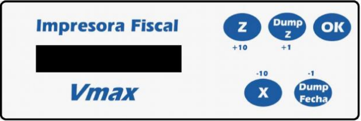
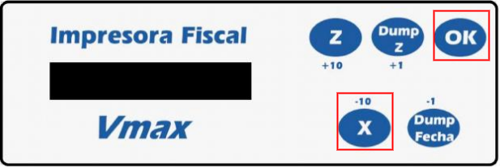
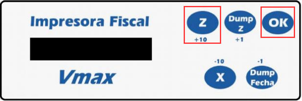
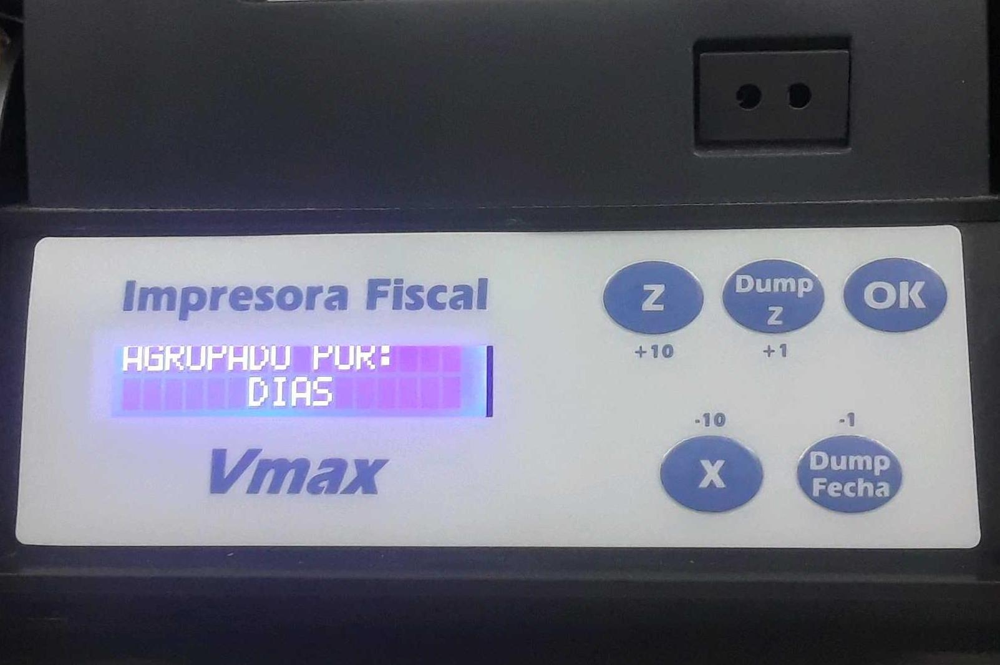
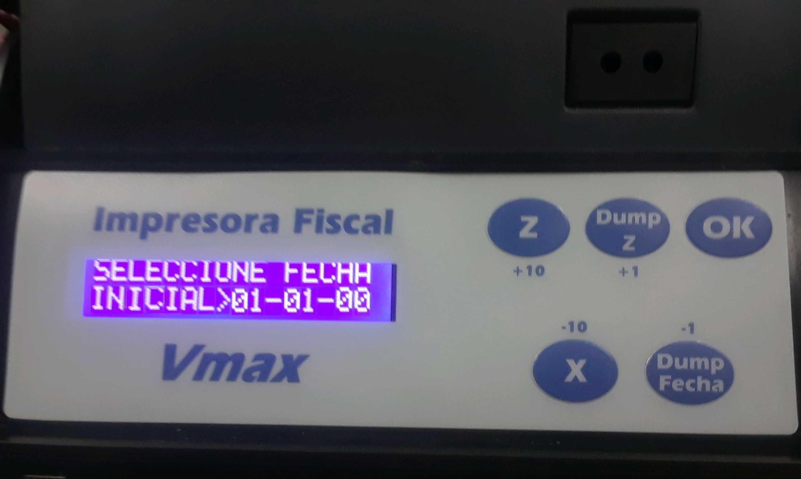
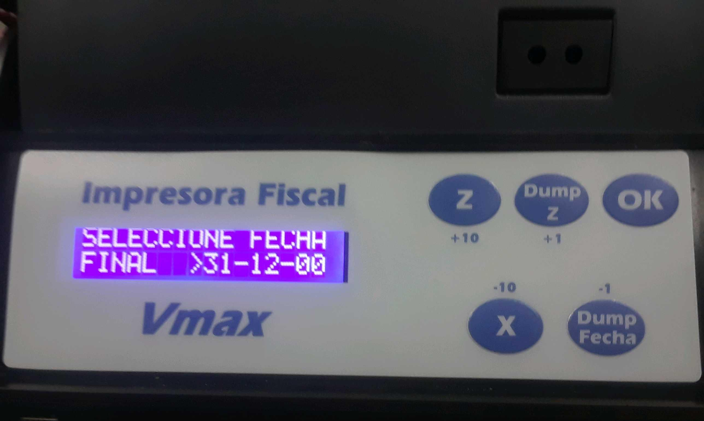
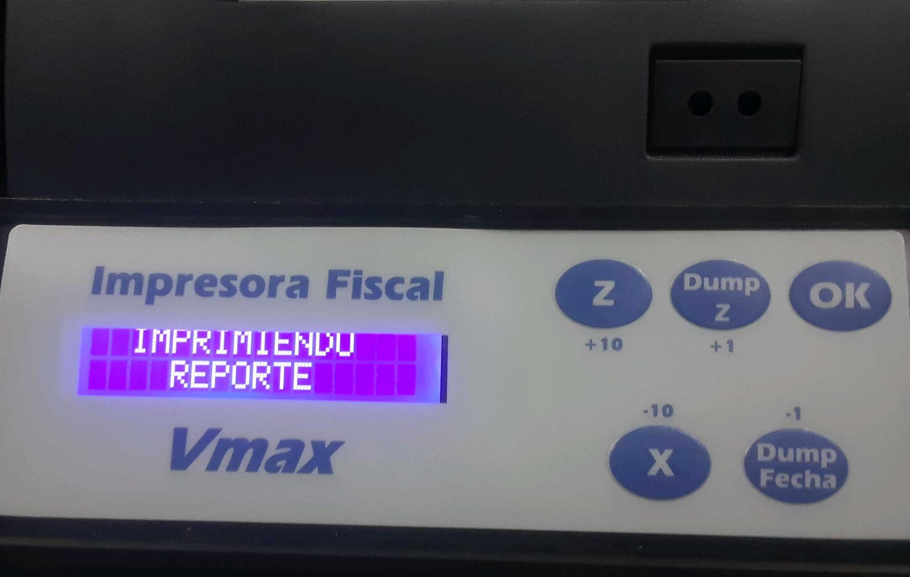
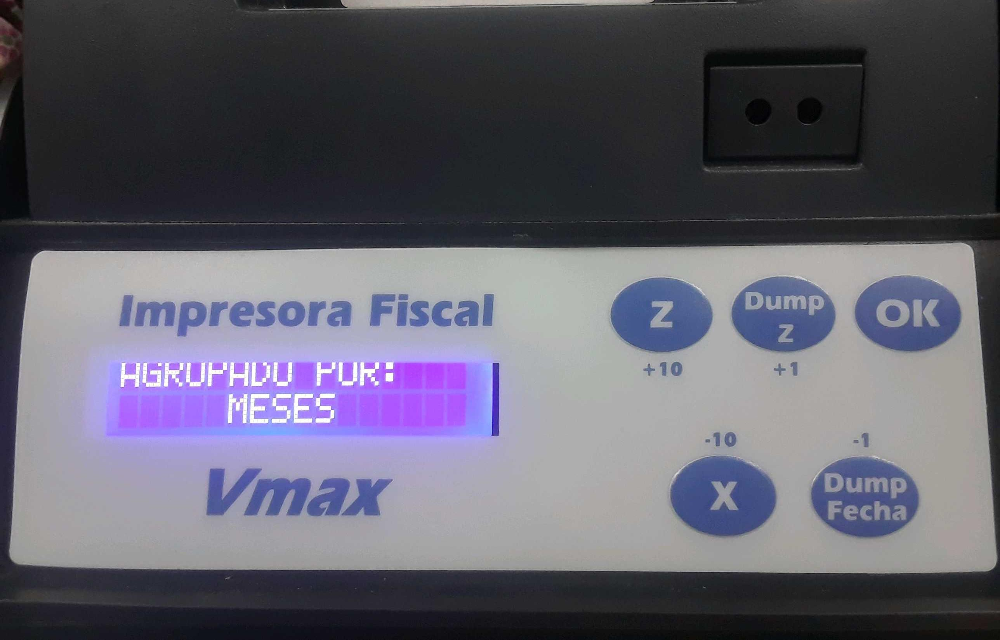
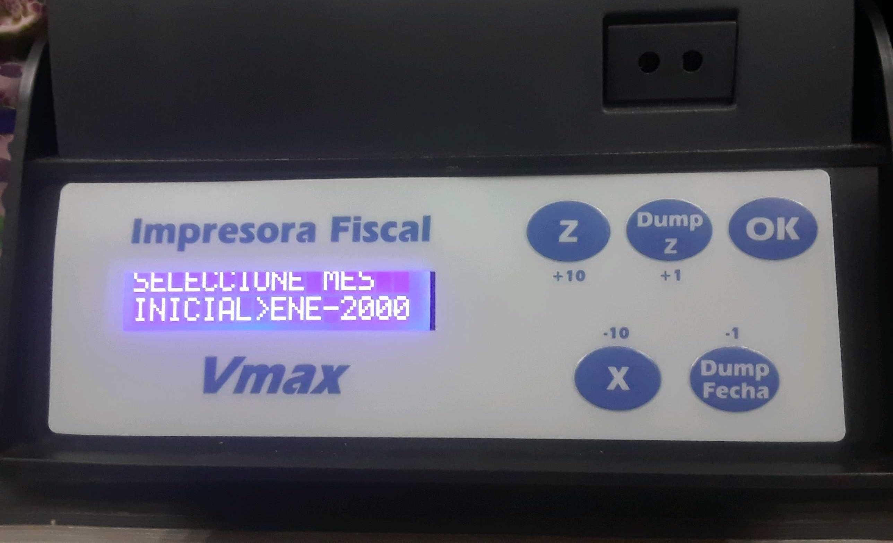
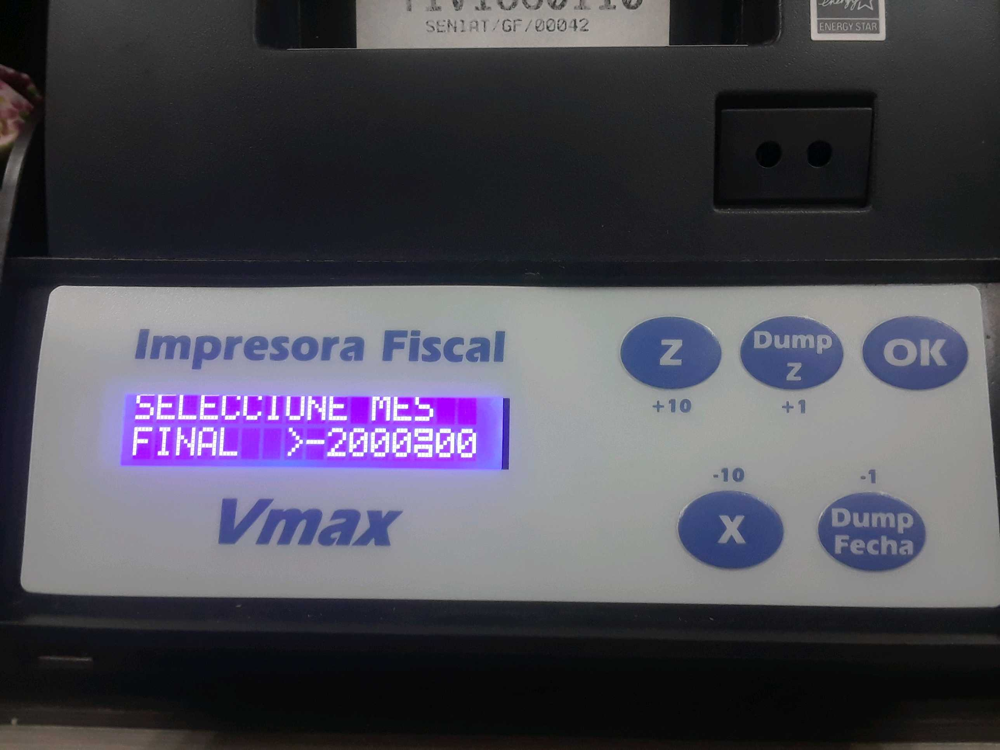

Generar Reportes Manualmente en la impresora
============================================

   Panel Frontal de la impresora

En en caso de error o cuando se confirma que se trabo la impresora durante una impresión, se hace necesario generar un reporte para consolidar que la data de ADempiere concuerda con la almacenada en la impresora, por motivos de de seguridad o auditoria, se hace conveniente generarlo a través de la impresora misma.

Generar Reporte "X".
---------------------------

   Generar Reporte X

Se hace a través de la combinación de los botones "**OK**" + "**X**" Se debe mantener pulsados ambos hasta que la impresión inicie.

Generar Reporte "Z".
---------------------------

   Generar Reporte Z

Se hace a través de la combinación de los botones "**OK**" + "**Z**" Se debe mantener pulsados ambos hasta que la impresión inicie.

Generar **"Reporte de Memoria Fiscal por días"**.
----------------------------------------------------

.. note::

    Estas instrucciones se detallan en la Página 15 de el `Manual de Fabricante. <http://www.elepos.com.ve/eleposveweb/archivos/Manuales/MU_ImpresorasVmax220_221_222.pdf>`_

.. figure:: resorces/print-report-by-month.png
   :alt: Reporte de Memoria Fiscal por mes

   Reporte de Memoria Fiscal por mes

Para emitir este reporte debe presionar las teclas "**Dump Fecha**" y "**OK**" al mismo tiempo durante 2 o 3 segundos.

.. tip:: 

    "Seguir instrucciones en pantalla:"

        Para incrementar o decrementar los valores en pantalla de uno en uno presione las teclas identificadas en letras pequeñas como +1 y -1.

        Para incrementar o decrementar los valores en pantalla de diez en diez presione las teclas identificadas en letras pequeñas como +10 y -10.

        Para fijar cada valor presione la tecla OK. Debe seguir este procedimiento para cada valor solicitado en la pantalla. Al finalizar será emitido el reporte. 

.. figure:: resorces/generate-report-by-days1.jpg
   :alt: Generar Reporte por Días

   Generar Reporte Z

En la pantalla se visualizara las opciones X "**MES**" y Z "**DÍAS**", se debe presionar el botón "**Z**", luego se mostrara el mensaje "**AGRUPADO POR DÍAS**".

   Generar Reporte Z

Seleccionar el rango de fechas a usar en el reporte.

   Generar Reporte

   Generar Reporte

Despues de cargar los parametros de impresion inmediatamente iniciara la impresión

   Generar Reporte

Generar **"Reporte de Memoria Fiscal por mes"**.
---------------------------------------------------

.. warning::

    Estas instrucciones se detallan en la Página 15 de el `Manual de Fabricante. <http://www.elepos.com.ve/eleposveweb/archivos/Manuales/MU_ImpresorasVmax220_221_222.pdf>`_ 

.. figure:: resorces/print-report-by-month.png
   :alt: Reporte de Memoria Fiscal por mes

   Reporte de Memoria Fiscal por mes

Para emitir este reporte debe presionar las teclas "**Dump Fecha**" y "**OK**" al mismo tiempo durante 2 o 3 segundos.

.. tip:: 

    "Seguir instrucciones en pantalla:"

        Para incrementar o decrementar los valores en pantalla de uno en uno presione las teclas identificadas en letras pequeñas como +1 y -1.

        Para incrementar o decrementar los valores en pantalla de diez en diez presione las teclas identificadas en letras pequeñas como +10 y -10.

        Para fijar cada valor presione la tecla OK. Debe seguir este procedimiento para cada valor solicitado en la pantalla. Al finalizar será emitido el reporte. 

.. figure:: resorces/generate-report-by-days1.jpg
   :alt: Generar Reporte por Mes

   Generar Reporte

En la pantalla se visualizara las opciones X "**MES**" y Z "**DÍAS**", se debe presionar el botón "**X**", luego se mostrara el mensaje "**AGRUPADO POR MES**".

   Generar Reporte

Seleccionar el rango de meses que se usaran en el reporte.

   Generar Reporte

   Generar Reporte

Despues de cargar los parametros de impresion inmediatamente iniciara la impresión

   Generar Reporte
