.. |Menú de ADempiere 1| image:: resources/menu1.png 
.. |Orden de Compra sin Completar| image:: resources/orden1.png 
.. |Menú de ADempiere 2| image:: resources/menu2.png 
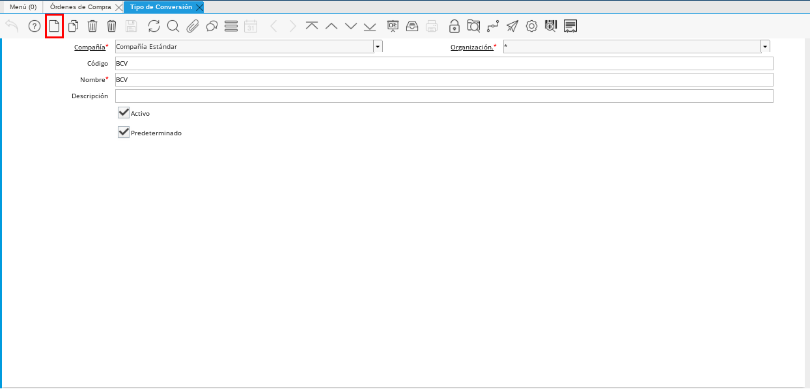
.. |Campo Nombre| image:: resources/nombre1.png
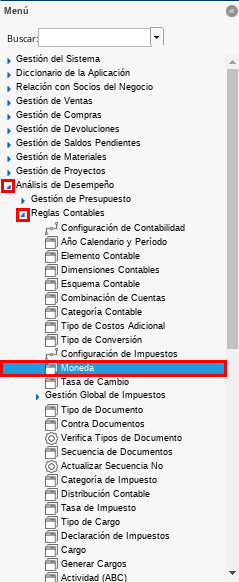

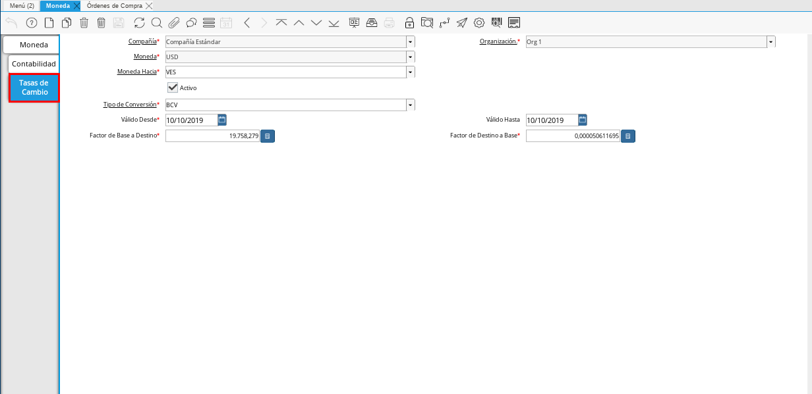
.. |Icono Registro Nuevo 2| image:: resources/nuevo2.png
.. |Campo Moneda Hacia| image:: resources/moneda1.png
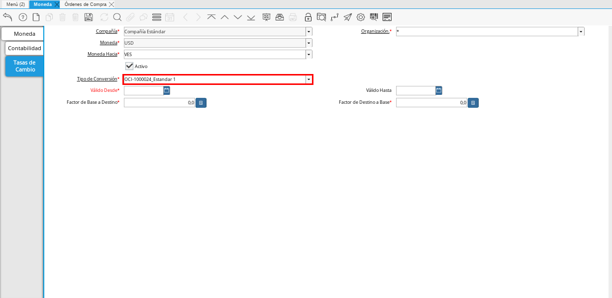
.. |Campo Válido Desde| image:: resources/desde1.png

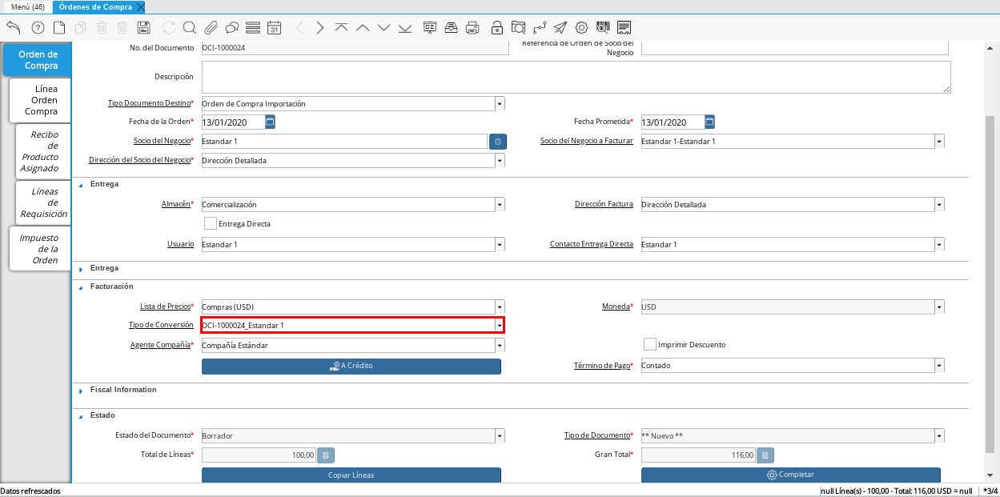

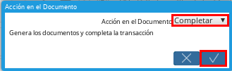

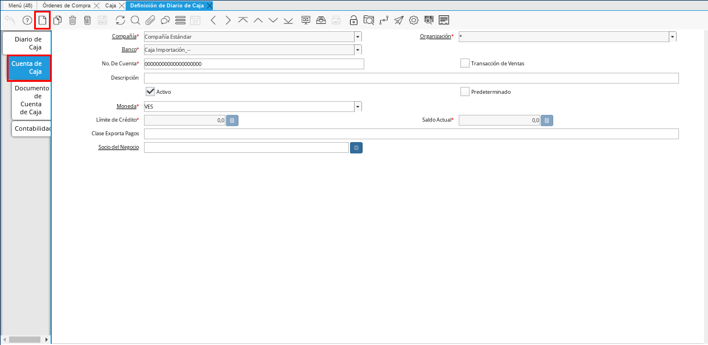

.. |Menú de ADempiere 4| image:: resources/menu4.png
.. |Campo Organización 2| image:: resources/org1.png
.. |Campo Tipo de Documento| image:: resources/tipodoc1.png

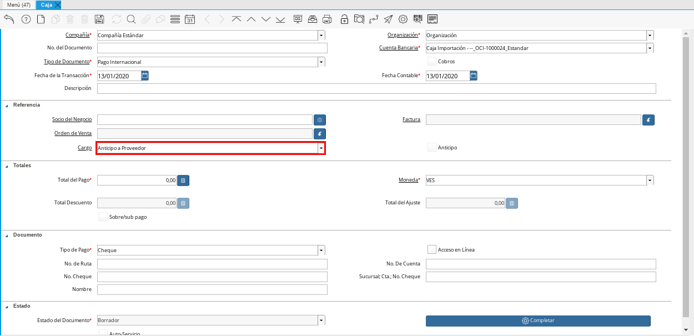

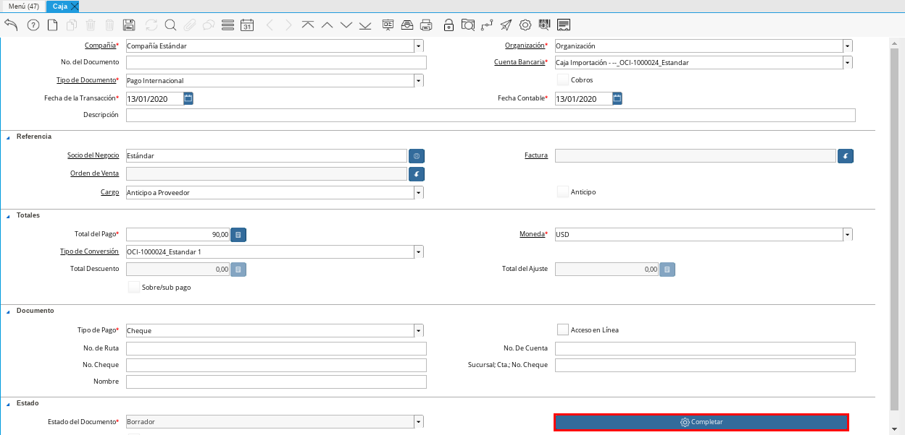
.. |Menú de ADempiere 6| image:: resources/menu6.png
.. |Documento por Pagar| image:: factura1.png

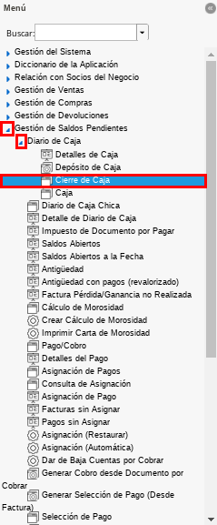
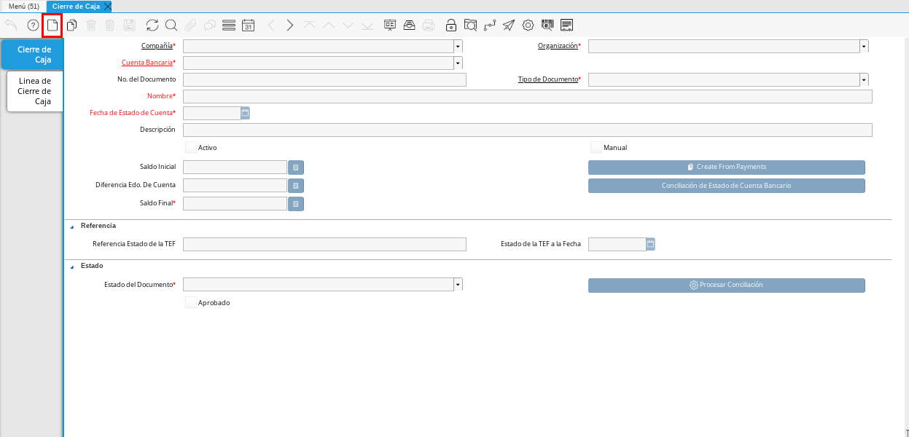

.. |Campo Tipo de Documento 2| image:: resources/tipodoc2.png
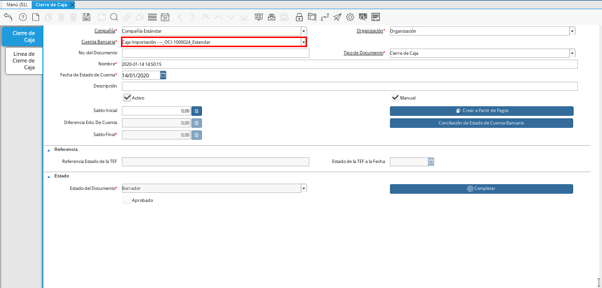
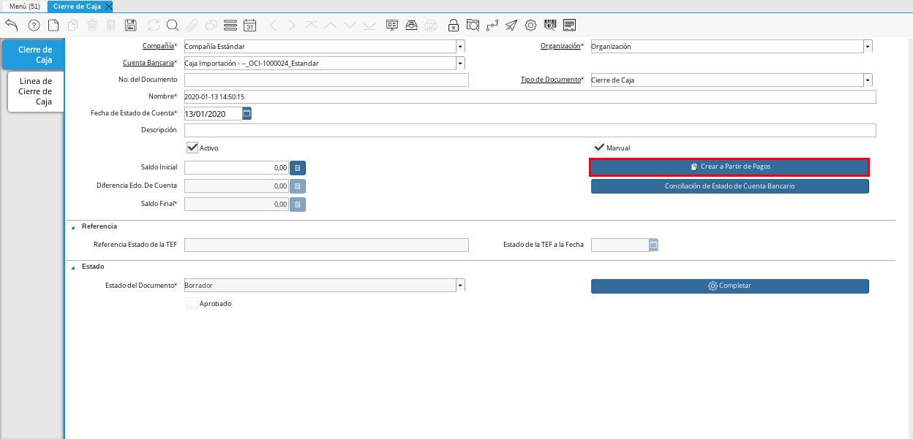

.. _documento/procedimiento-importación:

=============================
Procedimento para Importación
=============================

Crear Orden de Compra de Importación
====================================

#. Ubique y seleccione en el menú de ADempiere, la carpeta "**Gestión de Compras**" y luego seleccione la ventana "**Órdenes de Compra**".

    |Menú de ADempiere 1|

    Imagen 1: Menú de ADempiere

#. Realice el procedimiento regular para realizar una orden de compra, explicado en el material :ref: `documento/orden-de-compra` pero sin completar dicho documento que esta realizando.

    |Orden de Compra sin Completar|

    Imagen 2: Orden de Compra Importación sin Completar

Crear Tipo de Conversión
========================

#. Ubique y seleccione en el menú de ADempiere, la carpeta "**Análisis de Desempeño**", luego seleccione la carpeta "**Reglas Contables**", por último seleccione la ventana "**Tipo de Conversión**".

    |Menú de ADempiere 2|

    Imagen 3: Menú de ADempiere

    #. Seleccione el icono "**Registro Nuevo**", ubicado en la barra de herramientas de ADempiere.

        |Icono Registro Nuevo|

        Imagen 4. Icono Registro Nuevo

    #. Introduzca en el campo "**Nombre**" el número de la orden de compra creada anteriormente, seguido del símbolo "**_**" y el nombre del proveedor seleccionado en dicha orden.

        |Campo Nombre|

        Imagen 5. Campo Nombre

.. note:: 

    Recuerde guardar los cambios realizados seleccionando el icono "**Guardar Cambios**", ubicado en la barra de herramientas de ADempiere.

Crear Tasa de Conversión
========================

#. Ubique y seleccione en el menú de ADempiere, la carpeta "**Análisis de Desempeño**", luego seleccione la carpeta "**Reglas Contables**", por último seleccione la ventana "**Moneda**".

    |Menú de ADempiere 3|

    Imagen 6. Menú de ADempiere

#. Seleccione el registro de la moneda seleccionada en el documento "**Orden de Compra**". Para ejemplificar el registro es utilizada la moneda "**USD**".

    |Ventana Moneda|

    Imagen 7. Registro de Moneda USD en ADempiere

    #. Seleccione la pestaña "**Tasas de Cambio**" para navegar entre los diferentes registros de tasas de cambio correspondientes a la moneda "**USD**".

        |Pestaña Tasas de Cambio|

        Imagen 8. Pestaña Tasas de Cambio

    #. Seleccione el icono "**Registro Nuevo**" para crear un nuevo registro de tasas de cambio.

        |Icono Registro Nuevo 2|

        Imagen 9. Icono Registro Nuevo

        #. Seleccione en el campo "**Moneda Hacia**", la moneda correspondiente a la nacionalización. Para ejemplificar el registro es utilizada la moneda "**VES**".

            |Campo Moneda Hacia|

            Imagen 10. Campo Moneda Hacia

        #. Seleccione en el campo "**Tipo de Conversión**", el tipo de conversión creado. Para ejemplificar el registro es utilizado el tipo de conversión "**OCI-1000024_Estandar 1**" creado anteriormente.

            |Campo Tipo de Conversión 1|

            Imagen 11. Campo Tipo de Conversión

        #. Seleccione en el campo "**Válido Desde**", la fecha ingresada en el campo "**Fecha de la Orden**" de la orden de compra realizada anteriormente.

            |Campo Válido Desde|

            Imagen 12. Campo Válido Desde

        #. Seleccione en el campo "**Válido Hasta**", la fecha hasta la cual tiene validez la tasa de cambio que esta registrando. 

            |Campo Válido Hasta|

            Imagen 13. Campo Válido Hasta

        #. Introduzca en el campo "**Factor de Base a Destino**", la tasa por la que se multiplica el monto de la orden de compra realizada. Para ejemplificar el registro es utilizada la tasa "**82.000,0**".

            |Campo Factor de Base a Destino|

            Imagen 14. Campo Factor de Base a Destino

.. note:: 

    Recuerde guardar los cambios realizados seleccionando el icono "**Guardar Cambios**", ubicado en la barra de herramientas de ADempiere.

Asignar Tipo de Conversión a Orden de Compra de Importación
===========================================================

#. Regrese a la ventana "**Órdenes de Compra**" y ubique la orden de compra que se encuentra en estado "**Borrador**", creada anteriormente.

    |Orden de Compra sin Completar|

    Imagen 2: Orden de Compra Importación sin Completar

    #. Seleccione en el campo "**Tipo de Conversión**" el tipo de conversión creado. Para ejemplificar el registro es utilizado el tipo de conversión "**OCI-1000024_Estandar 1**", creado anteriormente.

    |Campo Tipo de Conversión 2|

    Imagen 15. Campo Tipo de Conversión

    .. note::

        Recuerde guardar los cambios realizados seleccionando el icono "**Guardar Cambios**", ubicado en la barra de herramientas de ADempiere.

#. Seleccione la opción "**Completar**", ubicada en la parte inferior derecha del documento.

    |Opción Completar 1|

    Imagen 16. Opción Completar Documento

    #. Seleccione la acción "**Completar**" y la opción "**OK**" para completar el documento "**Orden de Compra**".

        |Acción Completar|

        Imagen 17. Acción Completar

#. Podrá visualizar en la parte inferior de la orden de compra, el campo en estado "**Completo**" y el resultado de la conversión configurada anteriormente.

    |Orden de Compra Completa|

    Imagen 18. Orden de Compra Completa

Crear Caja Importación para Gestión de Terceros
===============================================

#. Ubique y seleccione en el menú de ADempiere, la carpeta "**Gestión del Sistema**", luego seleccione la carpeta "**Reglas de la Organización**", por último seleccione la ventana "**Definición de Diario de Caja**".

    |Menú de ADempiere 5|

    Imagen 19. Menú de ADempiere

    #. Navegue entre los registros de la ventana para ubicar el registro de la caja correspondiente. Para este ejemplo es utilizado el registro "**Caja Importación**".

        |Registro de Caja Importación|

        Imagen 20. Ventana de Registros de Cajas

    #. Seleccione la pestaña "**Cuenta de Caja**" y luego seleccione el icono "**Registro Nuevo**", para crear un registro nuevo de caja importación.

        |Pestaña Cuenta de Caja|

        Imagen 21. Pestaña Cuenta de Caja

    #. Seleccione en el campo "**Organización**", la organización para la cual esta definiendo la caja.

        |Campo Organización 1| 
        
        Iamgen 22. Campo Organización

    #. Introduzca en el campo "**No. De Cuenta**", el nombre de la caja que esta definiendo. Para ejemplificar el registro es utilizado el nombre "**OCI-1000024_Estandar**".

        |Campo No. de Cuenta|

        Imagen 23. Campo No. De Cuenta

.. note::

    Recuerde guardar los cambios realizados seleccionando el icono "**Guardar Cambios**", ubicado en la barra de herramientas de ADempiere.

Gestión de Caja de Intermediario
================================

#. Ubique y seleccione en el menú de ADempiere, la carpeta "**Gestión de Saldos Pendientes**", luego seleccione la carpeta "**Cash Journal**", por último seleccione la ventana "**Caja**".

    |Menú de ADempiere 4|

    Imagen 24. Menú de ADempiere

    #. Seleccione en el campo "**Organización**", la organización para la cual esta realizando el documento "**Caja**".

        |Campo Organización|

        Imagen 25. Campo Organización

    #. Seleccione el tipo de documento a generar en el campo "**Tipo de Documento**", la selección de este define el comportamiento del documento que se esta elaborando, dicho comportamiento se encuentra explicado en el documento :ref:`Tipo de Documento` elaborado por ERPyA.

        |Campo Tipo de Documento|

        Imagen 26. Campo Tipo de Documento

    #. Seleccione en el campo "**Cuenta Bancaria**", la caja correspondiente al registro que esta realizando. Para ejemplificar el registro es utilizada la opción "**Caja Importación**".

        |Campo Cuenta Bancaria|

        Imagen 27. Campo Cuenta Bancaria

    #. Seleccione en el campo "**Orden de Venta**", la orden de compra correspondiente a la caja que esta registrando.

        |Campo Orden de Venta|

        Imagen 28. Campo Orden de Venta

    #. Seleccione en el campo "**Tipo de Conversión**", el tipo de conversión correspondiente a la orden de compra seleccionada.

        |Campo Tipo de Conversión|

        Imagen 29. Campo Tipo de Conversión

    #. Introduzca en el campo "**Total del Pago**", el monto correspondiente al anticipo. Para ejemplificar el registro es utilizado el monto "**90,00**".

        |Campo Total del Pago|

        Imagen 30. Campo Total del Pago
    
    #. Seleccione la opción "**Completar**" ubicada en la parte inferior del documento.

        |Opción Completar|

        Imagen 31. Opción Completar

        #. Seleccione la acción "**Completar**" y la opción "**OK**" para completar el documento "**Orden de Compra**".

            |Acción Completar|

            Imagen 32. Acción Completar

Crear Documento por Pagar
=========================

#. Ubique y seleccione en el menú de ADempiere, la carpeta "**Gestión de Compras**", luego seleccione la carpeta "**Cash Journal**", por último seleccione la ventana "**Caja**".

    |Menú de ADempiere 6|

    Imagen 33. Menú de ADempiere

#. Realice el procedimiento habitual para crear el documento por pagar, explicado en el material :ref:`documento/documento-por-pagar` elaborado por ERPyA. Podrá visualizar el documento por pagar de la siguiente manera:

    |Documento por Pagar|

    Imagen 34. Documento por Pagar

.. note::

    Si ya se encuentra recepcionada la mercancía debe seguir el procedimiento de costos adicionales asociado a una recepción, de otro modo debe ser cargada de forma regular y ser reversada mediante un ajuste de crédito al recepcionar la mercancía, cargando un ajuste de débito con el procedimiento de costo adicional.

Cancelar Facturas
=================

#. Ubique y seleccione en el menú de ADempiere, la carpeta "**Gestión de Saldos Pendientes**", luego seleccione la ventana "**Pago/Cobro**".

    |Menú de ADempiere 7|

    Imagen 35. Menú de ADempiere

#. Podrá visualizar la ventana "**Pago/Cobro**", donde debe seleccionar en la barra de herramientas el icono "**Registro Nuevo**".

    |Icono Registro Nuevo|

    Imagen 36. Icono Registro Nuevo