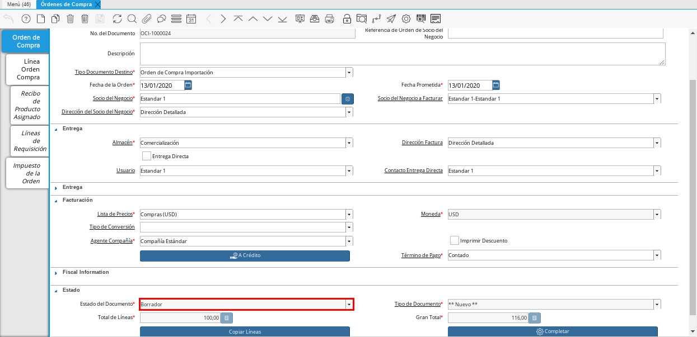
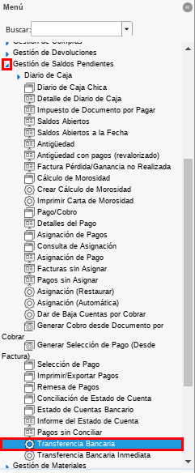
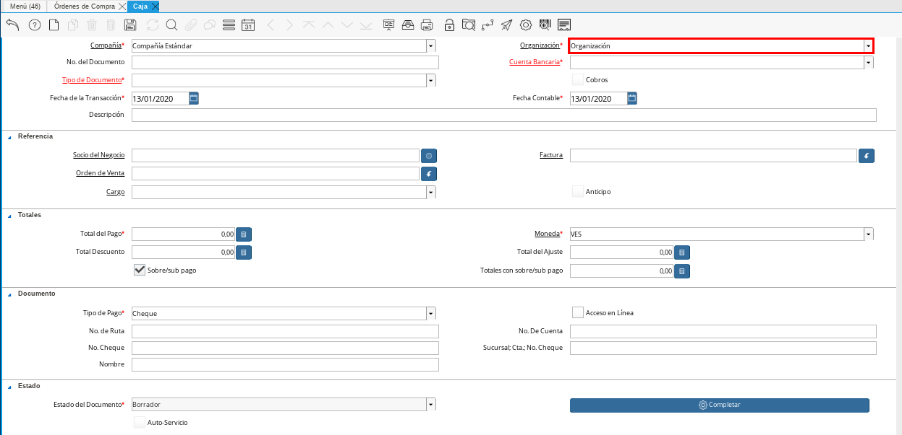

.. |Menú de ADempiere 1| image:: resources/menu1.png 

.. |Menú de ADempiere 2| image:: resources/menu2.png 
.. |Icono Registro Nuevo| image:: resources/nuevo1.png
.. |Campo Nombre| image:: resources/nombre1.png
.. |Menú de ADempiere 3| image:: resources/menu3.png
.. |Ventana Moneda| image:: resources/vent1.png
.. |Pestaña Tasas de Cambio| image:: resources/pest1.png
.. |Icono Registro Nuevo 2| image:: resources/nuevo2.png

.. |Campo Tipo de Conversión 1| image:: resources/tipoconver.png
.. |Campo Válido Desde| image:: resources/desde1.png
.. |Campo Válido Hasta| image:: resources/hasta1.png
.. |Campo Factor de Base a Destino| image:: resources/factor1.png
.. |Campo Tipo de Conversión 2| image:: resources/tipoconver2.png
.. |Opción Completar 1| image:: resources/completar1.png
.. |Acción Completar| image:: resources/accion1.png
.. |Orden de Compra Completa| image:: resources/resultado1.png
.. |Menú de ADempiere 5| image:: resources/menu5.png
.. |Registro de Caja Importación| image:: resources/caja1.png
.. |Pestaña Cuenta de Caja| image:: resources/cuenta2.png
.. |Campo Organización 1| image:: resources/org2.png
.. |Campo No. de Cuenta| image:: resources/cuenta3.png
.. |Contabilidad| image:: resources/contabilidad.png

.. |Resultado Contable 1| image:: resources/eje1.png
.. |Resultado Contable 2| image:: resources/eje2.png
.. |Ejemplo de Transferencia Bancaria| image:: resources/transf1.png
.. |Menú de ADempiere 4| image:: resources/menu4.png

.. |Campo Cuenta Bancaria| image:: resources/cuenta1.png
.. |Campo Cargo| image:: resources/orden2.png
.. |Campo Moneda| image:: resources/conversion1.png
.. |Campo Total del Pago| image:: resources/total1.png
.. |Campo Socio del Negocio| image:: resources/socio1.png
.. |Opción Completar| image:: resources/completar2.png
.. |Menú de ADempiere 6| image:: resources/menu6.png
.. |Documento por Pagar| image:: resources/factura1.png
.. |Pestaña Línea de la Factura| image:: resources/linea.png
.. |Campo Tipo de Documento 3| image:: resources/tipodoc3.png
.. |Campo Cuenta Bancaria 3| image:: resources/cuenta4.png
.. |Campo Factura 1| image:: resources/factura3.png
.. |Opción Completar 2| image:: resources/completar3.png
.. |Resultado Contable 3| image:: resources/eje3.png
.. |Resultado Contable 4| image:: resources/eje4.png
.. |Menú de ADempiere 7| image:: resources/menu7.png
.. |Icono Registro Nuevo 3| image:: resources/nuevo3.png
.. |Campo Organización 3| image:: resources/org3.png
.. |Campo Tipo de Documento 2| image:: resources/tipodoc2.png
.. |Campo Cuenta Bancaria 2| image:: resources/factura2.png
.. |Opción Crear Desde| image:: resources/total2.png
.. |Ventana del Proceso Crear Desde| image:: resources/vent2.png
.. |Opción Comenzar Búsqueda|image:: resources/busqueda.png
.. |Seleccione Documentos| image:: resources/selec.png
.. |Opción Completar 3| image:: resources/

.. _documento/procedimiento-importación:

Relación Anticipos a Intermediarios
===================================

La caja a definir funge en el procedimiento de anticipos a terceros  como un puente para el registro y pago de los anticipos a proveedores intermediarios en el proceso de importación y para la posterior liquidación de las facturas entregadas en la relación de gastos o costos de nacionalización y cierre de los anticipos.

En la ventana "**Definición de Diario de Caja**" se crean todas las posibles cajas que puedan manejarse dentro de una organización (Caja Importación), a continuación se define el procedimiento para realizar la definición de diario de caja de importación y cruce de cuentas.
 
Crear Orden de Compra de Importación
************************************

#. Ubique y seleccione en el menú de ADempiere, la carpeta "**Gestión de Compras**" y luego seleccione la ventana "**Órdenes de Compra**".

    |Menú de ADempiere 1|

    Imagen 1: Menú de ADempiere

#. Realice el procedimiento regular para realizar una orden de compra, explicado en el material :ref:`documento/orden-de-compra`.

    |Orden de Compra sin Completar|

    Imagen 2: Orden de Compra Importación sin Completar

.. note:: 

    El documento debe quedar en estado borrador.

Crear Tipo de Conversión
************************

#. Ubique y seleccione en el menú de ADempiere, la carpeta "**Análisis de Desempeño**", luego seleccione la carpeta "**Reglas Contables**", por último seleccione la ventana "**Tipo de Conversión**".

    |Menú de ADempiere 2|

    Imagen 3: Menú de ADempiere

    #. Seleccione el icono "**Registro Nuevo**", ubicado en la barra de herramientas de ADempiere.

        |Icono Registro Nuevo|

        Imagen 4. Icono Registro Nuevo

    #. Introduzca en el campo "**Nombre**" el número de la orden de compra que da origen a la importación, seguido del símbolo "**_**" y el nombre del proveedor seleccionado en dicha orden.

        |Campo Nombre|

        Imagen 5. Campo Nombre

.. note:: 

    Recuerde guardar los cambios realizados seleccionando el icono "**Guardar Cambios**", ubicado en la barra de herramientas de ADempiere.

Crear Tasa de Conversión
************************

La tasa de conversión se crea unicamente cuando se conoce el monto, el mismo se extrae de la planilla que emite la aduana.

#. Ubique y seleccione en el menú de ADempiere, la carpeta "**Análisis de Desempeño**", luego seleccione la carpeta "**Reglas Contables**", por último seleccione la ventana "**Moneda**".

    |Menú de ADempiere 3|

    Imagen 6. Menú de ADempiere

#. Seleccione el registro de la moneda seleccionada en el documento "**Orden de Compra**". Para ejemplificar el registro es utilizada la moneda "**USD**".

    |Ventana Moneda|

    Imagen 7. Registro de Moneda USD en ADempiere

    #. Seleccione la pestaña "**Tasas de Cambio**" para navegar entre los diferentes registros de tasas de cambio correspondientes a la moneda "**USD**".

        |Pestaña Tasas de Cambio|

        Imagen 8. Pestaña Tasas de Cambio

    #. Seleccione el icono "**Registro Nuevo**" para crear un nuevo registro de tasas de cambio.

        |Icono Registro Nuevo 2|

        Imagen 9. Icono Registro Nuevo

        .. note::

            La tasa de cambio se debe crear de dólares a bolívares y de bolívares a dólares.

        #. Seleccione en el campo "**Moneda Hacia**", la moneda correspondiente a la nacionalización. Para ejemplificar el registro es utilizada la moneda "**VES**".

            |Campo Moneda Hacia|

            Imagen 10. Campo Moneda Hacia

        #. Seleccione en el campo "**Tipo de Conversión**", el tipo de conversión creado. Para ejemplificar el registro es utilizado el tipo de conversión "**OCI-1000024_Estandar 1**" creado anteriormente.

            |Campo Tipo de Conversión 1|

            Imagen 11. Campo Tipo de Conversión

        #. Seleccione en el campo "**Válido Desde**", la fecha ingresada en el campo "**Fecha de la Orden**" de la orden de compra realizada anteriormente.

            |Campo Válido Desde|

            Imagen 12. Campo Válido Desde

        #. Seleccione en el campo "**Válido Hasta**", la fecha hasta la cual tiene validez la tasa de cambio que esta registrando. 

            |Campo Válido Hasta|

            Imagen 13. Campo Válido Hasta

        #. Introduzca en el campo "**Factor de Base a Destino**", la tasa por la que se multiplica el monto de la orden de compra realizada. Para ejemplificar el registro es utilizada la tasa "**82.000,0**".

            |Campo Factor de Base a Destino|

            Imagen 14. Campo Factor de Base a Destino

.. note:: 

    Recuerde guardar los cambios realizados seleccionando el icono "**Guardar Cambios**", ubicado en la barra de herramientas de ADempiere.

Asignar Tipo de Conversión a Orden de Compra de Importación
***********************************************************

#. Regrese a la ventana "**Órdenes de Compra**" y ubique la orden de compra que se encuentra en estado "**Borrador**", creada anteriormente.

    |Orden de Compra sin Completar|

    Imagen 15: Orden de Compra Importación sin Completar

    #. Seleccione en el campo "**Tipo de Conversión**" el tipo de conversión creado. Para ejemplificar el registro es utilizado el tipo de conversión "**OCI-1000024_Estandar 1**", creado anteriormente.

    |Campo Tipo de Conversión 2|

    Imagen 16. Campo Tipo de Conversión

    .. note::

        Recuerde guardar los cambios realizados seleccionando el icono "**Guardar Cambios**", ubicado en la barra de herramientas de ADempiere.

#. Seleccione la opción "**Completar**", ubicada en la parte inferior derecha del documento.

    |Opción Completar 1|

    Imagen 17. Opción Completar Documento

    #. Seleccione la acción "**Completar**" y la opción "**OK**" para completar el documento "**Orden de Compra**".

        |Acción Completar|

        Imagen 18. Acción Completar

#. Podrá visualizar en la parte inferior de la orden de compra, el campo en estado "**Completo**" y el resultado de la conversión configurada anteriormente.

    |Orden de Compra Completa|

    Imagen 19. Orden de Compra Completa

Gestión de Caja de Intermediario
********************************

Carga de Anticipos a Intermediarios
+++++++++++++++++++++++++++++++++++

La transferencia representa un proceso en el cual se generan los pagos por concepto de anticipos al gestor(s), el mismo requiere conocimientos básicos en el proceso actual de tesorería en ADempiere. 

El traslado de fondo reflejará en la cuenta de banco un egreso por el anticipo (Pago a Conciliar) y genera un ingreso en la cuenta puente (Caja #Expediente) que será utilizado para gestionar los pagos de terceros, cuando a un gestor se le conceda un anticipo, el mismo se gestionará a través de la caja creada previamente.

En primer lugar se creará el anticipo gestionando un traslado de fondos mediante el proceso de transferencia  a la caja (Caja #Expediente)  y se paga desde el banco en el cual sale realmente el pago. 

Para realizar tal procedimiento en ADempiere se debe realizar un transferencia, la transferencia bancaria es el proceso mediante el cual se realizan los traslados de fondos entre cuentas(Banco Real a Caja #Expediente), a continuación se define el proceso para realizar una transferencia bancaria en ADempiere. 

#. Ubique y seleccione en el menú de ADempiere la carpeta "**Gestión de Saldos Pendientes**", luego seleccione el proceso "**Transferencia Bancaria**".

    |Menú de ADempiere 8|

    Imagen 26. Menú de ADempiere

    #. Realizar una transferencia bancaria con las siguientes condiciones:

        #. **Banco Desde**: Banco desde la cual se cancelará el anticipo

        #. **Banco a Transferir**: Cuenta caja de importación definida anteriormente.

        #. **Socio del Negocio**: Socio del Negocio al cual se le cancelará el anticipo.

        #. **Moneda**: Moneda en la cual se cancelará la transferencia

        #. **Cargo**: Cargo correspondiente al anticipo "**Anticipo Tercero**" o "**Anticipo a Proveedor**".
            
        #. **Número del Documento**: Referencia correspondiente a la transferencia bancaria.

        #. **Monto**: Monto del anticipo.

        #. **Descripción**: Breve descripción sobre la transferencia.

        #. **Fecha de Estado de Cuenta**: Fecha de la transferencia realizada.

        #. **Fecha Contable**: Fecha de la transferencia realizada.

    #. Resultados:

        #. **Egreso**:

            - **Resultado**: Se realiza un egreso en banco por el monto a cancelar

            - **Resultado Contable**: A continuación se presenta un ejemplo de un resultado contable.

            |Resultado Contable 1|

            Imagen 27. Ejemplo de Resultado Contable 1

        #. **Ingreso**:

            - **Resultado**: Se realiza un ingreso en caja por el monto a cancelar

            - **Resultado Contable**: A continuación se presenta un ejemplo de un resultado contable.

            |Resultado Contable 2|

            Imagen 28. Ejemplo de Resultado Contable 2

    #. A continuación se presenta un ejemplo de la ventana "**Transferencia Bancaria**".

        |Ejemplo de Transferencia Bancaria|

        Imagen 29. Ejemplo de Transferencia Bancaria

Carga de Factura de Intermediarios
++++++++++++++++++++++++++++++++++

Posterior a la concesión del anticipo, será justificado el anticipo relacionando los gastos (Facturas) es entonces cuando se procede a liquidar los anticipos concedidos al gestor de importación.
La operación de anticipos a terceros está compuesta por cinco fases u operaciones las cuales no tienen porqué ser todas necesarias en el proceso de liquidación:

#. Anticipo a terceros(Gestor)
#. Registrar justificantes(Carga de Facturas de Cuentas por Pagar) 
#. Relación de Pasivos(Gestor)
#. Incremento de anticipo a terceros(Gestor)
#. Liquidación de Anticipos y CxP

En la siguiente ventana de Caja se realizan todos los pagos de las facturas pendientes por cancelar, a continuación se define el proceso de caja en ADempiere.

#. Ubique y seleccione en el menú de ADempiere, la carpeta "**Gestión de Saldos Pendientes**", luego seleccione la carpeta "**Diario de Caja**", por último seleccione la ventana "**Caja**".

    |Menú de ADempiere 4|

    Imagen 30. Menú de ADempiere

    #. Seleccione en el campo "**Organización**", la organización para la cual esta realizando el documento "**Caja**".

        |Campo Organización 2|

        Imagen 31. Campo Organización

    #. Seleccione el tipo de documento a generar en el campo "**Tipo de Documento**", la selección de este define el comportamiento del documento que se esta elaborando, dicho comportamiento se encuentra explicado en el documento :ref:`documento/tipo-documento` elaborado por ERPyA. Para ejemplificar el registro es utilizada la opción "**Pago Internacional**".

        |Campo Tipo de Documento|

        Imagen 32. Campo Tipo de Documento

    #. Seleccione en el campo "**Cuenta Bancaria**", la caja correspondiente al registro que esta realizando. Para ejemplificar el registro es utilizada la opción "**Caja Importación - --_OCI-1000024_Estandar**".

        |Campo Cuenta Bancaria|

        Imagen 33. Campo Cuenta Bancaria

    #. Seleccione en el campo "**Cargo**", el cargo correspondiente a la caja que esta registrando. Para ejemplificar el registro es utilizado el cargo "**Anticipo a Proveedor**".

        |Campo Cargo|

        Imagen 34. Campo Cargo

    #. Seleccione en el campo "**Moneda**", al moneda correspondiente a la caja que esta realizando.

        |Campo Moneda|

        Imagen 35. Campo Moneda

        .. note:: 

            Al seleccionar la moneda, podrá visualizar el campo "**Tipo de Conversión**" configurado anteriormente. 

    #. Introduzca en el campo "**Total del Pago**", el monto correspondiente al anticipo. Para ejemplificar el registro es utilizado el monto "**90,00**".

        |Campo Total del Pago|

        Imagen 36. Campo Total del Pago

    #. Seleccione en el campo "**Socio del Negocio**", el socio del negocio intermediario de la compra.

        |Campo Socio del Negocio|

        Imagen 37. Campo Socio del Negocio
    
    #. Seleccione la opción "**Completar**" ubicada en la parte inferior del documento.

        |Opción Completar|

        Imagen 38. Opción Completar

        #. Seleccione la acción "**Completar**" y la opción "**OK**" para completar el documento "**Orden de Compra**".

            |Acción Completar|

            Imagen 39. Acción Completar

Crear Documento por Pagar
~~~~~~~~~~~~~~~~~~~~~~~~~

#. Ubique y seleccione en el menú de ADempiere, la carpeta "**Gestión de Compras**", luego seleccione la ventana "**Documentos por Pagar**".

    |Menú de ADempiere 6|

    Imagen 40. Menú de ADempiere

#. Realice el procedimiento habitual para crear los documentos por pagar necesarios, explicado en el material :ref:`documento/documento-por-pagar` elaborado por ERPyA. Para ejemplificar el registro se realizan dos facturas identicas con número de documento "**1000015**" y "**1000014**", moneda "**USD**", monto "**45,00**" y cargo "**Gastos Aduanales**". 

    |Documento por Pagar|

    Imagen 41. Documento por Pagar

    #. Podrá visualizar en la pestaña "**Línea de la Factura**", el cargo "**Gastos Aduanales**" utilizado para generar el documento por pagar.

        |Pestaña Línea de la Factura|

        Imagen 42. Pestaña Línea de la Factura

.. note::

    Si ya se encuentra recepcionada la mercancía debe seguir el procedimiento de costos adicionales asociado a una recepción, de otro modo debe ser cargada de forma regular y ser reversada mediante un ajuste de crédito al recepcionar la mercancía, cargando un ajuste de débito con el procedimiento de costo adicional.

Gestión de Caja de Intermediario
********************************

#. Ubique y seleccione en el menú de ADempiere, la carpeta "**Gestión de Saldos Pendientes**", luego seleccione la carpeta "**Diario de Caja**", por último seleccione la ventana "**Caja**".

    |Menú de ADempiere 4|

    Imagen 43. Menú de ADempiere

    .. note::

        El requerimiento principal para realizar el proceso de gestión de caja de intermediario es tener una definición de caja creada.

    #. Seleccione en el campo "**Organización**", la organización para la cual esta realizando el documento "**Caja**".

        |Campo Organización 2|

        Imagen 44. Campo Organización

    #. Seleccione el tipo de documento a generar en el campo "**Tipo de Documento**", la selección de este define el comportamiento del documento que se esta elaborando, dicho comportamiento se encuentra explicado en el documento :ref:`documento/tipo-documento` elaborado por ERPyA. Para ejemplificar el registro es utilizada la opción "**Egreso Caja**".

        |Campo Tipo de Documento 3|

        Imagen 45. Campo Tipo de Documento

    #. Seleccione en el campo "**Factura**", la factura que será reflejada en la caja que esta realizando. Para ejemplificar el registro es utilizada la factura "**1000014**" creada anteriormente.

        |Campo Factura 1|

        Imagen 46. Campo Factura

        .. note:: 

            Recuerde guardar los cambios realizados seleccionando el icono "**Guardar Cambios**", ubicado en la barra de herramientas de ADempiere.

    #. Seleccione la opción "**Completar**", ubicada en la parte inferior del documento.

        |Opción Completar 2|

        Imagen 47. Opción Completar

        #. Seleccione la acción "**Completar**" y la opción "**Ok**" para completar el documento "**Caja**".

            |Acción Completar|

            Imagen 48. Acción Completar

.. note::

    Repita el procedimiento con todos los documentos por pagar importación realizados al socio del negocio intermediario.

Cancelación de Facturas
***********************

Cuentas por pagar emite una "**Solicitud de Pago**" seleccionando la caja creada previamente y asociando todas las facturas de la relación entregada por el intermediario gestor de la importación.

Tesorería ejecuta el proceso de "**Imprimir/Exportar**" llamando la solicitud de pago creada previamente.

#. Resultados:

    #. **Egreso**:

        - **Resultado**: Se genera un egreso en caja por el monto a cancelará

        - **Resultado Contable en Caja**:

            |Resultado Contable 3|

            Imagen 49. Ejemplo de Resultado Contable 3

        - **Resultado Contable en Asignación entre Factura y Pago**:

            |Resultado Contable 4|

            Imagen 50. Ejemplo de Resultado Contable 4

Cierre de Caja
~~~~~~~~~~~~~~

#. Ubique y seleccione en el menú de ADempiere, la carpeta "**Gestión de Saldos Pendientes**", luego seleccione la carpeta "**Diario de Caja**", por último seleccione la ventana "**Cierre de Caja**".

    |Menú de ADempiere 7|

    Imagen 49. Menú de ADempiere

#. Podrá visualizar la ventana "**Cierre de Caja**", donde debe seleccionar en la barra de herramientas el icono "**Registro Nuevo**".

    |Icono Registro Nuevo 3|

    Imagen 50. Icono Registro Nuevo

    #. Seleccione en el campo "**Organización**", la organización para la cual esta realizando el documento de cierre de caja.

        |Campo Organización 3|

        Imagen 51. Campo Organización

    #. Seleccione el tipo de documento a generar en el campo "**Tipo de Documento**", la selección de este define el comportamiento del documento que se esta elaborando, dicho comportamiento se encuentra explicado en el documento :ref:`documento/tipo-documento` elaborado por ERPyA. Para ejemplificar el registro es utilizada la opción "**Cierre de Caja**".

        |Campo Tipo de Documento 2|

        Imagen 52. Campo Tipo de Documento

    #. Seleccione en el campo "**Cuenta Bancaria**", la misma caja seleccionada en el documento "**Caja**" creado.

        |Campo Cuenta Bancaria 2|

        Imagen 53. Campo Cuenta Bancaria

    #. Seleccione el proceso "**Crear a Partir de Pagos**" para crear el cierre de caja a partir de los pagos.

        |Opción Crear Desde|

        Imagen 54. Proceso Crear a Partir de Pagos

        #. Podrá visualizar la ventana "**Crear extracto bancario a partir de pagos**", con los campos necesarios para filtrar la búsqueda.

            |Ventana del Proceso Crear Desde|

            Imagen 55. Ventana del Proceso Crear a Partir de Pagos

        #. Seleccione la opción "**Comenzar Búsqueda**" para buscar los documentos creados al socio del negocio intermediario.

            |Opción Comenzar Búsqueda|

            Imagen 56. Opción Comenzar Búsqueda

        #. Seleccione los diferentes documentos con montos en negativo, creados anteriormente y la opción "**OK**" para cargar la información a la pestaña "**Línea de Cierre de Caja**".

            |Seleccione Documentos|

            Imagen 57. Seleccionar Documentos 

            .. note::

                Recuerde seleccionar el icono "**Refrescar**" en la barra de herramientas de ADempiere, para refrescar el registro en la ventana "**Cierre de Caja**".
        
        #. Seleccione la opción "**Completar**", para completar el documento "**Cierre de Caja**".

            |Opción Completar 3|

            Imagen 58. Opción Completar

            #. Seleccione la acción "**Completar**" y la opción "**Ok**" para completar el documento "**Caja**".

                |Acción Completar|

                Imagen 59. Acción Completar
                