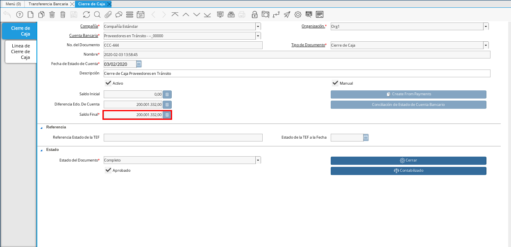
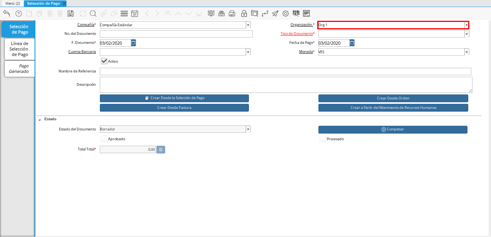
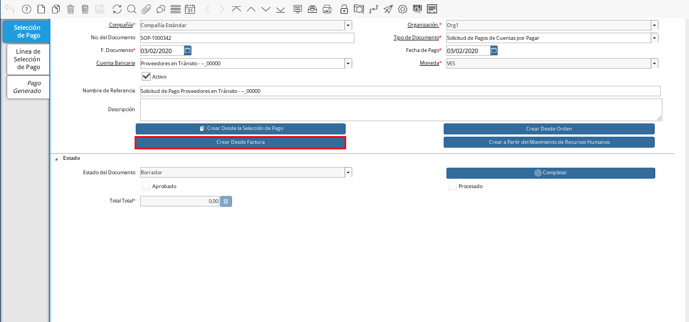
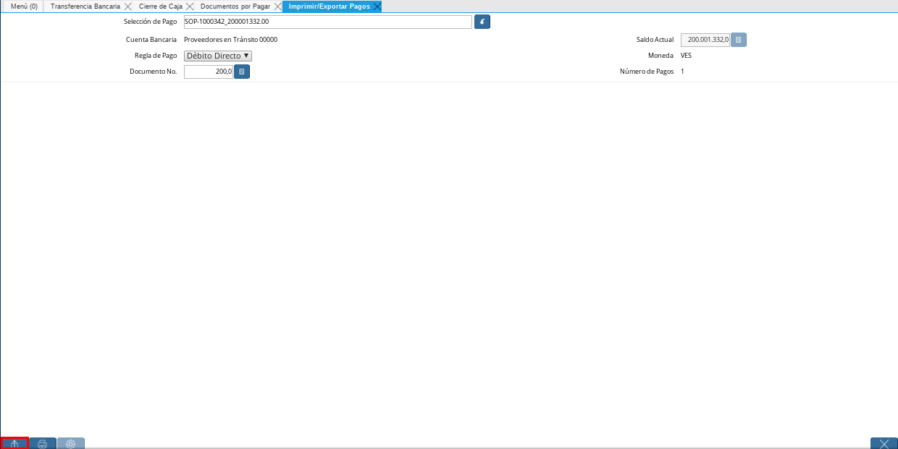
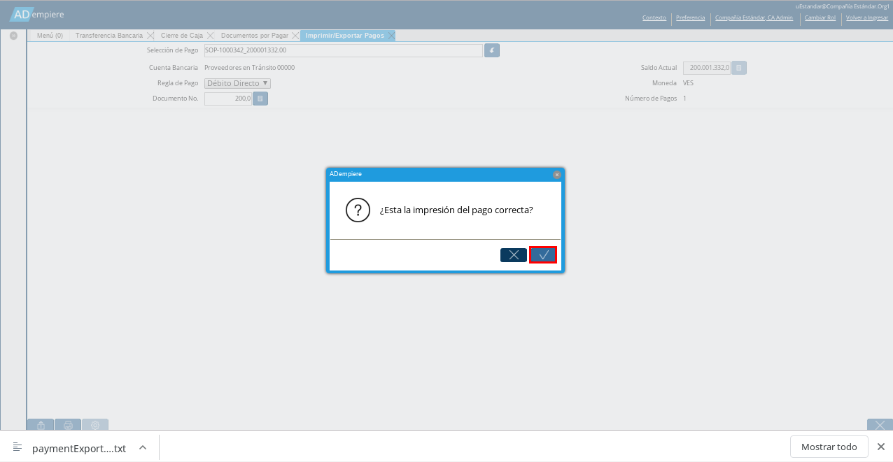

.. |Menú de ADempiere 1| image:: resources/menutransf.png
.. |Transferencia Bancaria| image:: resources/transferencia2.png

.. |Menú de ADempiere 2| image:: resources/menucierre1.png

.. |Menú de ADempiere 3| image:: resources/menufactura.png
.. |Documento por Pagar 1| image:: resources/docpagar1.png

.. |Icono Registro Nuevo| image:: resources/nuevasoli.png

.. |Campo Cuenta Bancaria| image:: resources/cuentab1.png

.. |Icono Guardar Cambios| image:: resources/iconoguardar1.png

.. |Opción Comenzar Búsqueda| image:: resources/vent3.png

.. |Opción Completar 1| image:: resources/completar5.png
.. |Acción Completar y Opción OK| image:: resources/acción1.png

.. |Campo Selección de Pago| image: resources/selecpagos2.png

.. |Mensaje de Confirmación| image:: resources/confirmacion1.png

.. _documento/anticipo-a-proveedores-en-transito:

Anticipo a Proveedores en Tránsito
==================================

Un anticipo a proveedor es el pago de una parte o un porcentaje del monto total de una compra o venta, realizado por adelantado. El mismo tiene la finalidad de asegurar los productos o servicios que el comprador requiere y por los cuales el vendedor amerita un anticipo para cubrir diferentes gastos.

En ADempiere es posible reflejar los anticipos realizados a proveedores en tránsito, permitiendo por medio de este, el control de los saldos abiertos que tienen los proveedores.

.. _paso/transferencia-anticipo-transito:

Transferencia Bancaria
----------------------

#. Ubique y seleccione en el menú de ADempiere, la carpeta "**Gestión de Saldos Pendientes**", luego seleccione el proceso "**Transferencia Bancaria**".

    |Menú de ADempiere 1|

    Imagen 1. Menú de ADempiere

#. Realice el procedimiento regular de transferencia bancaria explicado en la :ref:`paso/carga-anticipo` del documento "**Liquidación Anticipo Intermediario**", para transferir desde un banco determinado de la empresa a la caja del proveedor en tránsito al cual se le aplicará el anticipo.

    #. Para realizar el procedimiento se debe tomar en cuenta lo siguiente:

        - **Cuenta Bancaria Desde**: 0105-0000000000000000

        - **Cuenta Bancaria a Transferir**: Proveedores en Tránsito - --_00000

        - **Socio del Negocio**: Proveedor Estándar

        - **Moneda**: VES

        - **Cargo**: Anticipo Tercero

        - **No. del Documento**: 0111245859

        - **Documento Destino**: 0111245859

        - **Monto**: 200.001.332,00

        - **Descripción**: Transferencia de Anticipo a Proveedor en Tránsito

        - **Fecha de Estado de Cuenta**: 03/01/2020

        - **Fecha Contable**: 03/01/2020

    #. Quedando la ventana del proceso "**Transferencia Bancaria**", de la siguiente manera:

        |Transferencia Bancaria|

        Imagen 2. Transferencia Bancaria

    #. Al seleccionar la opción "**OK**, ADempiere realiza la transferencia en base a los datos ingresados en los campos de la ventana, generando un documento en "**Pago/Cobro**" que representa el egreso en el banco seleccionado y un documento en "**Caja**" que representa el ingreso en la caja seleccionada.

        #. **Egreso**:

            - **Resultado**: Se realiza un egreso en banco por el monto a cancelar.

                |Documento Pago Cobro|

                Imagen 3. Documento en Pago/Cobro

            - **Resultado Contable**: A continuación se presenta un ejemplo de un resultado contable.

                +--------------+------------------------------------------------------------+----------------------+-----------------------+
                | Organización |                         Cuenta                             | Débito Contabilizado | Crédito Contabilizado |
                +==============+============================================================+======================+=======================+
                | Organización |1.1.1.1.1.015 - EFECTIVO EN TRANSITO PROVEEDORES            |        200.001.332,00|                   0,00|
                +--------------+------------------------------------------------------------+----------------------+-----------------------+
                | Organización |1.1.1.1.2.1.005.002 - TRANSITO MERCANTIL C.A. BANCO         |                  0,00|         200.001.332,00|
                +--------------+------------------------------------------------------------+----------------------+-----------------------+
                |              |                                                            |        200.001.332,00|         200.001.332,00|
                +--------------+------------------------------------------------------------+----------------------+-----------------------+

        #. **Ingreso**:

            - **Resultado**: Se realiza un ingreso en caja por el monto a cancelar.

                |Documento Caja|

                Imagen 4. Documento en Caja

            - **Resultado Contable**: A continuación se presenta un ejemplo de un resultado contable.

                +--------------+------------------------------------------------------------+----------------------+-----------------------+
                | Organización |                         Cuenta                             | Débito Contabilizado | Crédito Contabilizado |
                +==============+============================================================+======================+=======================+
                | Organización |1.1.2.2.001 - ANTICIPOS A PROVEEDORES NACIONALES            |        200.001.332,00|                   0,00|
                +--------------+------------------------------------------------------------+----------------------+-----------------------+
                | Organización |1.1.1.1.1.015 - EFECTIVO EN TRANSITO PROVEEDORES            |                  0,00|         200.001.332,00|
                +--------------+------------------------------------------------------------+----------------------+-----------------------+
                |              |                                                            |        200.001.332,00|         200.001.332,00|
                +--------------+------------------------------------------------------------+----------------------+-----------------------+

.. _paso/cierre-caja-anticipo-transito:

Cierre de Caja
**************

El cierre de caja es realizado para indicar a ADempiere que al socio del negocio "**Proveedor Estándar**", se le realizó una transferencia bancaria como anticipo a su caja "**Proveedores en Tránsito - --_00000**", por el monto de "**200.001.332,00**".

#. Ubique y seleccione en el menú de ADempiere, la carpeta "**Gestión de Saldos Pendientes**", luego seleccione la carpeta "**Diario de Caja**", por último seleccione la ventana "**Cierre de Caja**".

    |Menú de ADempiere 2|

    Imagen 5. Menú de ADempiere

#. Realice el procedimiento regular para generar el cierre de caja, explicado en la :ref:`paso/cierre-caja-importación` del documento "**Importación**", seleccionando la caja proveedores en transito creada. Luego de completar el procedimiento podrá apreciar en el campo "**Saldo Final**", el saldo abierto que posee el socio del negocio proveedor.

    |Cierre de Caja|

    Imagen 6. Cierre de Caja

.. _paso/carga-factura-anticipo-transito:

Carga de Facturas
-----------------

#. Ubique y seleccione en el menú de ADempiere, la carpeta "**Gestión de Compras**", luego seleccione la ventana "**Documentos por Pagar**".

    |Menú de ADempiere 3|

    Imagen 7. Menú de ADempiere

#. Realice el procedimiento regular para generar un documento por pagar explicado en el material :ref:`documento/documento-por-pagar`, utilizando el cargo "**Transporte de Personal**".

    |Documento por Pagar 1|

    Imagen 8. Documento por Pagar

.. note::

    El cargo de la factura puede variar dependiendo del gasto con el cual se justifica el anticipo.

#. El asiento contable del documento por pagar realizado quedaría de la siguiente manera:

    +--------------+------------------------------------------------------------+----------------------+-----------------------+
    | Organización |                         Cuenta                             | Débito Contabilizado | Crédito Contabilizado |
    +==============+============================================================+======================+=======================+
    | Organización |6.1.1.1.2.006 - CUENTA DE GASTO O COSTO                     |        200.001.332,00|                   0,00|
    +--------------+------------------------------------------------------------+----------------------+-----------------------+
    | Organización |2.1.1.1.1.001 - CUENTAS POR PAGAR PROVEEDORES NACIONALES    |                  0,00|         200.001.332,00|
    +--------------+------------------------------------------------------------+----------------------+-----------------------+
    |              |                                                            |        200.001.332,00|         200.001.332,00|
    +--------------+------------------------------------------------------------+----------------------+-----------------------+
    

.. _paso/solicitud-pago-anticipo-transito:

Solicitud de Pago
-----------------

#. Ubique y seleccione en el menú de ADempiere, la carpeta "**Gestión de Saldos Pendientes**", por último seleccione la ventana "**Selección de Pago**".

    |Menú de ADempiere 4|

    Imagen 9. Menú de ADempiere

#. Podrá visualizar la ventana "**Selección de Pago**", donde debe seleccionar el icono "**Registro Nuevo**" para crear una solicitud de pago en ADempiere.

    |Icono Registro Nuevo|

    Imagen 10. Icono Registro Nuevo

#. Seleccione en el campo "**Organización**", la organización para la cual esta realizando el documento "**Solicitud de Pago**".

    |Campo Organización|
    
    Imagen 11. Campo Organización

#. Seleccione el tipo de documento a generar en el campo "**Tipo de Documento**", la selección de este define el comportamiento del documento que se esta elaborando, dicho comportamiento se encuentra explicado en el documento :ref:`documento/tipo-documento` elaborado por ERPyA. Para ejemplificar el registro es utilizada la opción "**Solicitud de Pagos de Cuentas por Pagar**". 

    |Campo Tipo de Documento|

    Imagen 12. Campo Tipo de Documento 

#. Seleccione en el campo "**Cuenta Bancaria**", la cuenta caja creada al socio del negocio proveedor en tránsito al cual se le realizó la transferencia bancaria.

    |Campo Cuenta Bancaria|
    
    Imagen 13. Campo Cuenta Bancaria

#. Introduzca en el campo "**Nombre de Referencia**", una breve descripción de la solicitud de pago que esta realizando.

    |Campo Nombre de Referencia|

    Imagen 14. Campo Nombre de Referencia

#. Seleccione el icono "**Guardar Cambios**", para guardar el registro de los campos en la ventana.

    |Icono Guardar Cambios|

    Imagen 15. Icono Guardar Cambios 

#. Seleccione el proceso "**Crear Desde Factura**", para crear la solicitud de pago desde el documento por pagar.

    |Crear Desde Factura|

    Imagen 14. Proceso Crear Desde Factura

    #. Podrá visualizar la ventana del proceso "**Crear Desde Factura**", donde debe seleccionar la opción "**Comenzar Búsqueda**" para buscar los registros de documentos por pagar.

        |Opción Comenzar Búsqueda|

        Imagen 15. Opción Comenzar Búsqueda

    #. Seleccione el documento por pagar y la opción "**OK**" para cargar los datos del documento seleccionado a la ventana "**Selección de Pago**".

        |Selección de Factura y Opción OK|

        Imagen 16. Selección de Factura y Opción OK

    .. note:: 

        Recuerde seleccionar el icono "**Refrescar**" para actualizar la ventana y se pueda visualizar el registro creado desde el proceso "**Crear Desde Factura**".

#. Seleccione la opción "**Completar**" ubicado en la parte inferior derecha del documento.

    |Opción Completar 1|

    Imagen 17. Opción Completar

    #. Seleccione la acción "**Completar**" y la opción "**OK**" para completar el documento "**Solicitud de Pago**".

        |Acción Completar y Opción OK|

        Imagen 18. Acción Completar y Opción OK

.. _paso/cancelacion-factura-anticipo-transito:

Cancelación de Factura
----------------------

.. _paso/imprimir-exportar-anticipo-transito:

Imprimir/Exportar Pagos
***********************

#. Ubique y seleccione en el menú de ADempiere, la carpeta "**Gestión de Saldos Pendientes**", por último seleccione la ventana "**Imprimir/Exportar Pagos**".

    |Menú de ADempiere 5|

    Imagen 12. Menú de ADempiere

#. Seleccione en el campo "**Selección de Pago**", la solicitud de pago "**SOP-1000342**" realizada anteriormente.

    |Campo Selección de Pago|

    Imagen 13. Campo Selección de Pago

#. Seleccione la opción "**Imprimir**" si la regla de pago corresponde a "**Cheque**", de lo contrario debe seleccionar la opción "**Exportar Registros**" para que sea generado el documento en formato "**.txt**". Para ejemplificar el registro es utilizada la opción "**Exportar Registros**".

    |Opción Exportar Registros|

    Imagen 15. Opción Exportar Registros

    .. note:: 

        El documento generado por ADempiere en formato "**.txt**" es utilizado por el usuario para importarlo al banco correspondiente. 

#. Podrá visualizar el siguiente mensaje de confirmación donde debe seleccionar la opción "**OK**".

    |Mensaje de Confirmación|

    Imagen 16. Mensaje de Confirmación

#. Luego de revisar el documento generado en formato "**.txt**", puede seleccionar la opción "**OK**" en el mensaje.

    |Mensaje para Confirmar Documento|

    Imagen 17. Mensaje para Confirmar Documento

.. _paso/cierre-caja-anticipo-transito:

Cierre de Caja
**************

#. Ubique y seleccione en el menú de ADempiere, la carpeta "**Gestión de Saldos Pendientes**", luego seleccione la carpeta "**Diario de Caja**", por último seleccione la ventana "**Cierre de Caja**".

    |Menú de ADempiere 2|

    Imagen 5. Menú de ADempiere

#. Realice el procedimiento regular para generar el cierre de caja, explicado en la :ref:`paso/cierre-caja-importación` del documento "**Importación**", seleccionando la caja proveedores en transito creada. Luego de completar el procedimiento podrá apreciar en el campo "**Saldo Final**", el saldo abierto que posee el socio del negocio proveedor.

    |Cierre de Caja 2|

    Imagen 6. Cierre de Caja
