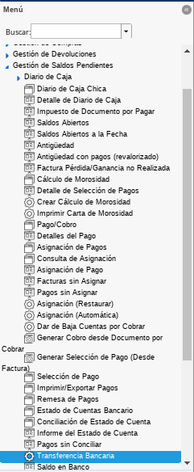
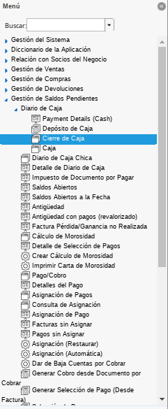
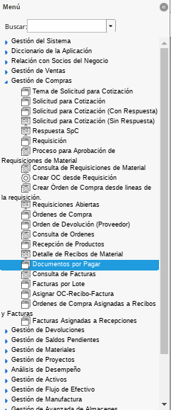
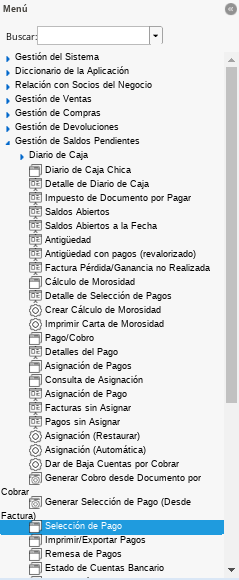
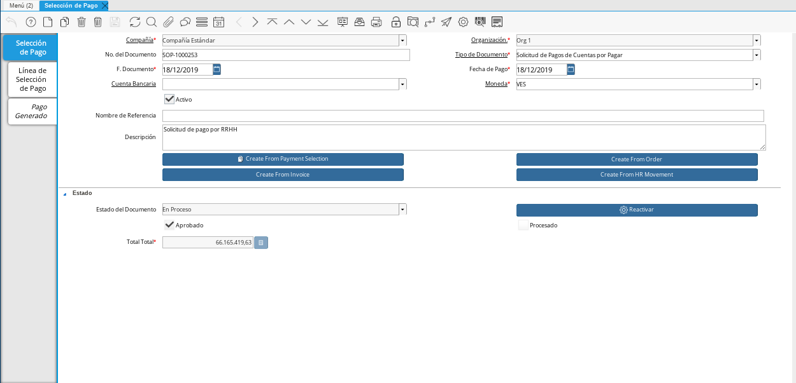
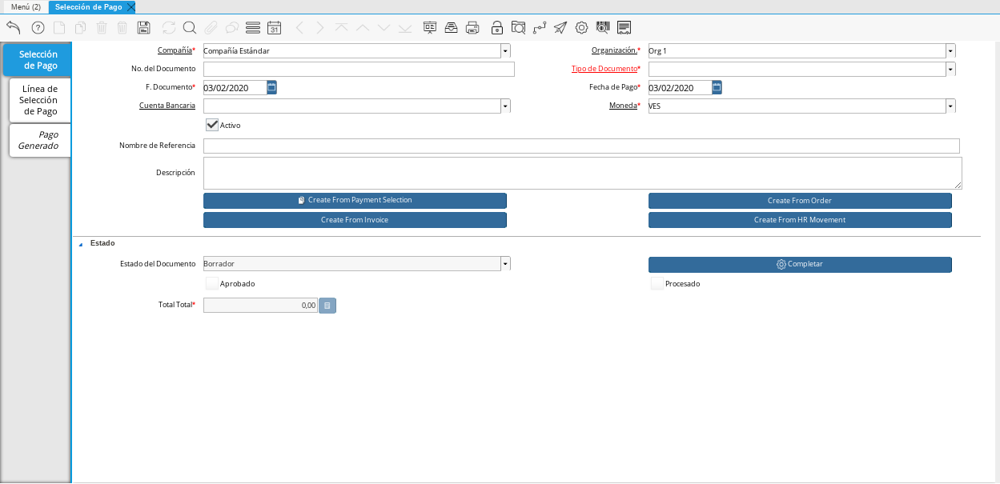
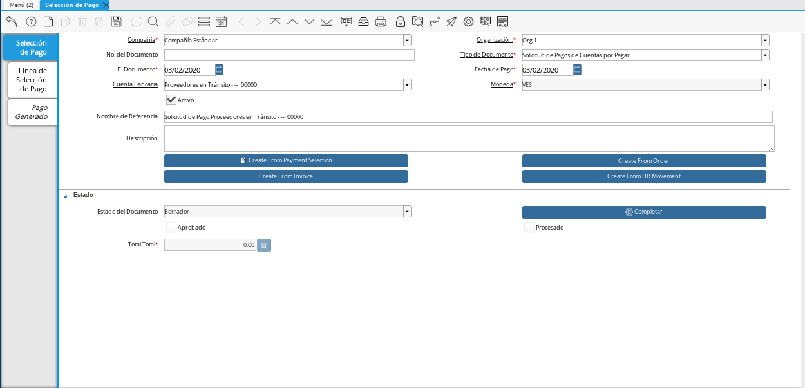

.. _documento/anticipo-a-proveedores-en-transito:

.. |Transferencia Bancaria| image:: resources/
.. |Documento Pago Cobro| image:: resources/
.. |Documento Caja| image:: resources/

.. |Cierre de Caja| image:: resources/

.. |Documento por Pagar 1| image:: resources/

.. 

.. _paso/transferencia-anticipo-transito:

Transferencia Bancaria
======================

#. Ubique y seleccione en el menú de ADempiere, la carpeta "**Gestión de Saldos Pendientes**", luego seleccione el proceso "**Transferencia Bancaria**".

    |Menú de ADempiere 1|

    Imagen 1. Menú de ADempiere

#. Realice el procedimiento regular de transferencia bancaria explicado en la :ref:`paso/carga-anticipo` del documento "**Liquidación Anticipo Intermediario**", para transferir desde un banco determinado de la empresa a la caja del proveedor en tránsito al cual se le aplicará el anticipo.

    #. Para realizar el procedimiento se debe tomar en cuenta lo siguiente:

        - **Banco Desde**: 0105-0000000000000000

        - **Cuenta Bancaria a Transferir**: Proveedores en Tránsito - --_00000

        - **Socio del Negocio**: Proveedor Estándar

        - **Moneda**: VES

        - **Cargo**: Anticipo a Tercero

        - **No. del Documento**: 0111245859

        - **Documento Destino**: 0111245859

        - **Monto**: 200.001.332,00

        - **Descripción**: Transferencia de Anticipo a Proveedor en Tránsito

        - **Fecha de Estado de Cuenta**: 03/01/2020

        - **Fecha Contable**: 03/01/2020

    #. Quedando la ventana del proceso "**Transferencia Bancaria**", de la siguiente manera:

        |Transferencia Bancaria|

        Imagen 2. Transferencia Bancaria

    #. Al seleccionar la opción "**OK**, ADempiere realiza la transferencia en base a los datos ingresados en los campos de la ventana, generando un documento en "**Pago/Cobro**" que representa el egreso en el banco seleccionado y un documento en "**Caja**" que representa el ingreso en la caja seleccionada.

        #. **Egreso**:

            - **Resultado**: Se realiza un egreso en banco por el monto a cancelar.

                |Documento Pago Cobro|

                Imagen 3. Documento en Pago/Cobro

            - **Resultado Contable**: A continuación se presenta un ejemplo de un resultado contable.

                +--------------+------------------------------------------------------------+----------------------+-----------------------+
                | Organización |                         Cuenta                             | Débito Contabilizado | Crédito Contabilizado |
                +==============+============================================================+======================+=======================+
                | Organización |1.1.1.1.1.015 - EFECTIVO EN TRANSITO PROVEEDORES            |        200.001.332,00|                   0,00|
                +--------------+------------------------------------------------------------+----------------------+-----------------------+
                | Organización |1.1.1.1.2.1.005.002 - TRANSITO MERCANTIL C.A. BANCO         |                  0,00|         200.001.332,00|
                +--------------+------------------------------------------------------------+----------------------+-----------------------+
                |              |                                                            |        200.001.332,00|         200.001.332,00|
                +--------------+------------------------------------------------------------+----------------------+-----------------------+

        #. **Ingreso**:

            - **Resultado**: Se realiza un ingreso en caja por el monto a cancelar.

                |Documento Caja|

                Imagen 4. Documento en Caja

            - **Resultado Contable**: A continuación se presenta un ejemplo de un resultado contable.

                +--------------+------------------------------------------------------------+----------------------+-----------------------+
                | Organización |                         Cuenta                             | Débito Contabilizado | Crédito Contabilizado |
                +==============+============================================================+======================+=======================+
                | Organización |1.1.2.2.001 - ANTICIPOS A PROVEEDORES NACIONALES            |        200.001.332,00|                   0,00|
                +--------------+------------------------------------------------------------+----------------------+-----------------------+
                | Organización |1.1.1.1.1.015 - EFECTIVO EN TRANSITO PROVEEDORES            |                  0,00|         200.001.332,00|
                +--------------+------------------------------------------------------------+----------------------+-----------------------+
                |              |                                                            |        200.001.332,00|         200.001.332,00|
                +--------------+------------------------------------------------------------+----------------------+-----------------------+

.. _paso/cierre-caja-anticipo-transito:

Cierre de Caja
**************

El cierre de caja es realizado para indicar a ADempiere que al socio del negocio "**Proveedor Estándar**", se le realizó una transferencia bancaria como anticipo a su caja "**Proveedores en Tránsito - --_00000**", por el monto de "**200.001.332,00**".

#. Ubique y seleccione en el menú de ADempiere, la carpeta "**Gestión de Saldos Pendientes**", luego seleccione la carpeta "**Diario de Caja**", por último seleccione la ventana "**Cierre de Caja**".

    |Menú de ADempiere 2|

    Imagen 5. Menú de ADempiere

#. Realice el procedimiento regular para generar el cierre de caja, explicado en la :ref:`paso/cierre-caja-importación` del documento "**Importación**", seleccionando la caja proveedores en transito creada. Luego de completar el procedimiento podrá apreciar en el campo "**Saldo Final**", el saldo abierto que posee el socio del negocio proveedor.

    |Cierre de Caja|

    Imagen 6. Cierre de Caja

.. _paso/carga-factura-anticipo-transito:

Carga de Facturas
=================

#. Ubique y seleccione en el menú de ADempiere, la carpeta "**Gestión de Compras**", luego seleccione la ventana "**Documentos por Pagar**".

    |Menú de ADempiere 3|

    Imagen 7. Menú de ADempiere

#. Realice el procedimiento regular para generar un documento por pagar explicado en el material :ref:`documento/documento-por-pagar`, utilizando el cargo "**Transporte**".

    |Documento por Pagar 1|

    Imagen 8. Documento por Pagar

.. note::

    El cargo de la factura puede variar dependiendo del gasto con el cual se justifica el anticipo.

#. El asiento contable del documento por pagar realizado quedaría de la siguiente manera:

    +--------------+------------------------------------------------------------+----------------------+-----------------------+
    | Organización |                         Cuenta                             | Débito Contabilizado | Crédito Contabilizado |
    +==============+============================================================+======================+=======================+
    | Organización |6.1.1.1.2.006 - CUENTA DE GASTO O COSTO                     |        200.001.332,00|                   0,00|
    +--------------+------------------------------------------------------------+----------------------+-----------------------+
    | Organización |2.1.1.1.1.001 - CUENTAS POR PAGAR PROVEEDORES NACIONALES    |                  0,00|         200.001.332,00|
    +--------------+------------------------------------------------------------+----------------------+-----------------------+
    |              |                                                            |        200.001.332,00|         200.001.332,00|
    +--------------+------------------------------------------------------------+----------------------+-----------------------+
    

.. _paso/solicitud-pago-anticipo-transito:

Solicitud de Pago
=================

#. Ubique y seleccione en el menú de ADempiere, la carpeta "**Gestión de Saldos Pendientes**", por último seleccione la ventana "**Selección de Pago**".

    |Menú de ADempiere 4|

    Imagen 9. Menú de ADempiere

#. Podrá visualiazar la ventana "**Selección de Pago**", donde debe seleccionar el icono "**Registro Nuevo**" para crear una solicitud de pago en ADempiere.

    |Icono Registro Nuevo|

    Imagen 10. Icono Registro Nuevo

#. Seleccione en el campo "**Organización**", la organización para la cual esta realizando el documento "**Solicitud de Pago**".

    |Campo Organización|
    
    Imagen 11. Campo Organización

#. Seleccione el tipo de documento a generar en el campo "**Tipo de Documento**", la selección de este define el comportamiento del documento que se esta elaborando, dicho comportamiento se encuentra explicado en el documento :ref:`documento/tipo-documento` elaborado por ERPyA. Para ejemplificar el registro es utilizada la opción "**Solicitud de Pagos de Cuentas por Pagar**". 

    |Campo Tipo de Documento|

    Imagen 12. Campo Tipo de Documento 

#. Seleccione en el campo "**Cuenta Bancaria**", la cuenta caja creada al socio del negocio proveedor en tránsito al cual se le realizó la transferencia bancaria.

    |Campo Cuenta Bancaria|
    
    Imagen 13. Campo Cuenta Bancaria

#. Introduzca en el campo "**Nombre de Referencia**", una breve descripción de la solicitud de pago que esta realizando.

    |Campo Nombre de Referencia|

    Imagen 14. Campo Nombre de Referencia

#. 

.. _paso/seleccion-pago-anticipo-transito:

Selección de Pago
=================

.. _paso/cancelacion-factura-anticipo-transito:

Cancelación de Factura
======================

.. _paso/imprimir-exportar-anticipo-transito:

Imprimir/Exportar Pagos
***********************

.. _paso/cierre-caja-anticipo-transito:

Cierre de Caja
**************