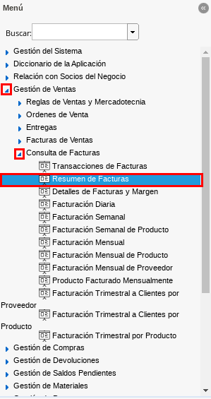
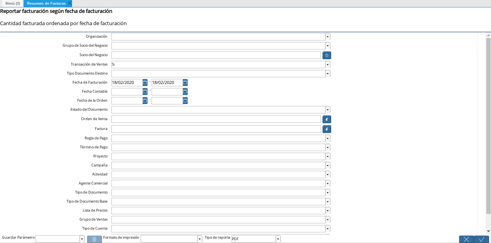
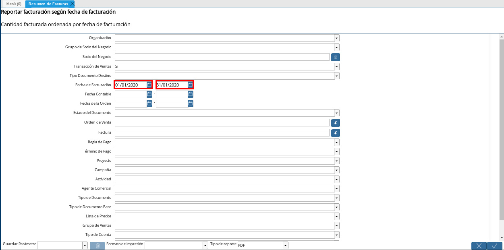
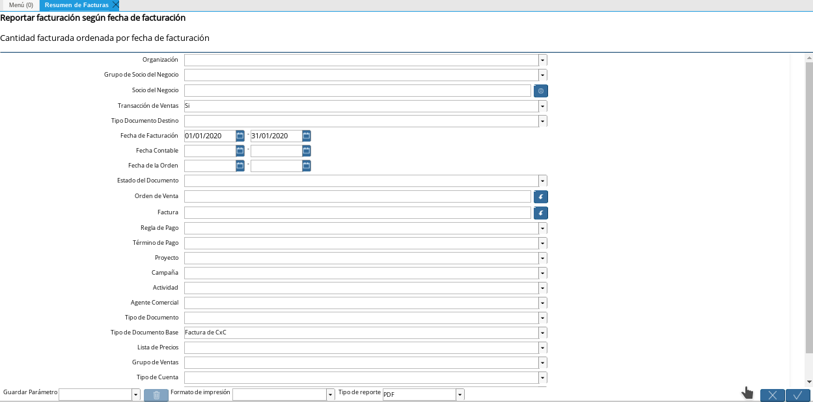
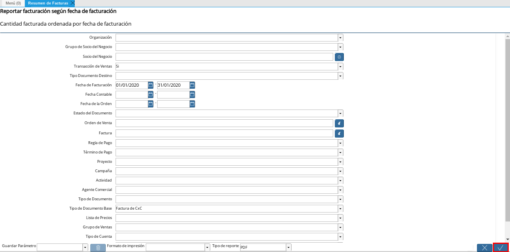
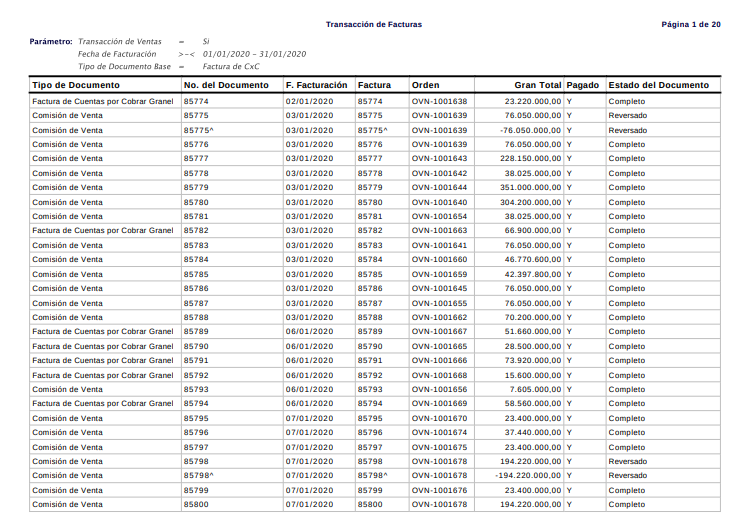

.. _documento/reporte-ventas-brutas:

Generar Reporte
===============

#. Ubique y seleccione en el menú de ADempiere, la carpeta "**Gestión de Ventas**", luego seleccione la carpeta "**Consulta de Facturas**", por último seleccione el reporte "**Resumen de Facturas**".

    |Menú de ADempiere 1|

    Imagen 1. Menú de ADempiere

    #. Podrá visualizar la ventana del proceso "**Resumen de Facturas**", el mismo contempla diferentes campos que pueden ser utilizados a criterio del usuario para filtrar la búsqueda en base a lo indicado en dichos campos.

        |Ventana del Proceso Resumen de Facturas 2|

        Imagen 2. Ventana del Proceso Resumen de Facturas

    #. Para generar un reporte de las ventas brutas de la organización, seleccione en el campo "**Fecha de Facturación**" la fecha de inicio y fecha final del rango para el generar el reporte en base al tiempo indicado en las mismas.

        |Campo Fecha de Facturación 1|

        Imagen 3. Campo Fecha de Facturación

    #. Seleccione en el campo "**Tipo de Documento Base**", el tipo de documento base que compete a las ventas de la organización para generar el reporte en base a todos los tipos de documentos asociados al mismo.

        |Campo Tipo de Documento Base 1|

        Imagen 4. Campo Tipo de Documento Base

    #. Luego de seleccionar los diferentes criterios de búsqueda que el usuario requiera, debe seleccionar la opción "**OK**" que se encuentra en la parte inferior derecha de la ventana.

        |Opción OK 1|

        Imagen 5. Opción OK

    #. Podrá visualizar el reporte de la siguiente manera.

        |Resultado del Reporte 1|

        Imagen 6. Reporte de Ventas Brutas

