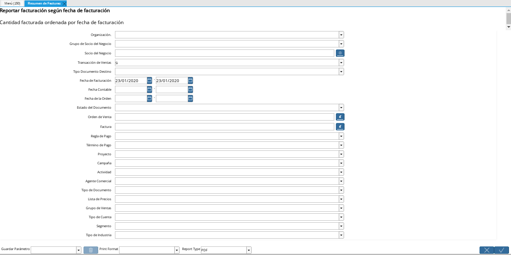

==================================================================================
Generar Reporte de Ventas Brutas desde el Proceso Resumen de Facturas de ADempiere
==================================================================================

ADempiere contiene diversas funcionalidades que ayudan a la compañía en cuanto al fujo de trabajo de las diferentes organizaciones, entre ellas se encuentran los procesos que permiten generar reportes según lo requerido por la organización. 

El proceso para generar reportes de resumen de facturas permite generar múltiples reportes de cuentas por cobrar y cuentas por pagar, el mismo consiste en filtrar la búsqueda por los campos que sean seleccionados en la ventana "**Resumen de Facturas**". Dicha selección de campos queda a criterio del usuario, según la necesidad o requerimiento del mismo al momento de generar el reporte.  

La ventana "**Resumen de Facturas**" cuenta con 23 campos que ofrecen al usuario diferentes opciones para generar los reportes de los documentos que contengan similitud con los campos seleccionados en la misma.

    |Ventana Resumen de Facturas 1|

    Imagen 1. Ventana Resumen de Facturas

De acuerdo al requerimiento del cliente, ERPyA realizó la configuración necesaria para que el mismo pueda generar un reporte de ventas brutas según el tipo de documento base que seleccione, para que pueda visualizar el total de los ingresos provenientes de las ventas en un rango o período de tiempo determinado.

Para generar el reporte de ventas brutas en ADempiere los campos o filtros principales son "**Fecha de Facturación**", que es el rango o período de tiempo que ADempiere tomará en cuenta para filtar la información y "**Tipo de Documento Base**", que es el documento base por el cual se rigen los diferentes tipos de documentos asociados a el, para generar según el comportamiento de cada uno, las acciones en los documentos de ADempiere. El comportamiento de los tipos de documentos se encuentra explicado en el material :ref:`Tipo de Documento` elaborado por ERPyA.

El tipo de documento base "**Factura de CxC**" tiene asociado a todos los tipos de documentos referentes a cuentas por cobrar que posee ADempiere, sin incluir los diferentes tipos de documentos de "**Nota de Crédito**" de cuentas por cobrar, ya que esos se encuentran asociados al tipo de documento base "**Nota de Crédito de CxC**". 

A continuación, se explica el procedimiento para generar un reporte de ventas brutas en ADempiere.

.. toctree::
    :maxdepth: 3

    gross-sales-report
