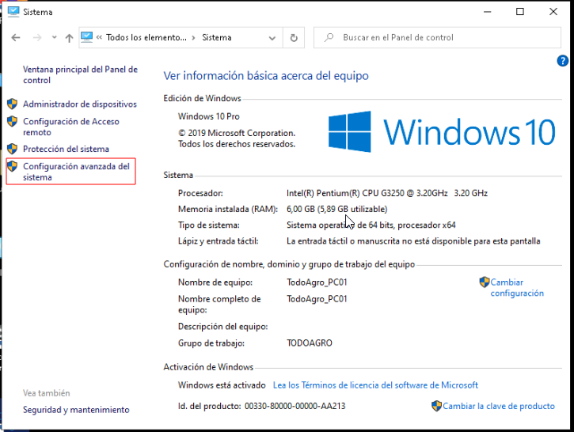
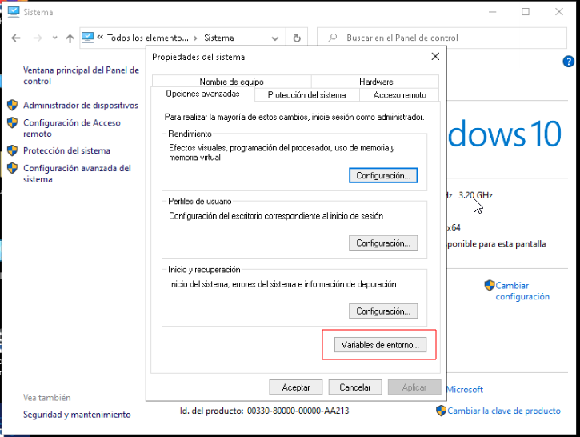
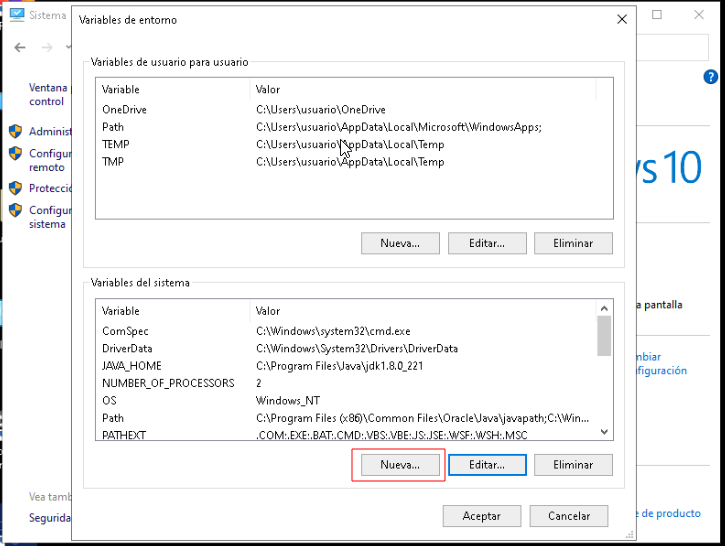
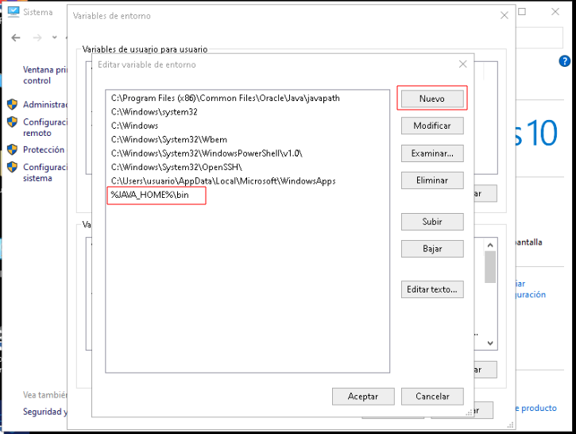

.. |Panel de Control| image:: resorces/control-panel.png

 
.. _documento/agregar-java-8-al-path:
 
**Añadir Java 8 a las Variables de Entorno**
============================================
 
 
A continuación se indica cómo configurar las variables JAVA_HOME y Path. Requerimientos para Añadir Java 8 a las Variables de Entorno:
 
 
 
**Software**:
 
  - Instalar el JDK de JAVA 8 y conocer la ruta de instalación, Ej: "C:\Program Files\Java\jdk1.8.0_221\bin"
 
 
**Procedimiento**:
 
 
**Configurar la variable JAVA_HOME**
 
Configurar la variable JAVA_HOME, es una variable de entorno del sistema que informa al sistema operativo sobre la ruta donde se encuentra instalado Java.
 
 
Seguiremos la siguiente secuencia de pasos para configurar esta variable:
 
  - Abrir Panel de Control
 
          |Panel de Control|
 
           Imagen 1. Ventana Panel de Control
 
  - Ingresar en Sistema
 
           |Ventana Sistema|
 
           Imagen 2. Ventana Sistema
 
  - Ingresar Configuración avanzada del sistema
 
          |Ventana propiedades Sistema|
 
           Imagen 3. Ventana Propiedades Sistema
 
  - Variables de entorno
 
          |Variables de Entorno|
 
           Imagen 4. Variables de Entorno
 
  - Hacer click en Nueva (Variables del sistema).
 
          |Añadir Variable|
 
           Imagen 5. Ventana Añadir Variable
 
 
Escribiremos en las cajas de texto que se muestran lo siguiente:
 
- Nombre de variable: JAVA_HOME C:\Program Files\Java\jdk1.8.0_221
 
- Valor de variable: escribiremos aquí la ruta en que se haya instalado Java.
 
 
 
**Configurar la variable PATH**
 
Agregar JAVA_HOME a la variable PATH, esta variable de entorno del sistema informa al sistema operativo sobre la ruta de distintos directorios esenciales para el funcionamiento del ordenador. Vamos a añadir al contenido de la variable PATH el lugar donde se encuentran los ficheros ejecutables de Java necesarios para su ejecución, como el compilador (javac.exe) y el intérprete (java.exe).
 
Seguiremos la siguiente secuencia de pasos para configurar esta variable:
 
Seguiremos la siguiente secuencia de pasos para configurar esta variable:
 
  - Abrir Panel de Control
 
          |Panel de Control|
 
           Imagen 1. Ventana Panel de Control
 
  - Ingresar en Sistema
 
           |Ventana Sistema|
 
           Imagen 2. Ventana Sistema
 
  - Ingresar Configuración avanzada del sistema
 
          |Ventana propiedades Sistema|
 
           Imagen 3. Ventana Propiedades Sistema
 
  - Variables de entorno
 
          |Variables de Entorno|
 
           Imagen 4. Variables de Entorno
 
  - Hacer click en Nueva (Variables del sistema).
 
          |Añadir Variable|
 
           Imagen 5. Ventana Añadir Variable
 
 
Una vez concluido nos quedará similar a esto:
 
Nombre de variable: PATH
 
Valor de variable: C:\WINDOWS;C:\WINDOWS\system32;%JAVA_HOME%\bin

