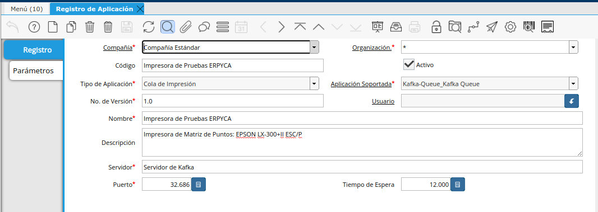
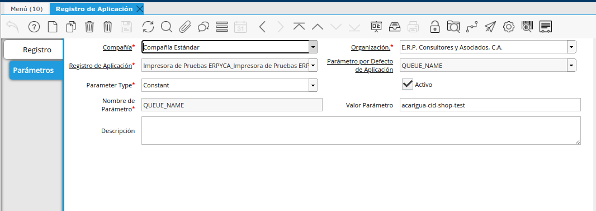
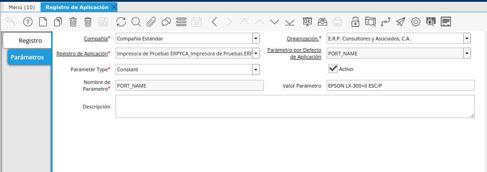
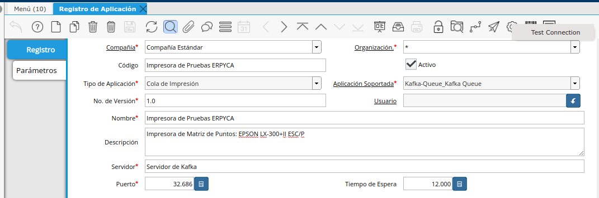
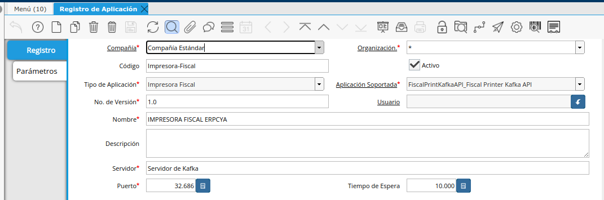
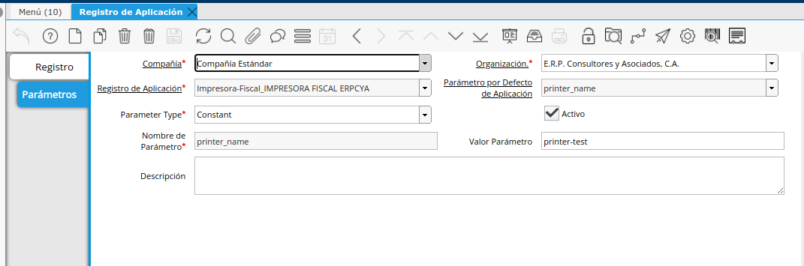
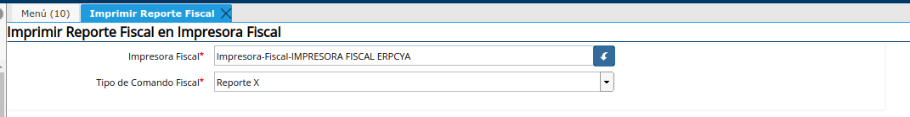

.. _documento/adempiere-config-local-printing-all-in-one:

Configuración Cliente de Impresión Todo en Uno (Local-Printing-All-In-One-DotNet) en ADempiere
==============================================================================================

En ADempiere la Configuración se realiza en la ventana Registro de Aplicación, la configuracion a emplear dependera del uso final de la aplicacion ya que puede controlar a impresoras fiscales de The Factory HKA y Imprimir PDF.

Configurar la aplicación para Imprimir PDF(Documentos) desde ADempiere
----------------------------------------------------------------------

1. Dirijase a la ventana registros de apliacion y cree un nuevo registro llenando los siguientes campos.

|Registro de Aplicación|

- **Código**: Codigo Descriptivo para identificar la impresora
- **Tipo de Aplicación**:   Cola de Impresión
- **Aplicación Soportada**: Kafka-Queue_Kafka Queue
- **Nombre**: Nombre Descriptivo para identificar la impresora
- **Descripción**: En esta seccion se puede Decribir la impresora o la ubicación de la misma para un mejor referencia para identificarla
- **Servidor**: Dominio o Dirección IP donde se encuentra ejecutandose el servicio de cola de Kafka.
- **Puerto**: Puerto por el cual responde el servicio de cola de Kafka.

2. Una vez llenos los campos anteriores se debe ingresar en la pestaña paramteros, alli deben estar 2 registros PORT_NAME y QUEUE_NAME

- **PORT_NAME**: Corresponde al nombre por el cual se va a identificar la impresora dentro de la cola de impresión, se puede colocar el departamento o el nombre que tiene la impresora  en windows

|Nombre de Impresora|

- **QUEUE_NAME**: Corresponde al Nombre de la cola de impresión.

|Nombre de Impresora|

3. Prueba de impresión:

Este paso es importante, debido a que en este punto es donde se crea la cola de impresión, para que ADempiere envie los Documentos y el Cliente de Impresión Todo en Uno los reciba y los envie a la impresora, cuande es ejecute el proceso Test Conection inmediatamente se enviara a la cola de impresion un documento aleatorio desde ADempiere (Es recomendable hacer esto antes de iniciar la configuracion en Windows de la aplicación).

|Prueba de Impresión|

Configurar la aplicación para controlar una impresora Fiscal
------------------------------------------------------------

1. Dirijase a la ventana registros de apliacion y cree un nuevo registro llenando los siguientes campos.

|Registro de Aplicación Impresora Fiscal|

- **Código**: Codigo Descriptivo para identificar la impresora
- **Tipo de Aplicación**: Impresora Fiscal
- **Aplicación Soportada**: FiscalPrintKafkaAPI_Fiscal Printer Kafka API
- **Nombre**: Nombre Descriptivo para identificar la impresora
- **Descripción**: En esta seccion se puede Decribir la impresora o la ubicación de la misma para un mejor referencia para identificarla
- **Servidor**: Dominio o Dirección IP donde se encuentra ejecutandose el servicio de cola de Kafka.
- **Puerto**: Puerto por el cual responde el servicio de cola de Kafka.

2. Una vez llenos los campos anteriores se debe ingresar en la pestaña paramteros, alli deben estar 2 registros PORT_NAME y QUEUE_NAME

- **printer_name**: Corresponde al nombre por el cual se va a identificar la impresora dentro de la cola de impresión.

|Nombre de cola de Impresión Impresora Fiscal|

- **port_name**: Corresponde al Puerto COM al que se encuentra conectado la impresora.

|Puerto COM Impresora Fical|

3. Prueba de impresión:

Este se debe realizar luego de realizar la configuracion en Windows de la aplicación(Local-Printing-All-In-One-DotNet). Se Debe ejecutar el proceso **Imprimir Reporte Fiscal** con los siguiente paramtros.

|Prueba de Impresión impresora fiscal|