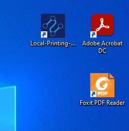

.. |Directorio de insalación| image:: resorces/resultant-install-directory.png
.. |Error de conexión| image:: resorces/config-print-queue-conection-error.png
.. |Funciónamiento Correcto| image:: resorces/config-print-queue-correct-operation.png
.. |Propiedades Acceso directo de la aplicación| image:: resorces/config-print-queue-shortcut-properties.PNG
.. _documento/check-fiscal-printing-local-printing-all-in-one:

Verificar el funcionamiento del Cliente de Cola de Impresión Fiscal(The Factory HKA)
====================================================================================

Verificar que la Aplicación este ejecutando la versión correcta
---------------------------------------------------------------

Se debe acceder a las propiedades del Acceso Directo de la aplicación que se encuentra en el escritorio.

|Acceso directo|

Por Ejemplo si la versión instalada es la siguiente: **Local-Printing-All-In-One-DotNet-rs-2.3.exe**

Esta parte en el nombre del instalador **rs-2.3** corresponde a la versión en la que se encuentra la aplicación.

|Propiedades Acceso directo de la aplicación|

Se Deben verificar los siguiente campos viendo si corresponden con la versión instalada:

- Ubicación de Destino: rs-2.3
- Destino:  C:\Users\(Usuario de Windows)\AppData\Local\Local-Printing-All-In-One-DotNet\rs-2.3\StartPrintService.bat
- Iniciar en:  C:\Users\(Usuario de Windows)\AppData\Local\Local-Printing-All-In-One-DotNet\rs-2.3

En caso de que alguno de estos valores no coincida, se debe modificar el acceso directo colocando la versión correcta en este caso **rs-2.3**.

Verificar que la aplicación reciba datos
----------------------------------------

Para hacer esto se debe iniciar la Aplicación Local-Printing-All-In-One-DotNet y enviar un Reporte X, obtener estado de impresora o si la impresora posee caja registradora enviar el comando abrir Gaveta:

Observando en la consola que consola se reciba un mensaje con la siguiente estrcutura:

.. code-block:: batch

|Imprimir Documento|

En estas lineas se muestra información del documento recibido, nombre de documento y el nombre definido en ADempiere para la impresora.

Problemas al momento de recibir el documento
^^^^^^^^^^^^^^^^^^^^^^^^^^^^^^^^^^^^^^^^^^^^

- Verificar si se escogio la impresora correcta al momento de imprimir.
- Verificar que los datos de conexión configurado en ADempiere corresponden con los definidos en el archivo printer.yaml

Verificar que la Aplicación Imprima por la impresora Fiscal
-----------------------------------------------------------

1. Abrimos la aplicación **Local-Printing-All-In-One-DotNet**.

2. Se abrira la consola de windows, y mostrara lo siguiente

|Funciónamiento Correcto|

4. Enviar un documento de desde ADempiere.

.. code-block:: batch

    

|Imprimir Documento|

El documento se debe imprimir inmediatamente al mostrarse le mensaje en la consola.

Problemas al momento de imprimir
^^^^^^^^^^^^^^^^^^^^^^^^^^^^^^^^

Si al momento de imprimir no se envia el documento a la impresora, es

- La impresora no esta configurada como predeterminada.
- Acrobat Reader DC o Foxit Reader no estan establecidos como la aplicación por defecto para visualizar PDF.
- El nombre de la impresora no es el mismo en el archivo printe.yaml y en ADempiere.

Cuando usas Adobe Acrobat Reader DC y el archivo se recibe correctamente y se guarda en la carpeta temporal, pero no se envia a la cola de la impresora. Se debe optar por cambiar la aplición por Foxit Reader.
