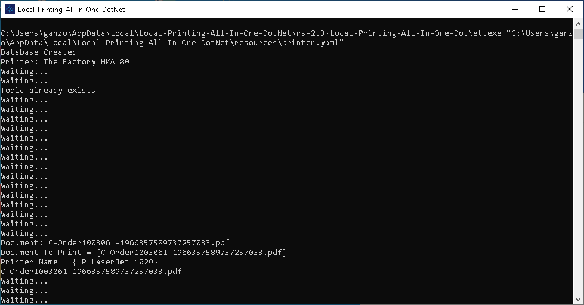
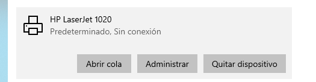
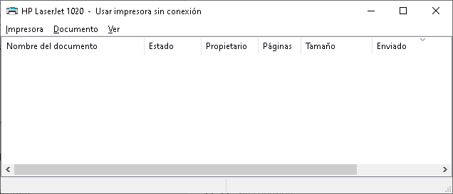

.. |Acceso directo de la aplicación| image:: resorces/desktop-app-icon.png
.. |Directorio de insalación| image:: resorces/resultant-install-directory.png
.. |Error de conexión| image:: resorces/config-print-queue-conection-error.png
.. |Funciónamiento Correcto| image:: resorces/config-print-queue-correct-operation.png

.. |Propiedades Acceso directo de la aplicación| image:: resorces/config-print-queue-shortcut-properties.PNG
.. _documento/check-printpdf-local-printing-all-in-one:

Verificar el funcionamiento del Cliente de Cola de Impresión
============================================================

Verificar que la Aplicacion este ejecutando la version correcta
---------------------------------------------------------------

Se debe acceder a las propiedades del Acceso Directo de la aplicacion que se encuentra en el escritorio.

|Acceso directo|

Por Ejemplo si la version instalada es la siguiente: **Local-Printing-All-In-One-DotNet-rs-2.3.exe**

Esta parte en el nombre del instalador **rs-2.3** corresponde a la version en la que se encuentra la aplicación.

|Propiedades Acceso directo de la aplicación|

Se Deben verificar los siguiente campos viendo si corresponden con la versión instalada:

- Ubicación de Destino: rs-2.3
- Destino:  C:\Users\(Usuario de Windows)\AppData\Local\Local-Printing-All-In-One-DotNet\rs-2.3\StartPrintService.bat
- Iniciar en:  C:\Users\(Usuario de Windows)\AppData\Local\Local-Printing-All-In-One-DotNet\rs-2.3

En caso de que alguno de estos valores no coincida, se debe modificar el acceso directo colocando la version correcta en este caso **rs-2.3**.

Verificar que la aplicacion reciba datos
----------------------------------------

Para hacer esto se debe iniciar la Aplicacion Local-Printing-All-In-One-DotNet y enviar un documento desde ADempiere:

Observando en la consola que consola se reciba un mensaje con la siguiente estrcutura:

.. code-block:: batch

    Document: C-Order1003061-1966357589737257033.pdf
    Document To Print = {C-Order1003061-1966357589737257033.pdf}
    Printer Name = {HP LaserJet 1020}
    C-Order1003061-1966357589737257033.pdf

|Imprimir Documento|

En estas lineas se muestra informacion del documento recibido, nombre de documento y el nombre definido en ADempiere para la impresora.

Problemas al momento de recibir el documento
^^^^^^^^^^^^^^^^^^^^^^^^^^^^^^^^^^^^^^^^^^^^

- Verificar si se escogio la impresora correcta al momento de imprimir.
- Verificar que los datos de conexión configurado en ADempiere corresponden con los definidos en el archivo printer.yaml

Verificar que la Aplicacion Imprima por la impresora predeterminada
-------------------------------------------------------------------

1. Abrimos impresoras y faxes, luego ubicamos la impresora predeterminada y pulsamos en abrir cola.

|Impresoras y faxes|

|Impresoras y faxes cola de impresión|

2. Abrimos la aplicación **Local-Printing-All-In-One-DotNet**.

3. Se abrira la consola de windows, y mostrara lo siguiente

|Funciónamiento Correcto|

4. Enviar un documento de desde ADempiere.

.. code-block:: batch

    Document: C-Order1003061-1966357589737257033.pdf
    Document To Print = {C-Order1003061-1966357589737257033.pdf}
    Printer Name = {HP LaserJet 1020}
    C-Order1003061-1966357589737257033.pdf

|Imprimir Documento|

Se recomienda tener en primer plano la ventana que se abrio en el primer paso, y de esta manera observar lo que se envia hacia la impresora predeterminada, ya que de otro modo por la velocidad a la se ejecuta no tendra tiempo suficiente para ver el documento recibido.

Problemas al momento de imprimir
^^^^^^^^^^^^^^^^^^^^^^^^^^^^^^^^

Si al momento de imprimir no se envia el documento a la impresora predeterminada, se debe tomar en cuantea lo siguiente

- La impresora no esta configurada como predeterminada.
- Acrobat Reader DC o Foxit Reader no estan establecidos como la aplicacion por defecto para visualizar PDF.
- El nombre de la impresora no es el mismo en el archivo printe.yaml y en ADempiere.

Cuando usas Adobe Acrobat Reader DC y el archivo se recibe correctamente y se guarda en la carpeta temporal, pero no se envia a la cola de la impresora. Se debe optar por cambiar la aplicion por Foxit Reader.
