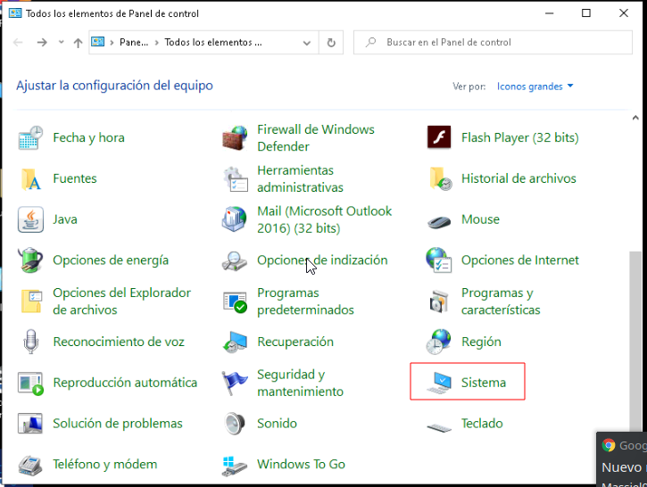
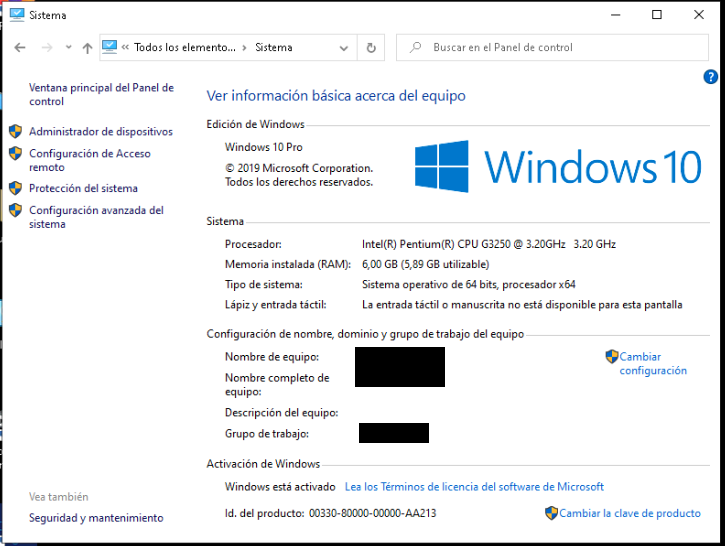
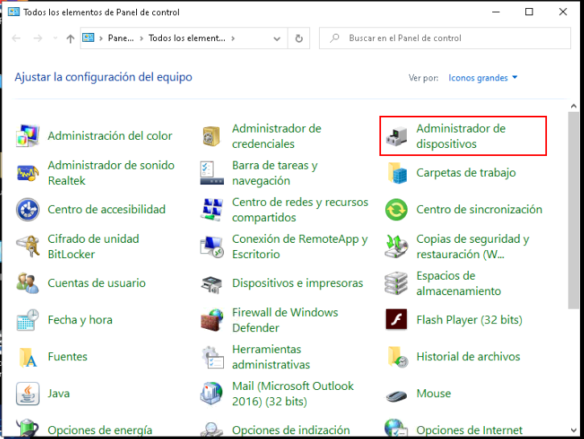
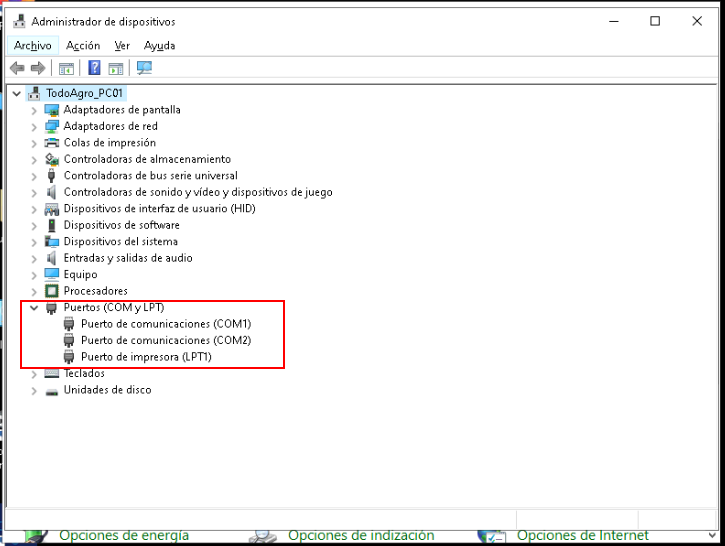
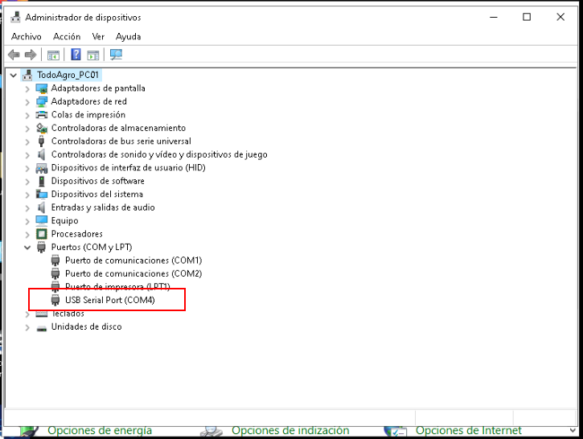
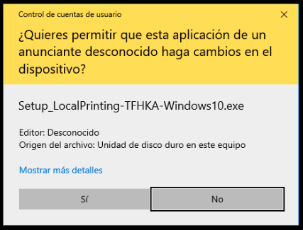
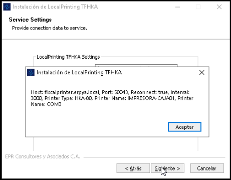
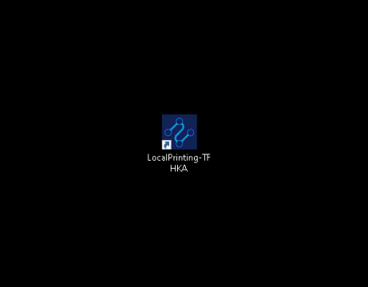

.. |Impresora Fiscal| image:: resorces/fiscal-printer.png
.. |Perifericos| image:: resorces/fiscal-printer-peripherals.png
.. |Ventana de Bienvenida| image:: resorces/welcome.png
.. |Ventana de Configuración| image:: resorces/service-settings.png
.. |Licencia| image:: resorces/license.png
.. |Directorio de instalación| image:: resorces/installation-folder.png
.. |Ventana de Finalización| image:: resorces/finish-page.png

.. _documento/instalar-impresora-fiscal-TFHKA:

**Instalar Impresora Fiscal The Factory HKA**
=============================================

Requerimientos para instalar el cliente de cola de impresión TFHKA:

#. **Hardware**:

    #. Impresora Fiscal, debe poseerse los componentes descritos en la siguiente imagen

        |Impresora Fiscal|

        Imagen 1. A) Impresora Fiscal, B) Fuente de Alimentación, C) Conector USB Impresora Fiscal

    #. Periféricos de la Impresora Fiscal (Display Kit, Gaveta Caja registradora), Algunos pueden ser opcionales ya que a pesar de no tener todos se puede iniciar el la el cliente de cola de impresión.

        |Perifericos|

        Imagen 2. A) Gaveta Caja registradora, B) Escaner de Codigo de Barras, C) Pantalla de visualización para impresora fiscal, D) Cable Conector RJ-11 de Gaveta Caja registradora, E) Conector USB Escaner Codigo de Barras, F) Cable Conector RJ-11 visualización para impresora fiscal.

        .. note::

            La **Gaveta Caja registradora** y la **Pantalla de visualización para impresora fiscal**, se deben conectar directamente en la impresora fiscal, mientras que el Escáner de Código de Barras se debe conectar directamente en el PC.

#. **Software**:
 
 
    #. Driver de Impresora Fiscal

    #. Instalar el JDK de JAVA 8 añadiendolo a las variables de entorno **JAVA_HOME** y **PATH**. En caso de desconocer cómo hacer esto en el siguiente link se muestra como hacerlo :ref:`documento/agregar-java-8-al-path`,.
    
    
    #. Descargar la versión adecuada del instalador del cliente de cola de impresión dependiendo del sistema operativo empleado:
    
    
        - Para el sistema operativo Windows 7:   
    
            - Setup_LocalPrinting-TFHKA-Windows7.exe
            
            - Service.exe
    
        - Para el sistema operativo Windows 10:         
    
            - Setup_LocalPrinting-TFHKA-Windows10.exe
    
    Para conocer qué versión de sistema operativo tiene instalado la PC, se debe ingresar a la ventana **Panel de Control** y ubicar el icono **Sistema** Allí se visualiza la información de la Versión y Arquitectura de Windows instalada.
    
            |Panel de Control|
            
            Imagen 3. Panel de Control
    
            |Ventana Sistema|
            
            Imagen 4. Ventana Sistema
    
        .. note::

            Los instaladores serán suministrados por E.R.P. Consultores y Asociados, C.A.

#. **Procedimiento de la instalación**:

    En caso de cumplir lo anteriormente descrito y Una vez conectada la Impresora a la pc, ademas teniendo a disposición el dominio hacia el que va apuntar el cliente de cola de impresión es necesario conocer los siguientes valores.
      ====================  ======================================================================================================================================================
      Parámetro             Descripción  
      ====================  ======================================================================================================================================================
      Dominio               Dirección Web donde Está Alojado el Servidor de cola de impresión, ejemplo: fiscalprinter.erpya.local
      Modelo de impresora   modelo de impresora a instalar en el equipo.
      Nombre de impresora   Este Nombre se le asigna en ADempiere al momento de registrar la impresora y es con el cual va a responder la impresora en la red.
      Puerto COM impresora  Esté corresponde al puerto serial en el cual se encuentra conectada la impresora fiscal.
      ====================  ======================================================================================================================================================
    
    Para conocer la el puerto **COM** en el que se encuentra la impresora fiscal, estando el Cable USB de la impresora desconectado se debe ingresar a la ventana **Panel de Control** y ubicar el icono **Administrador de Dispositivos**, allí se visualiza la información de la los Dispositivos conectados a la PC, una vez en la Ventana se debe ubicar **Puertos (COM y LPT)** llegados a este punto se debe conectar el Cable USB de la impresora en este punto se actualizará la ventana y agregara un nuevo elemento a la lista como se muestra en las siguientes imágenes:
    
        |Panel de Control Administrador de Dispositivos|
            
        Imagen 5. Ventana Panel de Control.
    
        |Ventana Administrador de Dispositivos|
            
        Imagen 6. Ventana Administrador de Dispositivos.
    
        |Ventana Administrador de Dispositivos Puerto COM|
            
        Imagen 7. Ventana Administrador de Dispositivos Actualizados luego de conectar la impresora.
      
    #. **Ejecutar Setup_LocalPrintingPnP.exe con privilegios de Administrador**:

    Para la demostración práctica del instalador se usará **Setup_LocalPrinting-TFHKA-Windows10.exe**, este se debe iniciar con privilegios de Administrador, esto lo puedes hacer haciendo click derecho sobre el icono del instalador y seleccionando la opción Ejecutar como Administrador, una vez hecho esto se desplegará la siguiente ventana:
    
    
        |Permitir hacer cambios en el Dispositivo|

        Imagen 8. Ventana de Confirmación, para permitir ejecutar la aplicación como Administrador.
    
    Al hacer click en siguiente cambiará a la siguiente ventana:
    
        |Ventana de Bienvenida|

        Imagen 9. Ventana de Bienvenida.
    
    Continuando al hacer click en siguiente cambiará a la siguiente ventana:
    
        |Ventana de Configuración|

        Imagen 10. Ventana de Configuración de Parámetros de impresora

    Se deben colocar los siguientes parámetros:
      
      =================  ========================= ===============================================================================================================
      Parámetro          Valor                     Descripción  
      =================  ========================= ===============================================================================================================
      Host               fiscalprinter.erpya.local Dominio Web donde Está Alojado el Servidor de cola de impresión (Colocar la Dirección sin el prefijo "https://")
      Port               50043                     Puerto de Comunicaciones del Servidor de cola de impresión, este Puerto se asigna por defecto en 50043.
      Reconnect          true                      Habilitar reconexión Automática del Cliente de cola de Impresión.
      Interval           3000                      Tiempo de reconexión (ms) tiempo de espera máximo para la reconexión del cliente de cola de impresión.
      Printer Type       HKA-80                    Este campo corresponde a una lista desplegable con los tipos de impresoras disponibles.
      Printer Name       IMPRESORA-CAJA01          Este Nombre se le asigna en adempiere al momento de registrar las impresoras.
      Printer Port       COM1                      Puerto serial en el que se encuentra conectada la impresora.
      =================  ========================= ===============================================================================================================

        .. note::

            E.R.P. Consultores y Asociados, C.A. suministrará la Dirección del dominio donde está alojado el Servidor de cola de impresión.
    

        |Ventana Confirmación de configuración|
    
        Imagen 11. Ventana de Confirmación de Parámetros de impresora
    
    Luego se desplegará la ventana con la Licencia de este Software, de manera que pueda verla y aceptarla.
    
        |Licencia|

        Imagen 12. Ventana de Configuración de Parámetros de impresora
    
    Continuando con la instalación se observa la ventana de selección del Directorio de instalación, para ambos tipos de instaladores esto se debe dejar como está por defecto, para continuar se presiona el botón Instalar.

        |Directorio de instalación|

        Imagen 13
    
    Finalizando la instalación está la Ventana de Finalización de instalación

        |Ventana de Finalización|

        Imagen 14. Ventana de Configuración de Parámetros de impresora

        .. note::

            Para el caso del instalador de Windows 10 al presionar finalizar se creará en el escritorio el acceso directo con el instalador.

        |Icono de Cliente de Cola de Impresión|

        Imagen 15. Icono creado luego instalar el cliente de cola de impresión utilizando el instalador de Windows 10
 

#. **Ejecutar PrintService.exe con privilegios de Administrador**:
 

    .. note::

        Este paso solo se emplea cuando se instala la versión de Windows 7.

    =================  ========================= ===============================================================================================================
    Parámetro          Valor                     Descripción  
    =================  ========================= ===============================================================================================================
    Host               fiscalprinter.erpya.local Dominio Web donde Está Alojado el Servidor de cola de impresión (Colocar la Dirección sin el prefijo "https://")
    Port               50043                     Puerto de Comunicaciones del Servidor de cola de impresión, este Puerto se asigna por defecto en 50043.
    Reconnect          true                      Habilitar reconexión Automática del Cliente de cola de Impresión.
    Interval           3000                      Tiempo de reconexión (ms) tiempo de espera máximo para la reconexión del cliente de cola de impresión.
    Printer Type       HKA-80                    Este campo corresponde a una lista desplegable con los tipos de impresoras disponibles.
    Printer Name       IMPRESORA-CAJA01          Este Nombre se le asigna en adempiere al momento de registrar las impresoras.
    Printer Port       COM1                      Puerto serial en el que se encuentra conectada la impresora.
    =================  ========================= ===============================================================================================================

    .. note::

         Se Debe configurar con los mismos valores del paso anterior, ya que estos son los parámetros que se utilizaran en el modo de prueba de la impresora Fiscal.

    |Icono de Cliente de Cola de Impresión|

    Imagen 16. Icono creado luego instalar PrintService.exe
 
    Luego de aplicar el instalador en el escritorio de Windows se creará un acceso directo **LocalPrinting-PnP.ink**, el cual permite iniciar el cliente de cola de impresión al ejecutarlo, la siguiente tabla muestra las opciones disponibles:

    ====================== ============================================
    Parámetro              Valor
    ====================== ============================================
    1                      Inicia el Cliente de Cola de Impresión
    2                      Detiene el Cliente de Cola de Impresión
    3                      Reinicia el Cliente de Cola de Impresión
    0                      Salir del Menú de Opciones
    ====================== ============================================

#. **Verificar Correcto funcionamiento luego de la instalación**:

    Hacer doble click en el acceso directo **LocalPrinting-TFHKA.ink** con privilegios de Administrador, para la versión de Windows 7 se desplegará un menú en la consola selecciona la opción 1, esto iniciará el cliente de cola de impresión, mientras que para el caso de Windows 10 se abrirá la consola iniciando el servicio de cola de impresión.

#. **Imprimir Reporte X** 

    Para el caso donde la conexión se ejecuta correctamente, se procede a realizar una impresión de control usando el Proceso **Imprimir Reporte Fiscal** con los parámetros:

    ====================== ===============================================
    Parámetro              Valor
    ====================== ===============================================
    Impresora Fiscal       Seleccionar Impresora a Emplear para la prueba
    Tipo de comando Fiscal Reporte X
    ====================== ===============================================

    Al iniciar la impresión todo está correctamente configurado y funcional.

