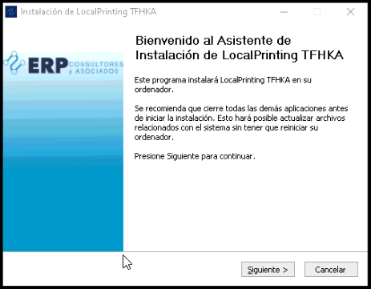
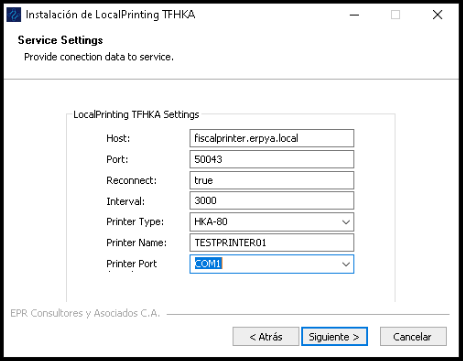
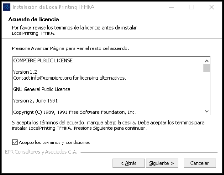
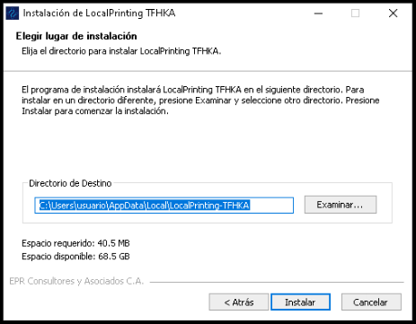
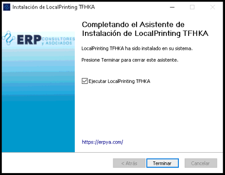

.. |Impresora Fiscal| image:: resorces/fiscal-printer.png
.. |Perifericos| image:: resorces/fiscal-printer-peripherals.png

 
.. _documento/instalar-impresora-fiscal-TFHKA:
 
**Instalar Impresora Fiscal The Factory HKA**
=============================================
 
 
Requerimientos para instalar el cliente de cola de impresión TFHKA:
 
 
 
#. **Hardware**:
 
  #. Impresora Fiscal, debe poseerse los componentes descritos en la siguiente imagen
 
          |Impresora Fiscal|
 
           Imagen 1. A) Impresora, B) Fuente de Alimentacion, C) Cable USB
 
  #. Periféricos de la Impresora Fiscal (Display Kit, Gaveta Caja registradora), Algunos pueden ser opcionales ya que a pesar de no tener todos se puede iniciar el la el cliente de cola de impresión.
 
          |Perifericos|
 
           Imagen 2. A) Gaveta Caja registradora, B) Escaner de Codigo de Barras, C) Pantalla de visualización para impresora fiscal
 
 
#. **Software**:
 
  #. Driver de Impresora Fiscal
 
  #. Instalar el JDK de JAVA 8 añadiendolo a las variables de entorno **JAVA_HOME** y **PATH**. En caso de desconocer cómo hacer esto en el siguiente link se muestra como hacerlo.
 
  #. Descargar la versión adecuada del instalador del cliente de cola de impresión dependiendo del sistema operativo empleado:
 
     - Para el sistema operativo Windows 7:    
         - Setup_LocalPrinting-TFHKA-Windows7.exe
         - Service.exe
 
     - Para el sistema operativo Windows 10:          
         - Setup_LocalPrinting-TFHKA-Windows10.exe
 
  .. note::
 
      Los instaladores serán suministrados por E.R.P. Consultores y Asociados, C.A.
 
#. **Procedimiento de la instalación**:
 
En caso de cumplir lo anteriormente descrito y Una vez conectada la Impresora a la pc, ademas teniendo a disposición el dominio hacia el que va apuntar el cliente de cola de impresión es necesario conocer los siguientes valores.
 
 
   ====================  ============================================================================================================================================
   Parámetro             Descripción   
   ====================  ============================================================================================================================================
   Dominio               Dirección Web donde Está Alojado el Servidor de cola de impresión, ejemplo: fiscalprinter.erpya.local
   Modelo de impresora   modelo de impresora a instalar en el equipo.
   Nombre de impresora   Este Nombre se le asigna en ADempiere al momento de registrar la impresora y es con el cual va a responder la impresora en la red.
   Puerto COM impresora  Esté corresponde al puerto serial en el cual se encuentra conectada la impresora fiscal.
   ====================  ============================================================================================================================================
 
    
#. **Ejecutar Setup_LocalPrintingPnP.exe con privilegios de Administrador**:
 
Para la demostración práctica del instalador se usará **Setup_LocalPrinting-TFHKA-Windows10.exe**, este se debe iniciar con privilegios de Administrador, esto lo puedes hacer haciendo click derecho sobre el icono del instalador y seleccionando la opción Ejecutar como Administrador, una vez hecho esto se desplegará la siguiente ventana de bienvenida:
 
 
          |Ventana de Bienvenida|
 
          Imagen 3. Ventana de Bienvenida
 
  Al hacer click en siguiente cambiará a la siguiente ventana:
 
 
          |Ventana de Configuración|
 
          Imagen 4. Ventana de Configuración de Parámetros de impresora
 
 
  Se deben colocar los siguientes parámetros:
    
   =================  ========================= ===============================================================================================================
   Parámetro          Valor                     Descripción   
   =================  ========================= ===============================================================================================================
   Host               fiscalprinter.erpya.local Dirección Web
   Port               50043                     Puerto de Comunicaciones del Servidor de cola de impresión, este Puerto se asigna por defecto en 50043.
   Reconnect          true                      Habilitar reconexión Automática del Cliente de cola de Impresión.
   Interval           3000                      Tiempo de reconexión (ms) tiempo de espera máximo para la reconexión del cliente de cola de impresión.
   Printer Type       HKA-80                    Este campo corresponde a una lista desplegable con los tipos de impresoras disponibles.
   Printer Name       IMPRESORA-CAJA01          Este Nombre se le asigna en adempiere al momento de registrar las impresoras.
   Printer Port       COM1                      Puerto serial en el que se encuentra conectada la impresora.
   =================  ========================= ===============================================================================================================
 
 
  Luego se tiene la ventana con la Licencia de este Software.
 
          |Licencia|
 
          Imagen 5. Ventana de Licencia
 
   Continuando con la instalación se observa la ventana de selección del Directorio de instalación, para ambos tipos de instaladores esto se debe dejar como está por defecto.
 
          |Directorio de instalación|
 
          Imagen 6. Ventana Directorio
 
   Finalizando la instalación está la Ventana de Finalización de instalación
 
          |Ventana de Finalización|
 
          Imagen 7. Ventana de Finalización de instalación
 
 
  .. note::
 
      Para el caso del instalador de Windows 10 al presionar finalizar se creará en el escritorio el acceso directo con el instalador
 
 
 
#. **Ejecutar PrintService.exe con privilegios de Administrador**:
 
   Este paso solo se emplea cuando se instala la versión de Windows 7.
 
   =================  ========================= ===============================================================================================================
   Parámetro          Valor                     Descripción   
   =================  ========================= ===============================================================================================================
   Host               fiscalprinter.erpya.local Dirección Web
   Port               50043                     Puerto de Comunicaciones del Servidor de cola de impresion, este Puerto se asigna por defecto en 50043.
   Reconnect          true                      Habilitar reconexión Automática del Cliente de cola de Impresión.
   Interval           3000                      Tiempo de reconexión (ms) tiempo de espera máximo para la reconexión del cliente de cola de impresión.
   Printer Type       HKA-80                    Este campo corresponde a una lista desplegable con los tipos de impresoras disponibles.
   Printer Name       IMPRESORA-CAJA01          Este Nombre se le asigna en adempiere al momento de registrar las impresoras.
   Printer Port       COM1                      Puerto serial en el que se encuentra conectada la impresora.
   =================  ========================= ===============================================================================================================
 
  .. note::
 
      Se Debe configurar con los mismos valores del paso anterior, ya que estos son los parámetros que se utilizaran en el modo de prueba de la impresora Fiscal.
 
 
  Luego de aplicar el instalador en el escritorio de Windows se creará un acceso directo **LocalPrinting-PnP.ink**, el cual permite iniciar el cliente de cola de impresión al ejecutarlo, la siguiente tabla muestra las opciones disponibles:
 
   ====================== ============================================
   Parámetro              Valor
   ====================== ============================================
   1                      Inicia el Cliente de Cola de Impresión
   2                      Detiene el Cliente de Cola de Impresión
   3                      Reinicia el Cliente de Cola de Impresión
   0                      Salir del Menú de Opciones
   ====================== ============================================
 
 
#. **Verificar Correcto funcionamiento luego de la instalación**:
 
  Hacer doble click en el acceso directo **LocalPrinting-TFHKA.ink** con privilegios de Administrador, para la versión de Windows 7 se desplegará un menú en la consola selecciona la opción 1, esto iniciará el cliente de cola de impresión, mientras que para el caso de Windows 10 se abrirá la consola iniciando el servicio de cola de impresión.
 
 
#. **Imprimir Reporte X**  
 
  #. Para el caso donde la conexión se ejecuta correctamente, se procede a realizar una impresión de control usando el Proceso **Imprimir Reporte Fiscal** con los parámetros:
 
     ====================== ===============================================
     Parámetro              Valor
     ====================== ===============================================
     Impresora Fiscal       Seleccionar Impresora a Emplear para la prueba
     Tipo de comando Fiscal Reporte X
     ====================== ===============================================
 
     Al iniciar la impresión todo está correctamente configurado y funcional.

