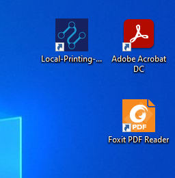
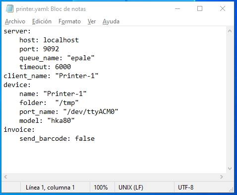
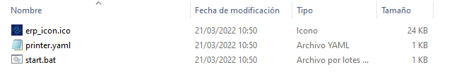
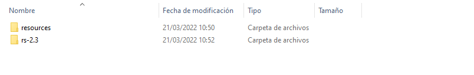
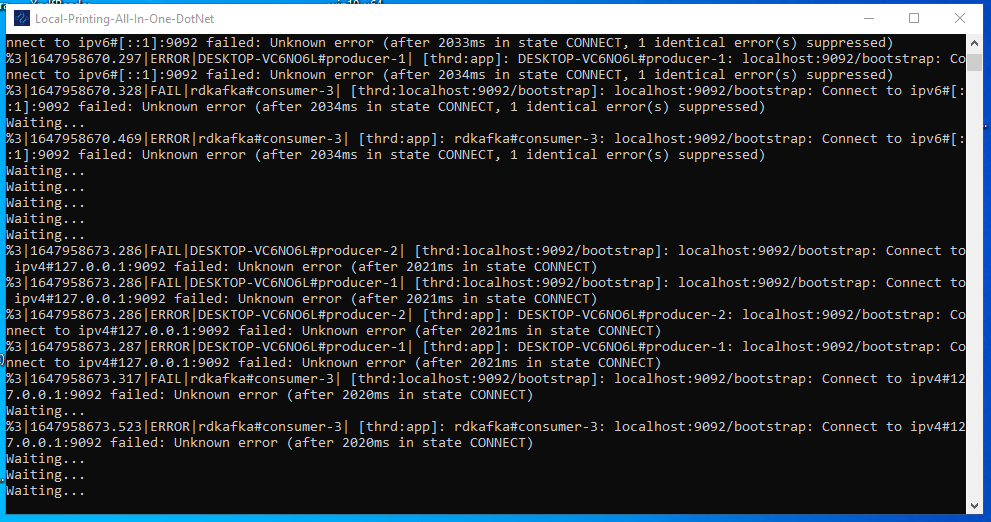
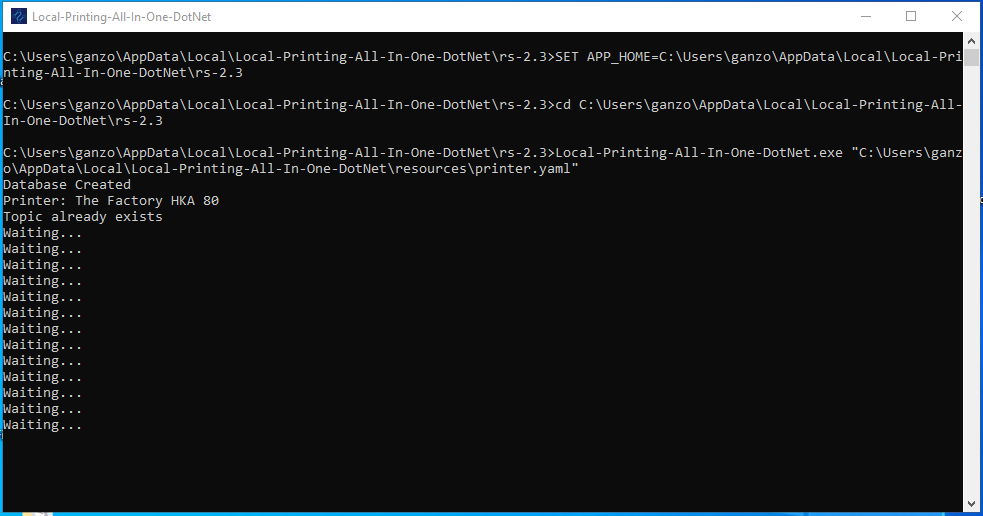
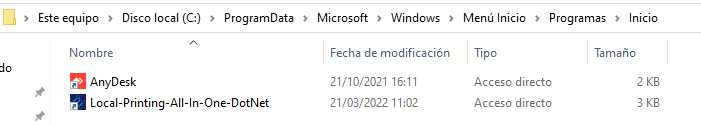
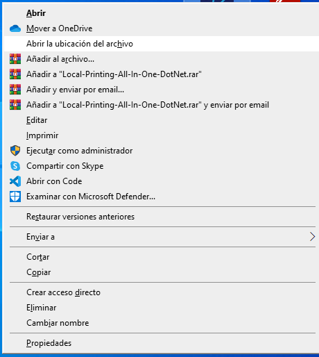
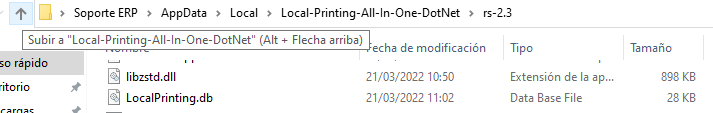

.. |Menú inicio| image:: resorces/config-print-queue-start-menu.png
.. _documento/local-config-local-printing-all-in-one:

Configuración Cliente de Impresión en Windows
============================================================================================

La Configuración de la Aplicación (Local-Printing-All-In-One-DotNet) dependera del uso final de la aplicación ya que puede controlar a impresoras fiscales de The Factory HKA e Imprimir PDF.

Configurar la aplicación para Imprimir PDF(Documentos)
------------------------------------------------------

Se Debe tener en cuenta que la aplicación utiliza la impresora predeterminada del sistema operativo y es imprescindible que se encuntre instalada una de las siguientes aplicaciónes para leer archivos PDF **Acrobat Reader DC** o **Foxit Reader**

1. Acceder al directorio de el Acceso Directo en el escritorio (**Local-Printing-All-In-One-DotNet**) resultante luego de instalar la apliciación, o en su defecto la siguiente ruta:

.. code-block:: batch

    C:\Users\(Usuario de Windows)\AppData\Local\Local-Printing-All-In-One-DotNet\

|Acceso directo de la aplicación|

|Ir a Directorio de Aplicación|

|Regresar una Carpeta|

Si accedes usando el Acceso directo debes regresar una carpeta atras, la ruta previamente menciónada debe Existir la siguiente distribuición de directorios.

|Directorio de insalación|

2. Configurar el paramteros de la aplicación en archivo printer.yaml

Para realizar este paso se debe acceder la carpeta resources.

|Archivos de configuración|

Abrimos el siguiente archivo **printer.yaml** el cual tiene la siguiente estructura.

|Estrutura de Archivo printer.yaml|

Al modificar el archivo se deben respetar las identaciónes y espacios en blanco, ya que de no ser asi la aplicación no iniciara.

.. code-block:: yaml

    server: 
        host: localhost
        port: 9092
        queue_name: "epale"
        timeout: 6000
    client_name: "Printer-1"
    device: 
        name: "Printer-1"
        folder:  "/tmp"
        port_name: "/dev/ttyACM0"
        model: "hka80"
    invoice:
        send_barcode: false

A continuación se Describe cada campo:

Sección server:

- **host**: Dominio o Dirección IP donde se encuentra ejecutandose el servicio de cola de Kafka.
- **port**: Puerto por el cual responde el servicio de cola de Kafka, en este parametro no se deben colocar puntos ni comas.
- **queue_name**: Nombre de cola de impresión,
- **timeout**: Tiempo de espera de respuesta, esta expresado en ms
- **client_name**: Nombre de impresora dentro de la cola de impresión (Para el caso de la impresión de PDF se puede colocar el departamento o el nombre tiene la impresora en windows)

Sección device:

- **name**: Nombre con el que se identifica la impresora (Es recomendable colocar el mismo nombre que se coloco en **client_name**)
- **folder**: Ruta de creación archivos temporales (No modificar este parametro)
- **port_name**: Puerto donde esta conectada la impresora fiscal (Solo se usa con impresoras fiscales)
- **model**: Modelo de la impresora fiscal (Solo se usa con impresoras fiscales)

Sección invoice:

- **send_barcode**: Enviar Codigo de barras (Solo se usa con impresoras fiscales)

3. Iniciar la aplicación para verificar la correcta configuración

|Acceso directo de la aplicación|

Si la apliciación esta correctamente configurada al iniciarla debe mostrar la siguiente consola de terminal.

|Funciónamiento Correcto|

    Si por el contrario sucede uno de las siguiente casos: 

    1. La consola se cierra inmediatamente al iniciar la aplicación, esto se debe que los parametros no estan configurados correctamento on no se respeto la estructura del archivo printer.yaml

    2. Inicia la aplicación y muestra lo siguiente:

    |Error de conexión|

    Esto sucede debido a que hay un error en los datos de conexión verificar los parametros **host** y **port**.

4. Copiar Acceso directo a Menú inicio, para que la aplicación inicie con el sistema operativo, este paso solo debe hacerse una vez confirmado que la aplicación funcióne correctamente.

Buscar el siguiente directorio y Copiar en su interior el acceso directo **Local-Printing-All-In-One-DotNet**.

|Menú inicio|

.. code-block:: batch

    C:\ProgramData\Microsoft\Windows\Start Menu\Programs\StartUp

|Copiar a menú inicio|

5. Prueba de reinicio.

Se debe reiniciar el equipo, al iniciar nuevamente automaticamente debe iniciar la aplicación.

|Funciónamiento Correcto|

De ser asi la aplicación esta Configurada y lista para su uso, en este punto se puede proceder a hacer la prueba de impresión desde ADempiere.

Configurar la aplicación para Imprimir Documentos Fiscales con The Factory HKA
------------------------------------------------------------------------------

Se Debe tener en cuenta que la aplicación utiliza la impresora predeterminada del sistema operativo y es imprescindible que se encuntre instalada una de las siguientes aplicaciónes para leer archivos PDF **Acrobat Reader DC** o **Foxit Reader**

1. Acceder al directorio de el Acceso Directo en el escritorio (**Local-Printing-All-In-One-DotNet**) resultante luego de instalar la apliciación, o en su defecto la siguiente ruta:

.. code-block:: batch

    C:\Users\(Usuario de Windows)\AppData\Local\Local-Printing-All-In-One-DotNet\

|Acceso directo de la aplicación|

|Ir a Directorio de Aplicación|

|Regresar una Carpeta|

Si accedes usando el Acceso directo debes regresar una carpeta atras, la ruta previamente menciónada debe Existir la siguiente distribuición de directorios.

|Directorio de insalación|

2. Configurar el paramteros de la aplicación en archivo printer.yaml

Para realizar este paso se debe acceder la carpeta resources.

|Archivos de configuración|

Abrimos el siguiente archivo **printer.yaml** el cual tiene la siguiente estructura.

|Estrutura de Archivo printer.yaml|

Al modificar el archivo se deben respetar las identaciónes y espacios en blanco, ya que de no ser asi la aplicación no iniciara.

.. code-block:: yaml

    server: 
        host: localhost
        port: 9092
        queue_name: "epale"
        timeout: 6000
    client_name: "Printer-1"
    device: 
        name: "Printer-1"
        folder:  "/tmp"
        port_name: "COM4"
        model: "hka80"
    invoice:
        send_barcode: false

A continuación se Describe cada campo:

Sección server:

- **host**: Dominio o Dirección IP donde se encuentra ejecutandose el servicio de cola de Kafka.
- **port**: Puerto por el cual responde el servicio de cola de Kafka, en este parametro no se deben colocar puntos ni comas.
- **queue_name**: Nombre de cola de impresión
- **timeout**: Tiempo de espera de respuesta, esta expresado en ms
- **client_name**: Nombre de impresora dentro de la cola de impresión (Se Recomienda para este caso colocar el serial de la impresora fiscal)

Sección device:

- **name**: Nombre con el que se identifica la impresora (Es recomendable colocar el mismo nombre que se coloco en **client_name**)
- **folder**: Ruta de creación archivos temporales (No modificar este parametro)
- **port_name**: Puerto donde esta conectada la impresora fiscal (Ej. COM4)
- **model**: Modelo de la impresora fiscal, de momento solo esta Soportada la impresora **hka80** de The Factory HKA

Sección invoice:

- **send_barcode**: Enviar Codigo de barras solo admite valores booleanos (true o false), previamente deben estar cofigurados los flags correspondientes en la programción de la impresora fiscal para imprimir codigos de barras.

3. Iniciar la aplicación para verificar la correcta configuración

|Acceso directo de la aplicación|

Si la apliciación esta correctamente configurada al iniciarla debe mostrar la siguiente consola de terminal.

|Funciónamiento Correcto|

    Si por el contrario sucede uno de las siguiente casos: 

    1. La consola se cierra inmediatamente al iniciar la aplicación, esto se debe que los parametros no estan configurados correctamento on no se respeto la estructura del archivo printer.yaml

    2. Inicia la aplicación y muestra lo siguiente:

    |Error de conexión|

    Esto sucede debido a que hay un error en los datos de conexión verificar los parametros **host** y **port**.

4. Copiar Acceso directo a Menú inicio, para que la aplicación inicie con el sistema operativo.

Buscar el siguiente directorio y Copiar en su interior el acceso directo **Local-Printing-All-In-One-DotNet**.

|Menú inicio|

.. code-block:: batch

    C:\ProgramData\Microsoft\Windows\Start Menu\Programs\StartUp

|Copiar a menú inicio|

5. Prueba de reinicio.

Se debe reiniciar el equipo, al iniciar nuevamente automaticamente debe iniciar la aplicación.

|Funciónamiento Correcto|

De ser asi la aplicación esta Configurada y lista para su uso, en este punto se puede proceder a hacer la prueba de impresión desde ADempiere.