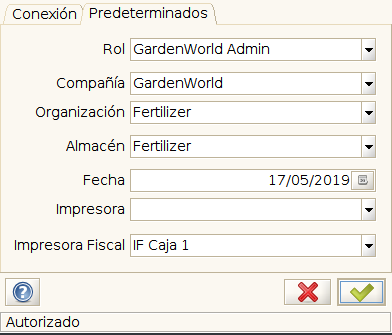
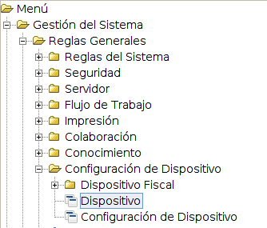
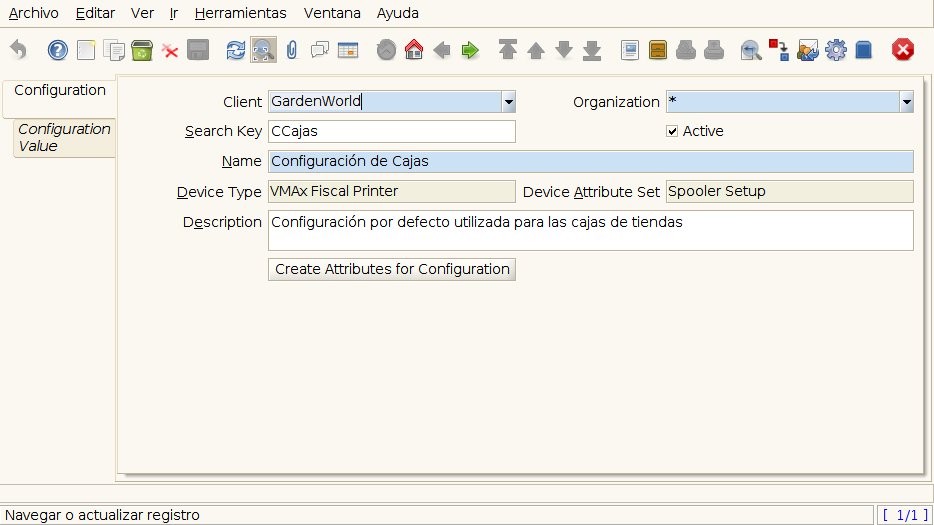
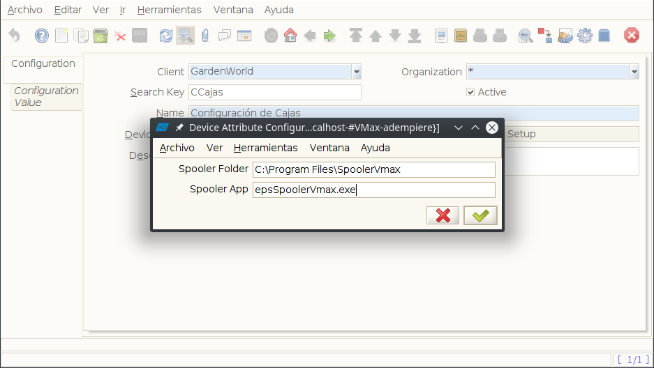
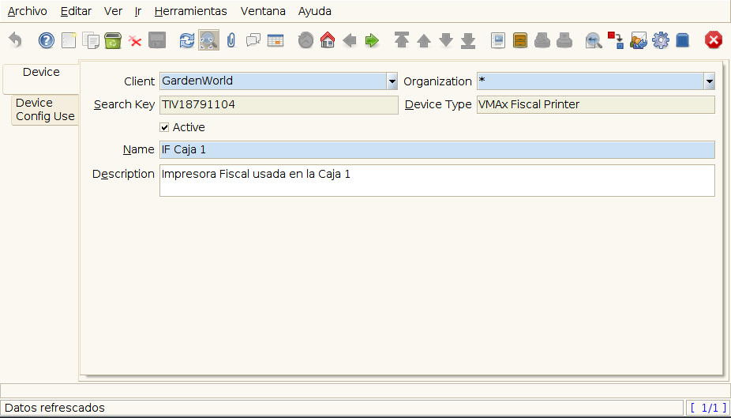
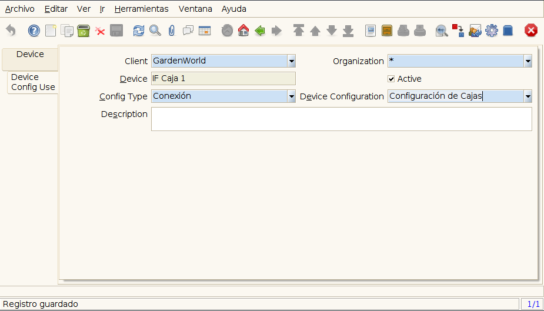

**Configuración de Impresora Fiscal VMax 220 para Usar con ADempiere**
======================================================================

Requisitos previos:

-  Tener un equipo con Windows instalado, bajo la Arquitectura
   procesador de 32 bits.
-  Adaptador USB-Serial Compatible con Windows en la versión del sistema
   operativo usado (Conector DB9 a USB).
-  Instalar la Aplicación Spooler.

Es necesario ingresar a ADempiere desde la versión de escritorio, para
un correcto funcionamiento es necesario modificar el archivo
"RUN\_Adempiere.bat" actualizando los parámetros:

!!! example "Configuración del Classpath"

::

        ADEMPIERE_HOME=(Ruta de ADempiere)

        JAVA_HOME=(Ruta de Instalación de JAVA). 

Nota: Es recomendable colocar un acceso directo en el escritorio, para
ejecutar con mayor Facilidad ADempiere.

Configurar la impresora requiere los siguientes pasos:
------------------------------------------------------

1. Ingresar a ADempiere con el Rol asignado correspondiente.

   Inicio de Sesión

2. Posicionarse en el menú de ADempiere.

3. Ingresar al directorio **Administración de Sistema** / **Reglas
   Generales** / **Configuración de Dispositivo**.

   Menú Fiscal

4. Abrir la Ventana Configuración de Dispositivo.

   Configuración de Dispositivo

5. Crear un Nuevo Registro

Agregando los siguientes Valores en sus correspondientes campos:

+----------------------------------------+--------------------------------------------------+
| Campo                                  | Valor                                            |
+========================================+==================================================+
| Clave de Búsqueda                      | Código asignado a la configuración'              |
+----------------------------------------+--------------------------------------------------+
| Nombre                                 | Nombre de Configuración                          |
+----------------------------------------+--------------------------------------------------+
| Tipo de Dispositivo                    | VMAx (Impresora Fiscal)                          |
+----------------------------------------+--------------------------------------------------+
| Conjunto de Atributos de Dispositivo   | Configuración de Spooler                         |
+----------------------------------------+--------------------------------------------------+
| Descripción                            | Una breve descripción del dispositivo y su uso   |
+----------------------------------------+--------------------------------------------------+

Luego de Cargar los Valores es Necesario Presionar el Botón crear
Atributos para configuración.

Se desplegara una ventana donde se debe seleccionar el directorio de
instalación de la Aplicación Spooler y el Ejecutable de las misma.

!!! example "Ejemplo de Configuración"

::

        Spooler Folder: C:\Program Files\SpoolerVmax

        Spooler App: epsSpoolerVmax.exe

   Diálogo de Configuracion de Dispositivo

Crear el nuevo Dispositivo (impresora):
---------------------------------------

1. Abrir la Ventana Dispositivo ubicada en el menú **Administración de
   Sistema** / **Reglas Generales** / **Configuración de Dispositivo**.

2. Crear un Nuevo Registro

Agregando los siguientes Valores en sus correspondientes campos:

+-------------+-------------+
| Campo       | Valor       |
+=============+=============+
| Clave de    | Clave de    |
| Búsqueda    | búsqueda    |
|             | para        |
|             | Impresora'  |
|             | (Este Valor |
|             | corresponde |
|             | al Serial   |
|             | de la       |
|             | impresora)  |
+-------------+-------------+
| Tipo de     | VMAx        |
| Dispositivo | (Impresora  |
|             | Fiscal)     |
+-------------+-------------+
| Nombre      | Nombre de   |
|             | la          |
|             | Impresora   |
+-------------+-------------+
| Descripción | Descripción |
+-------------+-------------+

   Dispositivo

Configuración de uso de Dispositivo:
------------------------------------

Luego de los pasos anteriores es necesario acceder a la Pestaña
Configuración de uso de Dispositivo, en esta ventana se establece la
manera en la que ADempire se comunicara con el dispositivo creado.

-  crear un nuevo registro:

+--------------------------------+-----------------------------------------+
| Campo                          | Valor                                   |
+================================+=========================================+
| Dispositivo                    | VMAx (Impresora Fiscal)                 |
+--------------------------------+-----------------------------------------+
| Tipo de Configuración          | Connection                              |
+--------------------------------+-----------------------------------------+
| Configuración de Dispositivo   | Configuración de Cajas                  |
+--------------------------------+-----------------------------------------+
| Descripción                    | Breve descripción de la funcionalidad   |
+--------------------------------+-----------------------------------------+

   Configuración de uso Dispositivo

.. note:: 

        Para confirmar que la configuración de todo lo anterior
esta correcta, ingresar de nuevo a ADempiere, en la ventana de seleccion
de rol seleccionar la impresora fiscal creada y continuar, dentro de
ADempiere procedemos a ejecutar el proceso: Imprimir Reporte Fiscal.
