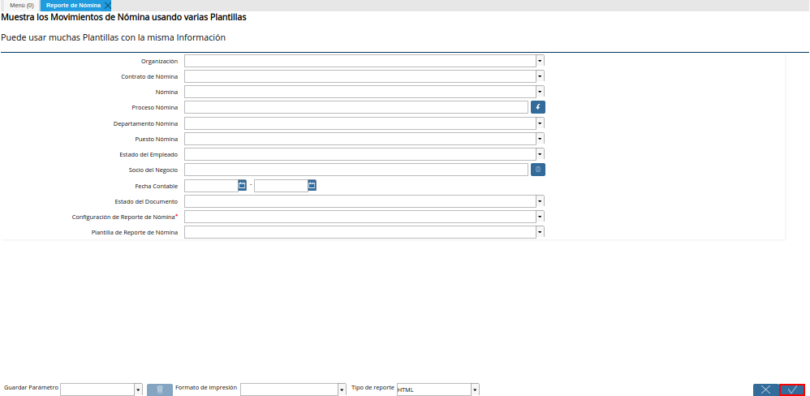

.. |Menú de ADempiere| image:: resources/menu-reporte-nomina.png

.. _documento/reporte-de-nómina:

**Generar Reporte de Nómina**
=============================

#. Ubique y seleccione en el menú de ADempiere, la carpeta "**Gestión de Recursos Humanos y Nómina**", luego seleccione la carpeta "**Nómina**", por último seleccione la carpeta "**Reporte de Nómina**", para posteriormente seleccionar el "**Reporte de Nómina**".

    |Menú de ADempiere|

    Imagen 1. Menú de ADempiere

#. Podrá visualizar la ventana "**Reporte de Nómina**", con diferentes campos que permiten generar el reporte de nómina de acuerdo a lo requerido por el usuario en su momento.

    |Ventana Reporte de Nómina|

    Imagen 2. Ventana Reporte de Nómina

#. Seleccionar en el campo "**Organización**", la organización desde la cual se va a generar el reporte de nómina.

    |Campo Organización|

    Imagen 3. Campo Organización

#. Seleccionar en el campo "**Contrato de Nómina**", el tipo de contrato por el cual se va a generar el reporte de nómina.

    |Campo Contrato de Nómina|

    Imagen 4. Campo Contrato de Nómina

#. Seleccionar en el campo "**Nómina**", la nómina a la cual pertenece el empleado y por la cual se va a generar el reporte de nómina.

    |Campo Nómina del Empleado|

    Imagen 5. Campo Nómina

    .. note::

        Se debe seleccionar la nómina a la cual pertenece el empleado para generar el reporte de la misma.

#. Seleccionar en el campo "**Proceso Nómina**", el proceso de nómina realizado previamente.

    |Campo Proceso Nómina|

    Imagen 6. Campo Proceso Nómina

#. Seleccione en el campo "**Departamento Nómina**", el departamento al cual pertenece el empleado y por el cual se va a generar el reporte de nómina.

    |Campo Departamento Nómina|

    Imagen 7. Campo Departamento Nómina

#. Seleccione en el campo "**Puesto Nómina**", el cargo o puesto que desempeña el empleado en la organización seleccionada anteriormente.

    |Campo Puesto Nómina|

    Imagen 8. Campo Puesto Nómina

#. Seleccione en el campo "**Estado del Empleado**", la condición o estatus del empleado dentro de la organización seleccionada anteriormente.

    |Campo Estado del Empleado|

    Imagen 9. Campo Estado del Empleado

#. Seleccione en el campo "**Socio del Negocio**", el empleado por el cual se va generar el reporte de nómina.

    |Campo Socio del Negocio|

    Imagen 10. Campo Socio del Negocio

#. Seleccione en el campo "**Fecha Contable**", el rango de fecha "**Desde - Hasta**" por el cual se va a generar el reporte de nómina.

    |Campo Fecha Contable|

    Imagen 11. Campo Fecha Contable

    .. note::

        Si deseas obtener un reporte por un rango de fecha puedes determinar las fechas, si no se coloca un rango de fecha le van aparecer todos los recibos de pagos de todas las nóminas que tenga procesadas el empleado.

#. Seleccionar en el campo "**Estado del Documento**", el estado en el que se encuentra el documento de pago por el cual se va a generar el reporte de nómina.

    |Campo Estado del Documento|

    Imagen 12. Campo Estado del Documento

#. Seleccionar en el campo "**Configuración del Reporte de Nómina**", la opción "**Nómina Regular**", para visualizar en el reporte de nómina los recibos de pagos de la nómina semanal, quicenal o quincenal mixta de cada empleado de la organización seleccionada anteriormente.

    |Campo Configuración del Reporte de Nómina|

    Imagen 13. Campo Configuración del Reporte de Nómina

#. Seleccionar la opción "**OK**", ubicada en la parte inferior derecha de la ventana para finalmente generar el reporte de nómina en base a lo seleccionado en los diferentes campos que contiene dicha ventana "**Reporte de Nómina**".

    |Opción OK para generar el reporte|

    Imagen 14. Opción Ok para Generar el Reporte

#. El reporte puede ser visualizado de la siguiente manera según lo seleccionado en los campos anteriormente explicados.

    |Reporte de Nómina|

    Imagen 15. Reporte de Nómina
