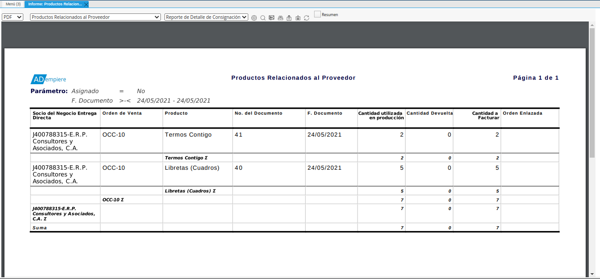
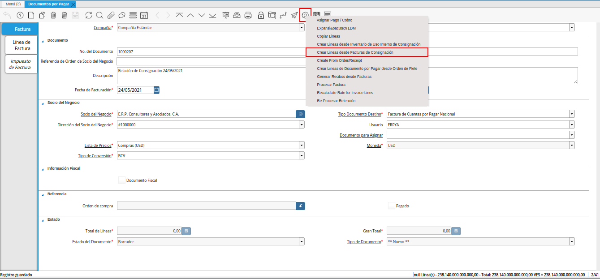

.. _ERPyA: http://erpya.com

.. |icono proceso de la ventana documentos por pagar| image:: resources/window-process-icon-documents-payable.png

.. |ventana del proceso crear líneas desde facturas de consignación| image:: resources/process-window-create-lines-from-consignment-invoices.png
.. |campo socio del negocio del proceso| image:: resources/business-partner-field-of-the-process.png
.. |campo orden de venta del proceso| image:: resources/process-sales-order-field.png
.. |campo fecha de facturación del proceso| image:: resources/process-billing-date-field.png
.. |campo producto del proceso| image:: resources/process-product-field.png
.. |opción comenzar búsqueda del proceso| image:: resources/option-start-process-search.png
.. |selección de registros filtrados| image:: resources/selection-of-filtered-records.png
.. |opción ok de proceso| image:: resources/process-ok-option.png
.. |icono refrescar| image:: resources/refresh-icon.png
.. |pestaña línea de factura| image:: resources/invoice-line-tab.png
.. |pestaña principal factura| image:: resources/main-tab-invoice.png
.. |opción procesar factura del icono proceso| image:: resources/process-icon-invoice-option.png
.. |acción completar y opción ok| image:: resources/action-complete-and-option-ok.png

.. _documento/relación-de-ventas-en-consignación:

**Relación de Ventas en Consignación**
======================================

Para la relación de las ventas en consignación, es obligatoria la configuración de las mismas. Dicha configuración se encuentra explicada en el material :ref:`documento/configuración-de-ventas-en-consignación`, elaborado por `ERPyA`_ y deben ser cumplidas de manera obligatoria para garantizar el correcto funcionamiento del procedimiento de ventas en consignación.

Adicional a ello, la venta no debe estar incluida en ningún documento por pagar. De lo contrario, el registro no podrá ser visualizado al momento ser cargada la información a la pestaña "**Línea de Factura**", de la ventana "**Documentos por Pagar**".

Luego de las modificaciones realizadas por `ERPyA`_ no es necesario realizar un documento por pagar (pre-factura), para relacionar la venta o uso interno de los productos en consignación. Si se requiere relacionar al proveedor o simplemente consultar las mismas, se puede generar el "**Reporte de Detalle de Consignación**".

Para ejeplificar el caso se tienen los siguientes productos en consignación del proveedor "**E.R.P. Consultores y Asociados, C.A.**"

    - 01-Tap            Tapabocas
    - 01-TerCont        Termos Contigo
    - 01-Chup           Chupetas
    - 01-Lib            Libretas (Cuadros)

Dichos productos se encuentran incluidos en la orden de compra "**OCC-10**".

.. _paso/generar-reporte-de-detalle-de-consignación:

**Reporte de Detalle de Consignación**
--------------------------------------

Genere el "**Reporte de Detalle de Consignación**", filtrando por "**Socio del Negocio Entrega Directa**", "**Asignado**" y "**F. Documento**", que corresponde al rango de fecha de facturación.

.. note::

    El "**Reporte de Detalle de Consignación**", se encuentra explicado de manera detallada en el material :ref:`documento/reporte-de-detalle-de-consignación`, elaborado por `ERPyA`_.

    |reporte de detalle de consignación|

    Imagen 1. Reporte de Detalle de Consignación

.. note::

    El reporte de relación de productos en consignación se puede generar muchas veces y sirve para ver los productos pendientes por relacionar, los productos relacionados o todos los productos sin importar si está o no relacionado.

.. _paso/registrar-documentos-por-pagar-por-proveedor:

**Registrar Documento por Pagar**
---------------------------------

La factura de cuentas por pagar debe ser registrada cuando el proveedor realiza la entrega de la misma a cuentas por pagar. Si el proveedor hace entrega de más de una factura, se debe realizar por cada una de ellas, el procedimiento que se explica a continuación.

    .. warning::

        Se debe crear en ADempiere, las facturas entregadas por el proveedor exactamente iguales.

Realice el procedimiento regular para crear un documento por pagar, dicho procedimiento se encuentra explicado en el material :ref:`documento/documento-por-pagar`, elaborado por `ERPyA`_.

    .. note::

        El documento por pagar deber ser creado bajo las restricciones contempladas en la factura entregada por el proveedor:

        - Introduzca en el campo "**No. del Documento**", el número de documento que contiene la factura entregada por el proveedor.
        - Seleccione en el campo "**Fecha de Facturación**", la fecha de facturación que contiene la factura entregada por el proveedor.
        - Seleccione en el campo "**Fecha Contable**", la fecha contable que contiene la factura entregada por el proveedor.
        - Introduzca en el campo "**Descripción**", una breve referencia del rango de ventas utilizado para generar los documentos por pagar.
        - Seleccione en el campo "**Lista de Precios**", la lista de precios que contiene la factura entregada por el proveedor.
        - Seleccione en el campo "**Tipo de Conversión**", el tipo de conversión que contiene la factura entregada por el proveedor.
        - Introduzca en el campo "**Nro de Control**", el número de control que contiene la factura entregada por el proveedor.

Luego de cargar la información necesaria en la pestaña principal "**Factura**", seleccione el icono "**Proceso**", ubicado en la barra de herramientas de ADempiere.

    |icono proceso de la ventana documentos por pagar|

    Imagen 2. Icono Proceso de la Ventana Documentos por Pagar

Seleccione la opción "**Crear Líneas desde Facturas de Consignación**", desplegada por la selección del icono "**Proceso**".

    |opción crear líneas desde facturas de consignación|

    Imagen 3. Opción Crear Líneas desde Facturas de Consignación

    .. note::

        Para registrar un documento por pagar desde un inventario de uso interno, se debe realizar el mismo procedimiento explicado anteriormente en el proceso :ref:`paso/registrar-documentos-por-pagar-por-proveedor`, con la diferencia de que en vez de seleccionar la opción "**Crear Líneas desde Facturas de Consignación**", del icono "**Proceso**", se selecciona la opción "**Crear Líneas desde Inventario de Uso Interno de Consignación**" y posteriormente el inventario de uso interno correspondiente.

Podrá visualizar la ventana del proceso con diferentes campos que permiten filtrar la información de las ventas.

    .. note::

        La información a ser visualizada en el presente proceso, va a depender de las siguientes condiciones:

        - La información cargada en la orden de compra, dicha orden debe estar en estado "**Completo**".

        - La información visualizada en el reporte :ref:`documento/reporte-de-detalle-de-consignación`.

        De no coincidir la información del reporte con la información visualizada en el presente proceso, debe realizar lo siguiente:

            - Verificar que se cumpla con la :ref:`documento/configuración-de-ventas-en-consignación`.
            - Verificar que el producto se encuentre incluido en una orden de compra, esto lo puede realizar generando el reporte :ref:`documento/reporte-detalle-de-la-orden`.

    |ventana del proceso crear líneas desde facturas de consignación|

    Imagen 4. Ventana del Proceso Crear Líneas desde Facturas de Consignación

    En el campo "**Socio del Negocio Entrega Directa**", podrá visualizar el socio del negocio seleccionado en la pestaña principal "**Factura**".

        |campo socio del negocio del proceso|

        Imagen 5. Campo Socio del Negocio

    Seleccione en el campo "**Orden de Venta**", la orden para filtrar la búsqueda de información.

        |campo orden de venta del proceso|

        Imagen 6. Campo Orden de Venta

        .. warning::

            La orden de compra es un factor clave y se debe colocar para poder crear la factura de cuentas por pagar desde la venta o el uso interno

    Seleccione en el campo "**F. Documento**", el rango de fecha de facturación para filtrar la búsqueda de información.

        |campo fecha de facturación del proceso|

        Imagen 7. Campo F. Documento

    Seleccione en el campo "**Producto**", el producto para filtrar la búsqueda de información.

        |campo producto del proceso|

        Imagen 8. Campo Producto del Proceso

    Seleccione la opción "**Comenzar Búsqueda**", para filtrar la información en base a lo seleccionado anteriormente.

        |opción comenzar búsqueda del proceso|

        Imagen 9. Opción Comenzar Búsqueda

    Seleccione todos los registros filtrados por el proceso.

        |selección de registros filtrados|

        Imagen 10. Selección de Registros 

    Seleccione la opción "**OK**", para cargar a la pestaña "**Línea de Factura**", la información seleccionada anteriormente.

        |opción ok de proceso|

        Imagen 11. Opción OK

Seleccione el icono "**Refrescar**", ubicado en la barra de herramientas de ADempiere, para actualizar la ventana "**Documentos por Pagar**" y se pueda visualizar la información cargada desde el proceso.

    |icono refrescar|

    Imagen 12. Icono Refrescar

Seleccione la pestaña "**Línea de Factura**", para revisar y verificar la información cargada desde el proceso.

    |pestaña línea de factura|

    Imagen 13. Pestaña Línea de Factura

Seleccione la pestaña principal "**Factura**", para completar el registro del documento por pagar.

    |pestaña principal factura|

    Imagen 14. Pestaña Principal Factura

.. note::

    Si se requiere cambiar el tipo de conversión, es necesario recalcular la tasa para las líneas de la factura. Para ello, se debe realizar el siguiente procedimiento:

    - Seleccione el icono "**Proceso**", ubicado en la barra de herramientas de ADempiere

    - Seleccione la opción "**Recalcular Tasa para Líneas de Factura**", para recalcular los precios de los productos que contiene el documento por pagar, en base a la lista de precios y tipo de conversión seleccionada anteriormente.

        - Podrá visualizar la ventana del proceso "**Recalcular Tasa para Líneas de Factura**", para recalcular los precios de los productos cargados a la línea de la factura.

        - Seleccione la opción "**OK**", para ejecutar el proceso.

Seleccione el icono "**Proceso**", ubicado en la barra de herramientas de ADempiere.

    |icono proceso de la ventana documentos por pagar|

    Imagen 15. Icono Proceso 

Seleccione la opción "**Procesar Factura**", ubicada en el menú desplegado por el icono "**Proceso**".

    |opción procesar factura del icono proceso|

    Imagen 16. Opción Procesar Factura 

Seleccione la acción "**Completar**" y la opción "**OK**", para conmpletar el registro del documentonpor pagar.

    |acción completar y opción ok|

    Imagen 17. Opción Completar y Opción OK

.. note::

    Al anular una orden de compra o documento por pagar se liberan todos los documentos de ventas o uso interno relacionados a los mismos.