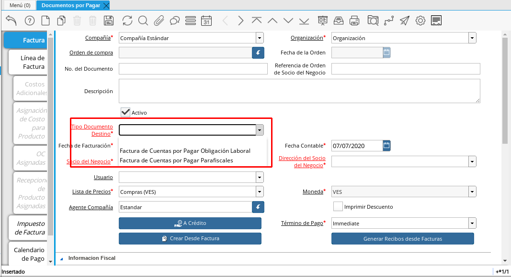

.. |Cargo| image:: resources/cargodoc.png

.. _documento/documento-por-pagar-obligación-laboral:
 
===========================================
**Documento por Pagar Obligación Laboral**
===========================================
 
El documento por pagar de Obligación Laboral se elabora para evidenciar el registro del pago de las obligaciones que contrae el empleador con los entes gubernamentales del estado venezolano o cualquier otra obligación qué según la legislación venezolana le corresponda cancelar a la compañía. Por ello, ADempiere configura cargos con la finalidad de que le ayuden a expresar el servicio que desee cancelar.
 
Para registrar un documento por pagar de obligación laboral puede seguir con los datos que se registraron en el proceso documento :ref:`documento/documento-por-pagar`. Con los siguientes datos adicionales que se detallan a continuación.
 
- Seleccione en la ventana principal de "**Documento por Pagar**" el tipo de documento que requiera utilizar para su factura.
 
    Los tipos de documentos de los cuales dispone para realizar un documento por pagar de obligación laboral son:
 
    - Facturas de Cuentas por Pagar Obligación Laboral: Esté tipo de documento lo utiliza para reflejar cualquier pago que se desee realizar a cualquier obligación que esté estipulado por la legislación venezolana.
    
    - Facturas de Cuentas por Pagar Parafiscales: este tipo de documento lo utilizará para realizar todos los pagos que contrae el empleador con los entes gubernamentales. Entre estos se encuentran el Instituto Venezolano de los Seguros Sociales (IVSS), El Banco Nacional de Vivienda y Hábitat (BANAVIH) y el Instituto Nacional de Capacitación y Educación Socialista (INCES)

    Recuerde que para este caso el tipo de documento determina la acción que realiza ese documento dentro de ADempiere y también determina  que pueda visualizar los diferentes cargos que tiene asociado ese tipo de documento.

    |Tipo de Documento|

    Imagen 1. Seleccione el Tipo de Documento con el que registrará su documento.

- Seleccione la pestaña “**Línea Documento de Pago**” y proceda seleccionando el "**Producto o Servicio**" a ordenar. Si la orden de compra contiene varios productos, el campo "**Nro. de Línea**", indicará el orden y despliegue de los mismos dentro del documento. Una vez que guarde el primer cargo, deberá seleccionar el icono "**Registro Nuevo**", ubicado en la barra de herramientas de ADempiere, incrementando así el número de líneas por productos en el documento.

- Seleccione en el campo “**Cargo**”, el nombre del cargo que desea registrar

    En ADempiere un cargo representa un servicio, quiere decir que no contabiliza en su inventario, entre los cargos que dispone ADempiere podemos mencionar los siguientes:

    - Aporte INCE
    - Aporte RPE
    - Aporte RPVH
    - Aporte SSO
    - Retención INCE
    - Retención ISLR
    - Retención RPE
    - Retención RPVH
    - Retención SSO
    - Adiestramiento de Personal
    - Alimentación (Extra-Tiempos) de Personal
    - Artículos de Limpieza
    - Capacitación de Personal
    - Combustible y Lubricantes
    - Comisión a Intermediarios de Nómina
    - Comisión en Ventas(Compras)
    - Cuentas por Pagar a  Intermediarios de Nómina
    - Descuento de Compra de Importación
    - Emisión Especial Intermediarios de Nómina
    - Encomienda
    - Equipos Tecnológicos
    - Estacionamiento
    - Flete Aduanales
    - Fletes
    - FUNDEI
    - Gas
    - Gastos Aduanales
    - Guardería/Matrícula de Dependiente de Personal
    - HCM de Personal
    - Honorarios Profesionales
    - Hospedaje de Personal
    - Intereses Moratorios de Compra
    - Juguetes de Dependiente de Personal
    - Mantenimiento de Equipos
    - Otros Gastos no Deducibles
    - Pack de Alimentos de Personal
    - Periódicos, Libros y Revistas
    - Póliza de Seguro
    - Préstamo Empleado
    - Préstamos entre Compañía
    - Recarga de Extintores
    - Recreación de Personal
    - Reexpedición Intermediarios de Nómina
    - Reintegro de Indemnizaciones
    - Reparación de Edificación e Instalaciones
    - Reparación de Maquinarias
    - Reparación de Planta
    - Reparación de Vehículos
    - Reproducción y Copias
    - Seguro de Mercancía
    - Seguros de Flete
    - Servicio de Informática
    - Servicio de Mano de Obra Especializada
    - Servicio Funerario de Personal
    - Servicio Legales
    - Servicios de Boletos Aéreos
    - Servicios de Estudios Médicos
    - Servicios Logísticos
    - Taxi (Extra-Tiempos) de Personal
    - Transporte de Personal
    - Uniforme Personal
    - Útiles Escolares de Dependiente de Personal
    - Viajes Internacionales
    - Viajes Nacionales
    - Viáticos de Personal
 
    |Cargo|

    Imagen 2. Seleccione el Tipo de Cargo

Para continuar con el registro de los otros campos puede seguir los pasos que se encuentran documentados  :ref:`documento/documento-por-pagar`.