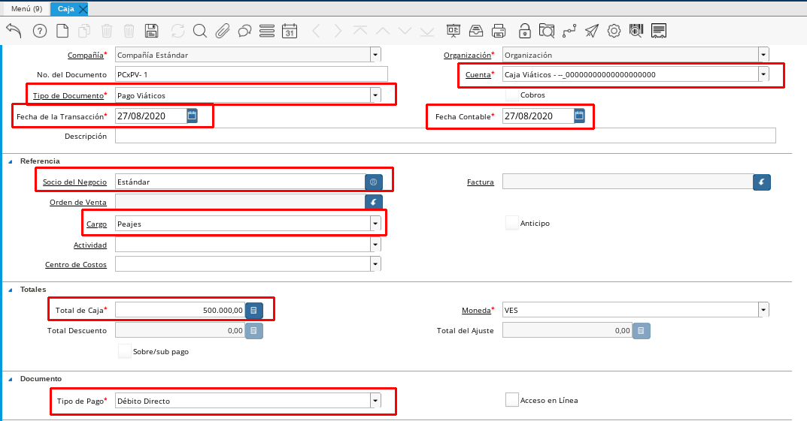

.. |Registro de Caja| image:: resources/box.png
.. |Completar Caja| image:: resources/completer.png

.. _documento/relación-de-facturas-o-justificación-de-gastos:

**Relación de Facturas o Justificación de Gastos**
==================================================

Para relacionar las facturas que presenta un empleado para justificar un gasto que este realizó por alguna razón en particular se deben seguir los pasos que se describen a continuación.

#. Si el empleado presenta en físico su factura

    #. Registre un **Documento por Pagar Obligación Laboral** con la información suministrada en el documento :ref:`documento/documento-por-pagar-obligación-laboral`.
    
    #.  Si una de las facturas abulta el monto otorgado por el empleado y dicho monto no será reembolsado por el cliente se debe justificar ese monto registrando el documento por pagar siguiendo los datos que se explican en el documento :ref:`documento/registros-de-montos-no-reembolsables-para-viáticos-y-reembolsos`

    #. Posteriormente relacione las facturas que registró anteriormente en la caja del empleado.

    #. Para registrar una caja se debe seguir los siguientes pasos, en caso de que relacionemos una caja de viáticos

        #. Dirijase a la ventana caja ubicada en el menú gestión de saldos pendientes sub menú gestión diario de caja

        #. Relacione la caja del empleado particiendo del tipo de documento que realizará en este caso si desea relacionar unos viáticos utilice el tipo de documentos Pago Viáticos si desea relacionar una Caja Reembolso, seleccione Pago Reembolso.

        #. Luego debe seleccionar la cuenta de la caja viáticos del empleado, la cual estará identificada por la caja del empleado adicionalmente tendrá el nombre del empleado.

        #. Seleccione la fecha de la transacción y la fecha contable 

        #. Agregue un breve descripión que le ayude a identificar la caja que está relacionando

        #. Posteriormente en el campo factura llame a la facturas que deseas relacionar, dicha factura ya debe estar cargada previamente. (Si seleccionas facturas, no debes seleccionar cargo)

        #. Automaticamente aparecerá el socio de negocio
        
        #. En el total de la caja debe seleccionar el total a relacionar de esa factura, si en este caso es por el monto total de la misma se registra el monto total de la factura, luego registra la moneda en el campo que dice Totales con sobre/sub pagos el monto que reste en caso que no relacione el monto total de la factura. 

        #. Seleccionas la regla de pago.

            Imagen 1. |Registro de Caja|

        #. Posteriormente procedemos a Completar nuestra Caja.

            Imagen 2. |Completar Caja|

#. Si el empleado no presentó una factura o un aval de su gasto y aún así usted debe relacionar el gasto debe seguir los siguientes pasos:

    #. Registre directamente una caja con los datos que describen anteriormente

        #. Para este caso por no disponer de factura debe seleccionar un **Cargo** referente al gasto realizado por el empleado. 

        #. Registre en el campo socio de negocio, el empleado solicitante.

            Imagen 3. |Cargo|

