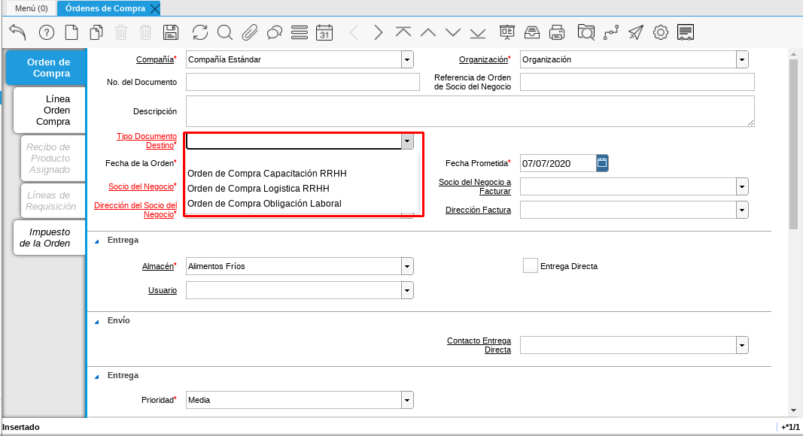

.. _documento/orden-de-compra-obligación-laboral:

.. |Cargo| image:: resources/cargo.png

=======================================
**Orden de Compra Obligación Laboral**
=======================================

La orden de compra obligación laboral se realiza cuando queremos registrar el pago de algún servicio solicitado para el personal como capacitación, adiestramiento, alimentación de personal, entre otros, el cual  fue adquirido por el departamento de recursos humanos y así solicitar al departamento de cuenta por pagar la cancelación del mismo al proveedor. Por ello, ADempiere configura cargos con la finalidad de que le ayuden a expresar realmente el servicio que desea cancelar.

Para registrar una orden de compra obligación laboral se puede seguir con los datos que se registraron en el proceso documento :ref:`documento/orden-de-compra`. Con los siguientes datos adicionales que se detallan a continuación. 

- Seleccione en la ventana principal de la orden de compra el tipo de documento que requiera utilizar para su orden de compra.

    Los tipos de documentos de los cuales dispone para realizar una orden de compra de obligación laboral son:

        - Orden de compra Capacitación de RRHH: Este tipo de documento lo utilizamos cuando necesitamos representar el gasto que se realizó por motivo de cualquier capacitación de personal, por ejemplo el pago del servicio de un curso.

        - Orden de compra Logística de RRHH: Este tipo de documento lo utilizamos cuando necesitamos representar el gasto que se realizó por motivo de cualquier logistica para el personal, por ejemplo el servicio de pago de comida o transporte de personal por realizar una actividad laboral fuera de su horario laboral.

        - Orden de compra Obligación Laboral: Este tipo de documento lo utilizamos cuando necesitamos representar el gasto que es asignado al empleado para el pago de cualquier obligación que este estipulado por la legislación venezolana, por ejemplo el pago de guarderias.

    - Recuerde que para este caso el tipo de documento determina la acción que realiza ese documento dentro de ADempiere y también determina  que pueda visualizar los diferentes cargos que tiene asociado ese tipo de documento.

        |Tipo de Documento|

        Imagen 1. Seleccione el Tipo de Documento con el que registrará su documento.

- Seleccione la pestaña “**Línea Orden Compra**” y proceda seleccionando el "**Producto o Servicio**" a ordenar. Si la orden de compra contiene varios productos, el campo "**Nro. de Línea**", indicará el orden y despliegue de los mismos dentro del documento. Una vez que guarde el primer cargo, deberá seleccionar nuevo, incrementando así el número de líneas por productos en el documento.

- Seleccione en el campo “**Cargo**”, el nombre del cargo que desea registrar

    En ADempiere un cargo representa un servicio, quiere decir que no contabiliza en su inventario, entre los cargos que dispone ADempiere podemos mencionar los siguientes:

    - Adiestramiento de Personal
    - Alimentación (Extra-Tiempos) de Personal
    - Artículos de Limpieza
    - Capacitación de Personal
    - Combustible y Lubricantes
    - Comisión a Intermediarios de Nómina
    - Comisión en Ventas(Compras)
    - Cuentas por Pagar a  Intermediarios de Nómina
    - Descuento de Compra de Importación
    - Emisión Especial Intermediarios de Nómina
    - Encomienda
    - Equipos Tecnológicos
    - Estacionamiento
    - Flete Aduanales
    - Fletes
    - FUNDEI
    - Gas
    - Gastos Aduanales
    - Guardería/Matrícula de Dependiente de Personal
    - HCM de Personal
    - Honorarios Profesionales
    - Hospedaje de Personal
    - Intereses Moratorios de Compra
    - Juguetes de Dependiente de Personal
    - Mantenimiento de Equipos
    - Otros Gastos no Deducibles
    - Pack de Alimentos de Personal
    - Periódicos, Libros y Revistas
    - Póliza de Seguro
    - Préstamo Empleado
    - Préstamos entre Compañía
    - Recarga de Extintores
    - Recreación de Personal
    - Reexpedición Intermediarios de Nómina
    - Reintegro de Indemnizaciones
    - Reparación de Edificación e Instalaciones
    - Reparación de Maquinarias
    - Reparación de Planta
    - Reparación de Vehículos
    - Reproducción y Copias
    - Seguro de Mercancía
    - Seguros de Flete
    - Servicio de Informática
    - Servicio de Mano de Obra Especializada
    - Servicio Funerario de Personal
    - Servicio Legales
    - Servicios de Boletos Aéreos
    - Servicios de Estudios Médicos
    - Servicios Logísticos
    - Taxi (Extra-Tiempos) de Personal
    - Transporte de Personal
    - Uniforme Personal
    - Útiles Escolares de Dependiente de Personal
    - Viajes Internacionales
    - Viajes Nacionales
    - Viáticos de Personal

|Cargo|

Imagen 2. Seleccione el Tipo de Cargo

Para continuar con el registro de los otros campos puede seguir los pasos que se encuentran documentados  :ref:`documento/orden-de-compra`.
