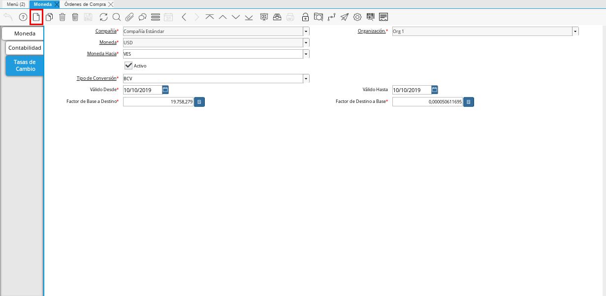
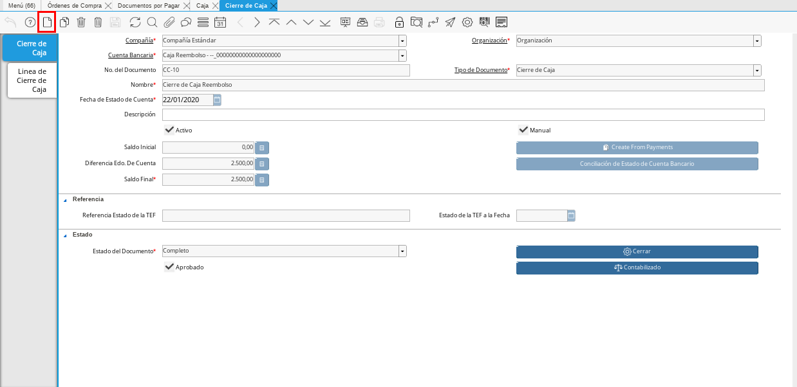

.. |Menú de ADempiere 1| image:: resources/menu1.png 
.. |Orden de Compra sin Completar| image:: resources/orden1.png 
.. |Menú de ADempiere 2| image:: resources/menu2.png 
.. |Icono Registro Nuevo| image:: resources/nuevo1.png

.. |Menú de ADempiere 3| image:: resources/menu3.png
.. |Ventana Moneda| image:: resources/vent1.png
.. |Pestaña Tasas de Cambio| image:: resources/pest1.png

.. |Campo Moneda Hacia| image:: resources/moneda1.png
.. |Campo Tipo de Conversión 1| image:: resources/tipoconver.png

.. |Campo Válido Hasta| image:: resources/hasta1.png
.. |Campo Factor de Base a Destino| image:: resources/factor1.png
.. |Campo Tipo de Conversión 2| image:: resources/tipoconver2.png
.. |Opción Completar 1| image:: resources/completar1.png
.. |Acción Completar| image:: resources/accion1.png
.. |Orden de Compra Completa| image:: resources/resultado1.png

.. |Menú de ADempiere 5| image:: resources/menucaja.png
.. |Campo Organización 1| image:: resources/org1.png
.. |Campo Tipo de Documento| image:: resources/tipodoc1.png
.. |Campo Cuenta Bancaria| image:: resources/cuenta1.png

.. |Menú de ADempiere 6| image:: resources/menucierre1.png

.. |Opción Completar 3| image:: resources/completar3.png

.. _documento/importación:
.. _ERPyA: http://erpya.com

**Importación**
===============

La importación consiste en ingresar al país los productos comprados procedentes de una empresa que se encuentra fuera del territorio nacional. Dicha importación tiene como consecuencia para la empresa nacional la generación de gastos aduanales, sujetos al pago de tributos o al amparo de las franquicias correspondientes.

El presente material elaborado por `ERPyA`_, pretende ofrecerle una explicación eficiente a nuestros clientes del procedimiento a seguir para la importación de productos en ADempiere, en su versión 3.9.2 para la localización Venezuela.

.. _paso/crear-orden-importación:
 
**Crear Orden de Compra de Importación**
****************************************

#. Ubique y seleccione en el menú de ADempiere, la carpeta "**Gestión de Compras**" y luego seleccione la ventana "**Órdenes de Compra**".

    |Menú de ADempiere 1|

    Imagen 1: Menú de ADempiere

#. Realice el procedimiento regular para realizar una orden de compra, explicado en el material :ref:`documento/orden-de-compra`.

    |Orden de Compra sin Completar|

    Imagen 2: Orden de Compra Importación sin Completar

.. note:: 

    El documento debe quedar en estado borrador.

.. _paso/crear-conversión:

**Crear Tipo de Conversión**
****************************

#. Ubique y seleccione en el menú de ADempiere, la carpeta "**Análisis de Desempeño**", luego seleccione la carpeta "**Reglas Contables**", por último seleccione la ventana "**Tipo de Conversión**".

    |Menú de ADempiere 2|

    Imagen 3: Menú de ADempiere

    #. Seleccione el icono "**Registro Nuevo**", ubicado en la barra de herramientas de ADempiere.

        |Icono Registro Nuevo|

        Imagen 4. Icono Registro Nuevo

    #. Introduzca en el campo "**Nombre**" el número de la orden de compra que da origen a la importación, seguido del símbolo "**_**" y el nombre del proveedor seleccionado en dicha orden.

        |Campo Nombre|

        Imagen 5. Campo Nombre

.. note:: 

    Recuerde guardar los cambios realizados seleccionando el icono "**Guardar Cambios**", ubicado en la barra de herramientas de ADempiere.

.. _paso/crear-tasa:

**Crear Tasa de Conversión**
****************************

La tasa de conversión se crea unicamente cuando se conoce el monto, el mismo se extrae de la planilla que emite la aduana.

#. Ubique y seleccione en el menú de ADempiere, la carpeta "**Análisis de Desempeño**", luego seleccione la carpeta "**Reglas Contables**", por último seleccione la ventana "**Moneda**".

    |Menú de ADempiere 3|

    Imagen 6. Menú de ADempiere

#. Seleccione el registro de la moneda seleccionada en el documento "**Orden de Compra**". Para ejemplificar el registro es utilizada la moneda "**USD**".

    |Ventana Moneda|

    Imagen 7. Registro de Moneda USD en ADempiere

    #. Seleccione la pestaña "**Tasas de Cambio**" para navegar entre los diferentes registros de tasas de cambio correspondientes a la moneda "**USD**".

        |Pestaña Tasas de Cambio|

        Imagen 8. Pestaña Tasas de Cambio

    #. Seleccione el icono "**Registro Nuevo**" para crear un nuevo registro de tasas de cambio.

        |Icono Registro Nuevo 2|

        Imagen 9. Icono Registro Nuevo

        .. note::

            La tasa de cambio se debe crear de dólares a bolívares y de bolívares a dólares.

        #. Seleccione en el campo "**Moneda Hacia**", la moneda correspondiente a la nacionalización. Para ejemplificar el registro es utilizada la moneda "**VES**".

            |Campo Moneda Hacia|

            Imagen 10. Campo Moneda Hacia

        #. Seleccione en el campo "**Tipo de Conversión**", el tipo de conversión creado. Para ejemplificar el registro es utilizado el tipo de conversión "**OCI-1000024_Estandar 1**" creado anteriormente.

            |Campo Tipo de Conversión 1|

            Imagen 11. Campo Tipo de Conversión

        #. Seleccione en el campo "**Válido Desde**", la fecha ingresada en el campo "**Fecha de la Orden**" de la orden de compra realizada anteriormente.

            |Campo Válido Desde|

            Imagen 12. Campo Válido Desde

        #. Seleccione en el campo "**Válido Hasta**", la fecha hasta la cual tiene validez la tasa de cambio que esta registrando. 

            |Campo Válido Hasta|

            Imagen 13. Campo Válido Hasta

        #. Introduzca en el campo "**Factor de Base a Destino**", la tasa por la que se multiplica el monto de la orden de compra realizada. Para ejemplificar el registro es utilizada la tasa "**82.000,0**".

            |Campo Factor de Base a Destino|

            Imagen 14. Campo Factor de Base a Destino

.. note:: 

    Recuerde guardar los cambios realizados seleccionando el icono "**Guardar Cambios**", ubicado en la barra de herramientas de ADempiere.

.. _paso/asignar-conversión-orden:

**Asignar Tipo de Conversión a Orden de Compra de Importación**
***************************************************************

#. Regrese a la ventana "**Órdenes de Compra**" y ubique la orden de compra que se encuentra en estado "**Borrador**", creada anteriormente.

    |Orden de Compra sin Completar|

    Imagen 15: Orden de Compra Importación sin Completar

    #. Seleccione en el campo "**Tipo de Conversión**" el tipo de conversión creado. Para ejemplificar el registro es utilizado el tipo de conversión "**OCI-1000024_Estandar 1**", creado anteriormente.

    |Campo Tipo de Conversión 2|

    Imagen 16. Campo Tipo de Conversión

    .. note::

        Recuerde guardar los cambios realizados seleccionando el icono "**Guardar Cambios**", ubicado en la barra de herramientas de ADempiere.

#. Seleccione la opción "**Completar**", ubicada en la parte inferior derecha del documento.

    |Opción Completar 1|

    Imagen 17. Opción Completar Documento

    #. Seleccione la acción "**Completar**" y la opción "**OK**" para completar el documento "**Orden de Compra**".

        |Acción Completar|

        Imagen 18. Acción Completar

#. Podrá visualizar en la parte inferior de la orden de compra, el campo en estado "**Completo**" y el resultado de la conversión configurada anteriormente.

    |Orden de Compra Completa|

    Imagen 19. Orden de Compra Completa

.. _paso/crear-factura-importación:

**Crear Documento por Pagar**
*****************************

#. Ubique y seleccione en el menú de ADempiere, la carpeta "**Gestión de Compras**" y luego seleccione la ventana "**Documentos por Pagar**".

    |Menú de ADempiere 4|

    Imagen 20: Menú de ADempiere

#. Realice el procedimiento regular para realizar un documento por pagar, explicado en el material :ref:`documento/documento-por-pagar`.

    |Factura de Importación|

    Imagen 21. Factura de Cuentas por Pagar Importación

.. _paso/crear-caja-importación:

**Cancelación de Factura**
**************************

#. Ubique y seleccione en el menú de ADempiere, la carpeta "**Gestión de Saldos Pendientes**", luego seleccione la carpeta "**Diario de Caja**", por último seleccione la ventana "**Caja**".

    |Menú de ADempiere 5|

    Imagen 22. Menú de ADempiere

    #. Seleccione en el campo "**Organización**", la organización para la cual esta realizando el documento "**Caja**".

        |Campo Organización 1|

        Imagen 23. Campo Organización

    #. Seleccione el tipo de documento a generar en el campo "**Tipo de Documento**", la selección de este define el comportamiento del documento que se esta elaborando, dicho comportamiento se encuentra explicado en el documento :ref:`documento/tipo-documento` elaborado por `ERPyA`_. Para ejemplificar el registro es utilizada la opción "**Pago Internacional**".

        |Campo Tipo de Documento|

        Imagen 24. Campo Tipo de Documento

    #. Seleccione en el campo "**Cuenta Bancaria**", la caja correspondiente al registro que esta realizando. Para ejemplificar el registro es utilizada la opción "**Caja Importación - --_PAGO USD**".

        |Campo Cuenta Bancaria|

        Imagen 25. Campo Cuenta Bancaria

    #. Seleccione en el campo "**Factura**", la factura de cuenta por pagar correspondiente a la importacipón que esta realizando. Para ejemplificar el registro es utilizada la factura "**1000024**".

        |Campo Factura|

        Imagen 26. Campo Factura

        .. note::

            Recuerde guardar los cambios realizados seleccionando el icono "**Guardar Cambios**", ubicado en la barra de herramientas de ADempiere.
    
    #. Seleccione la opción "**Completar**" ubicada en la parte inferior del documento.

        |Opción Completar 2|

        Imagen 27. Opción Completar

        #. Seleccione la acción "**Completar**" y la opción "**OK**" para completar el documento "**Orden de Compra**".

            |Acción Completar|

            Imagen 28. Acción Completar

.. _paso/cierre-caja-importación:

**Conciliación de Pagos**
*************************

#. Ubique y seleccione en el menú de ADempiere, la carpeta "**Gestión de Saldos Pendientes**", luego seleccione la carpeta "**Diario de Caja**", por último seleccione la ventana "**Cierre de Caja**".

    |Menú de ADempiere 6|

    Imagen 29. Menú de ADempiere

    #. Seleccione el icono "**Registro Nuevo**" ubicado en la barra de herramientas de ADempiere, para realizar un nuevo registro del documento "**Cierre de Caja**".

        |Icono Registro Nuevo 3|

        Imagen 30. Icono Registro Nuevo 

    #. Seleccione en el campo "**Organización**", la organización para la cual esta realizando el documento "**Cierre de Caja**".

        |Campo Organización 2|

        Imagen 31. Campo Organización

    #. Seleccione el tipo de documento a generar en el campo "**Tipo de Documento**", la selección de este define el comportamiento del documento que se esta elaborando, dicho comportamiento se encuentra explicado en el documento :ref:`documento/tipo-documento` elaborado por `ERPyA`_. Para ejemplificar el registro es utilizada la opción "**Cierre de Caja**".

        |Campo Tipo de Documento 2|

        Imagen 32. Campo Tipo de Documento

    #. Seleccione en el campo "**Cuenta Bancaria**", la misma caja seleccionada en el documento "**Caja**" creado. Para ejemplificar el registro es utilizada la opción "**Caja Importación - --_PAGO USD**".

        |Campo Cuenta Bancaria 2|

        Imagen 33. Campo Cuenta Bancaria

    #. Seleccione el proceso "**Crear a Partir de Pagos**" para crear el cierre de caja a partir de los pagos.

        |Opción Crear Desde|

        Imagen 34. Proceso Crear a Partir de Pagos

        #. Podrá visualizar la ventana "**Crear extracto bancario a partir de pagos**", con los campos necesarios para filtrar la búsqueda.

            |Ventana del Proceso Crear Desde|

            Imagen 35. Ventana del Proceso Crear a Partir de Pagos

        #. Seleccione la opción "**Comenzar Búsqueda**" para buscar los documentos creados al socio del negocio intermediario.

            |Opción Comenzar Búsqueda|

            Imagen 36. Opción Comenzar Búsqueda

        #. Seleccione el pago con monto en negativo creado anteriormente desde el documento "**Caja**" y la opción "**OK**" para cargar la información a la ventana "**Cierre de Caja**".

            |Seleccionar Pagos 1|

            Imagen 37. Seleccionar Pagos 

            .. note::

                Recuerde seleccionar el icono "**Refrescar**" en la barra de herramientas de ADempiere, para refrescar el registro en la ventana "**Cierre de Caja**".

        #. Seleccione la opción "**Completar**", para completar el documento "**Cierre de Caja**".

            |Opción Completar 3|

            Imagen 38. Opción Completar

            #. Seleccione la acción "**Completar**" y la opción "**Ok**" para completar el documento "**Caja**".

                |Acción Completar|

                Imagen 39. Acción Completar