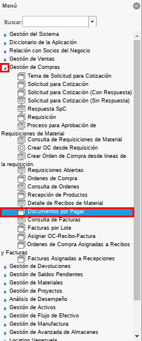
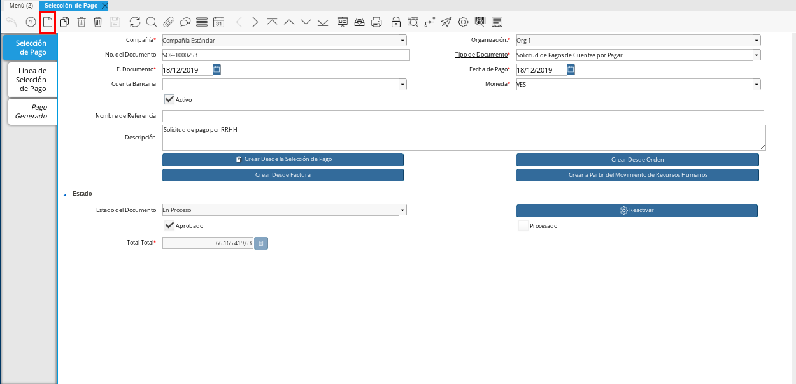
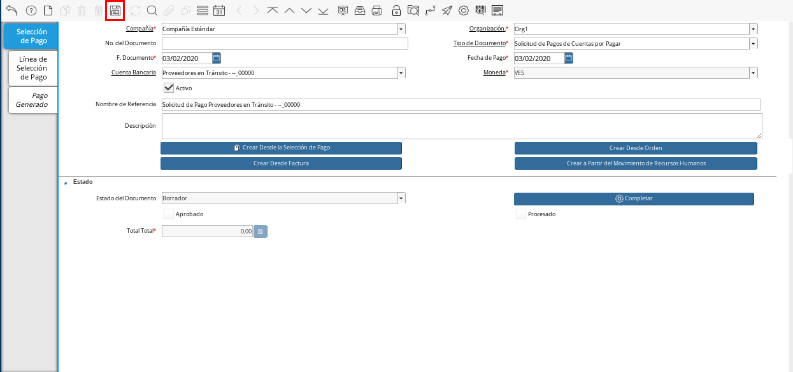
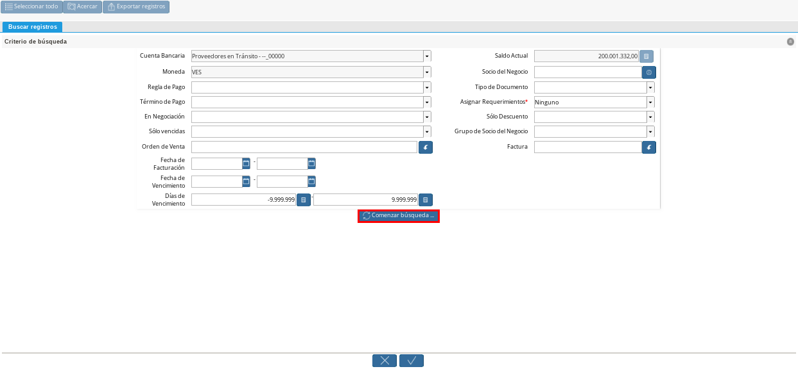

.. _ERPyA: http://erpya.com
.. |Menú de ADempiere 1| image:: resources/menutransf.png
.. |Menú de ADempiere 11| image:: resources/menutransf.png
.. |Ejemplo de Transferencia Bancaria| image:: resources/transferencia.png

.. |Documento Pago Cobro| image:: resources/pagocobro1.png
.. |Documento Caja| image:: resources/docaja1.png
.. |Menú de ADempiere 2| image:: resources/menucierre1.png
.. |Cierre de Caja| image:: resources/cierrecaja3.png

.. |Menú de ADempiere 4| image:: resources/menusolicitud.png

.. |Campo Organización| image:: resources/org4.png
.. |Campo Tipo de Documento| image:: resources/tipodoc4.png

.. |Campo Nombre de Referencia| image:: resources/nombre2.png

.. |Crear Desde Factura 1| image:: resources/creardesde2.png

.. |Selección de Factura y Opción OK| image:: resources/selecfacturas1.png

.. |Acción Completar y Opción OK| image:: resources/accion1.png
.. |Menú de ADempiere 5| image:: resources/menuimprimir.png

.. |Opción Exportar Registros| image:: resources/exportareg1.png

.. |Mensaje para Confirmar Documento| image:: resources/confirmacion2.png

.. |Cierre de Caja 2| image:: resources/cierrecaja4.png

.. _documento/anticipo-a-proveedores-en-transito:

**Anticipo a Proveedores en Tránsito**
======================================

Un anticipo a proveedor es el pago de una parte o un porcentaje del monto total de una compra o venta, realizado por adelantado. El mismo tiene la finalidad de asegurar los productos o servicios que el comprador requiere y por los cuales el vendedor amerita un anticipo para cubrir diferentes gastos.

En ADempiere es posible reflejar los anticipos realizados a proveedores en tránsito, permitiendo por medio de este, el control de los saldos abiertos que tienen los proveedores.

.. _paso/carga-anticipo:

**Carga de Anticipo**
*********************

La transferencia representa un proceso en el cual se generan los pagos por concepto de anticipos al gestor(s), el mismo requiere conocimientos básicos en el proceso actual de tesorería en ADempiere. 

.. note::

    Se requiere la definición de una caja intermediario para la liquidación de anticipo, para esto contacte a un consultor de **E.R.P. Consultores y Asociados**.

El traslado de fondo reflejará en la cuenta de banco un egreso por el anticipo (Pago a Conciliar) y genera un ingreso en la cuenta puente (Caja Intermediario _NumOrden_Proveedor) que será utilizado para gestionar los pagos de terceros, cuando a un gestor se le conceda un anticipo, el mismo se gestionará a través de la caja creada previamente.

En primer lugar se creará el anticipo gestionando un traslado de fondos mediante el proceso de transferencia  a la caja (Caja Intermediario _NumOrden_Proveedor)  y se paga desde el banco en el cual sale realmente el pago. 

Para realizar tal procedimiento en ADempiere se debe realizar un transferencia, la transferencia bancaria es el proceso mediante el cual se realizan los traslados de fondos entre cuentas (Banco Real a Caja Intermediario _NumOrden_Proveedor), a continuación se define el proceso para realizar una transferencia bancaria en ADempiere. 

Ubique y seleccione en el menú de ADempiere la carpeta "**Gestión de Saldos Pendientes**", luego seleccione el proceso "**Transferencia Bancaria**".

    |Menú de ADempiere 11|

    Imagen 1. Menú de ADempiere

Realizar una transferencia bancaria con las siguientes condiciones:

    **Banco Desde**: Banco desde la cual se cancelará el anticipo

    **Banco a Transferir**: Cuenta caja de importación definida anteriormente.

    **Socio del Negocio**: Socio del Negocio al cual se le cancelará el anticipo.

    **Moneda**: Moneda en la cual se cancelará la transferencia

    **Cargo**: Cargo correspondiente al anticipo "**Anticipo a Tercero**".
        
    **Número del Documento**: Referencia correspondiente a la transferencia bancaria.

    **Monto**: Monto del anticipo.

    **Descripción**: Breve descripción sobre la transferencia.

    **Fecha de Estado de Cuenta**: Fecha de la transferencia realizada.

    **Fecha Contable**: Fecha de la transferencia realizada.

Resultados:

    **Egreso**:

        - **Resultado**: Se realiza un egreso en banco por el monto a cancelar.

        - **Resultado Contable**: A continuación se presenta un ejemplo de un resultado contable.

        +--------------+------------------------------------------------------------+----------------------+-----------------------+
        | Organización |                         Cuenta                             | Débito Contabilizado | Crédito Contabilizado |
        +==============+============================================================+======================+=======================+
        | Organización |1.1.2.4.1.003 - TRANSITO ANTICIPO INTERMEDIARIOS            |         64.000.000,00|                   0,00|
        +--------------+------------------------------------------------------------+----------------------+-----------------------+
        | Organización | 1.1.1.1.2.1.011.002 - TRANSITO BANESCO BANCO UNIVERSAL C.A.|                  0,00|          64.000.000,00|
        +--------------+------------------------------------------------------------+----------------------+-----------------------+
        |              |                                                            |         64.000.000,00|          64.000.000,00|
        +--------------+------------------------------------------------------------+----------------------+-----------------------+

    **Ingreso**:

        - **Resultado**: Se realiza un ingreso en caja por el monto a cancelar

        - **Resultado Contable**: A continuación se presenta un ejemplo de un resultado contable.

        +--------------+-------------------------------------------------------------------+----------------------+-----------------------+
        | Organización |                             Cuenta                                | Débito Contabilizado | Crédito Contabilizado |
        +==============+===================================================================+======================+=======================+
        | Organización |1.1.2.4.1.002 - ANTICIPOS A INTERMEDIARIOS PENDIENTES POR CONCILIAR|         64.000.000,00|                   0,00|
        +--------------+-------------------------------------------------------------------+----------------------+-----------------------+
        | Organización |1.1.2.4.1.003 - TRANSITO ANTICIPO INTERMEDIARIOS                   |                  0,00|          64.000.000,00|
        +--------------+-------------------------------------------------------------------+----------------------+-----------------------+
        |              |                                                                   |         64.000.000,00|          64.000.000,00|
        +--------------+-------------------------------------------------------------------+----------------------+-----------------------+

A continuación se presenta un ejemplo de la ventana "**Transferencia Bancaria**".

    |Ejemplo de Transferencia Bancaria|

    Imagen 2. Ejemplo de Transferencia Bancaria

.. _paso/transferencia-anticipo-transito:

**Transferencia Bancaria**
--------------------------

Ubique y seleccione en el menú de ADempiere, la carpeta "**Gestión de Saldos Pendientes**", luego seleccione el proceso "**Transferencia Bancaria**".

    |Menú de ADempiere 1|

    Imagen 1. Menú de ADempiere

Realice el procedimiento regular de transferencia bancaria explicado en la :ref:`paso/carga-anticipo` del documento "**Liquidación Anticipo Intermediario**", para transferir desde un banco determinado de la empresa a la caja del proveedor en tránsito al cual se le aplicará el anticipo.

    Para realizar el procedimiento se debe tomar en cuenta lo siguiente:

        - **Cuenta Bancaria Desde**: 0105-0000000000000000

        - **Cuenta Bancaria a Transferir**: Proveedores en Tránsito - --_00000

        - **Socio del Negocio**: Proveedor Estándar

        - **Moneda**: VES

        - **Cargo**: Anticipo Tercero

        - **No. del Documento**: 0111245859

        - **Documento Destino**: 0111245859

        - **Monto**: 200.001.332,00

        - **Descripción**: Transferencia de Anticipo a Proveedor en Tránsito

        - **Fecha de Estado de Cuenta**: 03/01/2020

        - **Fecha Contable**: 03/01/2020

    Quedando la ventana del proceso "**Transferencia Bancaria**", de la siguiente manera:

        |Transferencia Bancaria|

        Imagen 2. Transferencia Bancaria

    Al seleccionar la opción "**OK**, ADempiere realiza la transferencia en base a los datos ingresados en los campos de la ventana, generando un documento en "**Pago/Cobro**" que representa el egreso en el banco seleccionado y un documento en "**Caja**" que representa el ingreso en la caja seleccionada.

        **Egreso**:

            - **Resultado**: Se realiza un egreso en banco por el monto a cancelar.

                |Documento Pago Cobro|

                Imagen 3. Documento en Pago/Cobro

            - **Resultado Contable**: A continuación se presenta un ejemplo de un resultado contable.

                +--------------+------------------------------------------------------------+----------------------+-----------------------+
                | Organización |                         Cuenta                             | Débito Contabilizado | Crédito Contabilizado |
                +==============+============================================================+======================+=======================+
                | Organización |1.1.1.1.1.015 - EFECTIVO EN TRANSITO PROVEEDORES            |        200.001.332,00|                   0,00|
                +--------------+------------------------------------------------------------+----------------------+-----------------------+
                | Organización |1.1.1.1.2.1.005.002 - TRANSITO MERCANTIL C.A. BANCO         |                  0,00|         200.001.332,00|
                +--------------+------------------------------------------------------------+----------------------+-----------------------+
                |              |                                                            |        200.001.332,00|         200.001.332,00|
                +--------------+------------------------------------------------------------+----------------------+-----------------------+

        **Ingreso**:

            - **Resultado**: Se realiza un ingreso en caja por el monto a cancelar.

                |Documento Caja|

                Imagen 4. Documento en Caja

            - **Resultado Contable**: A continuación se presenta un ejemplo de un resultado contable.

                +--------------+------------------------------------------------------------+----------------------+-----------------------+
                | Organización |                         Cuenta                             | Débito Contabilizado | Crédito Contabilizado |
                +==============+============================================================+======================+=======================+
                | Organización |1.1.2.2.001 - ANTICIPOS A PROVEEDORES NACIONALES            |        200.001.332,00|                   0,00|
                +--------------+------------------------------------------------------------+----------------------+-----------------------+
                | Organización |1.1.1.1.1.015 - EFECTIVO EN TRANSITO PROVEEDORES            |                  0,00|         200.001.332,00|
                +--------------+------------------------------------------------------------+----------------------+-----------------------+
                |              |                                                            |        200.001.332,00|         200.001.332,00|
                +--------------+------------------------------------------------------------+----------------------+-----------------------+

.. _paso/cierre-caja-anticipo-transito:

**Cierre de Caja**
******************

El cierre de caja es realizado para indicar a ADempiere que al socio del negocio "**Proveedor Estándar**", se le realizó una transferencia bancaria como anticipo a su caja "**Proveedores en Tránsito - --_00000**", por el monto de "**200.001.332,00**".

Ubique y seleccione en el menú de ADempiere, la carpeta "**Gestión de Saldos Pendientes**", luego seleccione la carpeta "**Diario de Caja**", por último seleccione la ventana "**Cierre de Caja**".

    |Menú de ADempiere 2|

    Imagen 5. Menú de ADempiere

Realice el procedimiento regular para generar el cierre de caja, explicado en la :ref:`paso/cierre-caja-importación` del documento "**Importación**", seleccionando la caja proveedores en transito creada. Luego de completar el procedimiento podrá apreciar en el campo "**Saldo Final**", el saldo abierto que posee el socio del negocio proveedor.

    |Cierre de Caja|

    Imagen 6. Cierre de Caja

.. _paso/cierre-caja-final-anticipo-transito:

**Cierre de Caja**
******************

Ubique y seleccione en el menú de ADempiere, la carpeta "**Gestión de Saldos Pendientes**", luego seleccione la carpeta "**Diario de Caja**", por último seleccione la ventana "**Cierre de Caja**".

    |Menú de ADempiere 2|

    Imagen 5. Menú de ADempiere

Realice el procedimiento regular para generar el cierre de caja, explicado en la :ref:`paso/cierre-caja-importación` del documento "**Importación**", seleccionando la caja proveedores en transito creada. Luego de completar el procedimiento podrá apreciar en el campo "**Saldo Final**", el saldo abierto que posee el socio del negocio proveedor.

    |Cierre de Caja 2|

    Imagen 6. Cierre de Caja
