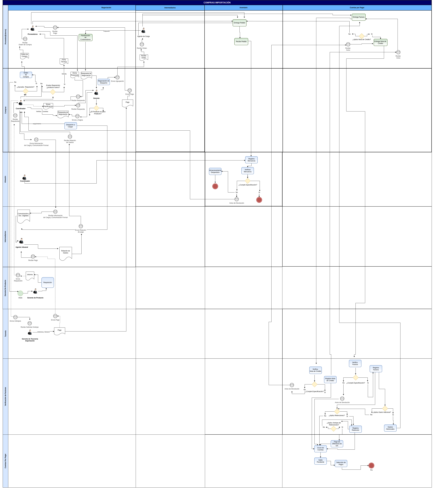

.. _src/lve/procedures/import:

==========================
**Gestión de Importación**
==========================

La importación consiste en ingresar al país los productos comprados procedentes de una empresa que se encuentra fuera del territorio nacional. Ahora bien, este proceso tiene implicaciones tributarias, para entender mejor vamos a esquematizar una seríe de pasos que ocurren en este proceso:

    La empresa Importadora selecciona a un agente aduanal, conforme al **artículo 35 de la Ley Orgánica de Aduanas**

    .. note::
        **Artículo 35:**

        El Agente de Aduanas es la persona autorizada por el Ministerio de Hacienda para actuar ante los órganos competentes en nombre y por cuenta de aquél que contrata sus servicios, en el trámite de una operación o actividad
        aduanera.
        Sin menoscabo de las responsabilidades, que según esta Ley correspondan al consignatario aceptante, exportador o emitente de las mercancías, el agente de aduanas será responsable ante el Fisco Nacional y ante su mandante por las infracciones cometidas a la normativa aduanera derivadas de su acción u omisión, dolosa o culposa en el ejercicio de sus funciones.

    El consignatario (Agente aduanal o Importador) establecen la clasificación arancelaria, o es solicitada ante el **SENIAT**, en caso de no tener clara la clasificación.

    En forma paralela, el importador deberá realizar la gestión de negociación con el proveedor de mercancía, depende de la negociación se generará el costo CIF, caso contrario el importador realiza la logística de traslado o transporte de la importación, esta gestión generará algunos gastos imputados a la gestión y que se transforman en costos FOB del material importado, alguno de ellos pueden ser:

        Transporte Internacional
        Paletizaje
        Seguros

    Por su parte, el agente aduanal realiza el manifiesto de importación y la declaración única de su valor, anexando los siguientes documentos para nacionalizar la mercancía:
        
        Facturas Comerciales
        Facturas de Flete
        Conocimiento de Embarque
        Guía Aérea
        Carta de porte relacionada al medio de transporte en la cual se importó la mercancía
        Declaración jurada del valor en aduana
        Poliza de seguros
        Certificación de origen de mercancía (de ser necesario)
        Certificación o autorizaciones previas (de ser necesario)
        Otros documentos necesarios por la aduana

    Luego, en un periodo no mayor a tres(3) días habiles el importador debe realizar el pago de los tributos aduaneros, una vez sea efectivo el pago, la aduana asigna un canal de control a la declaración única:
    
        Canal Verde: La mercancí es retirada inmediatamente, sin ser necesario examén o reconocimiento.
        Canal Amarillo: La mercancía es sometida a examén documental, de no tener observaciones es liberada en un plazo no mayor a 24 horas.
        Canal Rojo: La mercancía es sometida a reconocimiento físico y examén documental, de no tener observaciones es liberada en un plazo no mayor a 48 horas.

    
     Finalmente, se para retirar la mercancía se cancela el servicio de almacenaje en zona franca, posteriormente, el agente aduanal entrega la documentación completa al importador una vez haya culminado en su totalidad la nacionalización, y se haya completado los derechos de tasas portuaria y tarifas por servicios portuarios establecidos según sea el caso en la :download:`Ley Orgánica de Aduanas <LEY_ORGANICA_DE_ADUANAS.pdf>`.

    Junto a la documentación del expediente el agente aduanal consigna la relación de gastos de nacionalización, tales como:

        Planilla Forma 79084
        Planilla Forma 99086
        Planilla de Pre-Liquidación
        Especies fiscales
        Impuestos municipales
        Impuestos de grandes transacciones financieras
        Comisiones
        Documentación 
        Valoración de manifiesto
        Precintos
        Movilización 
        Liberaciones
        Gastos por administrativos
        Multas
        Almacenajes
        Uso de Superficie
        Entre otros Gastos
        Seguros nacionales
        Seguridad y vigilancia
        Honorarios profesionales
    
    Estos gastos, son cancelados mediante anticipos o pos consignación, bajo un cruce de cuentas entre el agente aduanal y el importador, para finalmente ser convertidos a costos FOB de la mercancía importada, sin embargo en el libro de compras bajo legislación venezolana debe ser reflejados unicamente los costos CIF con el IVA resultante de estos costos.

        |Diagrama|

    El presente material elaborado por `ERPyA`_, pretende ofrecerle una explicación eficiente a nuestros clientes del procedimiento a seguir para la importación de productos en ADempiere, en su versión 3.9.2 para la localización Venezuela.

.. toctree::
    :maxdepth: 2

    import
    advance-payment-to-transit-providers
    intermediary-advance-settlement
