.. _ERPyA: http://erpya.com
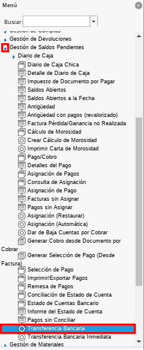
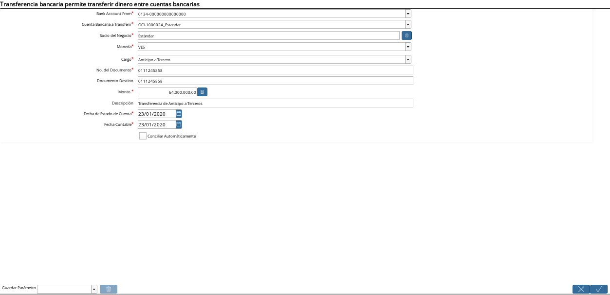
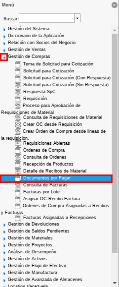
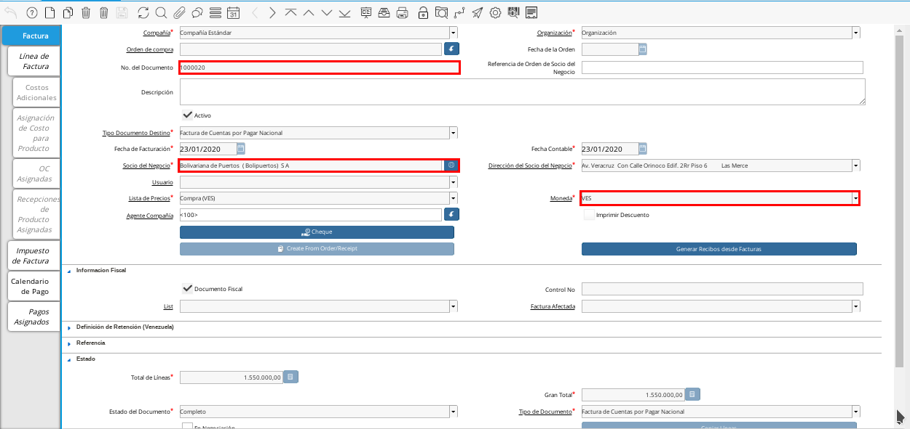
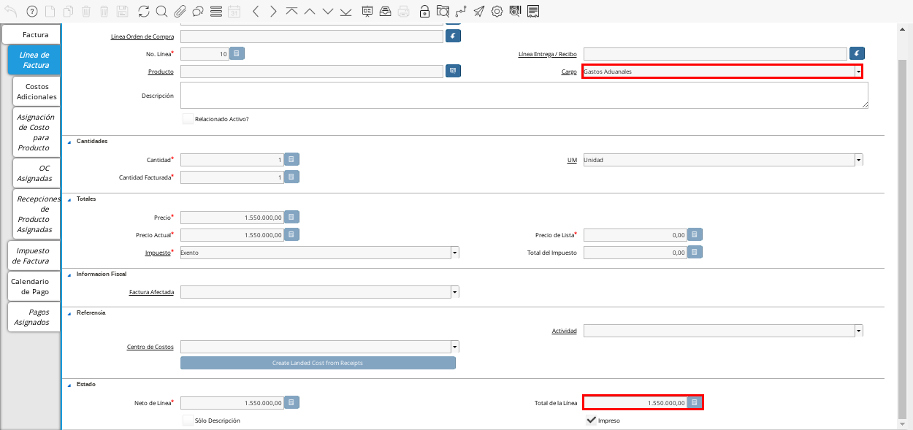
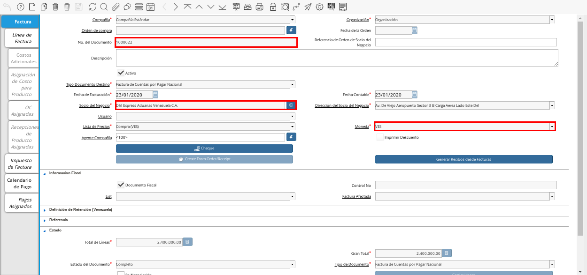
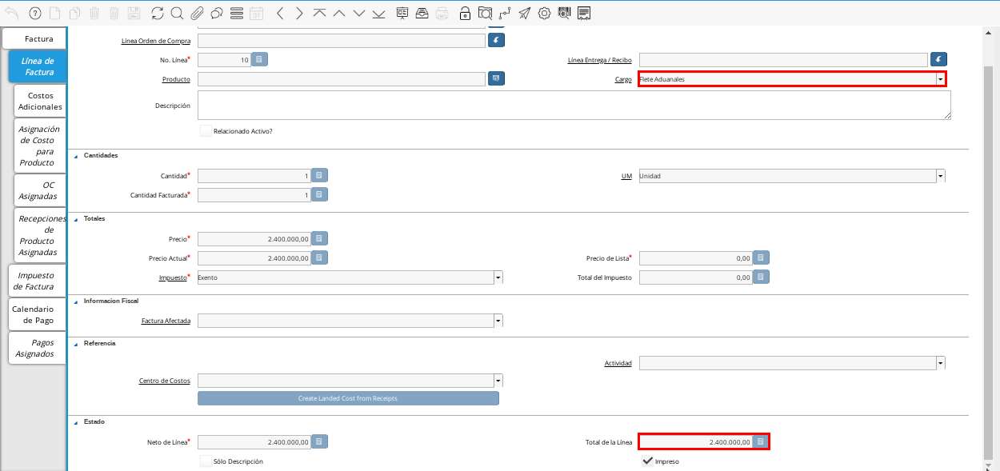
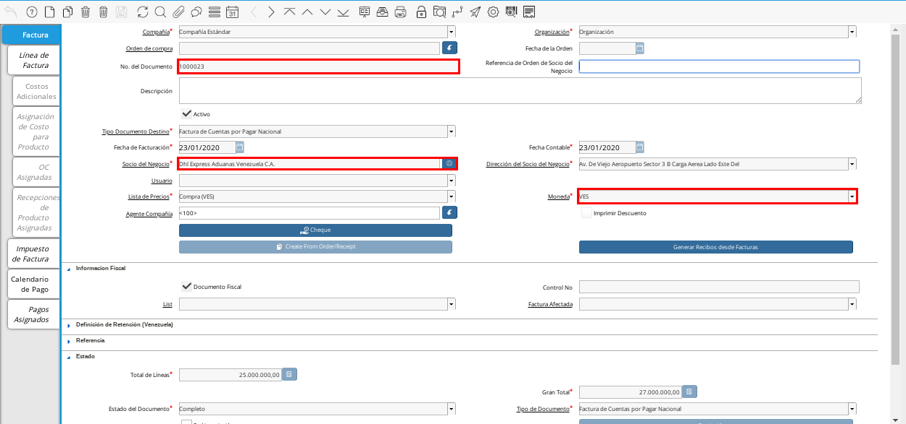
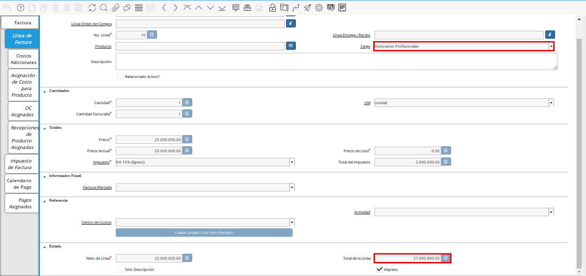
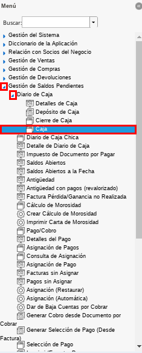
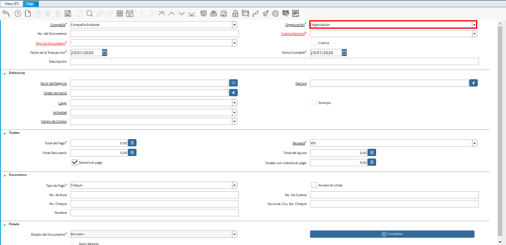
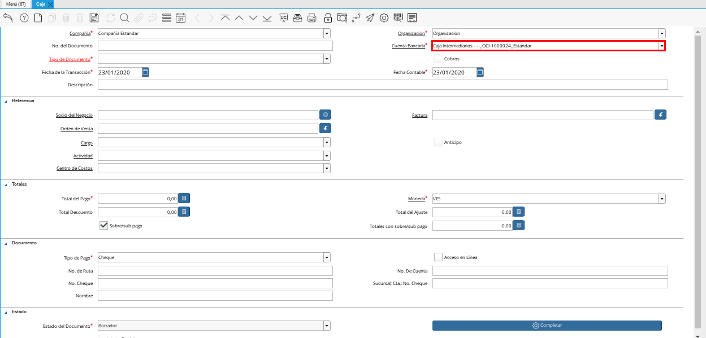
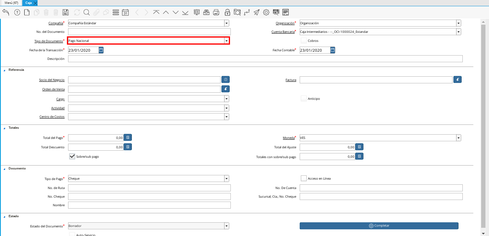
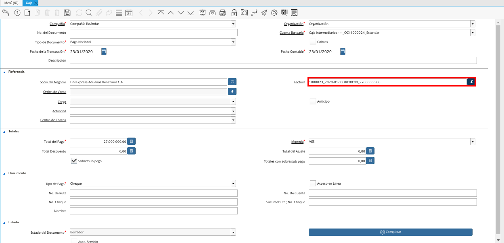
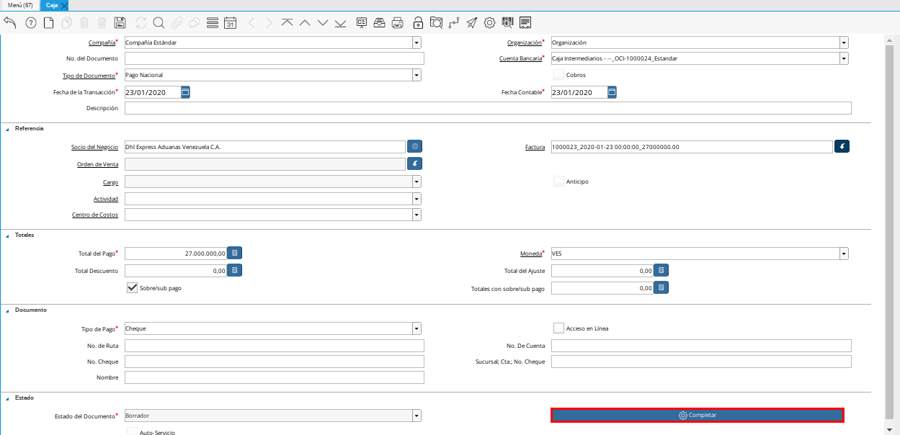
.. |Acción Completar| image:: resources/accion1.png
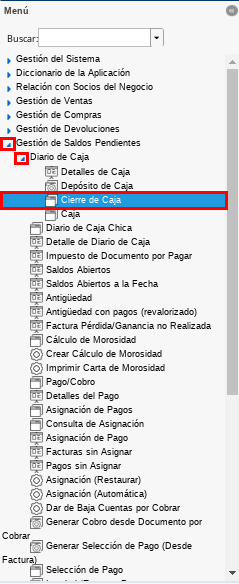
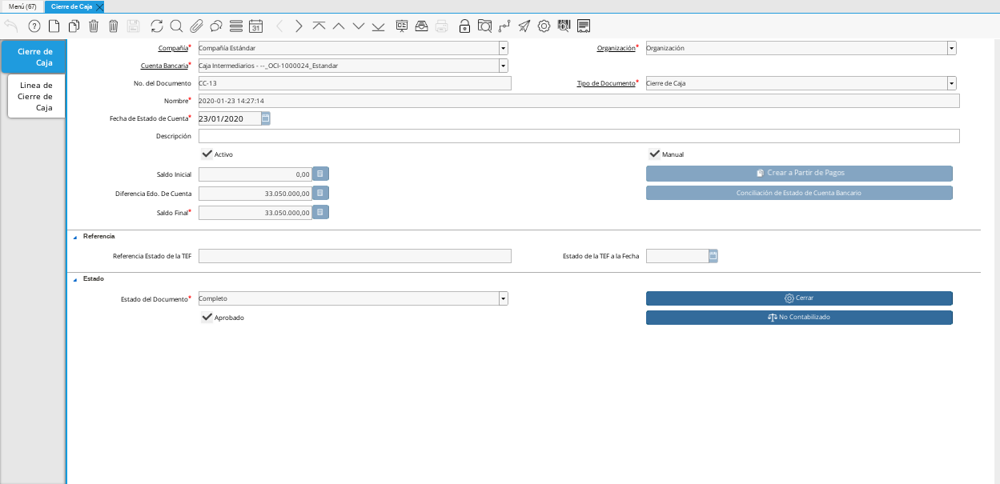
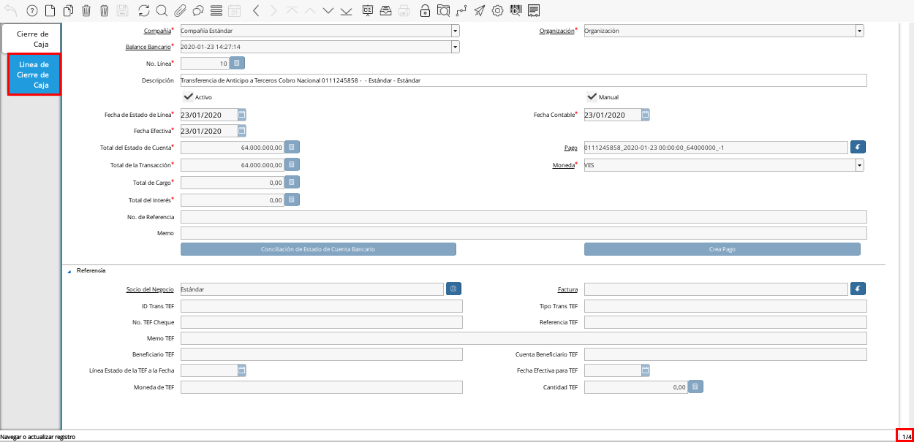
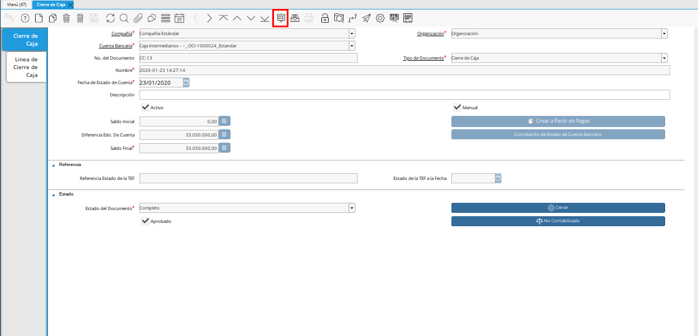
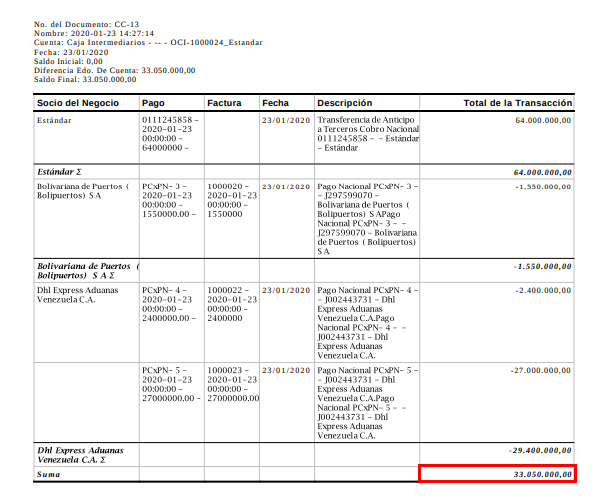

.. _documento/liquidación-anticipo-intermeiario:

**Liquidación Anticipo Intermediario**
======================================

Posterior a la concesión del anticipo, será justificado el anticipo relacionando los gastos (Facturas) es entonces cuando se procede a liquidar los anticipos concedidos al gestor de importación.

La operación de anticipos a terceros está compuesta por cinco fases u operaciones las cuales no tienen porqué ser todas necesarias en el proceso de liquidación:

Anticipo a terceros(Gestor)
Registrar justificantes(Carga de Facturas de Cuentas por Pagar) 
Relación de Pasivos(Gestor)
Incremento de anticipo a terceros(Gestor)
Liquidación de Anticipos y CxP

.. _paso/carga-anticipo:

**Carga de Anticipo**
*********************

La transferencia representa un proceso en el cual se generan los pagos por concepto de anticipos al gestor(s), el mismo requiere conocimientos básicos en el proceso actual de tesorería en ADempiere. 

.. note::

    Se requiere la definición de una caja intermediario para la liquidación de anticipo, para esto contacte a un consultor de **E.R.P. Consultores y Asociados**.

El traslado de fondo reflejará en la cuenta de banco un egreso por el anticipo (Pago a Conciliar) y genera un ingreso en la cuenta puente (Caja Intermediario _NumOrden_Proveedor) que será utilizado para gestionar los pagos de terceros, cuando a un gestor se le conceda un anticipo, el mismo se gestionará a través de la caja creada previamente.

En primer lugar se creará el anticipo gestionando un traslado de fondos mediante el proceso de transferencia  a la caja (Caja Intermediario _NumOrden_Proveedor)  y se paga desde el banco en el cual sale realmente el pago. 

Para realizar tal procedimiento en ADempiere se debe realizar un transferencia, la transferencia bancaria es el proceso mediante el cual se realizan los traslados de fondos entre cuentas (Banco Real a Caja Intermediario _NumOrden_Proveedor), a continuación se define el proceso para realizar una transferencia bancaria en ADempiere. 

Ubique y seleccione en el menú de ADempiere la carpeta "**Gestión de Saldos Pendientes**", luego seleccione el proceso "**Transferencia Bancaria**".

    |Menú de ADempiere 1|

    Imagen 1. Menú de ADempiere

    Realizar una transferencia bancaria con las siguientes condiciones:

        **Banco Desde**: Banco desde la cual se cancelará el anticipo

        **Banco a Transferir**: Cuenta caja de importación definida anteriormente.

        **Socio del Negocio**: Socio del Negocio al cual se le cancelará el anticipo.

        **Moneda**: Moneda en la cual se cancelará la transferencia

        **Cargo**: Cargo correspondiente al anticipo "**Anticipo a Tercero**".
            
        **Número del Documento**: Referencia correspondiente a la transferencia bancaria.

        **Monto**: Monto del anticipo.

        **Descripción**: Breve descripción sobre la transferencia.

        **Fecha de Estado de Cuenta**: Fecha de la transferencia realizada.

        **Fecha Contable**: Fecha de la transferencia realizada.

    Resultados:

        **Egreso**:

            - **Resultado**: Se realiza un egreso en banco por el monto a cancelar.

            - **Resultado Contable**: A continuación se presenta un ejemplo de un resultado contable.

            +--------------+------------------------------------------------------------+----------------------+-----------------------+
            | Organización |                         Cuenta                             | Débito Contabilizado | Crédito Contabilizado |
            +==============+============================================================+======================+=======================+
            | Organización |1.1.2.4.1.003 - TRANSITO ANTICIPO INTERMEDIARIOS            |         64.000.000,00|                   0,00|
            +--------------+------------------------------------------------------------+----------------------+-----------------------+
            | Organización | 1.1.1.1.2.1.011.002 - TRANSITO BANESCO BANCO UNIVERSAL C.A.|                  0,00|          64.000.000,00|
            +--------------+------------------------------------------------------------+----------------------+-----------------------+
            |              |                                                            |         64.000.000,00|          64.000.000,00|
            +--------------+------------------------------------------------------------+----------------------+-----------------------+

        **Ingreso**:

            - **Resultado**: Se realiza un ingreso en caja por el monto a cancelar

            - **Resultado Contable**: A continuación se presenta un ejemplo de un resultado contable.

            +--------------+-------------------------------------------------------------------+----------------------+-----------------------+
            | Organización |                             Cuenta                                | Débito Contabilizado | Crédito Contabilizado |
            +==============+===================================================================+======================+=======================+
            | Organización |1.1.2.4.1.002 - ANTICIPOS A INTERMEDIARIOS PENDIENTES POR CONCILIAR|         64.000.000,00|                   0,00|
            +--------------+-------------------------------------------------------------------+----------------------+-----------------------+
            | Organización |1.1.2.4.1.003 - TRANSITO ANTICIPO INTERMEDIARIOS                   |                  0,00|          64.000.000,00|
            +--------------+-------------------------------------------------------------------+----------------------+-----------------------+
            |              |                                                                   |         64.000.000,00|          64.000.000,00|
            +--------------+-------------------------------------------------------------------+----------------------+-----------------------+

    A continuación se presenta un ejemplo de la ventana "**Transferencia Bancaria**".

        |Ejemplo de Transferencia Bancaria|

        Imagen 2. Ejemplo de Transferencia Bancaria

.. _paso/carga-factura-cxp:

**Carga de Factura de Cuentas por Pagar**
*****************************************

Ubique y seleccione en el menú de ADempiere, la carpeta "**Gestión de Compras**", luego seleccione la ventana "**Documentos por Pagar**".

    |Menú de ADempiere 2|

    Imagen 3. Menú de ADempiere

Realice el procedimiento habitual para crear los documentos por pagar necesarios, explicado en el material :ref:`documento/documento-por-pagar` elaborado por `ERPyA`_. Para ejemplificar el registro se realizan tres facturas como relación entregada por el intermediario gestor de la importacióncon.

    Factura "**1000020**", con socio del negocio "**Bolivariana de Puertos  ( Bolipuertos)  S A**" y moneda "**VES**".
    
        |Documento por Pagar 1|

        Imagen 4. Documento por Pagar

        Podrá visualizar en la pestaña "**Línea de la Factura**", el cargo "**Gastos Aduanales**" utilizado para generar el documento por pagar con el monto de "**1.550.000,00**".

            |Pestaña Línea de la Factura 1|

            Imagen 5. Pestaña Línea de la Factura

    Factura "**1000022**", con socio del negocio "**Dhl Express Aduanas Venezuela C.A.**" y moneda "**VES**".
    
        |Documento por Pagar 2|

        Imagen 6. Documento por Pagar

        Podrá visualizar en la pestaña "**Línea de la Factura**", el cargo "**Flete Aduanales**" utilizado para generar el documento por pagar con el monto de "**2.400.000,00**".

            |Pestaña Línea de la Factura 2|

            Imagen 7. Pestaña Línea de la Factura

    Factura "**1000023**", con socio del negocio "**Dhl Express Aduanas Venezuela C.A.**" y moneda "**VES**".
    
        |Documento por Pagar 3|

        Imagen 8. Documento por Pagar

        Podrá visualizar en la pestaña "**Línea de la Factura**", el cargo "**Honorarios Profesionales**" utilizado para generar el documento por pagar con el monto de "**27.000.000,00**".

            |Pestaña Línea de la Factura 3|

            Imagen 9. Pestaña Línea de la Factura

.. note::

    Si ya se encuentra recepcionada la mercancía debe seguir el procedimiento de costos adicionales asociado a una recepción, de otro modo debe ser cargada de forma regular y ser reversada mediante un ajuste de crédito al recepcionar la mercancía, cargando un ajuste de débito con el procedimiento de costo adicional.

.. _paso/cancelación-cruce-anticipo-cuentas:

**Cancelación ó Cruce de Anticipo con Cuentas por Pagar**
*********************************************************

La caja a definir funge en el procedimiento de anticipos a terceros como un puente para el registro y pago de los anticipos a proveedores intermediarios en el proceso de importación y para la posterior liquidación de las facturas entregadas en la relación de gastos o costos de nacionalización y cierre de los anticipos.

En la siguiente ventana de "**Caja**" se realizan todos los pagos de las facturas pendientes por cancelar, a continuación se define el proceso de caja en ADempiere.

Ubique y seleccione en el menú de ADempiere, la carpeta "**Gestión de Saldos Pendientes**", luego seleccione la carpeta "**Diario de Caja**", por último seleccione la ventana "**Caja**".

    |Menú de ADempiere 3|

    Imagen 10. Menú de ADempiere

    .. note::

        El requerimiento principal para realizar el proceso de gestión de caja de intermediario es tener una definición de caja creada.

    Seleccione en el campo "**Organización**", la organización para la cual esta realizando el documento "**Caja**".

        |Campo Organización 1|

        Imagen 11. Campo Organización

    Seleccione en el campo "**Cuenta Bancaria**" la cuenta caja correspondiente al documento que esta realizando. Para ejemplificar el registro es utilizada la opción "**Caja Intermediarios - --_OCI-1000024_Estandar**".

        |Campo Cuenta Bancaria 1|

        Imagen 12. Campo Cuenta Bancaria
        
    Seleccione el tipo de documento a generar en el campo "**Tipo de Documento**", la selección de este define el comportamiento del documento que se esta elaborando, dicho comportamiento se encuentra explicado en el documento **Tipo de Documento** elaborado por `ERPyA`_. Para ejemplificar el registro es utilizada la opción "**Pago Nacional**".

        |Campo Tipo de Documento 1|

        Imagen 13. Campo Tipo de Documento

    Seleccione en el campo "**Factura**", la factura que será reflejada en la caja que esta realizando. Para ejemplificar el registro es utilizada la factura "**1000023**" creada anteriormente.

        |Campo Factura 1|

        Imagen 14. Campo Factura

        .. note:: 

            Recuerde guardar los cambios realizados seleccionando el icono "**Guardar Cambios**", ubicado en la barra de herramientas de ADempiere.

    Seleccione la opción "**Completar**", ubicada en la parte inferior del documento.

        |Opción Completar 2|

        Imagen 15. Opción Completar

        Seleccione la acción "**Completar**" y la opción "**Ok**" para completar el documento "**Caja**".

            |Acción Completar|

            Imagen 16. Acción Completar

.. note::

    Repita el procedimiento con todos los documentos por pagar importación correspondientes a la relación entregada por el intermediario gestor de la importación.

Cuentas por pagar emite una "**Solicitud de Pago**" seleccionando la caja creada previamente y asociando todas las facturas de la relación entregada por el intermediario gestor de la importación.

Tesorería ejecuta el proceso de "**Imprimir/Exportar**" llamando la solicitud de pago creada previamente.

Resultados:

    **Egreso**:

        - **Resultado**: Se genera un egreso en caja por el monto a cancelar.

        - **Resultado Contable en Caja**:

            +--------------+-------------------------------------------------------------------+----------------------+-----------------------+
            | Organización |                              Cuenta                               | Débito Contabilizado | Crédito Contabilizado |
            +==============+===================================================================+======================+=======================+
            | Organización |2.1.4.1.3.002 - SELECCIÓN DE PAGOS                                 |         27.000.000,00|                   0,00|
            +--------------+-------------------------------------------------------------------+----------------------+-----------------------+
            | Organización |1.1.2.4.1.002 - ANTICIPOS A INTERMEDIARIOS PENDIENTES POR CONCILIAR|                  0,00|          27.000.000,00|
            +--------------+-------------------------------------------------------------------+----------------------+-----------------------+
            |              |                                                                   |         27.000.000,00|          27.000.000,00|
            +--------------+-------------------------------------------------------------------+----------------------+-----------------------+

        - **Resultado Contable en Asignación entre Factura y Pago**:

            +--------------+-------------------------------------------------------------------+----------------------+-----------------------+
            | Organización |                              Cuenta                               | Débito Contabilizado | Crédito Contabilizado |
            +==============+===================================================================+======================+=======================+
            | Organización |2.1.1.1.1.001 - CUENTAS POR PAGAR PROVEEDORES NACIONALES           |         27.000.000,00|                   0,00|
            +--------------+-------------------------------------------------------------------+----------------------+-----------------------+
            | Organización |2.1.4.1.3.002 - SELECCIÓN DE PAGOS                                 |                  0,00|          27.000.000,00|
            +--------------+-------------------------------------------------------------------+----------------------+-----------------------+
            |              |                                                                   |         27.000.000,00|          27.000.000,00|
            +--------------+-------------------------------------------------------------------+----------------------+-----------------------+

.. _paso/conciliación-liquidación:

**Conciliación de Liquidación**
*******************************

Ubique y seleccione en el menú de ADempiere, la carpeta "**Gestión de Saldos Pendientes**", luego seleccione la carpeta "**Diario de Caja**", por último seleccione la ventana "**Cierre de Caja**".

    |Menú de ADempiere 4|

    Imagen 17. Menú de ADempiere

Realice el procedimiento regular para generar el cierre de caja, explicado en la :ref:`paso/cierre-caja-importación` del documento "**Importación**", seleccionando la caja intermediario creada. Luego de completar el procedimiento podrá apreciar en el campo "**Saldo Final**", el saldo abierto que posee el gestor intermediario.

    |Cierre de Caja|

    Imagen 18. Cierre de Caja

    Podrá apreciar en la pestaña "**Línea de Cierre de Caja**", los diferentes registros creados desde el proceso "**Crear a Partir de Pagos**".

        |Pestaña Línea de Cierre de Caja|

        Imagen 19. Pestaña Línea de Cierre de Caja

    Para generar el reporte del balance de caja y visualizar los saldos abiertos que posee el gestor intermediario, seleccione en la ventana "**Cierre de Caja**" el icono "**Informe**", que se encuentra ubicado en la barra de herramientas de ADempiere.

        |Icono Informe|

        Imagen 20. Icono Informe

        Podrá visualizar el balance de caja de la siguiente manera.

        |Reporte de Balance|

        Imagen 20. Reporte de Balance