.. _ERPyA: http://erpya.com
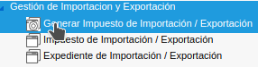
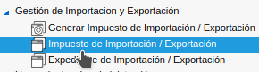
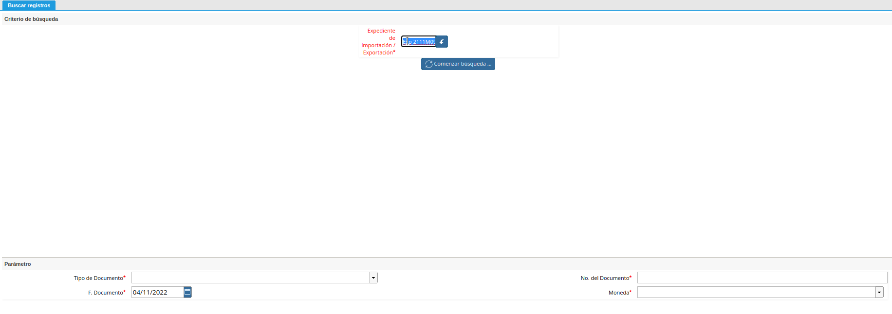
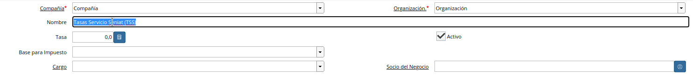
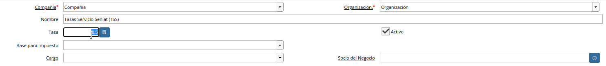
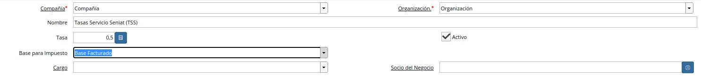
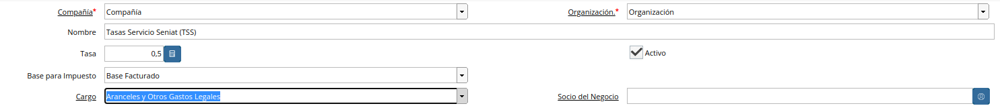
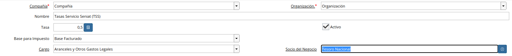
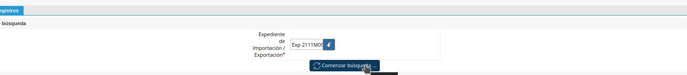
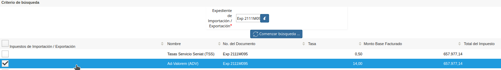
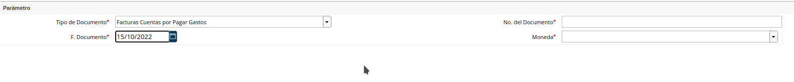
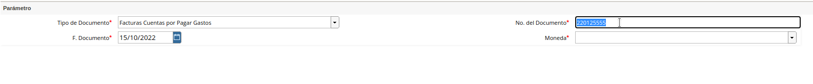
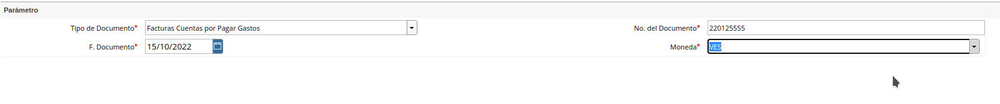
.. |Campo Tipo de Documento 1| image:: resources/tipodoc3.png
.. |Campo Factura 1| image:: resources/factura2.png
.. |Opción Completar 2| image:: resources/completar4.png
.. |Acción Completar| image:: resources/accion1.png
.. |Menú de ADempiere 4| image:: resources/menucierre1.png
.. |Cierre de Caja| image:: resources/cierrecaja.png
.. |Pestaña Línea de Cierre de Caja| image:: resources/linea4.png
.. |Icono Informe| image:: resources/cierrecaja2.png
.. |Reporte de Balance| image:: resources/reporte.png

.. _documento/planillas-tributarias:

**Planillas Tributarias**
=========================

En Venezuela para importar bienes o productos se generan tasas de impuestos sobre el precio CIF de la mercancía,además de un arancel ad valorem que normalmente está entre el 10% y el 20% del precio del producto, más la tasa aduanera, más el 16% de IVA.

**Configuración Escencial**
***************************
Ubique y seleccione en el menú de ADempiere, la carpeta "**Gestión de Importación y Exportación**" y luego seleccione la ventana "**Impuestos Importación/Exportación**".

    |Menú de ADempiere|

    Imagen 1. Menú de ADempiere

Indique el nombre del impuesto o tasa arancelaria ejemplo: **Tasas Servicio Seniat (TSS)**

    |Nombre de Impuestos|

    Imagen 2. Nombre de Impuesto

Indique la tasa del impuesto o tasa arancelaria ejemplo: **Tasas Servicio Seniat (TSS)** será **0,5%**

    |Tasa de Impuesto|

    Imagen 3. Tasa de Impuesto

Indique con qué base deseas que el impuesto o tasa arancelaria sea calculada ejemplo: **Tasas Servicio Seniat (TSS)** será **Base Facturado** y para **IVA** será **Base Facturado+Impuestos Generados**

    |Tipo de Base|

    Imagen 4. Base para Impuesto

Indique el cargo con el que generará la planilla de impuesto o tasa arancelaria sea calculada ejemplo: **Tasas Servicio Seniat (TSS)** será **Aranceles y Otros Gastos Legales**

    |Cargo para Planilla|

    Imagen 5. Cargo de Impuesto

Indique el socio del negocio con el que generará la planilla de impuesto o tasa arancelaria sea calculada ejemplo: **Tasas Servicio Seniat (TSS)** será **Tesoro Nacional**

    |Socio de Negocio|

    Imagen 6. Cargo de Impuesto

**Generar Planillas de Gastos Arancelarios/Impuestos**
******************************************************

Ubique y seleccione en el menú de ADempiere, la carpeta "**Gestión de Importación y Exportación**" y luego seleccione la ventana "**Generar Impuestos Importación/Exportación**".

    |Menú de ADempiere 1|

    Imagen 7. Menú de ADempiere

Indique el expediente de Importación, a continuación se despliega los impuestos que son opción para generar, esto siempre dependerá de la declaración única de importación y el resultado en planillas físicas.

    |Expediente|

    Imagen 8. Expediente de Importación

Seleccione la Opción **Comenzar Búsquedad**

    |Comenzar Búsqueda|

    Imagen 9. Comenzar Búsqueda

Seleccione el impuesto a generar, acorde a las planillas que son resultantes de la declaración única.

    |Selección Tasa|

    Imagen 10. Tasa a Aplicar

Seleccione el Tipo de Documento para la planilla correspondiente generalmente es la **Forma 79084** o la **Forma 99086**.

    |Tipo Documento|

    Imagen 11. Tipo de Documento

Indique el número de la planilla en el campo **Número de Documento**.

    |Número Planilla|

    Imagen 12. Número de Documento

Seleccione la **Moneda** para la planilla aduanera.

    |Moneda Planilla|

    Imagen 13. Moneda de Planilla

Seleccione el **Expediente Generado** para la planilla aduanera.

    |Moneda Planilla|

    Imagen 14. Moneda de Planilla

Al ejecutar el proceso su planilla quedará cargada de manera automática en **ADempiere** y computará como base para el **IVA**.

    |Menu Import|

    Imagen 15. Menú de ADempiere

.. note:: 

    **¡Importante!**
    Tome en cuenta la secuencia para generar sus planillas, la **Forma 99086** es la planilla que contiene el impuesto, en consecuencia deberá ser la última planilla en cargar en este proceso, para que la base sea acumulada en su totalidad.

Repita los paso anteriores para la generación del IVA, sabiendo que su base será el resultado de los costos CIF de la mercancía.

     |Menu Import|

    Imagen 16. Menú de ADempiere

Repita este procedimiento hasta concluir la totalidad de las planillas.

**Generar Planillas de IVA**
****************************

Ubique y seleccione en el menú de ADempiere, la carpeta "**Gestión de Importación y Exportación**" y luego seleccione la ventana "**Generar Impuestos Importación/Exportación**".

    |Menú de ADempiere 1|

    Imagen 17. Menú de ADempiere

Indique el expediente de Importación, a continuación se despliega los impuestos que son opción para generar, esto siempre dependerá de la declaración única de importación y el resultado en planillas físicas.

    |Expediente|

    Imagen 18. Expediente de Importación

Seleccione la Opción **Comenzar Búsquedad**

    |Comenzar Búsqueda|

    Imagen 19. Comenzar Búsqueda

Seleccione el impuesto a generar, acorde a las planillas que son resultantes de la declaración única.

    |Selección Tasa|

    Imagen 20. Tasa a Aplicar

Seleccione el **Tipo de Documento:Planillas de Nacionalización** para la planilla correspondiente a las planillas que generalmente es la **Forma 79084** o la **Forma 99086**.

    |Tipo Documento|

    Imagen 21. Tipo de Documento

Indique el número de la planilla en el campo **Número de Documento**.

    |Número Planilla|

    Imagen 22. Número de Documento

Seleccione la **Moneda** para la planilla aduanera.

    |Moneda Planilla|

    Imagen 23. Moneda de Planilla

Seleccione el **Expediente Generado** para la planilla aduanera.

    |Moneda Planilla|

    Imagen 24. Moneda de Planilla

Seleccione el **Factura Relacionada** para la planilla aduanera, en este caso debe ser la **Factura de Mercancía**.

    |Moneda Planilla|

    Imagen 25. Moneda de Planilla

Al ejecutar el proceso su planilla quedará cargada de manera automática en **ADempiere** y computará como base para el **IVA**.

    |Menu Import|

    Imagen 26. Menú de ADempiere

Finalmente, podrá ejecutar el **Libro de Compras** de manera regular, validando así que la base, impuesto y factura queden de manera correcta.