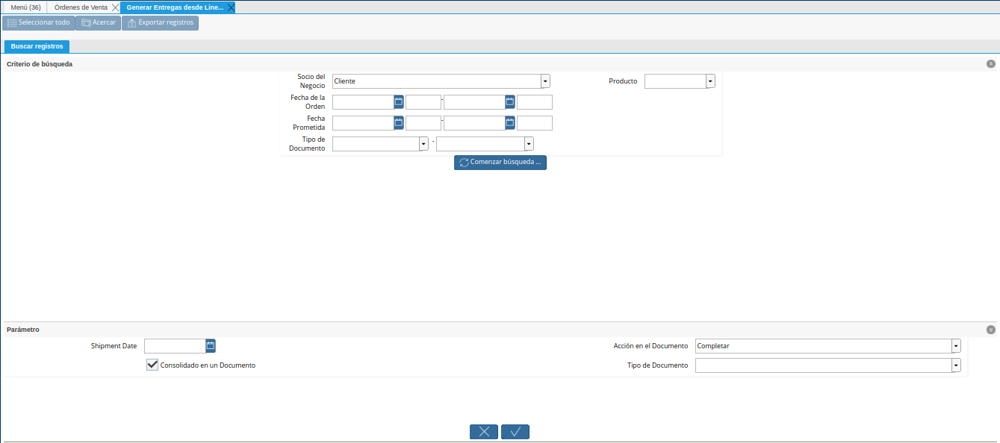

.. _ERPyA: http://erpya.com

.. |opciones del icono visualiza detalle donde es usado| image:: resources/icon-options-display-detail-where-it-is-used.png
.. |seleccionar opción todas las solicitudes| image:: resources/select-option-all-requests.png
.. |búsqueda avanzada de la solicitud| image:: resources/advanced-application-search.png

.. _documento/solicitud-de-mantenimiento:

**Solicitud de Mantenimiento**
==============================

El proceso de solicitud de mantenimiento se presenta con la finalidad de llevar en ADempiere el manejo del mantenimiento a equipos que tengan garantías o equipos que solo se requiera realizar un mantenimiento preventivo; dicho proceso se divide de la siguiente manera:

- **Mantenimiento por Garantía**: Mantenimiento realizado cuando se cumple la fecha de mantenimiento preventivo.

- **Solicitud de Mantenimiento con Garantía**: Mantenimiento realizado antes de la fecha del mantenimiento preventivo.

- **Orden de Reparación**: Reparación o mantenimiento de equipos que no tengan garantía.

Dicho proceso se generará como una solicitud que reflejará no solo el registro del mantenimiento que se este llevado en su momento, si no el estado que este pasá hasta ser culminado.

**Configuración**
-----------------

Partiendo de los tres tipos de escenarios, cada uno debe contar con la siguiente configuración que dependerá de cómo se lleve el proceso en cada compañía. Por los momentos se tienen el siguiente detalle, desglosado por cada tipo de documento:

**Configuración de Estados**
****************************

- Mantenimiento por Garantía: Debe tener la siguiente configuración de estados de solicitud.

    - En proceso
    - Por Aplicar Mantenimiento
    - Visita Técnica
    - En Mantenimiento
    - Por Entregar
    - Entregado
    - En Mora Cliente
    - Cerrado

- Solicitud de Mantenimiento con Garantía: Debe tener la siguiente configuración de estados de solicitud.

    - En Proceso
    - Por Verificar Fallas
    - Visita Técnica
    - En Mantenimiento
    - Por entregar
    - Entregado
    - En Mora Cliente
    - Cerrado

- Orden de Reparación: Debe tener la siguiente configuración de estados de solicitud.

    - En Proceso
    - Por Verificar Fallas
    - En Mantenimiento
    - Por Entregar
    - Entregado
    - En Mora Cliente
    - Cerrado

.. note::

    Estos estados de solicitud definirán el movimiento o el histórico en el cual se encuentra el mantenimiento que se este realizando. Dichos estados pueden configurarse para que estos se manejen de manera automática o pueden ser manejables de manera manual por el usuario.

**Configuración de Categorías**
*******************************

Del mismo modo, se debe definir la categoría de solicitud que para este caso se asoció la categoría de productos, la cual hace referencia al grupo de productos al que se aplica los mantenimientos. En este caso se tienen los siguientes:

- Elementos Fabricados  de Acero Inoxidable

- Bombas de Vacío

**Configuración de Envío de Correos**
*************************************

A medida que se trabaje con las solicitudes de mantenimiento, estas pueden hacer llegar información del estado en el que se encuentran vía correo electrónico, tanto para el personal de la compañía encargada como para el cliente o usuario al que se le esta prestando el servicio, para que este proceso se cumpla se requiere tener configurado lo siguiente:

- Se debe tener asociado en la pestaña "**Contacto (Usuario)**", el correo electrónico al que se le enviará la información, dicha pestaña se encuentra en la ventana "**Socio de Negocio**". Esta configuración aplica tanto por el personal involucrado como para el cliente o persona al que se le está prestando el servicio. Para que esto se cumpla, tanto el cliente como el empleado deben estar registrados como un socio de negocio.

- Una vez los socios de negocios (clientes, empleados) cuenten con dicha configuración, en la pestaña "**Contacto (Usuario)**" se define como se requiere informar al mismo. Dependiendo del caso, estos se asocian de la siguiente forma:

    - Si se desea informar siempre al grupo de encargados o involucrados en el proceso de mantenimiento, para que constantemente se les informe el estado de la solicitud se debe asociar al tipo de solicitud.

    - Si se desea informar solo al cliente o a un tercero involucrado en el proceso del mantenimiento, se debe asociar al campo usuario de la ventana "**Solicitud**" o en la pestaña "**Usuarios a Notificar**"

    - El patrón de correo a utilizar si se desea en este caso, debe ser facilitado a `ERPyA`_ para ser incorporado en ADempiere.

**Mantenimiento por Garantía**
------------------------------

Partiendo de la configuración que se debe tener para el proceso de :ref:`documento/solicitud-de-mantenimiento` en ADempiere, se pueden registrar los tipos de solicitud de la siguiente forma:

Las solicitudes de mantenimiento por garantía se generarán de manera automática en ADempiere, ya que al momento de ser vendido y entregado el producto este cuenta con un lapso de garantía que quedará como una solicitud de mantenimiento en "**Proceso**" en ADempiere, para que al momento de cumplirse el año del mantenimiento por garantía, esta pueda notificar o sea ubicada para aplicar el procedimiento de mantenimiento preventivo. Ejemplo:

Se tiene la siguiente "**Orden de Venta**".

    |orden de venta para mantenimiento por garantía|

    Imagen 1. Orden de Venta

Dicha venta no se le ha generado una entrega, para que la solicitud de mantenimiento se genere automáticamente se debe generar la entrega de dicho producto, para ello se debe aplicar el proceso :ref:`documento/generar-entrega-desde-líneas-de-la-orden`.

    |ventana generar entrega desde línea de la orden|

    Imagen 2. Ventana Generar Entrega desde Línea de la Orden

Al ser generada la entrega desde el proceso "**Generar Entrega desde Línea de la Orden**", se puede observar en la orden de venta que esta cuenta con una entrega asociada y una solicitud generada. Esto se puede observar al seleccionar el icono "**Visualiza Detalle (Donde es Usado)**", ubicado en la barra de herramientas de ADempiere.

    |opciones del icono visualiza detalle donde es usado|

    Imagen 3. Opciones del Icono Visualiza Detalle (Donde es Usado)

Para acercar la solicitud generada de esta venta, se debe seleccionar la opción "**Todas las Solicitudes**" desplegada al seleccionar el icono "**Visualiza Detalle (Donde es Usado)**", ubicado en la barra de herramientas de ADempiere.

    |seleccionar opción todas las solicitudes|

    Imagen 4. Seleccionar Opción Todas las Solicitudes

De igual manera, se puede ubicar posicionándose en la ventana "**Solicitud**" y filtrando la búsqueda del registro por el socio del negocio cliente y la fecha correspondiente.

    |búsqueda avanzada de la solicitud|

    Imagen 5. Búsqueda Avanzada de la Solicitud

Para este caso, ya la solicitud de "**Mantenimiento por Garantía**" se encuentra creada para hacer seguimiento del mantenimiento a equipos por garantía.

    |registro de mantenimiento por garantía|

    Imagen 6. Mantenimiento por Garantía

Del mismo modo una vez se cumpla el tiempo por garantía y dependiendo de como se encuentran configurados los estados del tipo de solicitud con el que se encuentre trabajando, este cambiará la fecha de la siguiente acción de manera automática y aplicará los estados según las reglas del negocio; del mismo modo, de no querer manejar estados automáticos estos se pueden manejar de manera manual dependiendo de como se este llevando en sitio el mantenimiento.

Cabe destacar que la solicitud de "**Mantenimiento por Garantía**" cuenta con las siguientes características en ADempiere:

- "**Asunto**": Se colocá una breve descripción del mantenimiento a realizar. Ejemplo: Mantenimiento por garantía venta

- "**Resumen**": Se colocá una descripción del mantenimiento preventivo a realizar. Ejemplo: Manteniemiento a equipo de bomba de vacío "**Bomba de Vacío 1100Lts/min**"

- "**No. del Documento**": Es el número de la solicitud con la que se esta trabajando, este será arrojado automáticamente por ADempiere

- "**Tipo de Solicitud**": Se asocia el tipo de solicitud que se requiere generar, el mismo es definido por la compañía en base a sus reglas. En el presente ejemplo de mantenimiento por garantía, se debe asociar la opción "**Mantenimiento por Garantía**".

- "**Categoría**": Define la categoría a la que pertenece la solicitud de mantenimiento, en el caso de que las tenga categorizadas

- "**Estado**": Indica en que estado se encuentra la solicitud de mantenimiento

- "**Prioridad**": Indica que tan importante es la solicitud en mantenimiento

- "**Confidencialidad**": Indica si el registro de la solicitud va a ser visible para todos los usuarios que tengan acceso a la ventana solicitud, o solo para las personas que se encuentren asociadas al tipo de solicitud

- "**Agente Comercial**": Se asocia al usuario o empleado encargado de realizar el seguimiento del mantenimiento

- "**Patrón de Correo**": A medida que la solicitud cambie de estado, si se desea enviar un correo que muestre alguna información determinada, la información puede ser alojada como una plantilla de correo que puede ser utilizada en la solicitud y ser enviada a los usuarios que se encuentren asociados al tipo de solicitud; también se puede utilizar dicha plantilla asociandola en la pestaña "**Usuarios a Notificar**" o al usuario que se agregue en el campo "**Usuario**", que pertenezca al socio del negocio o cliente asociado a la solicitud de mantenimiento.

- "**Resultado**": En este campo se mostrará el mensaje que contenga el patrón de correo a seleccionar.

- "**Producto Usado**": Bajo este campo se asociaran los productos que se utilicen para el mantenimiento a realizar. Es decir, las herramientas a utilizar; al agregar ese producto, quedará reflejado en el histórico en la pestaña "**Actualizaciones**"

- "**Cantidad Usada**": Se agregara la "**Cantidad Usada**" del producto que se esta utilizando para el mantenimiento

- "**Socio del Negocio**": Se asocia el cliente al que se le está prestando el servicio de mantenimiento

Una vez conocidos los campos principales y obligatorios con los que se puede conformar una solicitud de mantenimiento, solo queda hacer los cambios de estado de la solicitud. Una vez culminado todo el proceso, este pasaría a un estado "**Cerrado**".