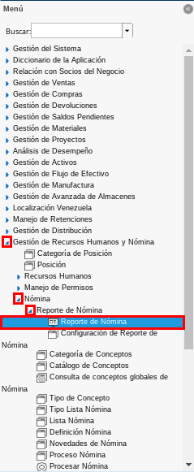
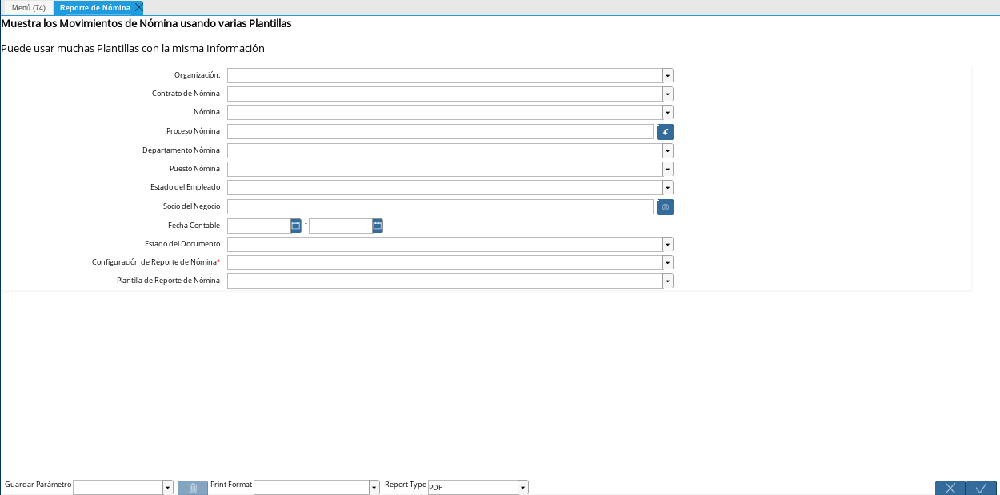
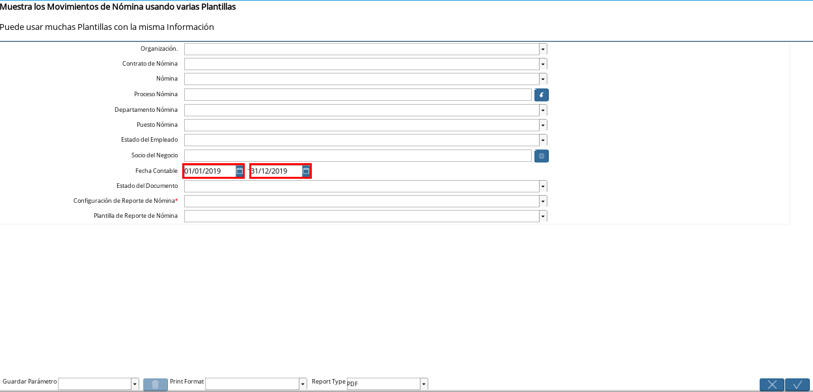
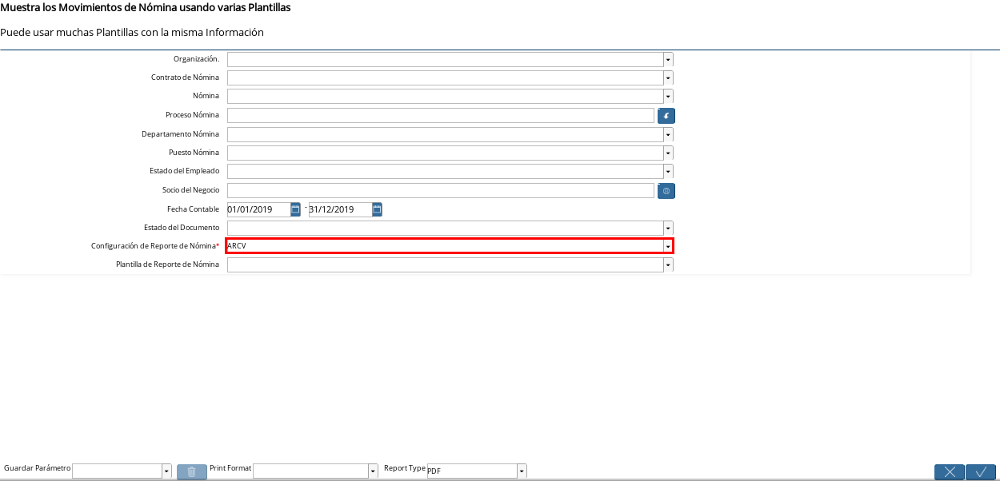
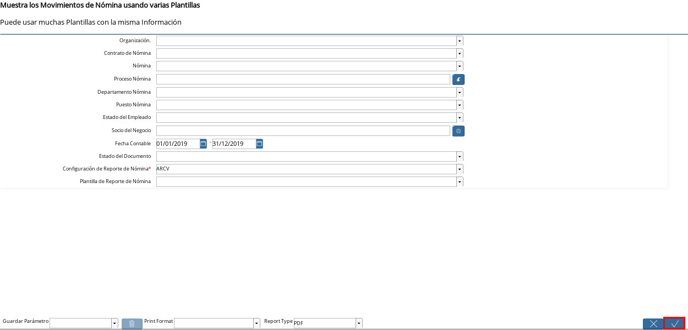
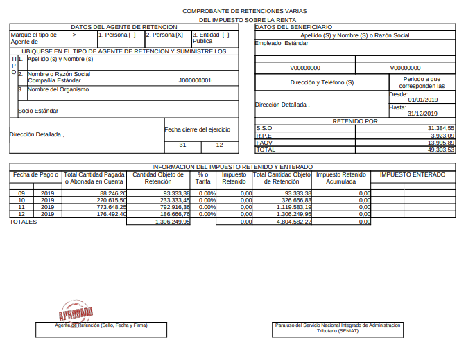

.. _documento/reporte-arcv:

**Generar Reporte ARCV**
========================

#. Ubique y seleccione en el menú de ADempiere, la carpeta "**Gestión de Recursos Humanos y Nómina**", luego seleccione la carpeta "**Nómina**", después seleccione la carpeta "**Reporte de Nómina**", por último seleccione la ventana "**Reporte de Nómina**".

    |Menú de ADempiere 1|

    Imagen 1. Menú de ADempiere

#. Podrá visualizar la ventana "**Reporte de Nómina**" con los diferentes campos que pueden ser utilizados para generar el reporte, según el requerimiento del usuario.

    |Ventana Reporte de Nómina 1|

    Imagen 2. Ventana Reporte de Nómina

    #. Seleccione en el campo "**Fecha Contable**", el rango o período de tiempo que ADempiere tomará en cuenta para filtar la información.

        |Campo Fecha Contable 1|

        Imagen 3. Campo Fecha Contable

    #. Seleccione en el campo "**Configuración de Reporte de Nómina**", el tipo de reporte a generar. Para generar el reporte "**ARCV**", debe seleccionar la opción "**ARCV**" en dicho campo.

        |Campo Configuración de Reporte de Nómina 1|

        Imagen 4. Campo Configuración de Reporte de Nómina

    #. Seleccione la opción "**OK**" para generar el reporte "**ARCV**".

        |Opción OK 1|

        Imagen 5. Opción OK 

#. Podrá visualizar el reporte "**ARCV**" generado de la siguiente manera.

    |Reporte 1|

    Imagen 6. Reporte ARCV

.. note::

    ADempiere genera una hoja por cada empleado que tenga registrado la organización.