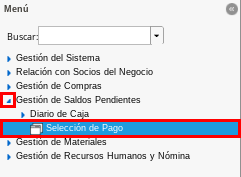
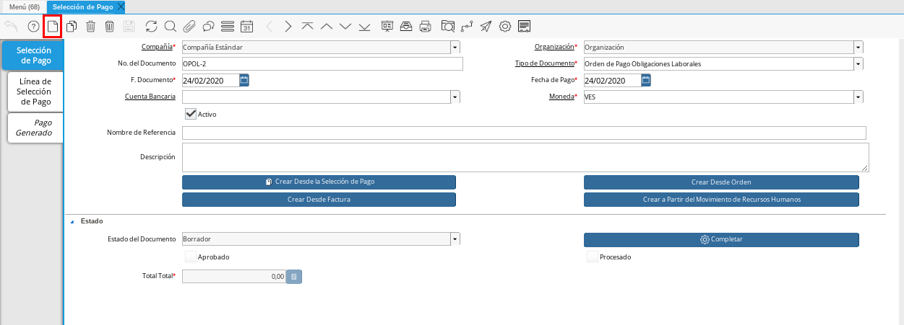
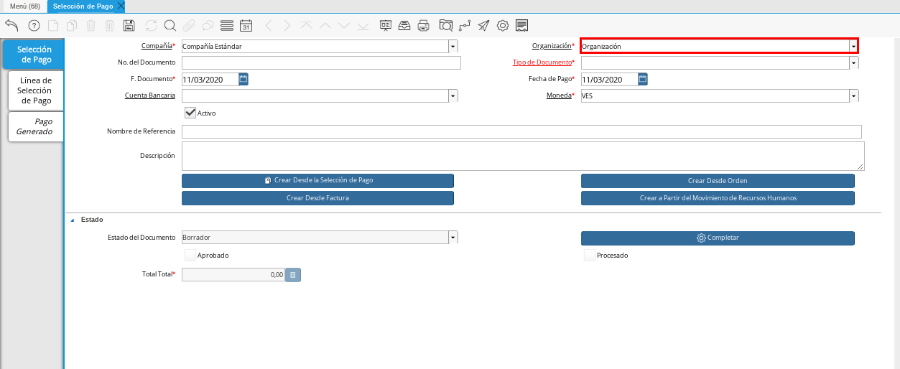
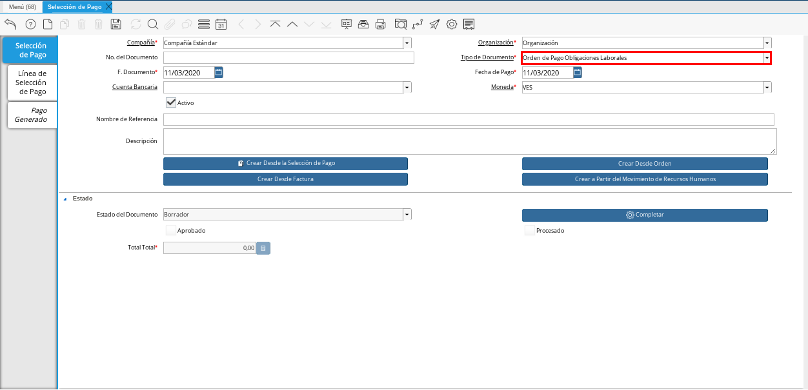
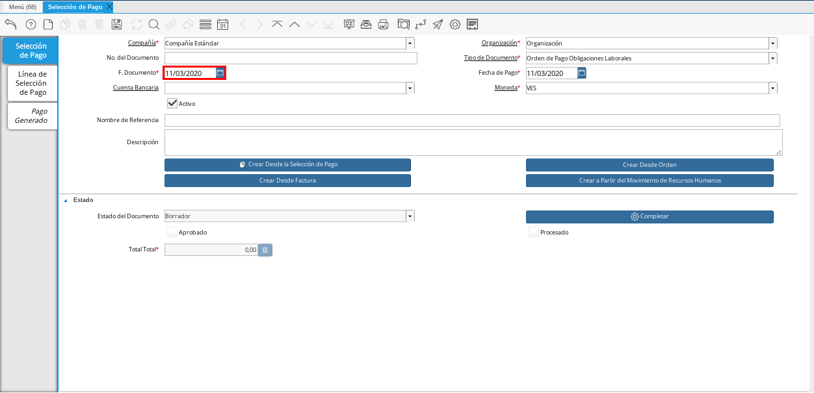
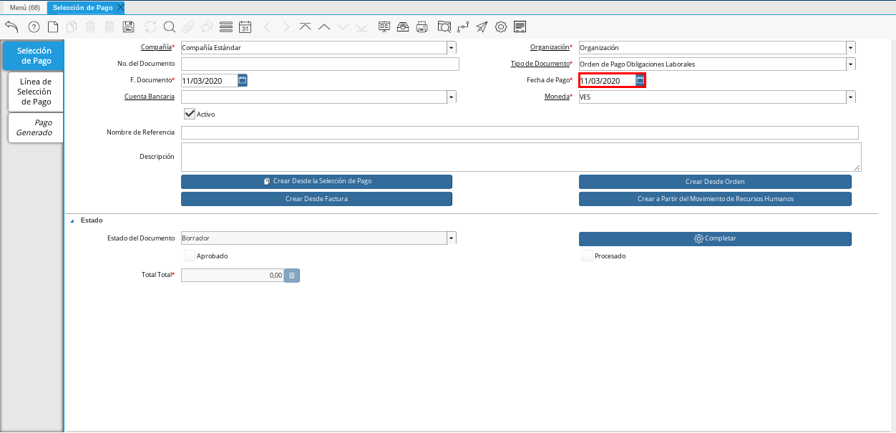
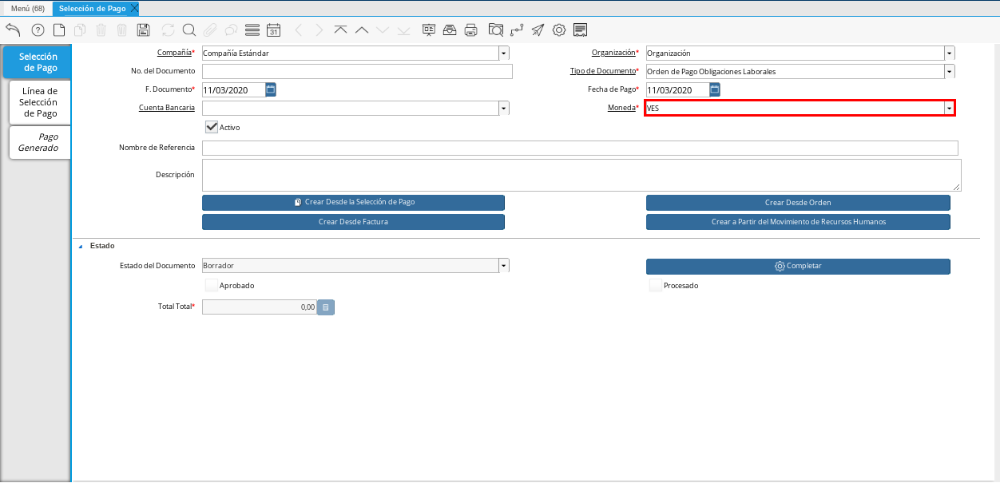
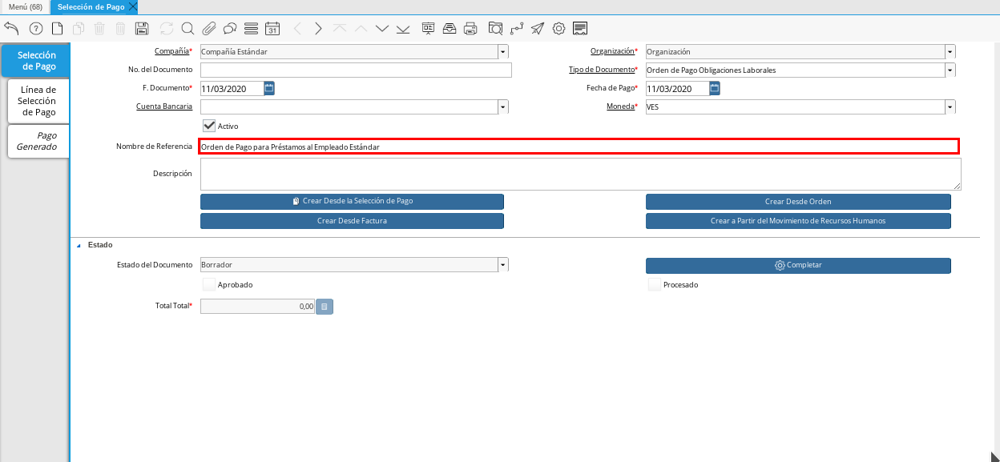
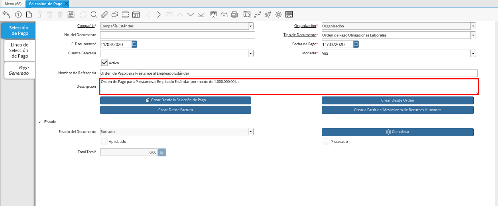
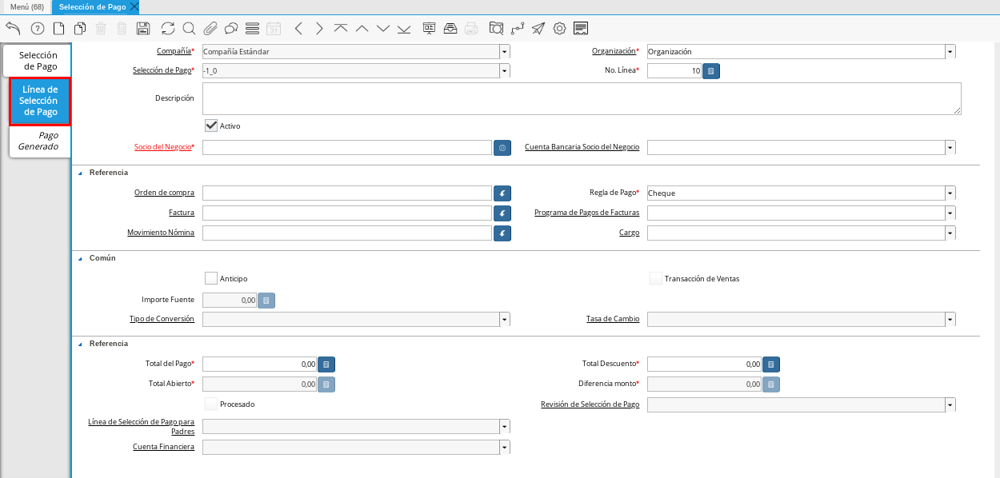
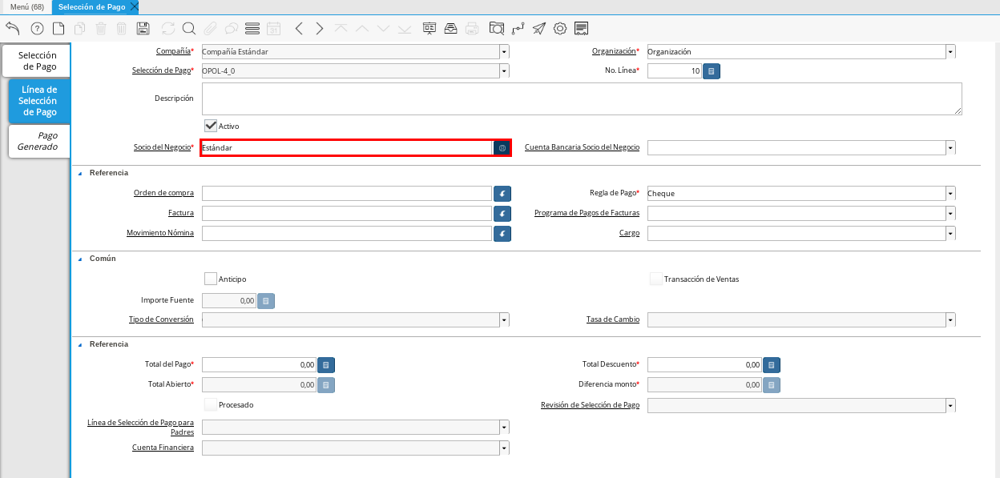
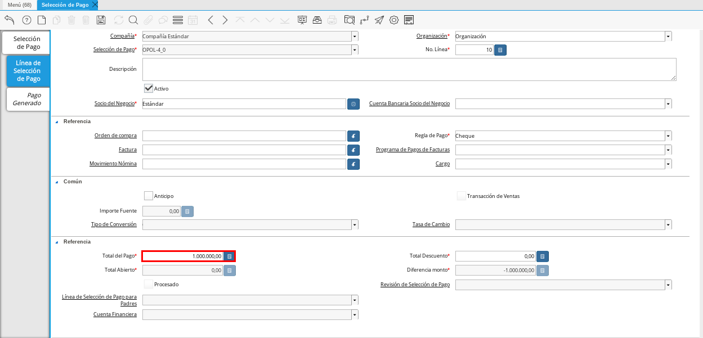
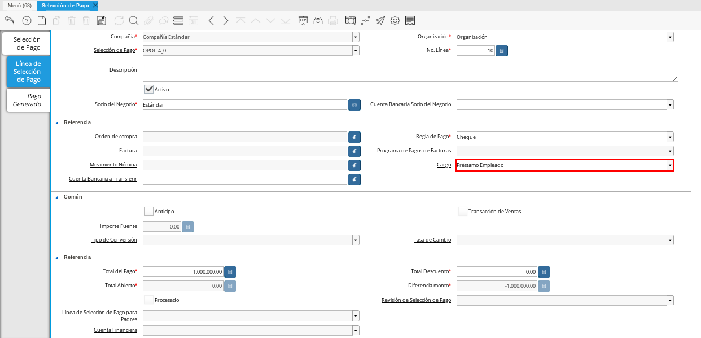
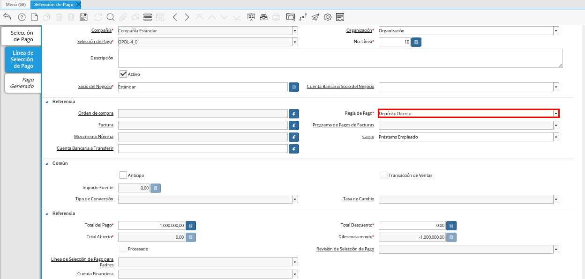
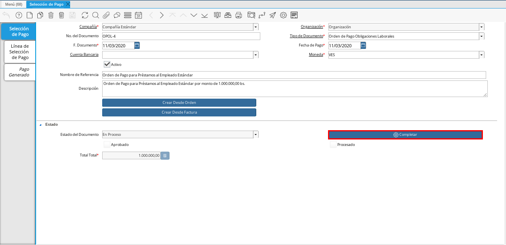
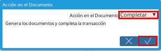

.. _src/lve/documentation-lve/human-resource-payroll/payroll/loans-to-employees:
.. _ERPyA: http://erpya.com

=========================
**Préstamos a Empleados**
=========================

Para registrar los préstamos a los socios del negocio que cumplan el rol de empleados en ADempiere, se debe crear un documento de orden de pago por cada empleado al cual le sea gestionado el préstamo. El procedimiento para crear la orden de pago por los préstamos a los empleados, es el mismo explicado en el documento :ref:`documento/orden-de-pago` de cuentas por pagar, con la diferencia de que el tipo de documento a seleccionar debe ser "**Orden de Pago Obligaciones Laborales**".

Adicional a ello, la pestaña "**Línea de Selección de Pago**" debe contener el socio del negocio empleado, el cargo "**Préstamo Empleado**", el monto del préstamo y la forma de pago del mismo.

El presente material elaborado por `ERPyA`_ pretende ofrecerle una explicación eficiente a nuestros clientes del procedimiento a seguir para realizar y obtener un resultado exitoso al momento de registrar los préstamos generados a los empleados, mediante una orden de pago en la versión 3.9.2 de ADempiere en la localización Venezuela.

    ========================================
    **Orden de Pago Obligaciones Laborales**
    ========================================

        #. Ubique y seleccione en el menú de ADempiere, la carpeta "**Gestión de Saldos Pendientes**", luego seleccione la ventana "**Selección de Pagos**".

           |Menú de ADempiere|

           Imagen 1. Menú de ADempiere

        #. Podrá visualizar la ventana "**Selección de Pago**", en la cual debe seleccionar el icono "**Registro Nuevo**" ubicado en la barra de herramientas de ADempiere.

            |Icono Registro Nuevo 1|

            Imagen 2. Icono Registro Nuevo

        #. Seleccione en el campo "**Organización**", la organización para la cual está realizando el documento "**Orden de Pago Obligaciones Laborales**".

            |Campo Organización 1|

            Imagen 3. Campo Organización

        #. Seleccione el tipo de documento a generar en el campo "**Tipo de Documento**", la selección de este define el comportamiento del documento que se está elaborando, dicho comportamiento se encuentra explicado en el documento :ref:`documento/tipo-documento` elaborado por `ERPyA`_. Para ejemplificar el registro es utilizado el tipo de documento "**Orden de Pago Obligaciones Laborales**".

            |Campo Tipo de Documento 1|

            Imagen 4. Campo Tipo de Documento

        #. Seleccione en el campo "**F. Documento**", la fecha en la cual se está generando el documento de orden de pago obligaciones laborales.

            |Campo F. Documento 1|

            Imagen 5. Campo F. Documento

        #. Seleccione en el campo "**Fecha de Pago**", la fecha en la cual se debe realizar el pago al socio del negocio empleado.

            |Campo Fecha de Pago 1|

            Imagen 6. Campo Fecha de Pago

        #. Seleccione en el campo "**Moneda**", la moneda en la cual se debe realizar el pago al socio del negocio empleado.

            |Campo Moneda 1|

            Imagen 7. Campo Moneda

        #. Introduzca en el campo "**Nombre de Referencia**", un nombre de referencia para la orden de pago que está realizando.

            |Campo Nombre de Referencia 1|

            Imagen 8. Campo Nombre de Referencia

        #. Introduzca en el campo "**Descripción**", una breve descripción referente a la orden de pago que está realizando.

            |Campo Descripción 1|

            Imagen 9. Campo Descripción

        .. note::

            Recuerde guardar el registro de campos de la ventana "**Selección de Pago**", seleccionando el icono "**Guardar Cambios**" ubicado en la barra de herramientas de ADempiere.

        #. Seleccione la pestaña "**Línea de Selección de Pago**", para proceder a llenar los campos necesarios.

           |Pestaña Línea de Selección de Pago 1|

           Imagen 10. Pestaña Línea de Selección de Pago

        #. Seleccione en el campo "**Socio del Negocio**", el socio del negocio empleado al cual se debe realizar el préstamo.

            |Campo Socio del Negocio|

            Imagen 11. Campo Socio del Negocio

        #. Introduzca en el campo "**Total del Pago**", el monto total del préstamo correspondiente al socio del negocio seleccionado.

            |Campo Total del Pago|

            Imagen 12. Campo Total del Pago

        #. Seleccione en el campo "**Cargo**", el cargo correspondiente a la orden de pago que se esta realizando. Para ejemplificar el registro es utilizado el cargo "**Préstamo Empleado**".

            |Campo Cargo|

            Imagen 13. Campo Cargo

        #. Seleccione en el campo "**Regla de Pago**", la forma de pago para gestionar el préstamo al socio del negocio empleado seleccionado.

            |Regla de Pago|

            Imagen 14. Campo Regla de Pago

        .. note::

            Recuerde guardar el registro de campos de la ventana "**Selección de Pago**", seleccionando el icono "**Guardar Cambios**" ubicado en la barra de herramientas de ADempiere.

    #. Regrese a la ventana principal "**Selección de Pago**" y seleccione la opción "**Completar**", ubicada en la parte inferior del documento.

        |Pestaña Selección de Pago y Opción Completar 1|

        Imagen 15. Opción Completar

        #. Seleccione la acción "**Completar**" y la opción "**OK**", para completar el documento.

            |Acción Completar|

            Imagen 16. Acción Completar
