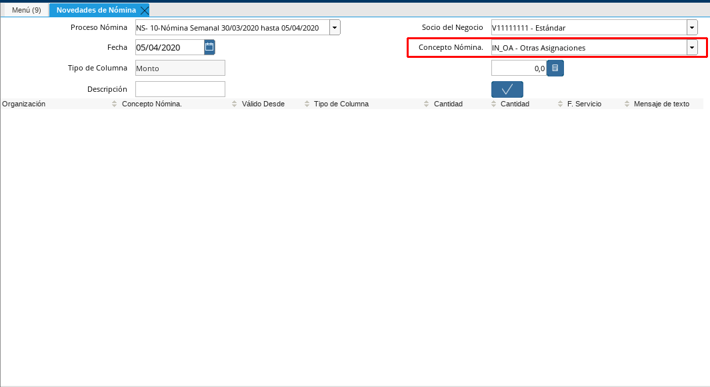

.. |Menú de ADempiere| image:: resources/menu.png

.. |Campo Socio del Negocio| image:: resources/campo-socio-del-negocio.png
.. |Campo Fecha| image:: resources/campo-fecha.png

.. |Opción OK| image:: resources/opcion-ok.png

.. _documento/novedades-de-nómina:
.. _ERPyA: http://erpya.com

**Cargar Incidencias**
======================

#. Seleccione en el menú de ADempiere, la carpeta "**Gestión de Recursos Humanos y Nómina**", luego seleccione la carptea "**Nómina**", por último seleccione la ventana "**Novedades de Nómina**".

    |Menú de ADempiere|

    Imagen 1. Menú de ADempiere

#. Seleccione en el campo "**Proceso Nómina**", el proceso de nómina realizado previamente. Dicho proceso se encuentra explicado en el documento :ref:`documento/procedimiento-para-procesar-nómina` elaborado por `ERPyA`_.

    |Campo Proceso de Nómina|

    Imagen 2. Campo Proceso Nómina

    .. warning::

        El proceso a seleccionar es al que se le cargarán las incidencias que posee el empleado.

#. Seleccione en el campo "**Socio del Negocio**", el socio del negocio empleado al cual se le cargará la incidencia.

    |Campo Socio del Negocio|

    Imagen 3. Campo Socio del Negocio

#. Seleccione en el campo "**Fecha**", la fecha en la que se le cargará la incidencia al socio del negocio empleado seleccionado.

    |Campo Fecha|

    Imagen 4. Campo Fecha

#. Seleccione en el campo "**Concepto Nómina**", la incidencia que se le cargará al socio del negocio empleado seleccionado.

    |Campo Conceptos de Tipo Incidencias|

    Imagen 5. Campo Conceptos de Tipo Incidencias

    .. note::

        En este campo se muestran todas las incidencias, sin importar el tipo de nómina con el que fue generado el documento proceso de nómina seleccionado. 
    
#. Introduzca en el campo "**Descripción**", una breve descripción de la incidencia que se le cargará al socio del negocio empleado.

    |Campo Descripción|

    Imagen 6. Campo Descripción

#. Seleccione la opción "**OK**", para que la incidencia sea cargada a la incidencia al proceso de nómina seleccionado.

    |Opción OK|

    Imagen 7. Opción OK