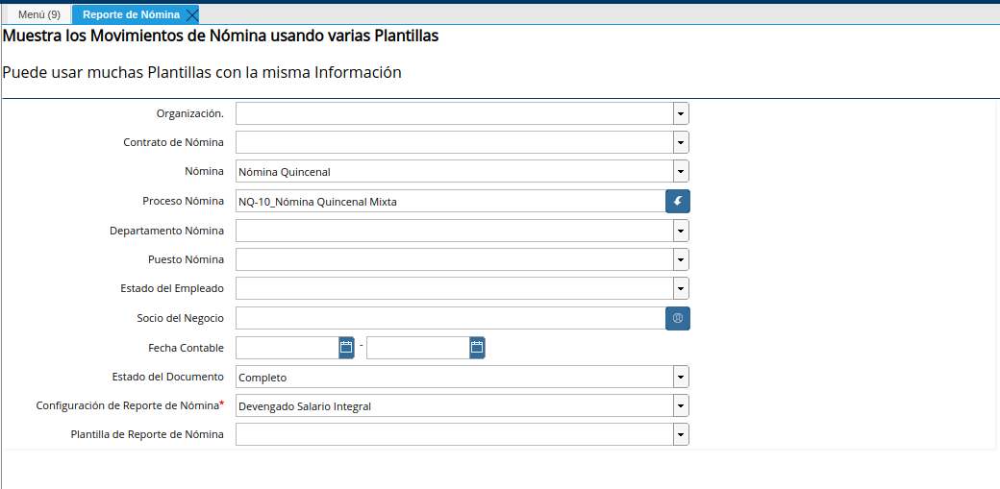
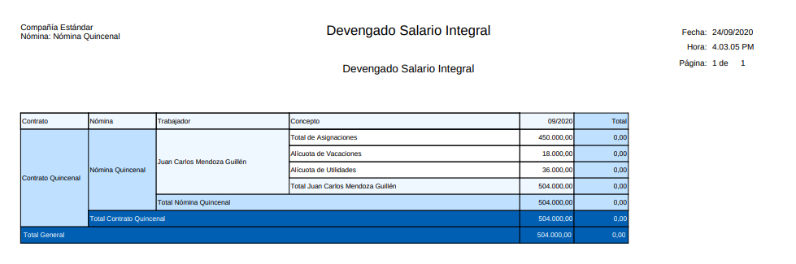

.. _documento/devengado-salario-integral:

==============================
**Devengado Salario Integral**
==============================

El reporte "**Devengado Salario Integral**" se refiere al monto que devengo el trabajador en su nómina regular y que integra todos los conceptos salariales procesados para dichas nóminas. El Salario Integral corresponde al monto total que devenga el trabajador durante su nómina regular más la suma de su  alícuota de vacaciones y su alícuota de utilidades. 

Para obtener dicho reporte debemos seleccionar los siguientes campos principales:

   +---------------------------------+-------------------------------------------------------------+
   |      **PARÁMETROS**             |                       **REFERENCIA**                        |
   +=================================+=============================================================+
   | Organización                    | Seleccione la Organización a la cual pertenece  la nómina o |
   |                                 | el socio de negocio que desea solicitar el reporte          |
   +---------------------------------+-------------------------------------------------------------+
   | Nómina                          | Selecciones entre los distintos tipos de nómina, aquella que|
   |                                 | desea visualizar el reporte, este filtro lo puede usar si   |
   |                                 | quiere visualizar varias nóminas de un mismo tipo y no una  |
   |                                 | en específico                                               |
   +-------------------------------- +-------------------------------------------------------------+
   | Proceso de Nómina               | Seleccione el proceso de nómina en específico basado en el  |
   |                                 | tipo de nómina que seleccionó anteriormente  (Tambien puede |
   |                                 | ubicarlo en la ventana proceso de nómina)                   |
   +---------------------------------+-------------------------------------------------------------+
   | Socio del Negocio               | Seleccione el nombre del socio del negocio que necesite     |
   |                                 | visualizar la información. Si desea ver la información de   |
   |                                 | todos los socios de negocios deje en campo en blanco        |
   +---------------------------------+-------------------------------------------------------------+
   | Fecha Contable                  | Seleccione la fecha contable entre el rango desde, hasta    |
   |                                 | si selecciona un proceso específico de nómina no debe       |
   |                                 | utilizar este  filtro ya que se traerá la fecha  o          |
   |                                 | periodo que tenga la nómina en particular                   |
   +---------------------------------+-------------------------------------------------------------+
   |  Estado del Documento           | Siempre es recomendable utilizar el estado COMPLETO, para   |
   |                                 | que el reporte todo en cuenta solo los procesos de nóminas  |
   |                                 | en estado Completo no los anulados, ni en borrador          |
   +---------------------------------+-------------------------------------------------------------+
   | Configuración del Reporte de    | Seleccione en este caso Devengado Salario Integral          |
   | Nómina.                         |                                                             |
   +---------------------------------+-------------------------------------------------------------+

   |Parámetros para generar el reporte|

   Imagen 1. Parámetros para generar el reporte 

Los campos que podrá visualizar en este reporte son:

   +-----------------------------------------------+-----------------------------------------------+
   |          **PARÁMETROS**                       |             **REFERENCIA**                    |
   +===============================================+===============================================+
   |  Contrato                                     | Corresponde a el contrato configurado para la |
   |                                               | nómina en ejecución                           |
   +-----------------------------------------------+-----------------------------------------------+
   |  Nómina                                       | Identifica el nombre de la nómina que ha sido |
   |                                               | procesada, para este caso será la nómina      |
   |                                               | regular a la que pertenece el empleado        |
   +-----------------------------------------------+-----------------------------------------------+
   |  Trabajador                                   | Identifica el nombre de cada uno de los       |
   |                                               | empleados                                     |
   +-----------------------------------------------+-----------------------------------------------+
   |  Concepto de Nómina                           | Identifica el nombre de concepto de nómina    |
   |                                               | en este caso aparecerá el nombre de las       |
   |                                               | asignaciones y deducciones mencionadas        |
   |                                               | anteriormente                                 |
   +-----------------------------------------------+-----------------------------------------------+
   |  Mes                                          | Corresponde al monto otorgado por el empleado |
   |                                               | de  los conceptos necesarios para obtener el  |
   |                                               | el salario integral durante ese mes           |
   +-----------------------------------------------+-----------------------------------------------+
   |  Total                                        | Corresponde al monto total obtenido por       |
   |                                               | concepto                                      |
   +-----------------------------------------------+-----------------------------------------------+

En el siguiente ejemplo se presenta  el monto devengado salario integral  por el empleado durante el proceso de una nómina regular determinada.

Si desea conocer el valor de dicho concepto durante varias nóminas, no seleccione el proceso de nómina y coloca un parametros de fechas con la finalidad de que pueda visualizar el monto obtenido durante varios procesos de nómina

   |Reporte Devengado Salario Integral|

   Imagen 2. Reporte Devengado Salario Integral 