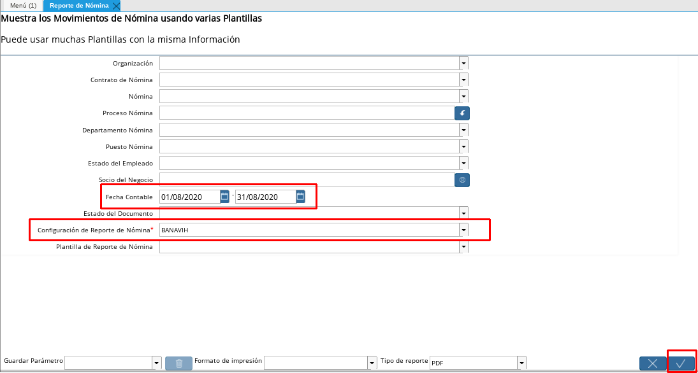

.. _documento/generar-txt-banavih:

**Generar TXT de Banavih**
==========================

El txt de Banavih es uno de los archivos que necesitamos subir al portal de FAOV en línea, el cual debe contener la información necesaria de la nómina procesada para el cálculo de los
recursos a retener como aportes al fondo, en los siguientes pasos se mencionan el proceso que debemos seguir para generar este archivo desde ADempiere.

#. Seleccione la ventana reporte de nómina, ubicado en el menú Gestión de Recursos Humanos, sub carpeta reporte de nómina

#. Para obtener el reporte debe seleccionar los siguientes item

#. Seleccione en el campo **Nómina** la nómina que le va a generar el reporte (Semanal, Quincenal, Mensual)

#. Selecciones el rango de la fecha en que desees solicitar el archivo en el campo **Fecha**

#. Seleccione en el campo **Configuración Reporte de Nómina** BANAVIH es el nombre del reporte configurado para obtener el archivo.

#. Posteriormente debe darle en el check list **OK**

    |Reporte|

    Imagen 1. Parámetros para obtener archivo 

Posteriormente puede ubicar en su carpeta de descarga, el archivo generado con el nombre que estará estructurado de la siguiente manera: la letra “**N**”, el número de cuenta nómina (**20 dígitos**), el mes de la nómina (**en formato MM**), el año de la nómina (**en formato AAAA**).

Se presenta como ejemplo, un archivo que puede descargar en el enlace :download:`N01050000000000000001012021.txt`, para corroborar que coincida la estructura con el documento generado de ADempiere.

Al descargar el mismo, se puede visualizar de la siguiente manera.

::

    V,000000052,EMPLEADO,ESTANDAR ,UNO,,1259500010,19102020,
    V,00000091,EMPLEADO,ESTANDAR ,UNO,NUEVO ,1259500010,01032020,
    V,00000055,EMPLEADO,ESTANDAR ,OTRO,NUEVO ,1259500010,01102019,
    V,00000032,EMPLEADO,ESTANDAR ,DOS,,1259500010,12022019,
    V,00000054,EMPLEADO,ESTANDAR ,DOS,NUEVO ,1259500010,23012020,
    V,00000032,EMPLEADO,ESTANDAR ,OTRO,DOS ,1259500010,01022020,

Adicional a ello, se explica la extructura del mismo:

    - Primeramente se muestra el tipo de persona del empleado, seguido de su número de identificación. Luego se muestra el nombre completo del empleado, seguido del salario integral mensual del mismo. Finalmente se muestra la fecha de ingreso del empleado a la organización y si posee fecha final o de salida, esta se refleja luego de la fecha de ingreso. Los valores anteriormente nombrados, son separados en el archivo con el signo "**,**".

Luego de verificar que su txt esté correctamente, puede proceder a subir el archivo al portal.

