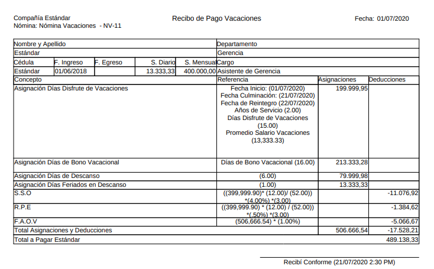
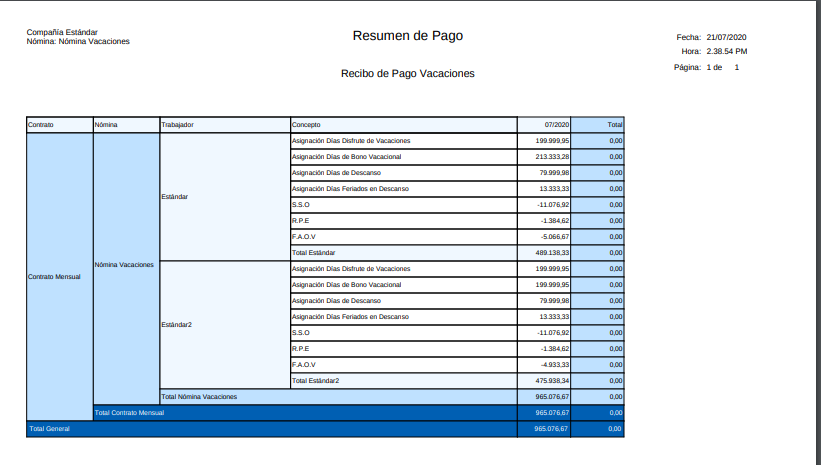

.. |Detalle de Pago 1| image:: resources/detallevacaciones33.png

.. _documento/vacaciones:

**Vacaciones**
===============

El reporte de vacaciones lo utilizamos cuando queremos visualizar unicamente los resultados de la nómina de vacaciones, en él usted podrá visualizar las asignaciones y las deducciones dentro de la nómina de vacaciones del empleado. Los parámetros utilizados para generar el reporte de nómina los encontrará en el documento proceso de nómina de vacaciones :ref:`documento/nomina-vacaciones`, un documento que tambien le ayudará a identificar cada uno de los campos que se utilizan para obtener un reporte de nómina es el documento :ref:`documento/reporte-de-nómina`

Entre las asignaciones que se pueden visualizar en el reporte de vacaciones se encuentran:

    +-----------------------------------------------+-----------------------------------------------+
    |           **ASIGNACIONES**                    |             **REFERENCIA**                    |
    +===============================================+===============================================+
    | Asignación Disfrute de Vacaciones             | Resulta de la Multiplicación del total de días|
    |                                               | que le corresponden al empleado por concepto  |
    |                                               | disfrute de las vacaciones por el salario     |
    |                                               | promedio diario de sus vacaciones             |
    +-----------------------------------------------+-----------------------------------------------+
    | Asignación Bono Vacacional                    | Resulta de la Multiplicación del total de días|
    |                                               | que le corresponden al empleado por concepto  |
    |                                               | bono vacacional  por el salario promedio      |
    |                                               | diario de sus vacaciones                      |
    +-----------------------------------------------+-----------------------------------------------+
    | Asignación Días de Descanso                   | Resulta de la Multiplicación de los Días      |
    |                                               | en Descanso durante el periodo vacacional     |
    |                                               | por el  salario promedio diario de vacaciones |
    +-----------------------------------------------+-----------------------------------------------+
    | Asignación Feriados en Descanso               | Resulta de la Multiplicación de los Días      |
    |                                               | Feriados durante el periodo vacacional por el |
    |                                               | salario promedio diario de vacaciones         |
    +-----------------------------------------------+-----------------------------------------------+

    .. note::

        Cabe destacar que no todas asignaciones apareceran en su reporte de vacaciones por ejemplo no siempre exitirá la asignación feriados en descanso sino cuando esten estipulados en el periodo vacacional.

Entre las deducciones que se pueden visualizar en el reporte de vacaciones se encuentran:

    +-----------------------------------------------+-----------------------------------------------+
    |           **DEDUCCIONES**                     |             **REFERENCIA**                    |
    +===============================================+===============================================+
    | Deducción S.S.O.                              | Representa la cantidad a retener a el         |
    |                                               | empleado para el pago del S.S.O. Obligatorio  |
    +-----------------------------------------------+-----------------------------------------------+
    | Deducción R.P.E.                              | Representa la cantidad a retener a el         |
    |                                               | empleado para el pago del R.P.E.              |
    +-----------------------------------------------+-----------------------------------------------+
    | Deducción F.A.O.V                             | Representa la cantidad a retener a el         |
    |                                               | empleado para el pago del BANAVIH             |
    +-----------------------------------------------+-----------------------------------------------+
    | Deducción I.S.L.R                             | Representa la cantidad a retener a el         |
    |                                               | empleado para la Declaración del I.S.L.R      |
    +-----------------------------------------------+-----------------------------------------------+

    .. note::

        Cabe destacar que no la deducciones apareceran en su reporte de vacaciones sino aquellas que esten configuradas para para ese tipo de nómina.

Para este reporte están configurados 3 tipos de plantillas

#. Recibo de Pago: Seleccione esta plantilla si usted desea visualizar de forma detallada las asignaciones y deducciones por separado para cada empleado según la nómina de vacaciones procesada, este documento se ha realizado con la finalidad de ser el comprobante de pago que usted le proporciona al empleado para conocer el pago de su nómina de vacaciones. 

    Entre los datos personales que usted puede visualizar en el encabezado de su recibo de pago de vacaciones se encuentran los siguientes:

    +-----------------------------------------------+-----------------------------------------------+
    |       **DATOS PERSONALES**                    |             **REFERENCIA**                    |
    +===============================================+===============================================+
    |  Nombre de la Compañía                        | Corresponde al nombre de la compañía          |
    +-----------------------------------------------+-----------------------------------------------+
    |  Fecha Contable                               | Es la Fecha que registró en su proceso de     |
    |                                               | nómina                                        |
    +-----------------------------------------------+-----------------------------------------------+
    |  Nombre del Proceso de Nómina                 | Será el nombre que registró en su proceso de  |
    |                                               | nómina                                        |
    +-----------------------------------------------+-----------------------------------------------+
    |  Nombre y Apellido  del Empleado              | Corresponde al nombre y apellido registrado en|
    |                                               | la ventana Empleados (Todos)                  |
    +-----------------------------------------------+-----------------------------------------------+
    |  Cédula del Empleado                          | Corresponde al número de identificación del   |
    |                                               | empleado registrado en la ventana Empleados   |
    |                                               | (Todos)                                       |
    +-----------------------------------------------+-----------------------------------------------+
    |  Fecha de Ingreso                             | Corresponde a la fecha de ingreso del         |
    |                                               | trabajador registrada en la pestaña           |
    |                                               | información del contrato de la ventana        |
    |                                               | Empleados (Todos)                             |
    +-----------------------------------------------+-----------------------------------------------+
    |  Fecha de Egreso                              | Corresponde a la fecha de egreso del          |
    |                                               | trabajador registrada en la pestaña           |
    |                                               | información del contrato de la ventana        |
    |                                               | Empleados (Todos) esta información se registra| 
    |                                               | cuando usted conoce la fecha de retiro del    |
    |                                               | trabajador, de lo contrario en el campo       |
    |                                               | no aparecerá información                      |      
    +-----------------------------------------------+-----------------------------------------------+
    |  Salario Diario                               | Corresponde a el monto del salario diario     |
    |                                               | registrado en la en la pestaña información    |
    |                                               | del contrato de la ventana Empleados (Todos)  |
    +-----------------------------------------------+-----------------------------------------------+
    |  Salario Mensual                              | Corresponde a el monto del salario mensual    |
    |                                               | registrado en la en la pestaña información    |
    |                                               | del contrato de la ventana Empleados (Todos)  |
    +-----------------------------------------------+-----------------------------------------------+
    |  Departamento                                 | Corresponde a el Departamento al que pertenece|
    |                                               | el empleado registrado en la en la pestaña    |
    |                                               | información del contrato de la ventana        |
    |                                               | Empleados (Todos)                             |
    +-----------------------------------------------+-----------------------------------------------+
    |  Cargo                                        | Corresponde a el cargo desempeñado por        |
    |                                               | el empleado registrado en la en la pestaña    |
    |                                               | información del contrato de la ventana        |
    |                                               | Empleados (Todos)                             |
    +-----------------------------------------------+-----------------------------------------------+

    .. note::

        Para realizar cualquier modificación que requiera realizar de estos campos puede utilizar el siguiente documento :ref:`documento/socio-empleado` 

    Adicionalmente dentro de los Conceptos encontrará datos como:   

    +-----------------------------------------------+-----------------------------------------------+
    |       **DATOS ADICIONALES**                   |             **REFERENCIA**                    |
    +===============================================+===============================================+
    |  Fecha de Inicio de Vacaciones                | Corresponde a la fecha registrada por el      |
    |                                               | cliente donde indica la fecha de salida de    |
    |                                               | de las vacaciones del empleado                |
    +-----------------------------------------------+-----------------------------------------------+
    |  Fecha de Culminación de Vacaciones           | Corresponde a la fecha de culminación del     |
    |                                               | periodo de las vacaciones el empleado         |
    +-----------------------------------------------+-----------------------------------------------+
    |  Fecha de Reintegro de Vacaciones             | Corresponde a la fecha de reintegro del       |
    |                                               | empleado                                      |
    +-----------------------------------------------+-----------------------------------------------+
    |  Días de Anticipo                             | Corresponde a los días de anticipo de         |
    |                                               |  vacaciones otorgados al empleado             |
    +-----------------------------------------------+-----------------------------------------------+   

    Por último se detallará el montol total de las asignaciones, el total de deducciones y el neto a pagar, también encontrará en su recibo de pago un espacio para que el empleado firme y confirme la aprobación de los datos allí obtenidos así como la hora y el día en que fue impreso el recibo.

    En el ejemplo presentado se evidencia una nómina de vacaciones  procesada a un empleado al que llamaremos Estándar y en ella se evidencian las asignaciones y las deducciones del mismo, así como se encuentran todos los datos qué detallamos anteriormente.

    |Recibo de Nómina|

    Imagen 1. Recibo de Pago

#. Detalle de Pago: Seleccione esta plantilla de reporte de nómina de vacaciones si desea conocer de manera detallada todos los montos de nómina de asignación y deducciones de una manera más resumida y detallada, esta plantilla la utiliza el cliente para conocer los montos totales de las nóminas de vacaciones procesadas a los empleados.

    Los campos podrá visualizar en este reporte son:

    +-----------------------------------------------+-----------------------------------------------+
    |          **PARÁMETROS**                       |             **REFERENCIA**                    |
    +===============================================+===============================================+
    |  Contrato                                     | Correspone a el contrato configurado para la  |
    |                                               | nómina en ejecución                           |
    +-----------------------------------------------+-----------------------------------------------+
    |  Nómina                                       | Identifica el nombre de la nómina que ha sido |
    |                                               | procesada, para este caso será nómina de      |
    |                                               | vacaciones                                    |
    +-----------------------------------------------+-----------------------------------------------+
    |  Trabajador                                   | Identifica el nombre de cada uno de los       |
    |                                               | empleados                                     |
    +-----------------------------------------------+-----------------------------------------------+
    |  Concepto de Nómina                           | Identifica el nombre de concepto de nómina    |
    |                                               | en este caso aparecerá el nombre de las       |
    |                                               | asignaciones y deducciones mencionadas        |
    |                                               | anteriormente                                 |
    +-----------------------------------------------+-----------------------------------------------+
    |  Asignaciones                                 | Corresponde a los montos obtenidos por        |
    |                                               | concepto de asignaciones al empleado          |
    +-----------------------------------------------+-----------------------------------------------+
    |  Deducciones                                  | Corresponde a los montos obtenidos por        |
    |                                               | concepto de deducciones al empleado           |
    +-----------------------------------------------+-----------------------------------------------+
    |  Total                                        | Corresponde al monto total obtenido por       |
    |                                               | concepto                                      |
    +-----------------------------------------------+-----------------------------------------------+

    En el siguiente ejemplo presentado se evidencia una nómina de vacaciones procesada a 2 empleados y en ella se evidencian las asignaciones y las deducciones del mismo, así como se encuentran todos los datos qué detallamos anteriormente.

    |Detalle de Pago 1|

    Imagen 2. Detalle de Pago. Misma nómina de vacaciones con diferentes empleados.

#. Resumen de Pago:  Seleccione esta plantilla de reporte de vacaciones para conocer de manera resumida las asignaciones y deducciones agrupadas en un  mismo reporte omitiendo algunos detalle que usted puede encontrar en la plantilla Detalle de Pago. Esta plantilla presentará por cada uno de los concepto un monto total por cada empleado:

    Los campos que podrá visualizar en este reporte son:

    +-----------------------------------------------+-----------------------------------------------+
    |          **PARÁMETROS**                       |             **REFERENCIA**                    |
    +===============================================+===============================================+
    |  Contrato                                     | Corresponde a el contrato configurado para la |
    |                                               | nómina en ejecución                           |
    +-----------------------------------------------+-----------------------------------------------+
    |  Nómina                                       | Identifica el nombre de la nómina que ha sido |
    |                                               | procesada, para este caso nómina de           |
    |                                               | vacaciones                                    |
    +-----------------------------------------------+-----------------------------------------------+
    |  Trabajador                                   | Identifica el nombre de cada uno de los       |
    |                                               | empleados                                     |
    +-----------------------------------------------+-----------------------------------------------+
    |  Concepto de Nómina                           | Identifica el nombre de concepto de nómina    |
    |                                               | en este caso aparecerá el nombre de las       |
    |                                               | asignaciones y deducciones mencionadas        |
    |                                               | anteriormente                                 |
    +-----------------------------------------------+-----------------------------------------------+
    |  Mes                                          | Corresponde al monto otorgado por el empleado |
    |                                               | por el concepto de asignación o durante ese   |
    |                                               | mes                                           |
    +-----------------------------------------------+-----------------------------------------------+
    |  Total                                        | Corresponde al monto total obtenido por       |
    |                                               | concepto                                      |
    +-----------------------------------------------+-----------------------------------------------+

    En el siguiente ejemplo presentado se evidencia una nómina de vacaciones procesada a 2 empleados y en ella se evidencian las asignaciones y las deducciones del mismo, así como se encuentran todos los datos qué detallamos anteriormente para el reporte de nómina de vacaciones utilizando la plantilla de resumen de pagos

    |Resumen de Pago 1|

    Imagen 3. Resumen de Pago. Misma nómina con diferentes empleados.
