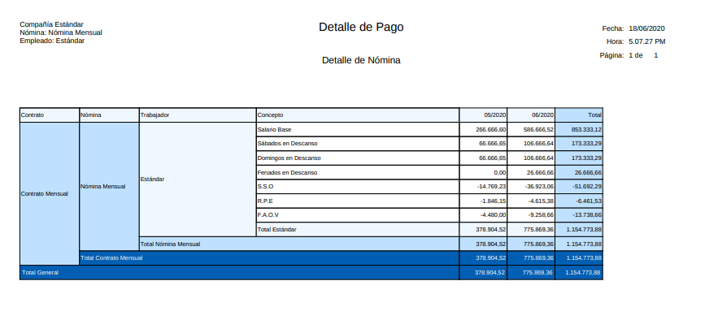
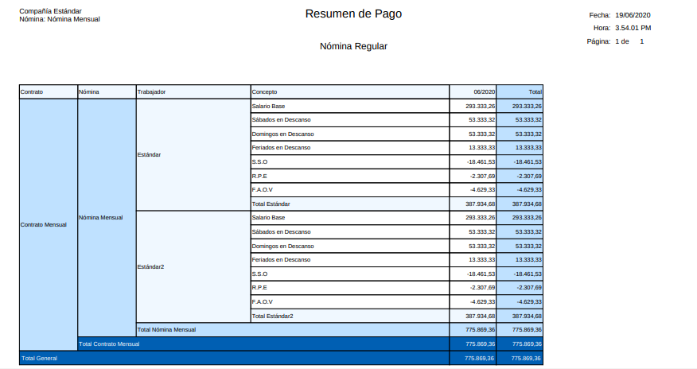
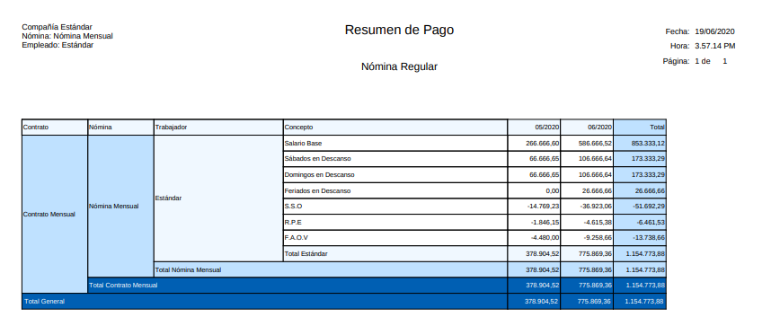

.. |Recibo de Nómina| image:: resources/recibopago11.png
.. |Detalle de Pago 1| image:: resources/DetalledePago11.png

.. _documento/nomina-regular:

**Nómina Regular**
===================

El reporte de nómina regular contiene los datos principales de todo proceso de nómina regular, representando primeramente los datos de cada uno de los empleados. Tambien en él usted podrá visualizar las asignaciones y las deducciones procesadas en las diferentes nóminas regulares del empleado.  Los parámetros utilizados para generar el reporte de nómina los encontrará en el documento :ref:`documento/reporte-de-nómina` donde se detallan los campos utilizados para visualizar un reporte de nómina.

Entre las asignaciones que se pueden visualizar en el reporte de nómina regular se encuentran:

    +-----------------------------------------------+-----------------------------------------------+
    |           **ASIGNACIONES**                    |             **REFERENCIA**                    |
    +===============================================+===============================================+
    | Asignación Salario Base                       | Resulta de la multiplicación de los días      |
    |                                               | trabajados por el salario diario del Empleado |
    |                                               | empleado                                      |
    +-----------------------------------------------+-----------------------------------------------+
    | Asignación Días de Descanso                   | Resulta de la multiplicación de los días      |
    |                                               | de descanso por el promedio salario normal    |
    |                                               | parcial                                       |
    +-----------------------------------------------+-----------------------------------------------+
    | Asignación Sábados en Descanso                | Resulta de la multiplicación de los días      |
    |                                               | sábados en descanso por el promedio salario   |
    |                                               | normal parcial                                |
    +-----------------------------------------------+-----------------------------------------------+
    | Asignación Domingos en Descanso               | Resulta de la multiplicación de los días      |
    |                                               | domingos en descanso por el promedio salario  |
    |                                               | normal parcial                                |
    +-----------------------------------------------+-----------------------------------------------+
    | Asignación Días de Descanso Trabajado         | Resulta de la multiplicación de los días de   |
    |                                               | descanso trabajados por el promedio salario   |
    |                                               | normal por el porcentaje adicional que se debe|
    |                                               | incrementar, según lo establecido por la      |
    |                                               | legislación venezolana                        |
    +-----------------------------------------------+-----------------------------------------------+
    | Asignación Días Sábados Trabajado             | Resulta de la multiplicación de los días de   |
    |                                               | sábados trabajados por el promedio salario    |
    |                                               | normal por el porcentaje adicional que se debe|
    |                                               | incrementar, según lo establecido por la      |
    |                                               | legislación venezolana                        |
    +-----------------------------------------------+-----------------------------------------------+
    | Asignación Días Domingo Trabajado             | Resulta de la multiplicación de los días de   |
    |                                               | domingos trabajados por el promedio salario   |
    |                                               | normal por el porcentaje adicional que se debe|
    |                                               | incrementar, según lo establecido por la      |
    |                                               | legislación venezolana                        |
    +-----------------------------------------------+-----------------------------------------------+
    | Asignación Horas Extras Diurnas               | Resulta de la multiplicación de las horas     |
    |                                               | extras diurnas por el salario hora por el     |
    |                                               | porcentaje adicional que se debe incrementar, |
    |                                               | según lo establecido por la legislación       |
    |                                               | venezolana                                    |
    +-----------------------------------------------+-----------------------------------------------+
    | Asignación Horas Nocturnas Trabajadas         | Resulta de la multiplicación de las horas     |
    |                                               | extras nocturnas trabajadas por el salario    |
    |                                               | hora                                          |
    +-----------------------------------------------+-----------------------------------------------+
    | Asignación Horas Extras Nocturnas             | Resulta de la multiplicación de la asignación |
    |                                               | horas nocturnas trabajadas por el porcentaje  |
    |                                               | adicional que se debe incrementar, según lo   |
    |                                               | establecido por la legislación venezolana     |
    +-----------------------------------------------+-----------------------------------------------+
    | Asignación Bono Nocturno                      | Resulta de la multiplicación de la asignación |
    |                                               | horas extras nocturnas por el porcentaje      |
    |                                               | adicional de bono nocturno que se debe        |
    |                                               | incrementar, según lo establecido por la      |
    |                                               | legislación venezolana                        |  
    +-----------------------------------------------+-----------------------------------------------+
    | Asignación Otras Asignaciones                 | Resulta de cualquier otra asignación que no   |
    |                                               | contemplada dentro de la legislación          |    
    |                                               | venezolana                                    |
    +-----------------------------------------------+-----------------------------------------------+

    .. note::

        Cabe destacar que no la asignaciones apareceran en su reporte de nómina regular sino aquellas que sean configuradas para para ese tipo de nómina.

Entre las deducciones que se pueden visualizar en el reporte de nómina regular se encuentran:

    +-----------------------------------------------+-----------------------------------------------+
    |           **DEDUCCIONES**                     |             **REFERENCIA**                    |
    +===============================================+===============================================+
    | Deducción S.S.O.                              | Representa la cantidad a retener a el         |
    |                                               | empleado para el pago del S.S.O. Obligatorio  |
    +-----------------------------------------------+-----------------------------------------------+
    | Deducción R.P.E.                              | Representa la cantidad a retener a el         |
    |                                               | empleado para el pago del R.P.E.              |
    +-----------------------------------------------+-----------------------------------------------+
    | Deducción F.A.O.V                             | Representa la cantidad a retener a el         |
    |                                               | empleado para el pago del BANAVIH             |
    +-----------------------------------------------+-----------------------------------------------+
    | Deducción I.S.L.R                             | Representa la cantidad a retener a el         |
    |                                               | empleado para la Declaración del I.S.L.R      |
    +-----------------------------------------------+-----------------------------------------------+
    | Deducción Ausencias Injustificadas            | Representa a la multiplicación de los días de |
    |                                               | de ausencia por el salario diario             |
    +-----------------------------------------------+-----------------------------------------------+
    | Deducción Faltas Injustificadas               | Representa a la multiplicación de las horas de|
    |                                               | de ausencia por el salario hora               |      
    +-----------------------------------------------+-----------------------------------------------+
    | Deducción Retardos                            | Representa a la multiplicación de los minutos |
    |                                               | de retardo por el salario por minuto          |      
    +-----------------------------------------------+-----------------------------------------------+
    | Deducción Otras Deducciones                   | Representa cualquier otra deducción a         |
    |                                               | descontar al empleado y no se encuentre       |
    |                                               | en la legislación venezolana                  |
    +-----------------------------------------------+-----------------------------------------------+
   
    .. note::

        Cabe destacar que no la deducciones apareceran en su reporte de nómina regular sino aquellas que esten configuradas para para ese tipo de nómina.

Para este reporte de Nómina Regular están configurados 3 tipos de plantillas

- Recibo de Pago: Seleccione esta plantilla si usted desea visualizar de forma detallada las asignaciones y deducciones por separado para cada empleado según la nómina procesada, este documento se ha realizado con la finalidad de ser el comprobante de pago que usted le proporciona al empleado para conocer el pago de su nómina.

    Entre los datos personales que usted puede visualizar en el encabezado de su recibo de pago de la nómina regular se encuentran los siguientes:

    +-----------------------------------------------+-----------------------------------------------+
    |       **DATOS PERSONALES**                    |             **REFERENCIA**                    |
    +===============================================+===============================================+
    |  Nombre de la Compañía                        | Corresponde al nombre de la compañía          |
    +-----------------------------------------------+-----------------------------------------------+
    |  Fecha Contable                               | Es la fecha que registró en su proceso de     |
    |                                               | nómina                                        |
    +-----------------------------------------------+-----------------------------------------------+
    |  Nombre del Proceso de Nómina                 | Será el nombre que registró en su proceso de  |
    |                                               | nómina                                        |
    +-----------------------------------------------+-----------------------------------------------+
    |  Período de Nómina                            | Será el período que registró en su proceso de |
    |                                               | nómina                                        |
    +-----------------------------------------------+-----------------------------------------------+   
    |  Nombre y Apellido  del Empleado              | Corresponde al nombre y apellido registrado en|
    |                                               | la ventana Empleados (Todos)                  |
    +-----------------------------------------------+-----------------------------------------------+
    |  Cédula del Empleado                          | Corresponde al número de identificación del   |
    |                                               | empleado registrado en la ventana Empleados   |
    |                                               | (Todos)                                       |
    +-----------------------------------------------+-----------------------------------------------+
    |  Fecha de Ingreso                             | Corresponde a la fecha de ingreso del         |
    |                                               | trabajador registrada en la pestaña           |
    |                                               | información del contrato de la ventana        |
    |                                               | Empleados (Todos)                             |
    +-----------------------------------------------+-----------------------------------------------+
    |  Fecha de Egreso                              | Corresponde a la fecha de egreso del          |
    |                                               | trabajador registrada en la pestaña           |
    |                                               | información del contrato de la ventana        |
    |                                               | Empleados (Todos) esta información se registra| 
    |                                               | cuando usted conoce la fecha de retiro del    |
    |                                               | trabajador, de lo contrario en el campo       |
    |                                               | no aparecerá información                      |      
    +-----------------------------------------------+-----------------------------------------------+
    |  Salario Diario                               | Corresponde a el monto del salario diario     |
    |                                               | registrado en la en la pestaña información    |
    |                                               | del contrato de la ventana Empleados (Todos)  |
    +-----------------------------------------------+-----------------------------------------------+
    |  Salario Mensual                              | Corresponde a el monto del salario mensual    |
    |                                               | registrado en la en la pestaña información    |
    |                                               | del contrato de la ventana Empleados (Todos)  |
    +-----------------------------------------------+-----------------------------------------------+
    |  Departamento                                 | Corresponde a el departamento al que pertenece|
    |                                               | el empleado registrado en la en la pestaña    |
    |                                               | información del contrato de la ventana        |
    |                                               | Empleados (Todos)                             |
    +-----------------------------------------------+-----------------------------------------------+
    |  Cargo                                        | Corresponde a el cargo desempeñado por        |
    |                                               | el empleado registrado en la en la pestaña    |
    |                                               | información del contrato de la ventana        |
    |                                               | Empleados (Todos)                             |
    +-----------------------------------------------+-----------------------------------------------+

    .. note::

        Para realizar cualquier modificación que requiera realizar de estos campos puede utilizar el siguiente documento :ref:`documento/socio-empleado` 

    Por último se detallará el montol total de las asignaciones, el total de deducciones y el neto a pagar, también encontrará en su recibo de pago un espacio para que el empleado firme y confirme la aprobación de los datos allí obtenidos así como la hora y el día en que fue impreso el recibo.

    En el ejemplo presentado se evidencia una nómina mensual  procesada a un empleado al que llamaremos Estándar y en ella se evidencian las asignaciones y las deducciones del mismo, así como se encuentran todos los datos que detallamos anteriormente.

    |Recibo de Nómina|

    Imagen 1. Recibo de Pago

- Detalle de Pago: Seleccione esta plantilla de reporte de nómina regular si desea conocer de manera detallada todos los montos de nómina de asignación y deducciones de una manera más resumida y detallada, esta plantilla la utiliza el cliente para conocer los montos del totales de las nóminas procesadas a todos los empleados.

    Los campos podrá visualizar en este reporte son:

    +-----------------------------------------------+-----------------------------------------------+
    |          **PARÁMETROS**                       |             **REFERENCIA**                    |
    +===============================================+===============================================+
    |  Contrato                                     | Correspone a el contrato configurado para la  |
    |                                               | nómina en ejecución                           |
    +-----------------------------------------------+-----------------------------------------------+
    |  Nómina                                       | Identifica el nombre de la nómina que ha sido |
    |                                               | procesada                                     |
    +-----------------------------------------------+-----------------------------------------------+
    |  Trabajador                                   | Identifica el nombre de cada uno de los       |
    |                                               | empleados                                     |
    +-----------------------------------------------+-----------------------------------------------+
    |  Concepto de Nómina                           | Identifica el nombre de concepto de nómina    |
    |                                               | en este caso aparecerá el nombre de las       |
    |                                               | asignaciones y deducciones mencionadas        |
    |                                               | anteriormente                                 |
    +-----------------------------------------------+-----------------------------------------------+
    |  Asignaciones                                 | Corresponde a los montos obtenidos por        |
    |                                               | concepto de asignaciones al empleado          |
    +-----------------------------------------------+-----------------------------------------------+
    |  Deducciones                                  | Corresponde a los montos obtenidos por        |
    |                                               | concepto de deducciones al empleado           |
    +-----------------------------------------------+-----------------------------------------------+
    |  Total                                        | Corresponde al monto total obtenido por       |
    |                                               | concepto                                      |
    +-----------------------------------------------+-----------------------------------------------+

    En el siguiente ejemplo presentado se evidencia una nómina mensual  procesada a  2 empleados y en ella se evidencian las asignaciones y las deducciones del mismo, así como se encuentran todos los datos qué detallamos anteriormente. 

    |Detalle de Pago 1|

    Imagen 2. Detalle de Pago. Misma nómina con diferentes empleados.

    En el ejemplo presentado se evidencia detalle de pago del reporte de nómina regular de 2 nóminas mensuales procesada al mismo empleado y en ella se evidencian las asignaciones y las deducciones obtenidas, así como se encuentran todos los datos qué detallamos anteriormente. 
 
    |Detalle de Pago 2|

    Imagen 3. Detalle de Pago. Diferentes nóminas procesadas al mismo empleado.

- Resumen de Pago:  Seleccione esta plantilla de reporte de nómina para conocer de manera resumida las asignaciones y deducciones agrupadas en todas en un  mismo reporte omitiendo algunos detalle que usted pudiera encontrar en la plantilla Detalle de Pago. Esta plantilla le presentará por cada uno de los concepto un monto total por cada empleado:

    Los campos podrá visualizar en este reporte son:

    +-----------------------------------------------+-----------------------------------------------+
    |          **PARÁMETROS**                       |             **REFERENCIA**                    |
    +===============================================+===============================================+
    |  Contrato                                     | Corresponde a el contrato configurado para la |
    |                                               | nómina en ejecución                           |
    +-----------------------------------------------+-----------------------------------------------+
    |  Nómina                                       | Identifica el nombre de la nómina que ha sido |
    |                                               | procesada                                     |
    +-----------------------------------------------+-----------------------------------------------+
    |  Trabajador                                   | Identifica el nombre de cada uno de los       |
    |                                               | empleados                                     |
    +-----------------------------------------------+-----------------------------------------------+
    |  Concepto de Nómina                           | Identifica el nombre de concepto de nómina    |
    |                                               | en este caso aparecerá el nombre de las       |
    |                                               | asignaciones y deducciones mencionadas        |
    |                                               | anteriormente                                 |
    +-----------------------------------------------+-----------------------------------------------+
    |  Mes                                          | Corresponde al monto otorgado por el empleado |
    |                                               | por el concepto de asignación o durante ese   |
    |                                               | mes                                           |
    +-----------------------------------------------+-----------------------------------------------+
    |  Total                                        | Corresponde al monto total obtenido por       |
    |                                               | concepto                                      |
    +-----------------------------------------------+-----------------------------------------------+

    En el siguiente ejemplo presentado se evidencia una nómina mensual  procesada a  2 empleados y en ella se evidencian las asignaciones y las deducciones del mismo, así como se encuentran todos los datos qué detallamos anteriormente para el reporte de nómina regular utilizando la plantilla de resumen de pagos
 
    |Resumen de Pago 1|

    Imagen 4. Resumen de Pago. Misma nómina con diferentes empleados.

    En el ejemplo presentado se evidencia detalle de pago del reporte de nómina regular de 2 nóminas mensuales procesada al mismo empleado y en ella se evidencian las asignaciones y las deducciones obtenidas, así como se encuentran todos los datos qué detallamos anteriormente para el reporte de nómina regular utilizando la plantilla de resumen de pagos 
 
    |Resumen de Pago 2|

    Imagen 5. Resumen de Pago. Diferentes nóminas procesadas al mismo empleado.