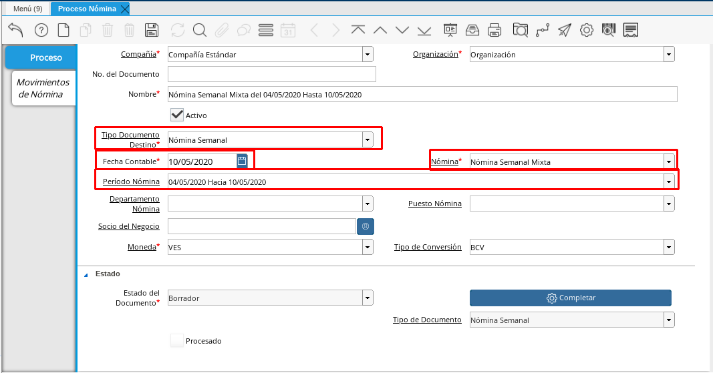
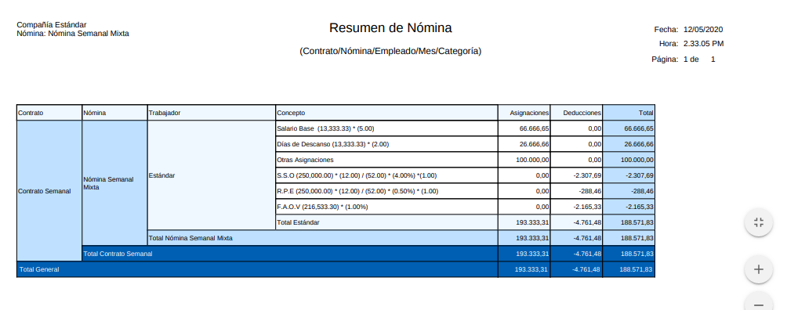
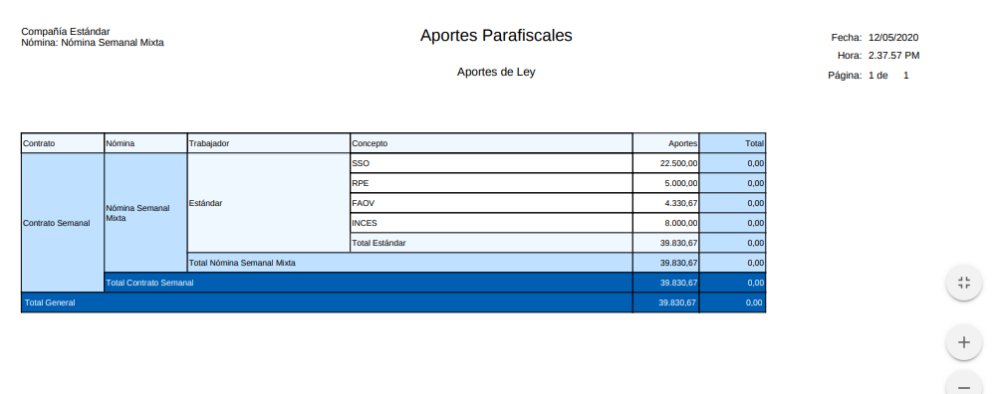
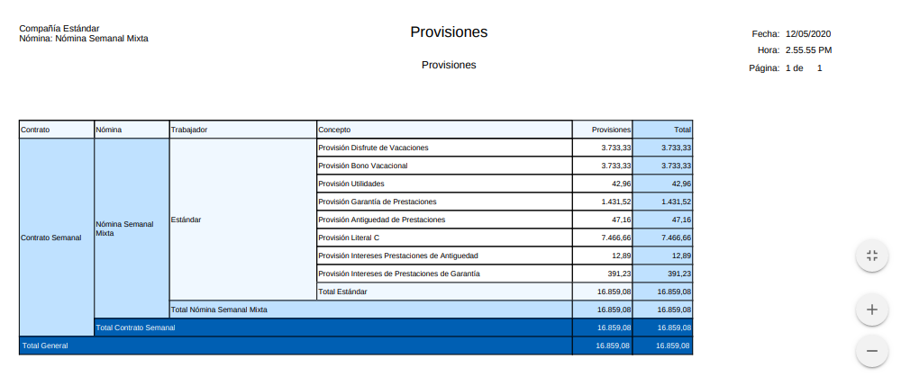

.. _ERPyA: http://erpya.com

.. |Recibo de Pago Nómina Semanal Mixta| image:: resources/recibosemanalmixta.png
.. |Detalle de Pago Nómina Semanal Mixta| image:: resources/detallesemanalmixta.png

.. |Retenciones Nómina Semanal Mixta| image:: resources/retencionessemanalmixta.png

.. _documento/nomina-semanal-mixta:

=========================
 **Nómina Semanal Mixta**
=========================

    Para procesar una “**Nómina Semanal Mixta**” debemos realizar el proceso de nómina estándar mencionado en el documento :ref:`documento/procedimiento-para-procesar-nómina` elaborado por `ERPyA`_. En esta ventana se registran los datos principales que ADempiere requiere para crear una nómina de tipo semanal mixta, cada uno de los campos detallados a continuación son relevantes para obtener un registro exitoso:

#. Estatus del documento:

    #. Seleccione **Nómina Semanal** en el campo "**Tipo de Documento**".

        El tipo de documento le permitirá definir la acción del documento que esté registrando en ADempiere.

    #. Seleccione **Nómina Semanal Mixta** en el campo "**Nómina**"

        La nómina semanal mixta define el comportamiento de la nómina, para este caso tiene las siguientes características:

            #. Regla de Pago: Débito Directo
            #. Contrato de Nómina: Contrato Semanal
            #. Cargo: Sueldos y Salarios por Pagar

    #. Seleccione el período semanal correspondiente a la nómina que se está ejecutando en el campo "**Período Nómina**"

        El período de nómina define el período laborado que le está siendo cancelado al empleado, disponiendo de los períodos creados en la definición de nómina semanal.

    #. Seleccione la fecha “Hasta” o el último día del período que seleccionó anteriormente en el campo "**Fecha Contable**"

        A través de la fecha contable se determina contablemente la fecha de pago de la nómina semanal en ejecución, por tal motivo se recomienda colocar la fecha “**Hasta**” o el último día del período que seleccionó anteriormente.

      |Nómina Semanal Mixta|

      Imagen 1. Nómina Semanal Mixta

#. Incidencias:

      Para esta nómina no son obligatorias las incidencias, pero en ADempiere se cuentan con las siguientes incidencias disponibles para la Nómina Semanal Mixta:

      +-------------------------------------------------------+----------------------+----------------+
      |           **INCIDENCIA**                              |     **CÓDIGO**       |    **TIPO**    |
      +=======================================================+======================+================+
      | Descanso Trabajado                                    |     ("IN_DT")        |    Cantidad    |
      +-------------------------------------------------------+----------------------+----------------+
      | Feriado Trabajado                                     |     ("IN_FT")        |    Cantidad    |
      +-------------------------------------------------------+----------------------+----------------+
      | Horas Extras Diurnas                                  |     ("IN_HED")       |    Cantidad    |
      +-------------------------------------------------------+----------------------+----------------+
      | Horas Nocturnas Trabajadas                            |     ("IN_HNT")       |    Cantidad    |
      +-------------------------------------------------------+----------------------+----------------+
      | Fecha de Inicio de Reposo Prenatal y Postnatal        |    ("IN_FIRPP")      |     Fecha      |
      +-------------------------------------------------------+----------------------+----------------+
      | Días de Permiso Reposo PreNatal y PostNatal           |     ("IN_DRPPP")     |    Cantidad    |
      +-------------------------------------------------------+----------------------+----------------+
      | Fecha de Reposo Convalidado por el IVSS               |     ("IN_FREC")      |     Fecha      |
      +-------------------------------------------------------+----------------------+----------------+
      | Días de Reposo Covalidado                             |     ("IN_DRC")       |    Cantidad    |
      +-------------------------------------------------------+----------------------+----------------+
      | Otras Asignaciones                                    |      ("IN_OA")       |     Monto      |
      +-------------------------------------------------------+----------------------+----------------+
      | Ausencias Injustificadas                              |      ("IN_AI")       |    Cantidad    |
      +-------------------------------------------------------+----------------------+----------------+
      | Faltas Injustificadas                                 |      ("IN_FI")       |    Cantidad    |
      +-------------------------------------------------------+----------------------+----------------+
      | Retardos                                              |      ("IN_RE")       |    Cantidad    |
      +-------------------------------------------------------+----------------------+----------------+
      | Otras Deducciones                                     |      ("IN_FI")       |     Monto      |
      +-------------------------------------------------------+----------------------+----------------+

      Para conocer cómo registrar una incidencia puede utilizar el siguiente enlace :ref:`documento/novedades-de-nómina`

#. Resultados:

    - "**Reportes**"

    Para visualizar los Reportes de Nóminas  puede seguir los pasos que se encuentran en el Documento :ref:`documento/reporte-de-nómina` con los datos adicionales que se indican a continuación para cada Reporte

        - "**Recibo de Pago**"

            - **Nómina**: Nómina Semanal Mixta

            - **Proceso de Nómina**: Ubica el número de documento del proceso de nómina que está ejecutando.

            - **Configuración de Reporte de Nómina**: Nómina Regular

        |Recibo de Pago Nómina Semanal Mixta|

        Imagen 2. Recibo de Pago Nómina Semanal Mixta

        - "**Detalle de Pago**"

            - **Nómina**: Nómina Semanal Mixta

            - **Proceso de Nómina**: Ubica el número de documento del proceso de nómina que está ejecutando.

            - **Configuración de Reporte de Nómina**: Nómina Regular

            - **Plantilla de Reporte de Nómina**: Detalle de Pago

        |Detalle de Pago Nómina Semanal Mixta|

        Imagen 3. Detalle de Pago Nómina Semanal Mixta

        - "**Resumen de Pago**"

            - **Nómina**: Nómina Semanal Mixta

            - **Proceso de Nómina**: Ubica el número de documento del proceso de nómina que está ejecutando.

            - **Configuración de Reporte de Nómina**: Nómina Regular

            - **Plantilla de Reporte de Nómina**: Resumen de Pago

        |Resumen de Pago Nómina Semanal Mixta|

        Imagen 4. Resumen de Pago Nómina Semanal Mixta

        - "**Retenciones**"

            - **Nómina**: Nómina Semanal Mixta

            - **Proceso de Nómina**: Ubica el número de documento del proceso de nómina que está ejecutando.

            - **Configuración de Reporte de Nómina**: Retenciones Parafiscales

        |Retenciones Nómina Semanal Mixta|

        Imagen 5. Retenciones de Nómina Semanal Mixta

        - "**Aportes**"

            - **Nómina**: Nómina Semanal Mixta

            - **Proceso de Nómina**: Ubica el número de documento del proceso de nómina que está ejecutando.

            - **Configuración de Reporte de Nómina**: Aportes Parafiscales

        |Aportes Nómina Semanal Mixta|

        Imagen 6. Aportes Nómina Semanal Mixta

        - "**Provisiones**"

            - **Nómina**: Nómina Semanal Mixta

            - **Proceso de Nómina**: Ubica el número de documento del proceso de nómina que está ejecutando.

            - **Configuración de Reporte de Nómina**: Provisiones

        |Provisiones Nómina Semanal Mixta|

        Imagen 7. Provisiones de Nómina Semanal Mixta

        .. note::

            Cabe destacar que los Reportes de Aportes, Retenciones, Provisiones se deben pasar al Departamento de Contabilidad
