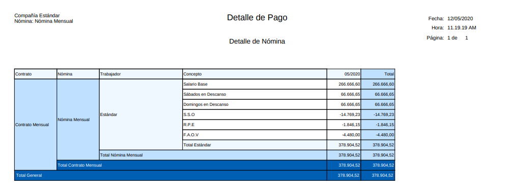
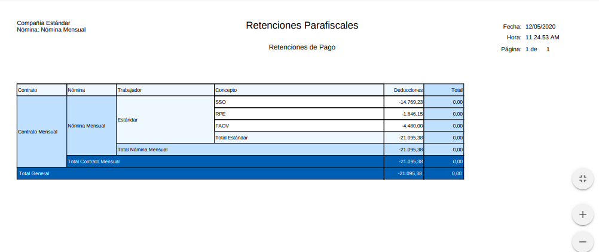

.. _ERPyA: http://erpya.com
.. |Nómina Mensual| image:: resources/mensual.png
.. |Recibo de Pago Nómina Mensual| image:: resources/recibomensual.png

.. |Resumen de Pago Nómina Mensual| image:: resources/resumenmensual.png

.. |Aportes Nómina Mensual| image:: resources/aportesmensual.png
.. |Provisiones Nómina Mensual| image:: resources/provisionesmensual.png

.. _documento/nomina-mensual:

===================
 **Nómina Mensual**
===================

Para procesar una “**Nómina Mensual**” debemos realizar el proceso de nómina estándar mencionado en el documento :ref:`documento/procedimiento-para-procesar-nómina` elaborado por `ERPyA`_. En esta ventana se registran los datos principales que ADempiere requiere para crear una nómina de tipo mensual, cada uno de los campos detallados a continuación son relevantes para obtener un registro exitoso:

#. Estatus del documento:

    #. Seleccione **Nómina Mensual** en el campo "**Tipo de Documento**".

        El tipo de documento le permitirá definir la acción del documento que esté registrando en ADempiere.

    #. Seleccione **Nómina Mensual** en el campo "**Nómina**"

        La nómina mensual define el comportamiento de la nómina, para este caso tiene las siguientes características:

            #. Regla de Pago: Débito Directo
            #. Contrato de Nómina: Contrato Mensual
            #. Cargo: Sueldos y Salarios por Pagar

    #. Seleccione el período mensual correspondiente a la nómina que se está ejecutando en el campo "**Período Nómina**"

        El período de nómina define el período laborado que le está siendo cancelado al empleado, disponiendo de los períodos creados en la definición de nómina mensual.

    #. Seleccione la fecha “Hasta” o el último día del período que seleccionó anteriormente en el campo "**Fecha Contable**"

        A través de la fecha contable se determina contablemente la fecha de pago de la nómina mensual en ejecución, por tal motivo se recomienda colocar la fecha “**Hasta**” o el último día del período que seleccionó anteriormente.

      |Nómina Mensual|

      Imagen 1. Nómina Mensual

#. Incidencias:

    Para esta nómina no son obligatorias las incidencias, pero en ADempiere se cuentan con las siguientes incidencias disponibles para la nómina mensual:

      +-------------------------------------------------------+----------------------+----------------+
      |           **INCIDENCIA**                              |     **CÓDIGO**       |    **TIPO**    |
      +=======================================================+======================+================+
      | Sábado Trabajado                                      |     ("IN_ST")        |    Cantidad    |
      +-------------------------------------------------------+----------------------+----------------+
      | Domingo Trabajado                                     |     ("IN_DOT")       |    Cantidad    |
      +-------------------------------------------------------+----------------------+----------------+
      | Feriado Trabajado                                     |     ("IN_FT")        |    Cantidad    |
      +-------------------------------------------------------+----------------------+----------------+
      | Horas Extras Diurnas                                  |     ("IN_HED")       |    Cantidad    |
      +-------------------------------------------------------+----------------------+----------------+
      | Horas Nocturnas Trabajadas                            |     ("IN_HNT")       |    Cantidad    |
      +-------------------------------------------------------+----------------------+----------------+
      | Fecha de Inicio de Reposo Prenatal y Postnatal        |    ("IN_FIRPP")      |     Fecha      |
      +-------------------------------------------------------+----------------------+----------------+
      | Días de Permiso Reposo PreNatal y PostNatal           |    ("IN_DRPPP")      |    Cantidad    |
      +-------------------------------------------------------+----------------------+----------------+
      | Fecha de Reposo Convalidado por el IVSS               |     ("IN_FREC")      |     Fecha      |
      +-------------------------------------------------------+----------------------+----------------+
      | Días de Reposo Covalidado                             |     ("IN_DRC")       |    Cantidad    |
      +-------------------------------------------------------+----------------------+----------------+
      | Otras Asignaciones                                    |      ("IN_OA")       |     Monto      |
      +-------------------------------------------------------+----------------------+----------------+
      | Ausencias Injustificadas                              |      ("IN_AI")       |    Cantidad    |
      +-------------------------------------------------------+----------------------+----------------+
      | Faltas Injustificadas                                 |      ("IN_FI")       |    Cantidad    |
      +-------------------------------------------------------+----------------------+----------------+
      | Retardos                                              |      ("IN_RE")       |    Cantidad    |
      +-------------------------------------------------------+----------------------+----------------+
      | Otras Deducciones                                     |      ("IN_FI")       |     Monto      |
      +-------------------------------------------------------+----------------------+----------------+

    Para conocer cómo registrar una incidencia puede utilizar el siguiente enlace :ref:`documento/novedades-de-nómina`

#. Resultados:

    - "**Reportes**"

    Para visualizar los reportes de nóminas  puede seguir los pasos que se encuentran en el documento :ref:`documento/reporte-de-nómina` con los datos adicionales que se indican a continuación para cada reporte

        - "**Recibo de Pago**"

            - **Nómina**: Nómina Mensual

            - **Proceso de Nómina**: Ubique el número de documento del proceso de nómina que está ejecutando.

            - **Configuración de Reporte de Nómina**: Nómina Regular

        |Recibo de Pago Nómina Mensual|

        Imagen 2. Recibo de Pago Nómina Mensual

        - "**Detalle de Pago**"

            - **Nómina**: Nómina Mensual

            - **Proceso de Nómina**: Ubique el número de documento del proceso de nómina que está ejecutando.

            - **Configuración de Reporte de Nómina**: Nómina Regular

            - **Plantilla de Reporte de Nómina**: Detalle de Pago

        |Detalle de Pago Nómina Mensual|

        Imagen 3. Detalle de Pago Nómina Mensual

        - "**Resumen de Pago**"

            - **Nómina**: Nómina Mensual

            - **Proceso de Nómina**: Ubique el número de documento del proceso de nómina que está ejecutando.

            - **Configuración de Reporte de Nómina**: Nómina Regular

            - **Plantilla de Reporte de Nómina**: Resumen de Pago

        |Resumen de Pago Nómina Mensual|

        Imagen 4. Resumen de Pago Nómina Mensual

        - "**Retenciones**"

            - **Nómina**: Nómina Mensual

            - **Proceso de Nómina**: Ubique el número de documento del proceso de nómina que está ejecutando.

            - **Configuración de Reporte de Nómina**: Retenciones Parafiscales

        |Retenciones Nómina Mensual|

        Imagen 5. Retenciones de Nómina Mensual

         - "**Aportes**"

            - **Nómina**: Nómina Mensual

            - **Proceso de Nómina**: Ubique el número de documento del proceso de nómina que está ejecutando.

            - **Configuración de Reporte de Nómina**: Aportes Parafiscales

          |Aportes Nómina Mensual|

          Imagen 6. Aportes de Nómina Mensual

        - "**Provisiones**"

            - **Nómina**: Nómina Mensual

            - **Proceso de Nómina**: Ubique el número de documento del proceso de nómina que está ejecutando.

            - **Configuración de Reporte de Nómina**: Provisiones

        |Provisiones Nómina Mensual|

        Imagen 7. Provisiones de Nómina Mensual

        .. note::

            Cabe destacar que los reportes de Aportes, Retenciones, Provisiones se deben pasar al Departamento de Contabilidad
