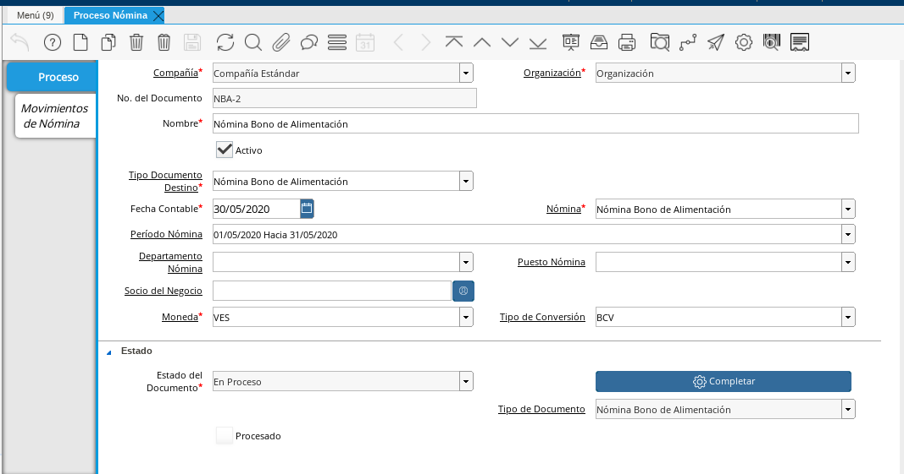
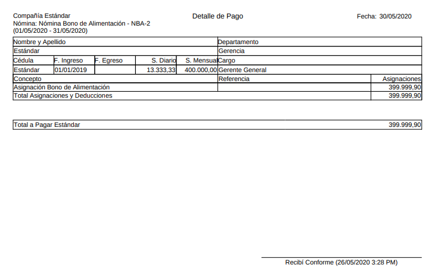
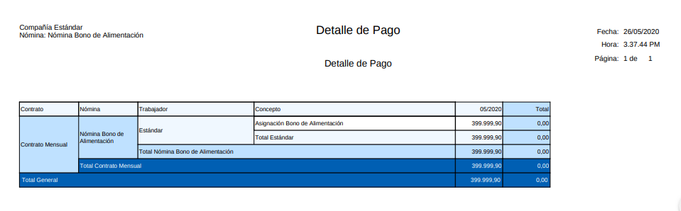
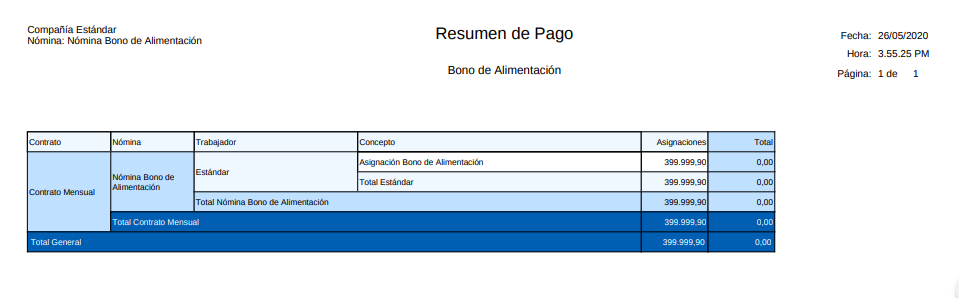

.. _ERPyA: http://erpya.com

.. _documento/nomina-bono-alimentación:

===============================
**Nómina Bono de Alimentación**
===============================

    Para procesar una “**Nómina de Bono de Alimentación**” debemos realizar el proceso de nómina estándar mencionado en el documento :ref:`documento/procedimiento-para-procesar-nómina` elaborado por `ERPyA`_. En esta ventana se registran los datos principales que ADempiere requiere para crear una nómina de bono de alimentación, cada uno de los campos detallados a continuación son relevantes para obtener un registro exitoso:

#. Estatus del Documento:

    #. Seleccione **Nómina Bono de Alimentación** en el campo "**Tipo de Documento**".

        El tipo de documento le permitirá definir la acción del documento que esté registrando en ADempiere.

    #. Seleccione **Nómina Bono de Alimentación** en el campo "**Nómina**"

        La nómina Bono de Alimentación define el comportamiento de la nómina, para este caso tiene las siguientes características:

            #. Regla de Pago: Débito Directo
            #. Cargo: Bono de Alimentación por Pagar

    #. Seleccione el período correspondiente a la nómina que se está ejecutando en el campo "**Período Nómina**"

        El período de nómina define el período laborado que le está siendo cancelado al empleado, para esta nómina se dispone de períodos mensuales

    #. Seleccione la fecha “Hasta” o el último día del período que seleccionó anteriormente en el campo "**Fecha Contable**"

        A través de la fecha contable se determina contablemente la fecha de pago de la nómina de bono de alimentación en ejecución, por tal motivo se recomienda colocar la fecha “**Hasta**” o el último día del período que seleccionó anteriormente.

      |Nómina Bono de Alimentación|

      Imagen 1. Nómina Bono de Alimentación

#. Incidencias:

    Para esta nómina las incidencias serán extraídas de  aquellas qué se procesaron en las nóminas regulares del empleado durante ese periodo determinado. Las incidencias qué se tomarán de las nóminas regulares del trabajador son las siguientes:

      +-------------------------------------------------------+----------------------+----------------+
      |           **INCIDENCIA**                              |     **CÓDIGO**       |    **TIPO**    |
      +=======================================================+======================+================+
      | Ausencias Injustificadas                              |      ("IN_AI")       |    Cantidad    |
      +-------------------------------------------------------+----------------------+----------------+
      | Faltas Injustificadas                                 |      ("IN_FI")       |    Cantidad    |
      +-------------------------------------------------------+----------------------+----------------+
      | Retardos                                              |      ("IN_RE")       |    Cantidad    |
      +-------------------------------------------------------+----------------------+----------------+

    Para conocer cómo registrar una incidencia puede utilizar el siguiente enlace :ref:`documento/novedades-de-nómina`

#. Resultados:

    - "**Reportes**"

        Para visualizar los reportes de nóminas  puede seguir los pasos que se encuentran en el documento :ref:`documento/reporte-de-nómina` con los datos adicionales que se indican a continuación para cada reporte

        - “**Recibo de Pago**”

            - **Nómina**: Nómina Bono de Alimentación

            - **Proceso de Nómina**: Ubique el número de documento del proceso de nómina que está ejecutando.

            - **Configuración de Reporte de Nómina**: Bono de Alimentación

        |Recibo de Pago Nómina Bono de Alimentación|

        Imagen 2. Recibo de Pago Nómina Bono de Alimentación

        - “**Detalle de Pago**”

            - **Nómina**: Nómina Bono de Alimentación

            - **Proceso de Nómina**: Ubique el número de documento del proceso de nómina que está ejecutando.

            - **Configuración de Reporte de Nómina**: Bono de Alimentación

            - **Plantilla de Reporte de Nómina**: Detalle de Pago

        |Detalle de Pago Nómina Bono de Alimentación|

        Imagen 3. Detalle de Pago Nómina Bono de Alimentación

        - “**Resumen de Pago**”

            - **Nómina**: Nómina Bono de Alimentación

            - **Proceso de Nómina**: Ubique el número de documento del proceso de nómina que está ejecutando.

            - **Configuración de Reporte de Nómina**: Bono de Alimentación

            - **Plantilla de Reporte de Nómina**: Resumen de Pago

        |Resumen de Pago Nómina Bono de Alimentación|

        Imagen 4. Resumen de Pago Nómina de Nómina de Vacaciones
