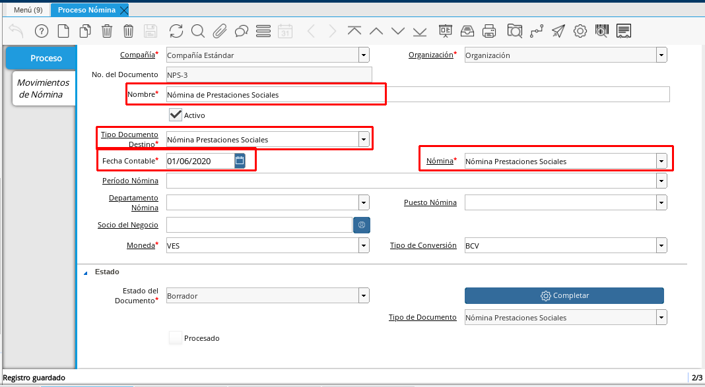

.. _ERPyA: http://erpya.com

.. |Recibo de Pago Nómina Prestaciones Sociales| image:: resources/reciboprestacionessociales.png
.. |Detalle de Pago Nómina Prestaciones Sociales| image:: resources/detalleprestacionessociales.png
.. |Resumen de Pago Nómina Prestaciones Sociales| image:: resources/resumenprestacionessociales.png

.. _documento/nomina-prestaciones-sociales:

=================================
**Nómina Prestaciones Sociales**
=================================

Para procesar una “**Nómina de Prestaciones Sociales**” debemos realizar el proceso de nómina estándar mencionado en el documento :ref:`documento/procedimiento-para-procesar-nómina` elaborado por `ERPyA`_. En esta ventana se registran los datos principales que ADempiere requiere para crear una nómina de prestaciones sociales, cada uno de los campos detallados a continuación son relevantes para obtener un registro exitoso:

#. Estatus del Documento:

    #. Seleccione “**Nómina Prestaciones Sociales**” en el campo “**Tipo de Documento**”

        El tipo de documento le permitirá definir la acción del documento que esté registrando en ADempiere.

    #. Selecciones “**Nómina de Prestaciones Sociales**” en el campo “**Nómina**”

        La nómina de prestaciones sociales define el comportamiento de la nómina, para este caso por ser una nómina especial cuenta con las siguientes características:

            #. Regla de Pago: Débito Directo
            #. Cargo: Sueldos y Salarios por Pagar

    #. Seleccione la fecha en la que esté ejecutando la nómina en el campo **Fecha Contable**

    ..note::

        La nómina de prestaciones sociales está configurada para que procese la asignación de garantía de prestaciones cada 3 meses al empleado, y la asignación de antiguedad de prestaciones cada año a partir del segundo año de servicio del empleado.

      |Nómina Prestaciones Sociales|

      Imagen 1. Nómina Prestaciones Sociales

    .. warning::

        Esta nómina  por ser una nómina especial no debe registrarse con período

#. Incidencias:

      Para esta nómina no son necesarias las incidencias.

#. Resultados:

    - **Reportes**

        Para visualizar los reportes de nóminas  puede seguir los pasos que se encuentran en el documento :ref:`documento/reporte-de-nómina:` con los datos adicionales que se indican a continuación para cada reporte

        - “**Recibo de Pago**”

            - **Nómina**: Nómina Prestaciones Sociales

         	- **Proceso de Nómina**: Ubique el número de documento del proceso de nómina que está ejecutando.

         	- **Configuración de Reporte de Nómina**: Préstaciones Sociales

        |Recibo de Pago Nómina Prestaciones Sociales|

        Imagen 2. Recibo de Pago Nómina Prestaciones Sociales

        - “**Detalle de Pago**”

            - **Nómina**: Nómina Prestaciones Sociales

            - **Proceso de Nómina**: Ubique el número de documento del proceso de nómina que está ejecutando.

            - **Configuración de Reporte de Nómina**: Prestaciones Sociales

            - **Plantilla de Reporte de Nómina**: Detalle de Pago

        |Detalle de Pago Nómina Prestaciones Sociales|

        Imagen 3. Detalle de Pago Nómina Prestaciones Sociales

        - “**Resumen de Pago**”

            - **Nómina**: Nómina Prestaciones Sociales

            - **Proceso de Nómina**: Ubique el número de documento del proceso de nómina que está ejecutando.

            - **Configuración de Reporte de Nómina**: Prestaciones Sociales

            - **Plantilla de Reporte de Nómina**: Resumen de Pago

        |Resumen de Pago Nómina Prestaciones Sociales|

        Imagen 4. Resumen de Pago Nómina Prestaciones Sociales
