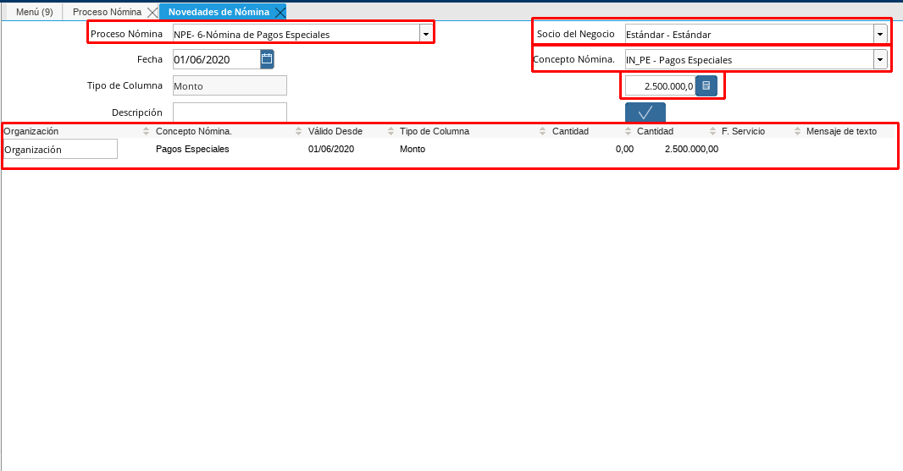

.. _ERPyA: http://erpya.com
.. _Atributo del Empleado: https://docs.erpya.com/es/latest/adempiere/master/business-partner/employee/employee.html#pestana-atributo-de-empleado

.. |Nómina Pagos Especiales| image:: resources/pagosespeciales.png
.. |Detalle de Pago Nómina Pagos Especiales| image:: resources/detallepagosespeciales.png
.. |Resumen de Pago Nómina Pagos Especiales| image:: resources/resumenpagosespeciales.png

.. |Factor Nómina Pagos Especiales| image:: resources/factorpagosespeciales.png

.. _documento/nomina-pagos-especiales:

===============================
 **Nómina Pagos Especiales**
===============================

    Para procesar una “**Nómina de Pagos Especiales**” debemos realizar el proceso de nómina estándar mencionado en el documento :ref:`documento/procedimiento-para-procesar-nómina` elaborado por `ERPyA`_. En esta ventana se registran los datos principales que ADempiere requiere para crear una nómina de pagos especiales. El comportamiento de esta nómina puede representarse a través 2 formas diferentes, una de ellas parte del registro de una incidencia pagos especiales, la cual le  permitirá asignarle un monto diferente a cada empleado por cada nómina de pagos especiales que realice, también tiene disponible el  factor bono pagos especiales a través del mismo puede determinar un monto fijo de un pago especial que le otorgará al empleado por un período determinado de tiempo. Cada uno de los campos detallados a continuación son relevantes para obtener un registro exitoso:

#. Estatus del Documento:

    #. Seleccione **Nómina por Pagos Especiales** en el campo "**Tipo de Documento**".

        El tipo de documento le permitirá definir la acción del documento que esté registrando en ADempiere.

    #. Seleccione **Nómina Pagos Especiales** en el campo "**Nómina**"

        La nómina de Pagos Especiales define el comportamiento de la nómina, para este caso tiene las siguientes características:

            #. Regla de Pago: Débito Directo
            #. Cargo: Sueldos y Salarios por Pagar

    #. Seleccione la fecha “Hasta” o el último día del período que seleccionó anteriormente en el campo "**Fecha Contable**"

        A través de la fecha contable se determina contablemente la fecha de pago de la nómina de pagos especiales en ejecución, por tal motivo se recomienda colocar la fecha “**Hasta**” o el último día del período que seleccionó anteriormente.

      |Nómina Pagos Especiales|

      Imagen 1. Nómina Pagos Especiales

    .. warning::

          Está nómina  por ser una nómina especial no debe registrarse con período

#. Incidencias

	#. Para procesar una nómina de pagos especiales tiene disponible la incidencia llamada "**Pagos Especiales**" para registrar el monto del pago especial que le otorgará a cada empleado durante esa nómina.

      +-------------------------------------------------------+----------------------+----------------+
      |           **INCIDENCIA**                              |     **CÓDIGO**       |    **TIPO**    |
      +=======================================================+======================+================+
      | Pagos Especiales                                      |     ("IN_PE")        |     Monto      |
      +-------------------------------------------------------+----------------------+----------------+

    Para conocer cómo registrar una incidencia puede utilizar el siguiente enlace :ref:`documento/novedades-de-nómina`

    |Incidencia de Nómina Pagos Especiales|

    Imagen 3. Incidencia de Nómina Pagos Especiales

#. Factores

	#. También tenemos disponible en el atributo del empleado  un factor llamado Pagos Especiales, en donde registrará el monto que le asignará al empleado durante un largo período de tiempo.

      +-------------------------------------------------------+----------------------+----------------+
      |           **CONCEPTO DE NÓMINA**                      |     **CÓDIGO**       |    **TIPO**    |
      +=======================================================+======================+================+
      | Factor Bono Pagos Especiales por Empleado             |     ("FA_BPE")       |      Monto     |
      +-------------------------------------------------------+----------------------+----------------+

    Para conocer cómo registrar una atributo del empleado puede utilizar el siguiente enlace `Atributo del Empleado`_

    |Factor Nómina Pagos Especiales|

    Imagen 3. Factor Nómina Pagos Especiales

.. warning::

    Debe utilizar alguna de las 2 formas para asignar el monto del pago especial al empleado

#. Resultados:

    - “**Reportes**”

    Para visualizar los reportes de nóminas  puede seguir los pasos que se encuentran en el documento :ref:`documento/reporte-de-nómina` con los datos adicionales que se indican a continuación para cada reporte

        - “**Detalle de Pago**”

            - **Nómina**: Nómina Pagos Especiales

            - **Proceso de Nómina**: Ubique el número de documento del proceso de nómina que está ejecutando.

            - **Configuración de Reporte de Nómina**: Pagos Especiales

            - **Plantilla de Reporte de Nómina**: Detalle de Pago

        |Detalle de Pago Nómina Pagos Especiales|

        Imagen 3. Detalle de Pago Nómina Pagos Especiales

        - “**Resumen de Pago**”

            - **Nómina**: Nómina Pagos Especiales

            - **Proceso de Nómina**: Ubique el número de documento del proceso de nómina que está ejecutando.

            - **Configuración de Reporte de Nómina**: Pagos Especiales

            - **Plantilla de Reporte de Nómina**: Resumen de Pago

        |Resumen de Pago Nómina Pagos Especiales|

        Imagen 4. Resumen de Pago Nómina Pagos Especiales
