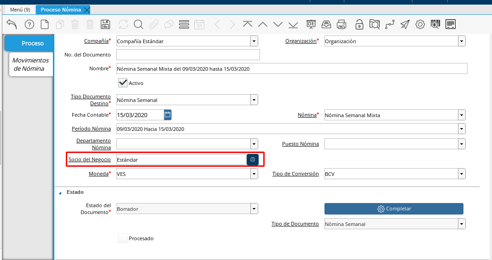
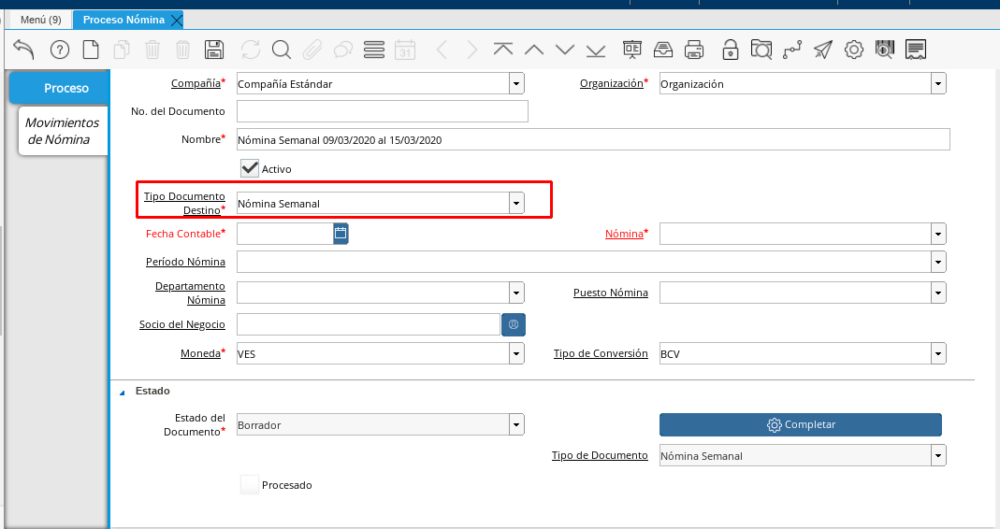

.. _ERPyA: http://erpya.com

.. _documento/procedimiento-para-procesar-nómina:

==================
**Proceso Nómina**
==================

#. Ubique y seleccione en el menú de ADempiere, la carpeta "**Gestión de Recursos Humanos y Nómina**", luego seleccione la carpeta "**Nómina**", por último seleccione la ventana "**Proceso Nómina**".

    |Menú de ADempiere|

    Imagen 1. Menú de ADempiere

#. Podrá visualizar la ventana "**Proceso Nómina**", donde debe seleccionar el icono "**Registro Nuevo**" ubicado en la barra de herramientas de ADempiere, para crear un nuevo registro de proceso de nómina.

    |Ventana Proceso Nómina y Selección de Icono de Registro Nuevo|

    Imagen 2. Ventana Proceso Nómina y Selección de Icono de Registro Nuevo

#. Seleccione en el campo "**Organización**", la organización para la cual está realizando el proceso de nómina.

    |Campo Organización|

    Imagen 3. Campo Organización

#. Introduzca en el campo "**Nombre**", el nombre de la nómina que se requiere procesar con su respectivo rango de tiempo (desde/hasta).

    |Campo Nombre|

    Imagen 4. Campo Nombre

#. Seleccione el tipo de documento a generar en el campo "**Tipo de Documento Destino**", la selección de este define el comportamiento del documento que se está elaborando, dicho comportamiento se encuentra explicado en el documento :ref:`documento/tipo-documento` elaborado por `ERPyA`_.

    |Campo Tipo de Documento Destino|

    Imagen 5. Campo Tipo de Documento Destino

    .. note::

        Los tipos de documentos de nómina se encuentran agrupados según su comportamiento, la Nominas Semanal y la Nómina Semanal Mixta se encuentran definidas en el Tipo de Documento "**Nómina Semanal**". De igual forma ocurre con las diferentes nóminas regulares utilizadas en ADempiere.

#. Seleccione en el campo "**Fecha Contable**", la fecha correspondiente a la fecha final del periodo de la nómina seleccionada, es decir la fecha hasta ingresada en el campo "**Nombre**".

    |Campo Fecha Contable|

    Imagen 6. Campo Fecha Contable

#. Seleccione la nómina que se requiere procesar en el campo "**Nómina**". En este campo no se encuentran unidas las nóminas como en el campo "**Tipo de Documento Destino**", por lo tanto se puede seleccionar la opción "**Nómina Semanal Mixta**" para ejemplificar el registro que se está realizando.

    |Campo Nómina|

    Imagen 7. Campo Nómina

#. Seleccione el "**Periodo de Nómina**". Las nóminas regulares poseen sus periodos de nómina ya sean semanales, quincenales o mensuales, usted debe elegir en este campo el periodo correspondiente a la nómina que esté ejecutando.

    |Campo Periodo de Nómina|

    Imagen 8. Campo Periodo de Nómina

#. Seleccione en el campo "**Socio del Negocio**", el socio del negocio es el empleado al cual se le va a procesar la nómina que se está registrando.

    |Campo Socio del Negocio|

    Imagen 9. Campo Socio del Negocio

    .. note::

        Este campo es utilizado cuando se le va a procesar la nómina a un solo empleado de la organización.Si usted desea procesar la nómina a todo el personal que tiene asignado la Nómina Semanal Mixta no seleccione a ningún Socio de Negocio.

#. Seleccione en el campo "**Moneda**", la moneda correspondiente al pago del empleado de la organización.

    |Campo Moneda|

    Imagen 10. Campo Moneda

#. Seleccione en el campo "**Tipo de Conversión**", el tipo de conversión correspondiente a la moneda seleccionada para el pago.

    |Campo Tipo de Conversión|

    Imagen 11. Campo Tipo de Conversión

#. Seleccione el icono "**Guardar Cambios**", ubicado en la barra de herramientas de ADempiere para guardar el registro de los campos de la ventana "**Proceso Nómina**".

    |Selección de Icono Guardar|

    Imagen 12. Selección de Icono Guardar Cambios

#. Seleccione la opción "**Completar**", ubicada en la parte inferior derecha de la ventana "**Proceso Nómina**", para preparar la nómina registrada.

    |Opción Completar|

    Imagen 13. Opción Completar

#. Seleccione la acción "**Preparar**" y la opción "**OK**" para preparar el documento.

    |Selección de la acción Preparar y opción OK|

    Imagen 14. Selección de la acción Preparar y la opción OK.

#. Puede preparar la nómina cuantas veces sean necesarios. Cuando esté seguro de que tiene todos los cálculos correctos proceda a completar la Nómina.

    |Selección de la acción Completar y opción OK|

    Imagen 15. Selección de la acción Completar y la opción OK.

#. Al finalizar el Proceso de Nómina, puede ver los resultados en los siguientes enlaces:

.. toctree::
    :maxdepth: 2

    weekly-payroll
    biweekly-payroll
    monthly-payroll
    mixed-weekly-payroll
    mixed-biweekly-payroll
    mixed-monthly-payroll
    payroll-food-voucher
    vacation-payroll
    payroll-special-payments
    profit-payroll
    payroll-social-benefits
    payroll-advance-social-benefits
    payroll-liquidation
